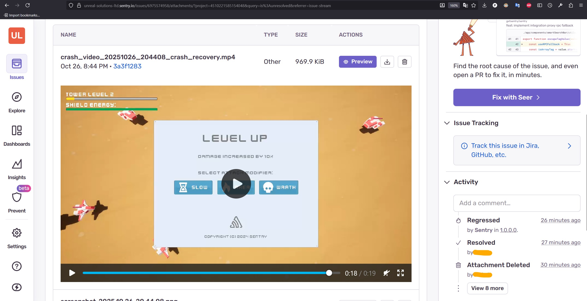

# 记录打包游戏中罕见的游戏崩溃

## 来源与状态

- 原始 URL：https://dev.epicgames.com/community/learning/tutorials/abpo/unreal-engine-recording-rare-game-crashes-in-packaged-game

## 运行时分类

- 类型：图文教程
- 判断：API 未识别到核心视频信号，可整理正文约 622 字符。

## 摘要

在崩溃发生之前记录游戏的最后几秒

## 中文整理

### 概览

**如何在崩溃发生之前录制游戏视频？** [https://youtu.be/hD7Rw3NNn6Q](https://youtu.be/hD7Rw3NNn6Q) 源代码：[https://github.com/UnrealSolutionsLtd/sentry-unreal-crash-video](https://github.com/UnrealSolutionsLtd/sentry-unreal-crash-video)

**当您的游戏有大约 100 个错误且只有 2 名开发人员时，您如何确保快速发现关键错误和崩溃？** 您现在可以在崩溃发生之前记录游戏的最后几秒。最神奇的是，您的最终用户会将这些视频上传到您的 Sentry 仪表板。
