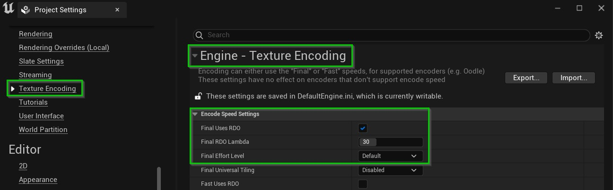
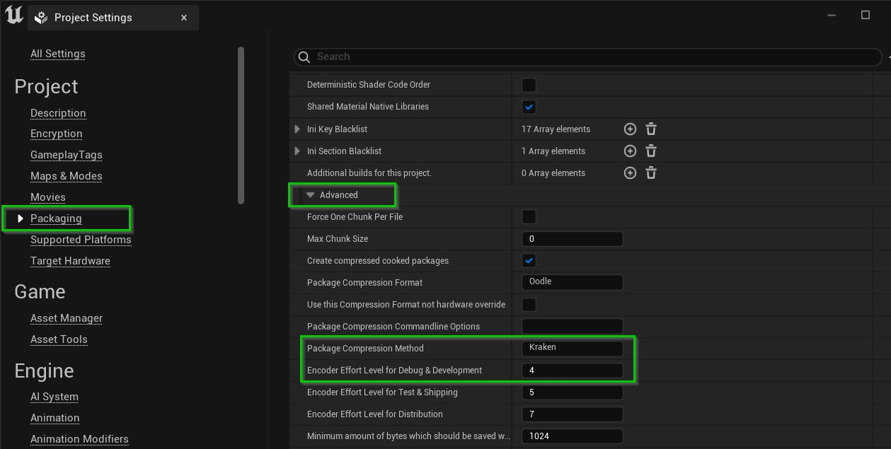
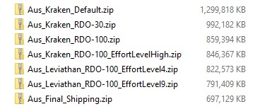
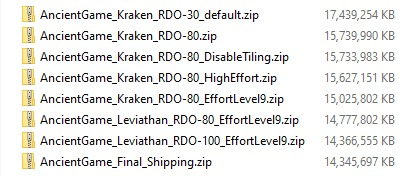
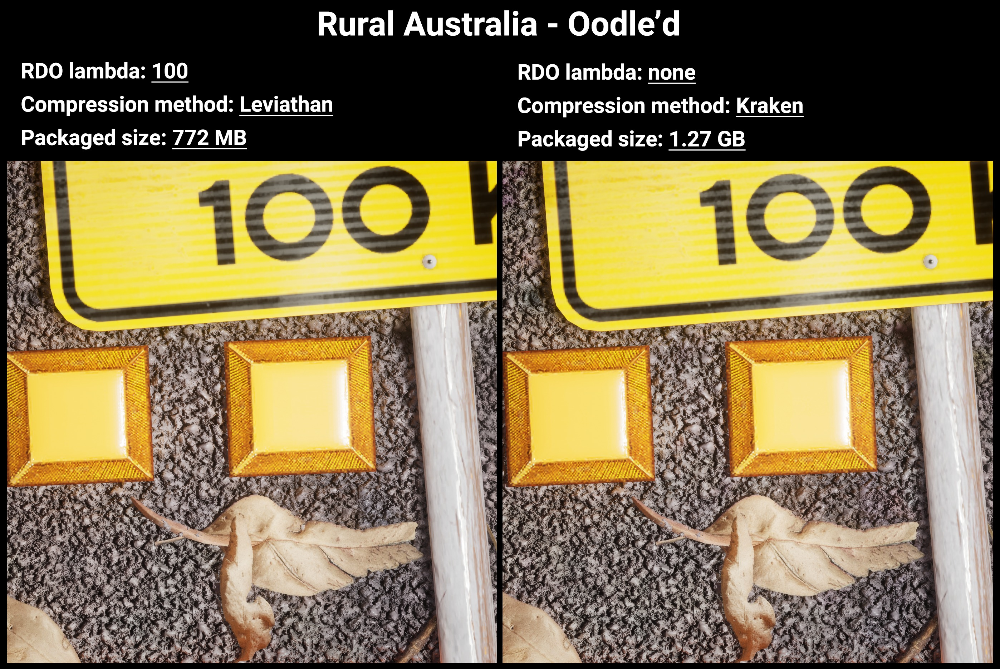
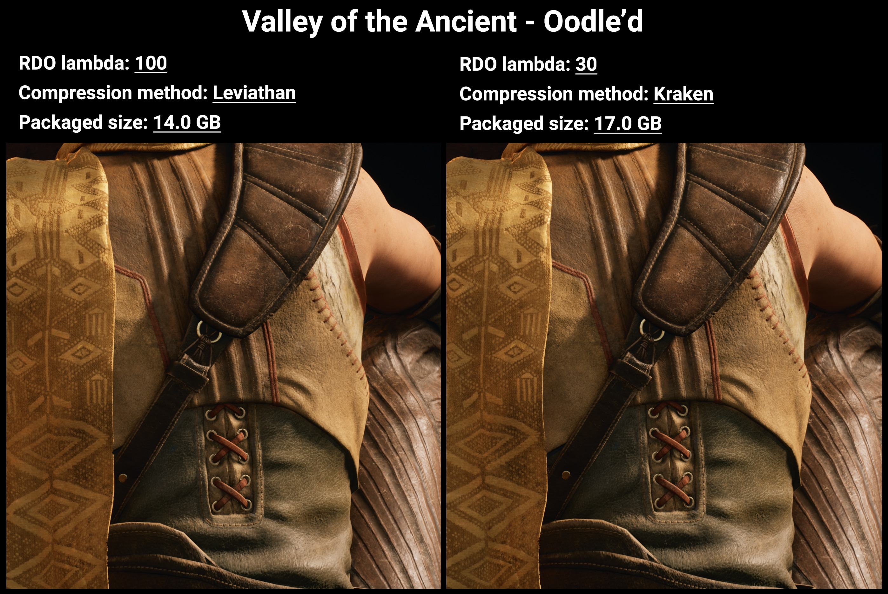

# 通过 Ooodle 压缩减小包大小

## 来源与状态

- 原始 URL：https://dev.epicgames.com/community/learning/tutorials/ry2D/unreal-engine-reducing-package-sizes-with-oodle-compression

## 运行时分类

- 类型：图文教程
- 判断：API 未识别到核心视频信号，可整理正文约 4674 字符。

## 摘要

高级 Ooodle 设置可以将打包项目的大小减少多达 40%。让我们深入了解一下。

## 中文整理

### 简介

从 4.27 开始，引擎中默认启用了 Ooodle 压缩，默默地使项目和包比过去小得多。然而，用户可以调整多种可用设置，以相对较少的权衡大幅减少打包项目的总体占用空间。我测试了两个项目的可用选项，即来自市场的 [Valley of thecient](https://www.unrealengine.com/marketplace/en-US/product/ancient-game-01) 演示和 [Rural Australia](https://www.unrealengine.com/marketplace/en-US/product/rural-australia) 项目，测量了最终的压缩可执行文件（在开发模式下）以及打包所需的时间。逐步调整每个设置后，我能够将应用程序大小分别缩小 18% 和 40%。我将在下面总结设置和结果。

### Ooodle纹理压缩

### RDO 拉姆达

显着缩小打包项目的一种方法是提高纹理压缩。 （注意：这些纹理压缩设置不适用于移动纹理）。在项目设置中，引擎下有一个名为纹理编码的类别。在这里您可以启用**RDO**（速率失真优化）并控制其**Lambda**。这是您用来启用和调整**有损纹理压缩**的旋钮。

默认 lambda 30 将为您提供立竿见影的结果，但它可以提高到 100。将AncientGame 从 30 更改为 80 导致总大小减少 **10%**（超过 1.5 GB）。与 RuralAustralia 默认无 RDO 相比，lambda 30 将包大小减小了 **24%**，而 lambda 100 则减小了 **34%**。根据我的经验，最高设置的视觉质量损失非常小（请参阅本文末尾的结果），但您需要在您的项目中对此进行测试。某些类型的纹理可能会受到更不利的影响，例如镜面反射/粗糙度贴图、法线贴图或某些蒙版。幸运的是，您可以覆盖每个纹理组或每个单独纹理的默认 lambda。请参阅[文档](https://docs.unrealengine.com/4.27/en-US/TestingAndOptimization/Oodle/Texture/) 了解如何执行此操作。

### 努力程度

平衡纹理压缩质量和压缩时间的第二个设置是**最终努力级别**。将其设置为“高”会增加包装时准备纹理所需的时间，但会提供更好的质量和稍小的尺寸。在 High 上，AncientGame 的构建时间要长 **8%**，而 RuralAustralia 的构建时间要长 **26%**。封装尺寸仅减少了约 **1%**，但有助于确保更好地保留纹理。

### Ooodle数据压缩

默认情况下，打包设置中会启用 Ooodle 数据压缩，以减少最终 .pak 文件的大小。

然而，Ooodle 有 4 种不同的压缩格式，具有不同的编码/解码速度和压缩比。 “Kraken” 是默认格式，因为它速度超快且是出色的压缩器，但对于更小的文件，您可以将其更改为“**Leviathan**”，编码/解码速度会略有提高。在AncientGame 上，其好处仅是尺寸减小了**2%**，而在RuralAustralia 上则仅减小了**3%**，尽管打包时间要长约**30%**。在我的工作站上，启动或加载游戏没有明显的差异，但始终在目标硬件上进行测试。某些平台（例如移动设备）可能对从 .pak 文件中解压资产所花费的时间更为敏感。 Leviathan 的技术细分可以在 [RAD 网站](http://www.radgametools.com/oodleleviathan.htm) 上找到，您可以用来压缩压缩包的最后一个杠杆是**编码器工作量**（与上面纹理压缩的工作量不同）。将开发构建的默认值从 4 提高到 9 **使AncientGame 的构建时间翻倍**，包大小得到 **4%** 的回报。

### 概括

在这两个项目中利用最极端的 Oodle 压缩设置，AncientGame 的打包时间增加了 **5.1 倍**，RuralAustralia 的打包时间增加了 **3 倍**，但让我将最终应用程序的大小最多减少 **40%**。有关更多详细信息，请参阅下面的文档链接。另外，不要忘记，在运输模式下打包应用程序会在所有这些其他优化之上去除大量不必要的调试信息。 - [Oodle 纹理](https://docs.unrealengine.com/TestingAndOptimization/Oodle/Texture) - [Oodle 数据](https://docs.unrealengine.com/TestingAndOptimization/Oodle/Data) - [Oodle 纹理 RDO 示例](http://radgametools.com/oodletextureexamples.htm) - [Oodle 数据压缩 - RAD](http://radgametools.com/oodlecompressors.htm)

## 相关链接

- [Oodle Texture](https://docs.unrealengine.com/TestingAndOptimization/Oodle/Texture)
- [Oodle Data](https://docs.unrealengine.com/TestingAndOptimization/Oodle/Data)
- [Oodle Texture RDO Examples](http://radgametools.com/oodletextureexamples.htm)
- [Oodle Data Compression - RAD](http://radgametools.com/oodlecompressors.htm)
