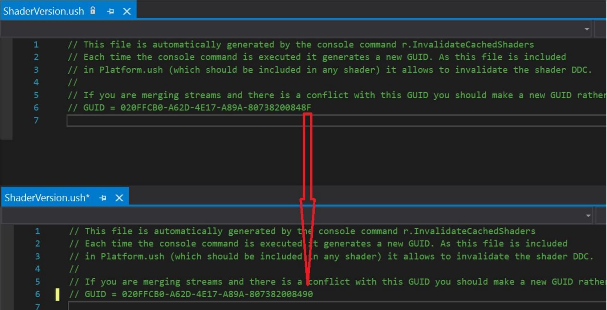
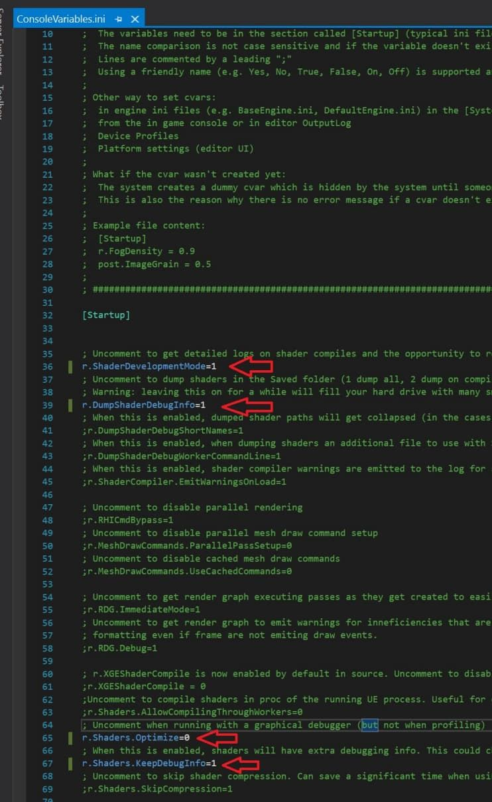
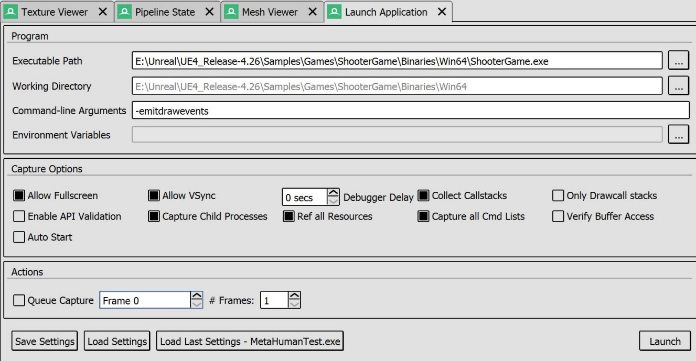
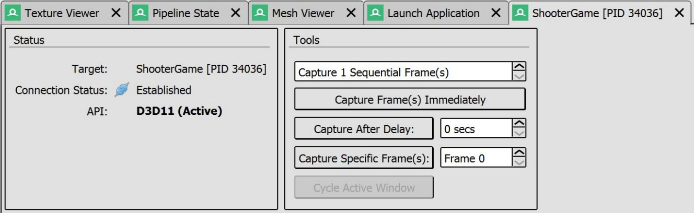

# Renderdoc/UE4 - 如何获取着色器符号

## 来源与状态

- 原始 URL：https://dev.epicgames.com/community/learning/knowledge-base/ze7b/unreal-engine-renderdoc-ue4-how-to-get-shader-symbols

## 运行时分类

- 类型：图文教程
- 判断：API 未识别到核心视频信号，可整理正文约 4586 字符。

## 摘要

Jon C 撰写的文章。清除并重置先前烘焙的着色器 着色器调试信息仅在烘焙时生成。如果您连接到 DDC，则 DDC 可能会保留着色器，因此只需清除您的 p...

## 中文整理

### 概览

*文章作者：[Jon C.](https://dev.epicgames.com/community/profile/33lq/Jon.Cain)*

### 清除并重置先前烘焙的着色器

- 着色器调试信息仅在烹饪时生成。 - 如果您连接到 DDC，则 DDC 可能会保留着色器，因此仅清除项目暂存文件夹通常是不够的。 - 主要问题是DDC将保存所有旧的着色器，而不是重新烹饪，旧的着色器将被拉出，并且在此过程中不会生成您需要的调试数据。 - 因此，要从头开始重新生成所有着色器，我的首选方法（因为我倾向于主要通过 AutomationTool 直接构建）是转到 ShaderVersion.ush 并修改 GUID（参见图片） - 或者，您也可以使用指定的 CVar； r.InvalidateCachedShaders，可以通过控制台、命令行 + CVar 规范，也可以在 .ini 文件中生成新的 GUID 文件。 - 无论使用哪种方法，该文件中都会存在一个新的 GUID，这会使旧着色器失效，并强制在下次烹饪时生成新着色器。

### 烹饪着色器调试信息

- 在开始烹饪着色器之前，您需要明确告诉 UE 您希望它转储着色器调试信息。 - 转到 ConsoleVariables.ini，取消注释右图中突出显示的 4 行。 - r.ShaderDevelopmentMode=1 在这里不一定需要，因为这主要用于着色器开发和测试，但如果您最近更改或创建了新着色器，则很方便。 - DumpShaderDebugInfo=1 转储所有 HLSL 和其他一些文件以测试重新编译（请参阅选项）。 - r.Shaders.Optimize=0 开启着色器编译器特定的优化，这可以使代码在调试期间更具可读性，并且也允许在调试期间单线程执行。 - r.Shaders.KeepDebugInfo=1 表示反射和调试数据等内容不会被删除。 - 这些特定于每个平台的着色器可能有不同的效果，但总的来说它们是相同的，并且在 UE5 的定义中是统一的。 - 保存后，您可以烹饪您的项目。在本例中，“BuildCookRun -project="ShooterGame" -build -cook -stage -deploy -run -platform=Win64”

### 捕获（序言）

- 进行捕获时，理想情况下您希望能够看到抽签过程的名称，以便了解每个过程/批次所指的内容。在进行捕获时，您需要启用 GEmitDrawEvents 才能使其工作。不幸的是，UE4 根据具体情况决定是否打开此选项，并且在 4.26 中跨平台也不一致。 - “-emitdrawevents”的潘多拉魔盒 - 从历史上看，这是一个可选择的选项，但随着时间的推移，每个 RHI 都开发出了自己的处理方式。 - 幸运的是，对于 PC 上的 D3D，特别是 RenderDoc，它通常会自动激活。其他平台需要在命令行上指定它（有些甚至需要它作为启动命令，其他平台则不需要）。 - 对于允许的平台，您还可以通过 ULocalPlayer::HandleToggleDrawEventsCommand（或通过命令行的 ToggleDrawEvents）“切换”。 - UE4.27 及以上版本将在调试和开发版本中默认为所有平台启用该功能，并选择加入测试和发布。 - 建议在捕获之前通过命令行启用 r.RHISetGPUCaptureOptions=1，因为这会执行以下操作： - 在帧期间启用高级标记，如“BasePass”和“PostProcessing”（由上面的 EmitDrawEvents 覆盖） - 在每个绘制调用周围显示材质使用的标记（包括材质名称等） - 禁用 RHI 线程。启用并行渲染时某些事件会丢失

### （最后）捕捉

- 打开 Renderdoc 并转到“启动应用程序”选项卡。 - 添加可执行文件，并将 -emitdrawevents 添加到命令行参数。 - 至少启用“CaptureChildProcesses”。 - 或者，保存您的设置以供将来使用（我将它们放在与项目相同的文件夹中） - 项目启动后，打开控制台并设置 - r.RHISetGPUCaptureOptions=1 - 按 F12 或使用对面显示的工具来捕获帧。该工具还允许您捕获多个连续帧、设置延迟等。 - 关闭 project.exe 并将捕获保存在 Renderdoc 中

您可以在 [RenderDoc 文档](https://renderdoc.org/docs/how/how_capture_frame.html) 或 [虚幻引擎文档](https://docs.unrealengine.com/4.27/en-US/TestingAndOptimization/PerformanceAndProfiling/RenderDoc/) 中找到更多信息。
