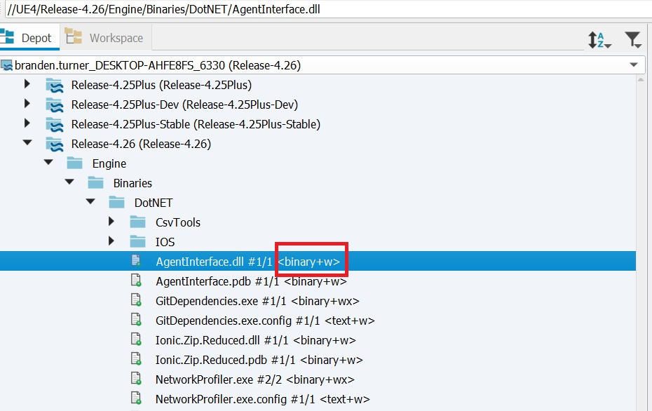
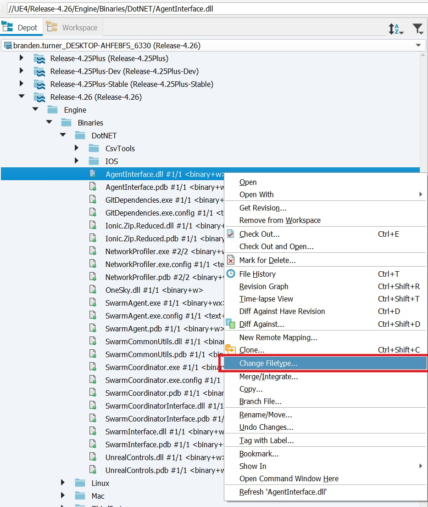
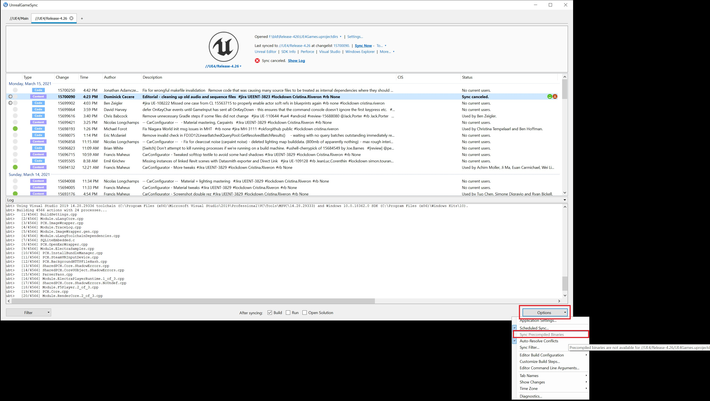

# UGS 预编译二进制文件指南

## 来源与状态

- 原始 URL：https://dev.epicgames.com/community/learning/knowledge-base/dPXe/unreal-engine-ugs-precompiled-binaries-guide

## 运行时分类

- 类型：图文教程
- 判断：API 未识别到核心视频信号，可整理正文约 7888 字符。

## 摘要

Branden T 撰写的文章。如果团队的内容创建者不需要使用代码库或重建编辑器来创建内容，那么为项目构建的编辑器的预编译二进制文件 (PCB) 非常有用。

## 中文整理

### 概览

*文章由 [Branden T.](https://dev.epicgames.com/community/profile/Kzq2/Branden.Turner) 撰写* 如果团队的内容创建者不需要使用代码库或重建编辑器来为其项目创建内容，那么为项目构建的编辑器的预编译二进制文件 (PCB) 非常有用。为了使用户能够下载预编译的二进制文件，可以将包含所需二进制文件的 zip 文件提交到 Perforce。然后，UnrealGameSync 将同步并提取该 zip 文件，而不是在本地进行编译。执行此操作使用与本地编译相同的用户界面，但任何没有匹配二进制文件的更改都将显示为灰色。配置完成后，用户可以通过选中“选项”菜单下的“同步预编译二进制文件”项来选择使用预编译二进制文件。

### 基本 Perforce 设置

我们不会从连接或网络配置的角度详细介绍所需内容，而是详细介绍用户将预编译二进制文件与其虚幻项目和引擎一起使用所需的内容。要设置 Perforce 服务器的内容以与 UGS 一起使用，需要完成一些工作。用户将需要一个包含其引擎源代码、不是由虚幻引擎构建过程生成的依赖项及其项目的单个流。 - 为了确保所有必需的虚幻引擎文件都存在，用户应该复制 Epic 现有的 Perforce 发布流之一 - 任何具有命名约定 //UE4/Release-4.xx 的发布流都应该可以很好地复制 - 确保复制 .p4ignore.txt 文件，因为这将确保在开发人员开始在本地构建流后，不会将额外的文件添加到流的副本中。 - 用户还可以使用 [GitHub 源构建](https://github.com/EpicGames/UnrealEngine)，运行 GitDependency.exe，然后上传完整源以及收集的依赖项。复制我们的 Perforce 流之一仍然是推荐的路径，并且无论文件如何收集、生成和上传，都需要从流中复制 .p4ignore.txt 文件。 - 无论您决定以哪种方式在 Perforce 中设置文件，请确保它们的文件类型和权限与您要设置的任何版本的版本流相匹配。如果文件在我们的流中被标记为可写，那么它也应该在您的流中可写。可写和不可写之间的不匹配可能会导致构建或运行时失败。要检查这些权限，请在 P4V 中打开流并检查文件名右侧：



如果您发现需要更改流中的文件类型或权限，请在打开文件进行编辑后右键单击该文件，然后单击“更改文件类型”：



这将打开一个菜单，您可以在其中编辑文件类型和权限以匹配我们的发布流。注意：如果在构建期间或运行时遇到特定文件的“访问被拒绝”错误，很可能是由于这些权限设置不正确。 - 与 UGS 一起使用的任何项目都需要是原生的，并且与虚幻引擎的文件位于同一流中。 - 原生项目是可以从虚幻目录结构的顶级目录发现的项目，或者可以从 .uprojectidrs 文件中列出的路径（也在虚幻目录结构的顶层）深一层发现的项目。 - 有关包含与 UGS 兼容的特定示例和文件结构图像的本机项目的更多信息，请[阅读此知识库文章。](https://forums.unrealengine.com/docs?search=What%20is%20a%20native&topic=264986) 用户应使用单独的流来保存预编译二进制文件 zip 文件 - 可以使用单个流，但强烈建议使用第二个单独的流有权访问第一流的用户也有权访问。这将避免不使用 PCB 的团队成员流失。 - 无需为此维护单独的工作空间； UnrealGameSync 将使用与同步文件相同的登录凭据以无状态方式获取 PCB。 - 要配置 PCB 上传到的流，请在项目根目录下添加 Build/UnrealGameSync.ini 并引用二进制文件将上传到的 Perforce 位置。这是 UGS 从 Perforce 获取 PCB 时将搜索的内容。 Build\UnrealGameSync.ini 条目示例： [//UE4/Main/Samples/Games/ShooterGame/ShooterGame.uproject] ZippedBinariesPath=//UE4/Dev-Binaries/++UE4+Main-Editor.zip 注意：UnrealGameSync.ini 必须位于 [Project Root]/Build/* 位置 - 指定 ZippedBinariesPath 时，需要记住以下几点： - 名称 //UE4/Dev-Binaries/++UE4+Main-Editor.zip 需要与下面上传部分中提到的 ArchiveStream 参数匹配，其中 ++UE4+Main 是当前分支的名称，斜杠转义为“+”字符。使用参数时应使用斜杠而不是“+”字符。 - 任何有权访问 PCB 流的用户帐户都可以向其上传一组新的 PCB，但具体如何完成取决于用户，因为这取决于工作室想要如何部署。手动用户可以执行此操作，或者自动构建节点也可以负责。 **生成并上传预编译的二进制文件** 设置两个流并且用户有权访问它们后，就可以生成 PCB 并将其上传到指定的 PCB 流。要生成和上传 PCB： - 从 Perforce 同步主流内容 - 运行基于我们示例的 BuildGraph 脚本（位于 [UE Root]/Engine/Build/Graph/Examples/BuildEditorAndTools.xml）以生成 PCB 并将其上传到正确的 Perforce 位置（使用 -ArchiveStream 参数指定位置） 使用 BuildEditorAndTools 的示例命令：Engine\Build\BatchFiles\RunUAT.bat

```cpp
BuildGraph

-Script=Engine/Build/Graph/Examples/BuildEditorAndTools.xml

-Target="Submit To Perforce for UGS"

-set:EditorTarget=ShooterGameEditor

-set:ArchiveStream=//UE4/Dev-Binaries
```

在本例中，ShooterGame 是一个原生项目，用户想要上传 PCB 的任何项目也需要是原生的。 **注意：有关使用 BuildEditorAndTools.xml 的其他信息可以在文件开头的注释中找到。** **注意：ArchiveStream 需要匹配之前指定的 ZippedBinariesPath，但不是使用“+”字符来转义斜杠，而是使用斜杠。** - 此示例将 zip 文件提交到 //UE4/Dev-Binaries/++UE4+Main-Editor.zip，其中 ++UE4+Main 是当前分支的名称斜杠转义为“+”字符。应将相同的路径设置为 UnrealGameSync.ini 中 ZippedBinariesPath 的值。注意：确保 CL 描述的格式正确。 UGS 期望每个 CL 描述以 [CL nnnnnnnnn] 开头，因此它知道二进制文件与哪个变更列表关联。 注意：PDB 包含在此 zip 文件中，但它们被删除以减少构建大小。这将允许从崩溃中收集调用堆栈，但不允许进行完整的调试。如果团队需要更好的符号存储，他们可能会想要使用符号服务器，这由 IT 和部署团队来实施。

### 使用 UGS 中的预编译二进制文件

在成功生成预编译二进制文件并将其上传到辅助流后，使用位于主流中的文件，UGS 应该能够检测并使用主流中的 PCB。 - 切换“同步预编译二进制文件”选项，并同步到最新版本。下图示例是没有任何预编译二进制文件的流，但如果在前面的步骤中正确设置了二进制文件，则该选项应该是可选的。



- PCB 应该被拾取并使用，而不是为选择此选项的任何人构建引擎
