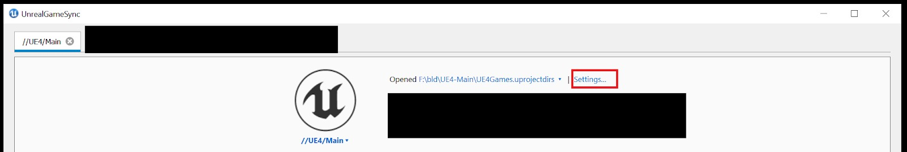
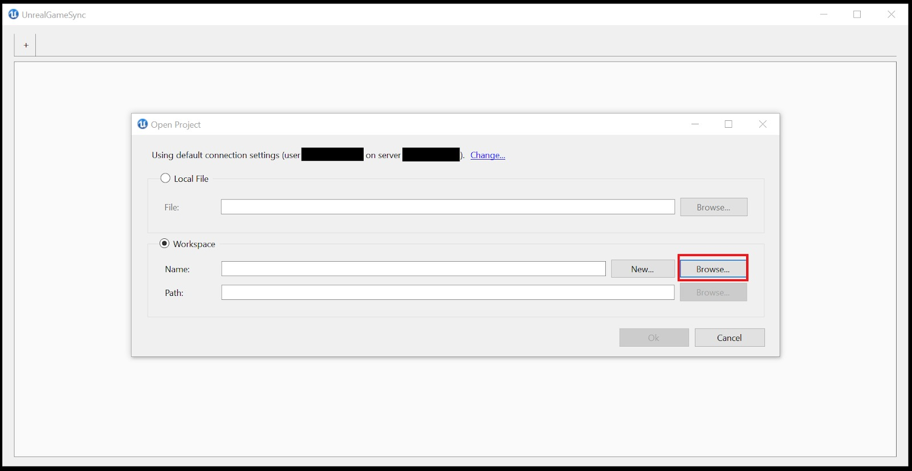
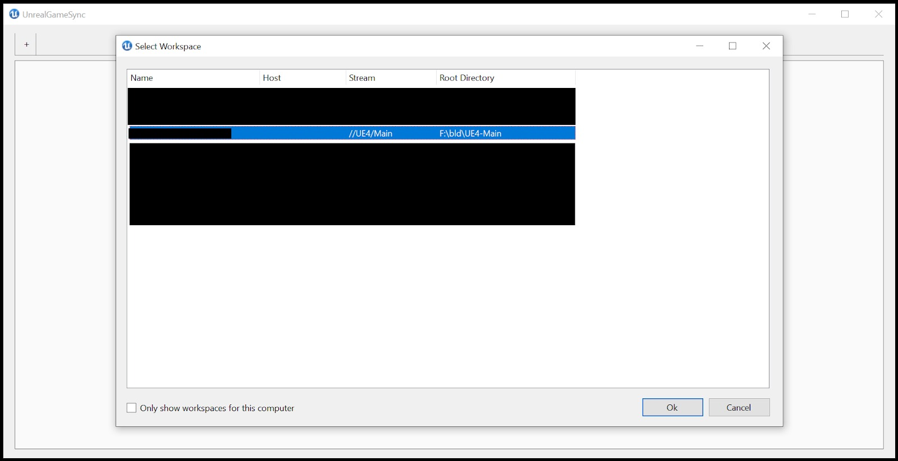
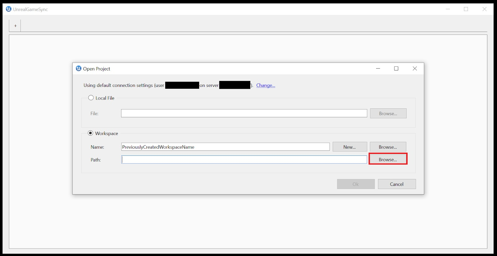
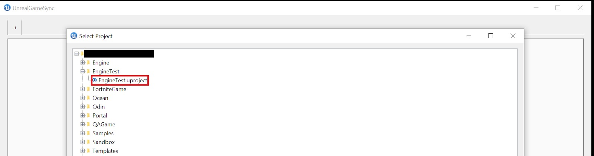
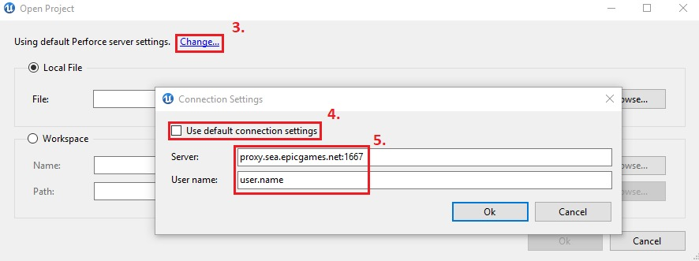

# UGS 故障排除

## 来源与状态

- 原始 URL：https://dev.epicgames.com/community/learning/knowledge-base/7yLm/unreal-engine-ugs-troubleshooting

## 运行时分类

- 类型：图文教程
- 判断：API 未识别到核心视频信号，可整理正文约 14366 字符。

## 摘要

文章由 Branden T 撰写。对于您在 UGS 中遇到的许多问题，可能会有一个工具提示，为您提供有关您认为应该正常工作的选项出了什么问题的更多信息。基本的 …

## 中文整理

### 概览

*文章由 [Branden T.](https://dev.epicgames.com/community/profile/Kzq2/Branden.Turner) 撰写* 对于您在 UGS 中遇到的许多问题，可能会有一个工具提示，为您提供有关您认为应该正常工作的选项出了什么问题的更多信息。

### 基本故障排除

收集有关您的设置的基本信息，并在向 Epic 或您的 IT 部门提出问题时包含在内，将有助于您获得更好、更高效的帮助。此类项目包括： - 确定是否可以在不使用 UGS 的情况下重现问题。通常，看似与 UGS 相关的问题实际上并非如此。例如： - 如果发生崩溃，请尝试在不使用 UGS 的情况下打开编辑器。 - 如果存在 Perforce 同步问题，请尝试仅使用 Perforce，而不是通过 UGS 使用它。如果在没有 UGS 参与的情况下您仍然看到问题，则需要联系实际发生问题的团队或部门以获得更好的帮助。 - 确定您是否使用的是最新版本的 UGS。版本信息可以通过诊断菜单（主页、选项 → 诊断...）访问，也可以在 UnrealGameSync.log 的 C:\Users<user>\AppData\Local\UnrealGameSync\ 中找到。这通常可能是涉及元数据和 UGS 更新的问题的原因。 - 如果您确定这是 UGS 特有的问题，请先参阅下面的常见问题。

### 笔记：

通过简单的故障排除步骤即可解决大量编译错误： - 确认编译中的哪一步失败 - 例如：UnrealHeaderTool、ShaderCompileWorker 等 - 通过 UnrealGameSync 清理工作空间，方法是在项目概述区域中选择“更多 → 清理工作空间”，然后尝试再次同步/编译 - 删除 UE4.sln，手动运行GenerateProjectFiles.bat (Windows)、GenerateProjectFiles.command (Mac)，然后尝试再次同步/编译 - 尝试使用 Visual Studio / XCode 手动编译 - 尝试同步/编译标记为“良好”（绿球）的变更列表 - 如果仍然失败，请选择选项 >“使用增量构建”= False - 尝试重新编译 - 确保禁用“同步预编译编辑器”（注意：仅在某些流中可用） - 确认 Perforce 中的工作区已正确配置 - 警告：这在很多情况下很有用，但它不包括工作区中是否有额外文件。如果您的工作区变得过于复杂而无法管理，您可能需要联系 IT 部门寻求帮助，或者重新创建工作区并重新同步其数据。

### 看不到预编译的二进制文件

检测 PCB 可能需要很长时间。 UGS 将首先加载所有 CL，然后交叉引用它们以查看哪些 PCB 可用。在较慢的连接上，这可能需要几分钟，所以如果速度可能很慢，请不要放弃！否则，这可能是由于存储它们的流的权限问题造成的，或者由于构建运行状况问题而无法正确创建/上传它们。请联系您的 P4 管理员并确认您的构建已成功上传预编译的二进制文件，并且您有权访问。将鼠标悬停在“同步预编译二进制文件”上时的工具提示还将提供更多有助于调试此问题的信息：



### 无法连接

这通常是 Perforce 或本地网络问题。我们已经发现 2019.2 版本存在问题，因此值得从该版本开始进行更改。有时，使用 P4V 重新登录 Perforce 服务器也可以帮助解决此问题。如果这是在第一次设置期间，并且您收到错误：无法同步应用程序并且您的日志包含：无法找到最后的更改列表请确保您的“Depot Path”设置为 Perforce 管理员提供给您的正确 Perforce 位置，并且该路径的格式正确，如：//depot/path/to/UnrealGameSync/bin 有两个前导斜杠，表示 Perforce depot，并且没有终止正斜杠。然后再次单击“连接”。如果这一切设置正确，并且您的 Perforce 版本不是 2019.2，您应该联系您的 Perforce 管理员以确认您拥有存储库路径的权限。

### 由于路径太长，同步或构建失败

大多数 Windows 版本都有 260 个字符的路径限制，UGS 无法规避。事实上，如果 UGS 检测到长度超过 260 个字符的路径，它将完全阻止同步项目。目前无法在 UGS 中禁用此检查。为了帮助解决此问题，您可能需要在更靠近根目录的文件夹中设置工作区（即：D:/prj/workspace/）。另外，尝试强制执行尽可能缩短文件名的文件命名结构。如果您决定使用 .uprojectdirs 文件而不是 .uproject 文件同步项目，这种情况也可能在极少数情况下发生。可以通过使用 .uproject 文件在 UGS 中设置项目来解决此问题。选择“设置”



为您正在使用的工作区的“名称”和“路径”选择“浏览”示例名称：





示例路径：



然后，无需像设置教程中那样选择 uprojectdirs 文件，只需在该流中选择一个 uproject 文件即可



然后再次尝试同步

### UGS 不会自动更新

**Case 1:** This one is typically due to file contention on the machine.这可以通过关闭 UGS、确认没有正在运行的活动 UGS 进程并删除 [AppData]/Local/UnrealGameSync/Latest/（通常包含阻止更新的争用文件）来解决。 If the deletion of that folder fails, you should be met with what file is held in contention and what process is holding on to it. If you’re unable to stop that process, rebooting should resolve that issue and allow you to delete that folder. After, you can use the UnrealGameSyncLauncher to download the latest update.注意：在重新启动之前，您可能需要从启动应用程序中删除 UnrealGameSync，删除该文件夹，将 UGS 重新添加到启动应用程序中，然后从那里重新启动，具体取决于您设置 UGS 的方式。 **情况 2：** 如果用户没有正确的连接或没有正确的权限来查看 UGS 更新的二进制文件所在的 Perforce 路径，UGS 可能会无限期挂起，不允许用户继续。如果是这种情况，请更新连接设置中的“Depot Path”，或者与您的 Perforce 管理员联系以获得对文件的正确访问权限。

### 与“找不到文件”相关的随机构建错误

这通常是与 Perforce 相关的错误，不一定与 UGS 相关。如果您的工作区出现问题，请首先尝试强制同步整个引擎目录，如果其他方法均失败，请创建一个新工作区。当同步过滤器配置不正确时，也可能会发生这种情况，无论是对于构建重要的内容被过滤掉（IE：Win64文件夹），还是意外引入了对同步过滤器覆盖的文件的依赖关系。配置同步过滤器的指南位于：[UGS 同步过滤器设置](https://docs.unrealengine.com/en-US/ProductionPipelines/DeployingTheEngine/UnrealGameSync/Reference/SyncFilters/index.html)

### 从编辑器的 UGS 副本进行烹饪失败

如果您收到类似于以下内容的错误： 错误：无法找到命令 BuildCookRun 当尝试从通过 UGS 分发的引擎的预编译二进制版本进行烹饪或打包时，可能是因为此操作需要源文件夹。我们正在寻求改进这一点，但目前即使您实际上没有构建源代码，您也需要通过 UGS 使用的预编译二进制文件进行烹饪和打包的源目录。如果这是您工作流程的一部分，请检查您的同步过滤器，以确保您没有排除源目录，即使您不直接使用它。

### 编译器限制：达到内部堆限制

如果编译时遇到类似如下错误： Fatal Error C1060: Compiler is out of Heap Space Fatal Error C1076: 编译器限制：达到内部堆限制；使用 /Zm 指定上限 错误 C3859：超出 PCH 的虚拟内存范围；请使用命令行选项“-Zm123”或更高的短期解决方法重新编译重新启动计算机，因为这会清除缓存内存并可以暂时解锁编译。长期解决方案 您应该联系您的 IT 部门并描述您的问题。在某些情况下，通过控制面板增加最大页面文件大小可能会有所帮助，但在大多数工作室中，这需要通过 IT 来完成。 (Windows) 启动游戏或编辑器时没有任何反应，或者编辑器立即崩溃并出现奇怪的错误大多数情况下，这种情况发生在之前未配置为运行虚幻引擎的计算机上。如果您使用的是新计算机，所有内容均已同步，并且其他所有内容似乎都正常工作，但启动时没有任何反应，请尝试运行位于以下位置的 UE4PrereqSetup_x64.exe 应用程序：/Engine/Extras/Redist/en-us。这应该安装在之前未安装过的计算机上运行虚幻引擎所需的先决条件。 UGS 启动时崩溃 UnrealGameSync 使用 P4 命令行工具查询 Perforce 更新。未安装命令行工具是启动崩溃的最常见原因。 **解决方案**： 1. 重新运行 Perforce 客户端安装程序 2. 在安装过程中，确保包含命令行工具 检查 P4 命令行工具 1. 打开命令窗口 2. 输入 p4。 3. 按输入键。 4. 如果安装了 P4 命令行工具，则会打印一系列帮助命令 5. 如果未安装 P4 命令行工具，则会打印错误 File not find 生成项目文件错误 生成项目文件时，如果遇到类似以下错误：

```cpp
Setting up Unreal Engine 4 project files...
UnrealBuildTool Exception: System.FormatException: Index (zero based) must be greater than or equal to zero and less than the size of the argument list.
at System.Text.StringBuilder.AppendFormatHelper(IFormatProvider provider, String format, ParamsArray args)
at System.String.FormatHelper(IFormatProvider provider, String format, ParamsArray args)
at System.String.Format(String format, Object[] args)
…
ERROR: UnrealBuildTool was unable to generate project files. Press any key to continue . . . Failed to generate project files (exit code 1).
```

这通常是由于缺少 Visual Studio 组件造成的。确保根据以下内容安装所有 Visual Studio 组件：[在虚幻引擎中为 C++ 项目设置 Visual Studio 开发环境 |虚幻引擎 5.0 文档](https://docs.unrealengine.com/en-US/ProductionPipelines/DevelopmentSetup/VisualStudioSetup/index.html) 如果您遇到类似以下内容的错误：错误 MSB3644：找不到框架“.NETFramework,Version=v4.6.2”的参考程序集。从 [Microsoft 网站](https://dotnet.microsoft.com/en-us/download/visual-studio-sdks) 安装 SDK 和开发人员包。

### 错误：System.ComponentModel.Win32Exception

使用UGS构建时，如果出现以下错误：

```cpp
ubt> Using Visual Studio 2017 14.16.27023 toolchain (C:\Program Files (x86)\Microsoft Visual Studio\2017\Professional\VC\Tools\MSVC\14.16.27023) and Windows 10.0.17763.0 SDK (C:\Program Files (x86)\Windows Kits\10).

ubt> ERROR: System.ComponentModel.Win32Exception (0x80004005): The system cannot find the file specified
```

这是当我们安装.NET Framework和其他开发包，并在重新启动计算机之前尝试同步时引起的。要修复，请重新启动计算机，再次生成项目文件，然后重建。

### 错误：System.UnauthorizedAccessException

这种情况通常发生在一段时间没有更新的 UGS 版本中，如下所示：

```cpp
UnrealGameSync has crashed.
System.UnauthorizedAccessException: Access to the path <path> is denied.
```

- 导航至 C:\AppData\Local\UnrealGameSync - 删除 UnrealGameSync.ini - 警告 - 删除此文件将删除用户数据，包括 - 保存的构建配置 - 编辑器命令行参数 - 收藏的打开项目 - 预编译编辑器和增量构建选择 找不到任何包含 …/.uproject 的 Perforce 工作区。检查您的连接设置。如果您是第一次设置 UGS 并使用本地文件对话框添加项目，但仍然出现上述错误： - 尝试通过“打开项目 → 工作空间 → 新建…”对话框添加相同的文件。 - 如果您无法这样做，则这是 Perforce 权限问题，您需要与 Perforce 管理员合作，以确保您拥有工作区目标流和文件的正确访问权限。

### 连接到服务器失败

尝试使用无法识别的端口号连接到 Perforce 服务器将返回以下错误：Perforce 客户端错误：连接到服务器失败；检查 $P4PORT 要解决此问题： - 打开命令/终端窗口 - 输入 p4 set P4PORT= - 按 Enter - 关闭并重新启动 UGS 同样，与未知用户连接将生成错误： 'p4 protected' 尚未启用用户“USERNAME”的访问 要解决此问题，请打开命令窗口并： - 输入 p4 set P4USER=

### System.Io.FileNotFoundException：Ionic.Zip.Reduced

- 验证 C:\Users[[User.name](https://user.name/)]\AppData\Local\UnrealGameSync\Latest 是否包含 Ionic.Zip.Reduced.dll - 如果它确实存在，则您可能在工作区中丢失了文件，应强制同步工作区中的 Engine\Binaries 文件夹 - 否则，请检查您的防病毒软件是否未隔离它。按照防病毒软件的步骤“信任”该文件 - 如果您不确定如何执行此操作，请从任务管理器终止 UGS - 删除 C:\Users[[User.name](https://user.name/)]\AppData\Local\UnrealGameSync\Latest 的内容 - 重新启动 UGS - 在 UGS 打开后确认该文件现在存在。

### UGS 未使用正确的代理服务器

如果打开“诊断”菜单（主窗口右下角，列表最底部的选项 → 诊断）后，诊断菜单显示您正在使用代理服务器，但同步仍然失败： - 在 UGS 中打开一个新项目 - 查找“使用默认 Perforce 服务器设置” - 单击“更改”[参见屏幕截图项目 3] - 取消选中“使用默认连接设置”框 [参见屏幕截图项目 4] - 在提供的字段中输入您的代理服务器和用户名[参见屏幕截图项目 5] - 单击“确定” - 打开 UGS 诊断现在应显示正确的服务器设置。
