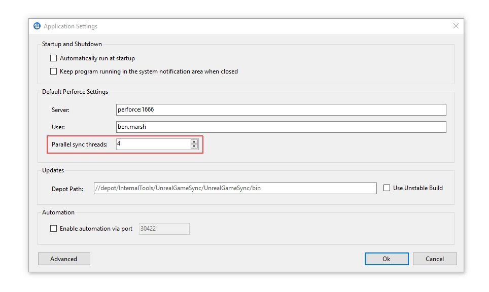

# WFH：UGS并行同步

## 来源与状态

- 原始 URL：https://dev.epicgames.com/community/learning/knowledge-base/MLLx/unreal-engine-wfh-ugs-parallel-sync

## 运行时分类

- 类型：图文教程
- 判断：API 未识别到核心视频信号，可整理正文约 1019 字符。

## 摘要

Branden T 撰写的文章。在多个线程上并行同步可以显着缩短高延迟连接的同步时间。要启用它，请转到 UGS 中的“选项”>“应用程序设置...”对话框，然后设置...

## 中文整理

### 概览

*文章由 [Branden T.](https://dev.epicgames.com/community/profile/Kzq2/Branden.Turner) 撰写* 在多个线程上并行同步可以显着缩短高延迟连接的同步时间。要启用它，请转到 UGS 中的“选项”>“应用程序设置...”对话框，然后设置“并行同步线程”值。我们建议数量为 2 或 4 - 一次运行太多实例似乎会导致 Perforce 停止运行。

UGS 的最新代码可以从以下位置获得 - Perforce: *//UE4/Release-4.25/Engine/Source/Programs/UnrealGameSync* - GitHub: [https://github.com/EpicGames/UnrealEngine/tree/4.25/Engine/Source/Programs/UnrealGameSync](https://github.com/EpicGames/UnrealEngine/tree/4.25/Engine/Source/Programs/UnrealGameSync) 代码UnrealGameSync 与所有版本的引擎兼容。
