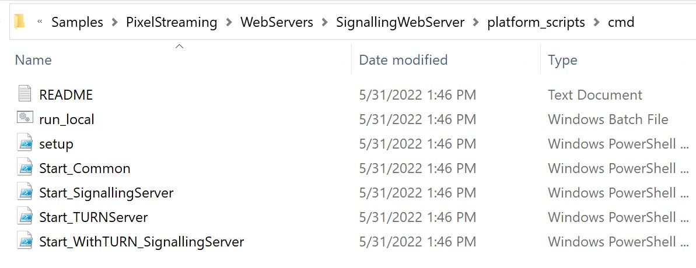
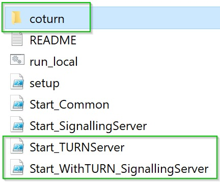
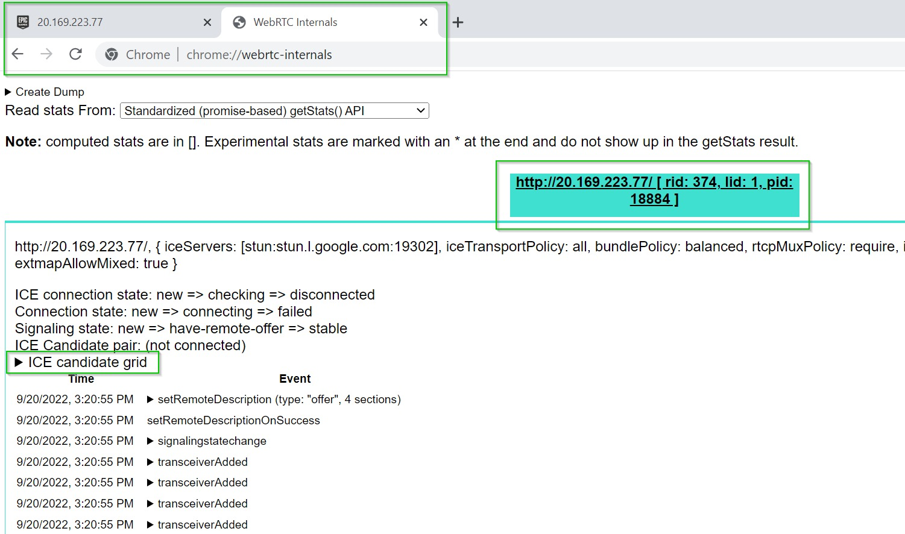
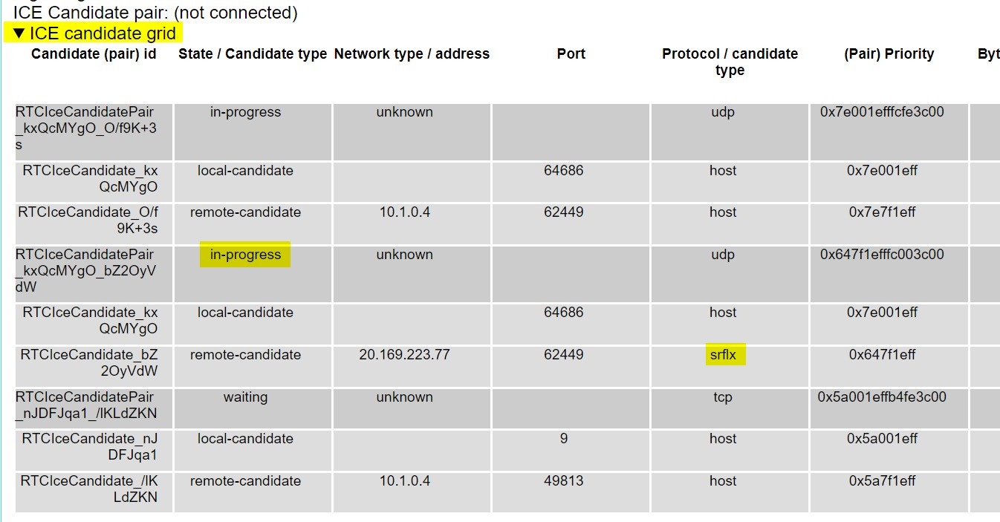
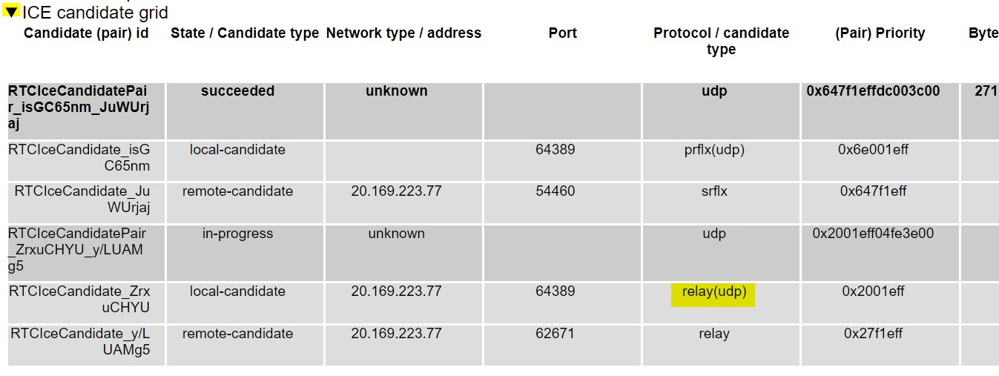
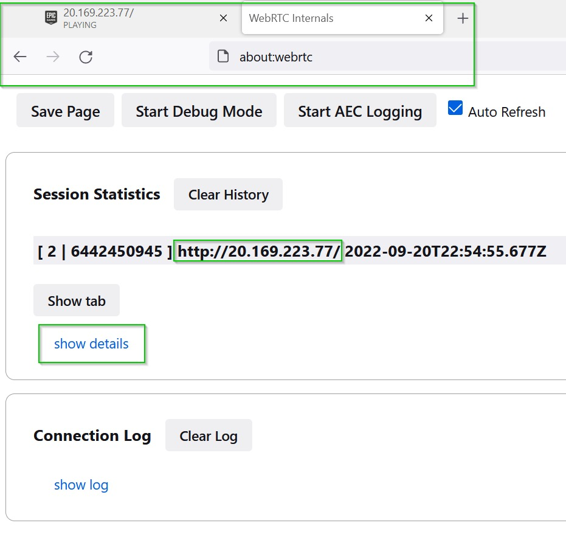
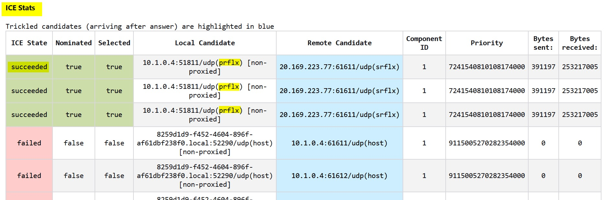
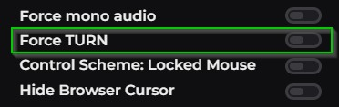

# 我的直播流在哪里？像素流的 TURN 服务器调试

## 来源与状态

- 原始 URL：https://dev.epicgames.com/community/learning/tutorials/VY4X/unreal-engine-where-s-my-stream-turn-server-debugging-for-pixel-streaming

## 运行时分类

- 类型：图文教程
- 判断：API 未识别到核心视频信号，可整理正文约 10817 字符。

## 摘要

一旦像素流应用程序进入云端，各种网络问题都会阻止最终用户看到它。基础设施最常见和最重要的修复是 TURN 服务器，本教程将向您展示如何设置和调试它。

## 中文整理

### 问题

在软件开发中，没有比臭名昭著的经典短语“*但它可以在我的计算机上运行......*”更可怕的短语了。在虚幻引擎开发中，在两台不同的 PC 上获得不同的结果可以用几个原因来解释，例如不同的 GPU 硬件和不同的开发环境以及过时的库、驱动程序或插件。然而，当通过 [Pixel Streaming](https://docs.unrealengine.com/5.0/en-US/pixel-streaming-in-unreal-engine/) 部署打包应用程序时，这些问题应该是无效的；实际上保证每个实例和每个虚拟机都是相同的。不幸的是，我看到许多来自有特殊问题的 UE 用户提出的支持请求。有些用户可以毫无问题地访问像素流实例，而有些用户即使使用相同的 Web 浏览器并访问相同的实例，也会出现空白屏幕。这几乎总是由缺少 TURN 服务器引起的。一些症状可能包括： - UE 应用程序发出黑色“无”流 - “正在开始连接到服务器，请稍候”消息 - 单击“单击开始”不会执行任何操作

### 什么是 TURN 服务器？

TURN 代表“**使用中继 NAT 进行遍历**（网络地址转换）”。 “*Relay*”是要记住的关键词。它是 WebRTC 设置的关键部分，但刚刚涉足 Web 开发的 UE 开发人员却忽视了这一点。当您在自己的计算机上本地测试像素流项目时，几乎没有任何网络基础设施会妨碍您，例如不需要公共 IP 地址，也没有任何带宽瓶颈。与您坐在同一本地网络上的同事的情况类似。但是，一旦 WebRTC 会话在万维网上进行代理，就会出现不同的要求。简而言之，出于安全和隐私原因，某些网络基础设施确实不喜欢从互联网上的 WebRTC 会话到浏览器进行“直接”连接。您通常会在办公室或 VPN 的蜂窝数据连接或企业网络上看到这一点，但不可能了解每个最终用户的 IT 设置。 TURN 服务器的作用是充当信令服务器（具有我们的 UE 应用程序的流）和最终用户浏览器之间的中继。它以这样一种方式来解决消费者可能遇到的最常见的防火墙问题，这就是为什么在生产部署中**始终使用 TURN 服务器**很重要。

### 如何设置 TURN 服务器？

作为默认像素流部署的一部分，Epic 提供了开始使用 TURN 服务器所需的[参考实现](https://docs.unrealengine.com/5.0/en-US/hosting-and-networking-guide-for-pixel-streaming-in-unreal-engine/#stunandturnservers)。在使用打包的像素流构建生成的 **Samples** 文件夹中，有各种脚本，如下所示。我建议始终从 Epic 的 [像素流基础设施](https://github.com/EpicGames/PixelStreamingInfrastruct) GitHub 获取最新版本。



如果您按照[入门](https://docs.unrealengine.com/5.0/en-US/getting-started-with-pixel-streaming-in-unreal-engine/)文档进行操作，您可能会运行 **Start_SignallingServer.ps1** 脚本。要启动并运行 TURN 服务器，您所需要做的就是使用管理员权限从 Powershell 窗口运行 **Start_WithTURN_SignallingServer.ps1**。如果一切顺利，它将下载开源 TURN 服务器“coturn”的副本到新文件夹并运行它的实例。如果您想重新启动 coturn 或者您想在不同于信令服务器的单独计算机上使用它，请使用管理员权限打开 Powershell 窗口并运行 **Start_TURNServer.ps1** 脚本。

```
Note: You must open up port 19303 for TCP and UDP traffic for coturn to communicate with the Signaling Server.
```



### 如何判断 TURN 是否正常工作

如果您在连接像素流应用程序时从未遇到过问题，则很难知道 TURN 服务器是否正在修复任何问题。希望您可以抓住以前无法连接的设备或同事，现在一切正常。在本教程的测试用例中，我有一个在 Azure 上运行的像素流应用程序，我无法从公司办公室访问该应用程序。当我按下大播放图标时，没有任何内容加载。无论您是否可以亲自查看自己的应用程序，下面的步骤都可以让您查看您的 TURN 服务器是否正常工作以及是否可供有连接问题的人使用。

### 铬合金

在 Google Chrome 中，让您的像素流页面在一个选项卡中运行，然后打开另一个到此地址的页面： [chrome://webrtc-internals/](https://chrome://webrtc-internals/) 将会有一个彩色文本块代表您的像素流选项卡，并且它应该已被选中。在页面正文中，“**ICE候选网格**”旁边有一个黑色三角形。单击此按钮可下拉有关我们的 WebRTC 连接的信息表。



下面的屏幕截图显示了我们流的连接候选，我们正在寻找的最重要的部分是“**协议/候选类型**”的列。如果没有 TURN 服务器，像素流解决方案将使用公共 STUN 服务器，并且该连接将在列表中显示为“**srflx**”（服务器自反）。这可能总是出现在可能的候选人以及“主持人”列表中。对于一些幸运的用户来说，这种连接类型可以完美地工作，而对于其他用户来说，它根本不起作用。就我而言，我有一个空白的黑屏，我正在等待 UE 应用程序，并且该连接的状态在此处标记为“进行中”。



在虚拟机上，我重新启动了我的信令服务器与 TURN 服务器并刷新了我的本地网页。这次我可以看到类型为“**relay**”的候选者，成功连接的类型为“prflx”（对等反射）。 **“中继”类型的连接仅在存在 TURN 服务器时才会显示。** 尽管“中继”不是最终的“成功”连接，但在本例中，它使我的像素流应用程序能够在我的限制性 IT 条件下立即工作。如果您在候选列表中没有看到“中继”，则必须调试 TURN 服务器并确保其正在运行并确保信令服务器指向它。



### 火狐浏览器

在 Firefox 中，让您的像素流页面在一个选项卡中运行，然后打开另一个到此地址的页面：[about:webrtc](https://about:webrtc) 将有一个与您的像素流选项卡相关的 **会话统计** 模块。点击“显示详细信息”。注意：仅当确实存在 WebRTC 连接时，此处才会显示信息。就我而言，单击像素流页面上的“单击开始”根本没有执行任何操作，这与 Chrome 中发生的情况不同。只有当您的浏览器确实可以连接时，才能完成其余的调试。



将展开一个表格，显示候选连接列表。 **如果您没有看到“中继”候选，则您的 TURN 服务器无法工作。** 如果没有 TURN 服务器，您很可能只会看到“srflx”和“主机”类型的候选。这对某些人来说完美无缺，但对另一些人则根本不起作用。就我而言，打开 TURN 服务器允许我的浏览器在我的限制性 IT 条件下进行连接，即使最终的连接类型是“prflx”/“srflx”。



### 总之

在像素流部署中通常会跳过一个步骤，在本地网络之外共享应用程序时，必须设置 TURN 服务器。如果您或其他人在访问流时遇到问题，请首先验证 UE 应用程序是否实际运行，然后立即检查您的 WebRTC ICE 候选者之间是否有“中继”。查看本页末尾的链接以获取有关此处涵盖的主题的更多信息。

### 额外提示

在默认像素流网页的设置菜单中，有一个“强制转动”选项。这也可以通过将“[/?ForceTURN=true](https://www.example.com//?ForceTURN=true)”附加到页面 URL 来完成。如果您使用 UE 4.27 或更早版本的像素流基础设施，则此选项可能不会出现或工作。强制流使用 TURN 服务器的中继候选并不是检查 TURN 服务器是否正常工作的最佳方法，但这是检查该流质量的好方法，因为如果有其他选项可用，浏览器宁愿不使用中继。



### 此 coturn 实现的替代方案

每台运行自己的流式应用程序和信令服务器实例的计算机也可以拥有自己的 coturn 服务器来中继数据。 TURN的计算成本相对较低，并且带宽要求大多相同。您还可以选择专用一台或多台机器来仅运行 coturn，并且您可以将所有实例指向通过该机器进行中继。如果这样做，您必须了解带宽限制。虽然 coturn 理论上可以处理数百或数千个连接，但发送数十个高质量 10 mbps 流很快就会耗尽每个实例的可用上传带宽。对于大规模部署，您可能需要考虑专业的 TURN 服务。您可以将信令服务器指向通过提供商提供的一个 IP 地址进行中继，所有额外的可扩展性和重新路由基础设施都会自动处理。没有个人经验或偏好，这里有几个提供此类服务的公司示例： - [XIRSYS](https://xirsys.com/) - [Twilio](https://www.twilio.com/stun-turn)

### 仍有问题吗？

如果您的应用程序正在运行并且 TURN 服务器正在中继，但您或其他人无法访问该流，则存在许多其他 IT 问题可能会阻止连接。不幸的是，调试这些问题超出了本文的范围，您应该联系系统管理员来调查潜在的网络限制。需要考虑的一些主题包括但不限于： - 将外部 IP 地址的资源访问列入白名单 - 允许使用非 HTTPS 网页 - PC、VM、网络安全组或公司网络上的基本防火墙设置。 （端口 80、443、8888、19303 是必需的默认端口） - 深度数据包检查 (DPI) 或其他 IT 规则可能会完全阻止 WebRTC 连接。 - [像素流媒体文档](https://docs.unrealengine.com/5.0/en-US/pixel-streaming-in-unreal-engine) - [托管和网络文档](https://docs.unrealengine.com/5.0/en-US/hosting-and-networking-guide-for-pixel-streaming-in-unreal-engine) - [像素流媒体基础设施](https://github.com/EpicGames/PixelStreamingInfrastruct) - [ICE、STUN、TURN 说明](https://temasys.io/guides/developers/webrtc-ice-sorcery) - [WebRTC TURN 说明](https://bloggeek.me/webrtc-turn)

## 相关链接

- [Pixel Streaming Documentation](https://docs.unrealengine.com/5.0/en-US/pixel-streaming-in-unreal-engine)
- [Hosting and Networking Documentation](https://docs.unrealengine.com/5.0/en-US/hosting-and-networking-guide-for-pixel-streaming-in-unreal-engine)
- [Pixel Streaming Infrastructure](https://github.com/EpicGames/PixelStreamingInfrastructure)
- [Explanations for ICE, STUN, and TURN](https://temasys.io/guides/developers/webrtc-ice-sorcery)
- [WebRTC TURN explanation](https://bloggeek.me/webrtc-turn)
