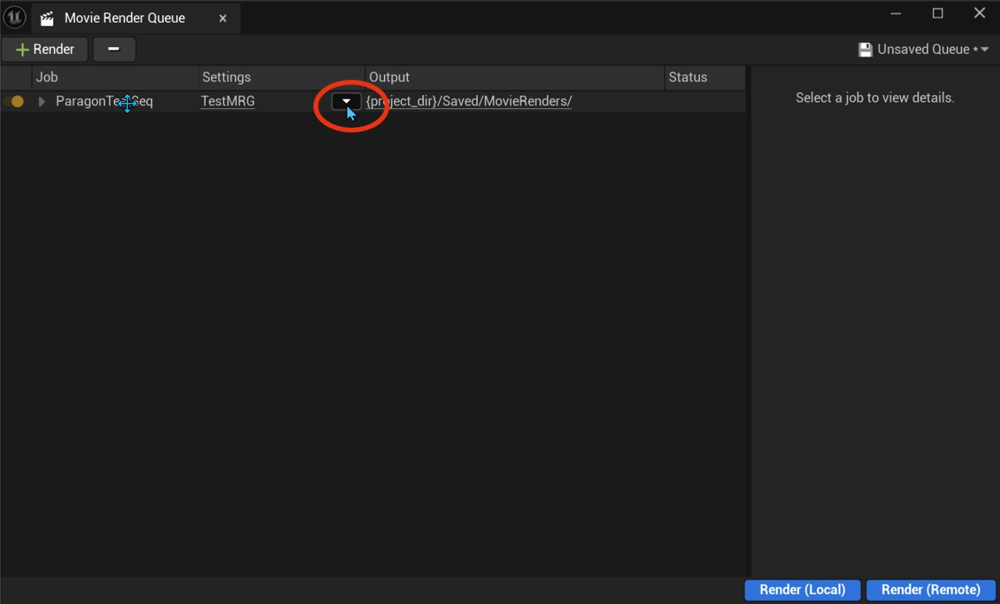
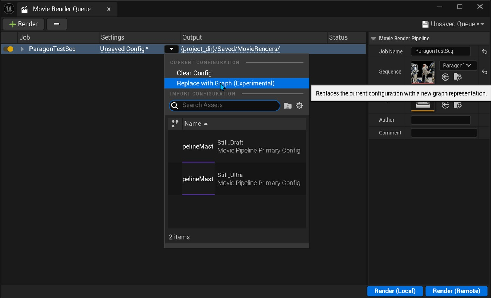
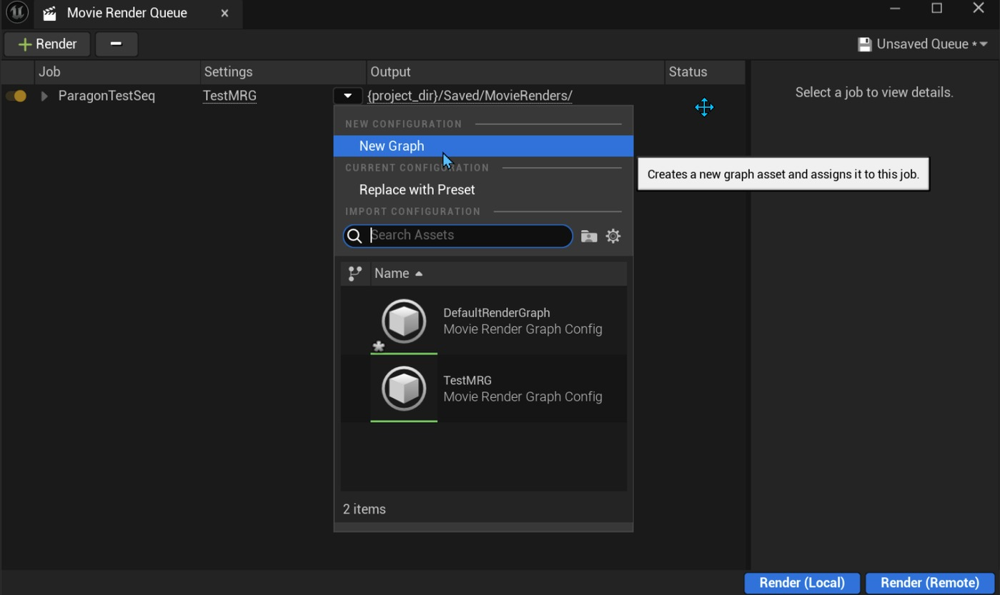
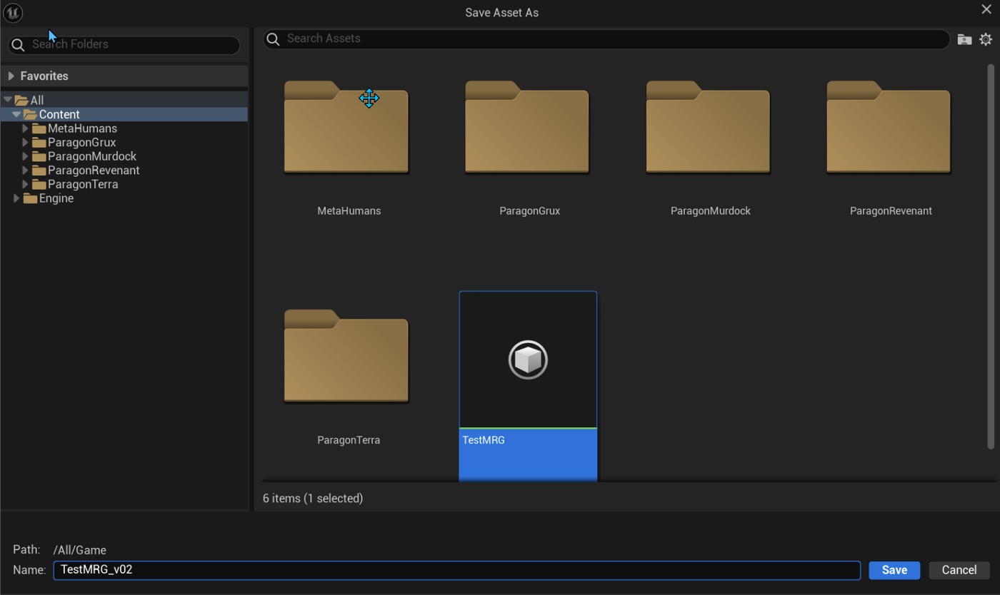
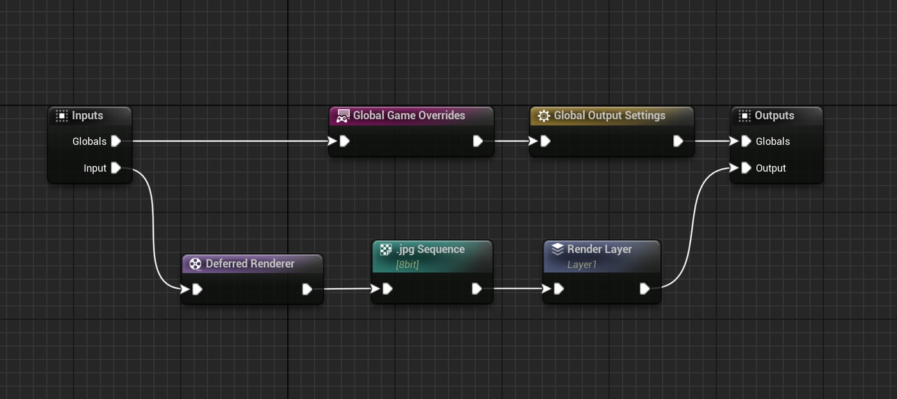
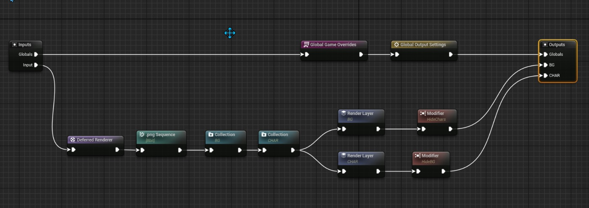
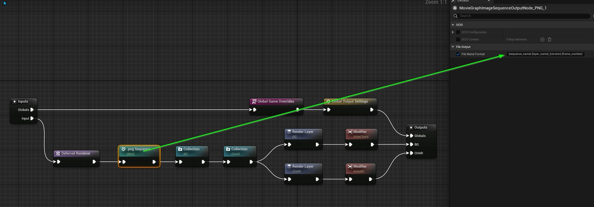
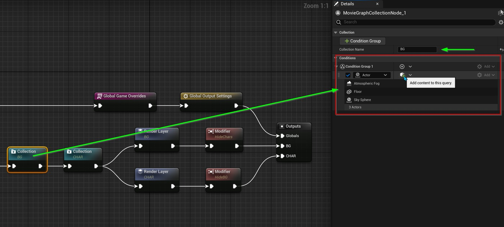
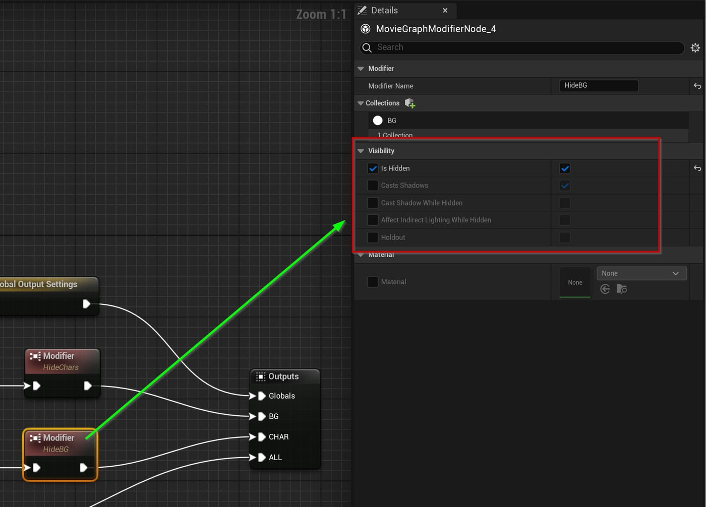
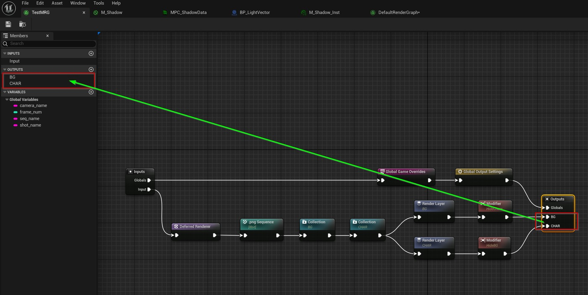

# 在虚幻引擎 5.4 中使用影片渲染图的快速入门

## 来源与状态

- 原始 URL：https://dev.epicgames.com/community/learning/tutorials/PnRZ/a-quick-start-to-using-the-movie-render-graph-in-unreal-engine-5-4

## 运行时分类

- 类型：图文教程
- 判断：运行时未识别到核心视频信号，可整理正文约 3206 字符。

## 摘要

有关使用影片渲染图渲染镜头中单独元素的快速入门教程。

## 中文整理

### 概览

要使用“影片渲染图”，请单击“影片渲染队列”对话框的“设置”列中的小箭头。

默认情况下，设置配置是影片渲染队列的标准设置。

要使用影片渲染图配置，请选择替换为图（实验），这将为您提供一个下拉菜单，您可以在其中选择“新图”。

选择后，此选项将要求您命名并保存新的图形资源。

它现在将显示为设置预设资产。

在 MRQ 设置对话框中，单击设置名称以打开图表。

默认的影片渲染图将在编辑器中打开。

通过一些小的修改，图表可以分离出关卡中的特定角色来单独渲染。

为了输出超过 1 个图像序列，必须将与每个渲染层关联的附加输出添加到输出节点，这将向该节点添加附加执行引脚。

分解上图，首先添加的是 PNG 设置，因为它支持透明度，而 JPG 不支持。

此外，在 PNG 序列节点的“详细信息”面板中，每个渲染层的命名均按以下约定显示：{sequence_name}.{layer_name}_{version}.{frame_number}。

版本标签作为自定义标签添加到默认文件名输出中。

链中接下来的 2 个节点是集合。

这些集合有助于对您想要在渲染中分离的项目进行分组。

每个集合都有许多不同的条件来指定如何确定组。

对于每个集合，条件类型设置为 Actor，并使用 + 按钮添加演员。

从那里，我们使用渲染层节点来指定要渲染的元素序列的唯一名称。

在此示例中，将从该图中输出 2 个不同的 PNG 序列。

CHAR为人物集合，BG为背景集合。

最后，我们在每个图中使用修饰符来分别隐藏集合。

当渲染 BG 元素时，我们隐藏 CHAR 集合，当渲染 CHAR 元素时，我们隐藏 BG 集合。

必须使用 + 按钮将要修改的集合添加到“集合”部分中，并且还必须设置“隐藏”参数。

为了输出超过 1 个图像序列，必须将与每个渲染层关联的附加输出添加到输出节点，这将向该节点添加附加执行引脚。

这将产生两个独立的 PNG 图像序列。

背景图像和带有 Alpha 通道的角色元素图像。

此外，如果您需要背景元素仍然具有隐藏角色元素的阴影，则修改器有一个名为“隐藏时投射阴影”的参数，这将有助于实现此功能。

这是虚幻引擎最新功能之一的非常简化的版本，它能够从相同的影片渲染队列设置中渲染单独的元素。

这个新功能有很多内容，绝对值得深入研究。

请继续关注有关此主题的更多深入文章。

玩得开心！

- 使用电影渲染图 - 蓝图 - 虚拟制作

## 相关链接

- [文档与教程](https://dev.epicgames.com/community/learning/tutorials/PnRZ/a-quick-start-to-using-the-movie-render-graph-in-unreal-engine-5-4#%E6%96%87%E6%A1%A3%E4%B8%8E%E6%95%99%E7%A8%8B)

