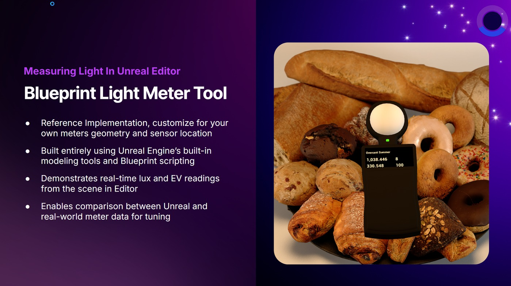
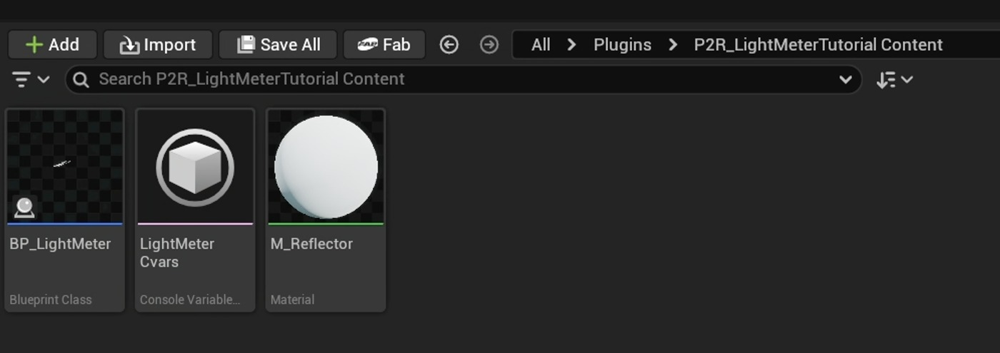
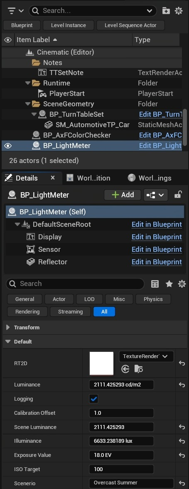
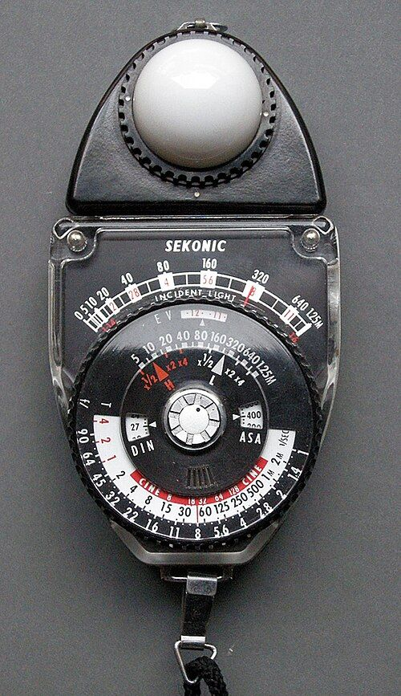

# 蓝图教程：虚幻引擎中的虚拟入射光计

## 来源与状态

- 原始 URL：https://dev.epicgames.com/community/learning/tutorials/Z2a2/blueprint-tutorial-virtual-incident-light-meter-in-unreal-engine
- 原始文件：blueprint-tutorial-virtual-incident-light-meter-in-unreal-engine.origin.md
- 分段：第 1/5 段

- 原始 URL：https://dev.epicgames.com/community/learning/tutorials/Z2a2/blueprint-tutorial-virtual-incident-light-meter-in-unreal-engine

## 运行时分类

- 类型：图文教程
- 判断：运行时未识别到核心视频信号，可整理正文约 14101 字符。

## 摘要

本指南将引导您创建仅蓝图的虚拟入射光计，该计通过对场景亮度进行采样来模拟现实世界的曝光计...

## 中文整理

### 在虚幻引擎中构建虚拟入射光计

此内容与 2025 年斯德哥尔摩虚幻节的现实门户 - 将现实世界资产与虚幻工作流程资源融合相关。

本指南将引导您创建一个纯蓝图的虚拟入射光计，该计通过在色调映射之前采样场景亮度、将其转换为 cd/m²、勒克斯、曝光值 (EV) 并对照明条件进行分类来模拟现实世界的曝光计。

这在 2025 年斯德哥尔摩虚幻节上分享的现实之门演示中得到了体现。

- 通往现实的门户 - 将现实世界资产与虚幻工作流程资源融合在本教程中，您将使用 SceneCapture2D actor 读取 1x1 像素渲染目标中的光照，提取线性 HDR 颜色值，使用基于物理的数学转换这些值，并对光照级别进行分类，以用于光照验证、虚拟制作或游戏开发场景。

您将构建一个独立的蓝图 act​​or，在运行时动态创建自己的渲染目标，使用 SceneCapture2D 组件捕获场景亮度，并运行基于物理的数学来计算照明分类。

这种方法避免了关卡或内容浏览器中的硬编码资产，确保了版本控制项目中可扩展、多实例使用的兼容性。

无需 C++！

这只是蓝图、数学和一些实用的照明知识。

该插件通过 Epic Games Launcher 与 Unreal Engine 5.6.1 一起打包。

P2R_LightMeterTutorial 插件提供的示例蓝图 Actor (BP_LightMeter) 可以添加到您的项目中，并且在关卡中使用时将提供以下内容： RT2D：这是特定于该 actor 的 TextureRender2D。

这就是我们正在采样的。

亮度 (cd/m²)：这是指级别中特定点的勒克斯估计值。

它是由平面捕获的光定向的。

放置演员时请考虑这一点。

日志记录：在指定级别启用此特定参与者的日志记录。

校准偏移：如果需要各种边缘情况（例如超大场景），此乘数可用于调整生成的场景亮度。

场景亮度 (cd/m²)：这是场景捕获中采样的原始像素的转换场景亮度的勒克斯估计值，并应用了校准因子。

照度 (Lux)：将测量结果转换为勒克斯。

曝光值 (EV)：计算出的 EV 基于 ISO 目标，通常为 100。

场景：场景亮度的分类范围标签。

### 你将构建什么

在本教程结束时，您的虚幻引擎蓝图系统将： - 使用 1x1 HDR 渲染目标从场景中捕获场景引用的线性 RGB 数据 使用 1x1 HDR 渲染目标从场景中捕获场景引用的线性 RGB 数据 - 计算真实世界的光度值，如亮度 (cd/m²) 和照度 (lux) 计算真实世界的光度值，如亮度 (cd/m²) 和照度 (lux) - 导出曝光值 (EV) 并进行调整针对相机 ISO 导出曝光值 (EV) 并针对相机 ISO 进行调整 - 将照明分类为有意义的现实世界标签（例如“月光”、“办公室灯光”等） 将照明分类为有意义的现实世界标签（例如“月光”、“办公室灯光”等） - 使用 3D TextRender 或 UI 小部件显示此信息 使用 3D TextRender 或 UI 小部件显示此信息 此方法避免使用基于磁盘的渲染目标，并确保每个实例即使在版本控制的环境中，蓝图也可以独立工作。

### 什么是入射照度计？

在我们构建一个之前，让我们先了解它到底是什么。现实世界的入射光计测量落在物体上的光，而不是从物体反射的光。它并不关心主题是什么；它只关心主题是什么。它测量原始传入照明，通常带有一个白色圆顶，可捕获来自正面方向的光线。这与相机（或反射仪）的工作原理有根本的不同，相机（或反射仪）的工作原理是根据物体看起来的亮度来确定曝光。入射计可帮助您根据光线的亮度确定曝光。它以勒克斯（流明/平方米）为单位测量照度，该值为您提供计算适当曝光的基础点。以下是摄影数学中的核心关系： 曝光 = (照度 × 时间) / (光圈)² 由此，我们得到曝光值 (EV) 系统： EV = log2(N² / t) - N = 光圈（光圈值） N = 光圈（光圈值） - t = 快门时间（秒） t = 快门时间（秒） 如果我们测量照度并将其转换为亮度： 亮度 ≈ Lux / π 那么我们可以使用： EV100 = log2(亮度/2.5) 这就是真实仪表为您提供建议曝光设置的方式。在 Unreal 中，我们将使用 SceneCapture2D 重新创建它，以对预色调映射的 HDR 亮度进行采样，然后执行必要的计算以确定蓝图中的 Lux、EV、ISO 和分类。 - 维基百科文章：照度计

### 第 1 步：准备项目

### 1.1 启用虚拟制作实用程序插件

要创建可在虚幻编辑器视口中进行交互的可勾选蓝图 Actor，我们需要启用 Virtual Production Utilities 插件。这将为我们提供 VP Tickable Actor 基类，我们可以将其子类化作为 Actor 的基础。

### 1.2 配置项目以获得更高精度

r.SceneColorFormat 是一个控制台变量 (CVar)，用于控制场景颜色缓冲区的格式/精度/布局（即后处理/色调映射之前的全场景渲染目标）。

换句话说，它决定了包含渲染场景的缓冲区中有多少位、什么数字格式（固定与浮动）以及是否存储 alpha 等。

由于场景颜色缓冲区被大量使用（用于后处理、半透明、读回等），因此其格式会对性能、质量和内存带宽产生影响。

由于我们正在评估现实世界的价值，因此拥有最高精度是有益的。

这并不意味着我们需要以这种精确度来传递我们的体验！

以下是 CVAR 各种值的快速总结： 0 | PF_B8G8R8A8（每通道 8 位）|精度低。

可能用于测试或后备，通常不适合 HDR 或繁重的后处理。

1 | PF_A2B10G10R10（10 位 + 2 位阿尔法）|更高的精度和一定的 alpha 能力。

2 | PF_FloatR11G11B10（浮点数，无 alpha）|紧凑浮点表示（R/G 为 11 位，B 为 10 位）。

如果不需要阿尔法，这是一个很好的折衷方案。

3 | PF_FloatRGB（32 位浮点 RGB，无 alpha）|不错的浮点精度，但丢失了 alpha。

有时在不需要 alpha 时使用。

4（默认）| PF_FloatRGBA（64 位浮点）|许多设置中的默认/最高精度选项。

包括完整的 Alpha 通道。

5 | PF_A32B32G32R32F（128 位浮点）|在大多数实时环境中，主要是为了实验或极端精确的需求，过度杀伤力。

PF_B8G8R8A8（每通道 8 位）低精度。
