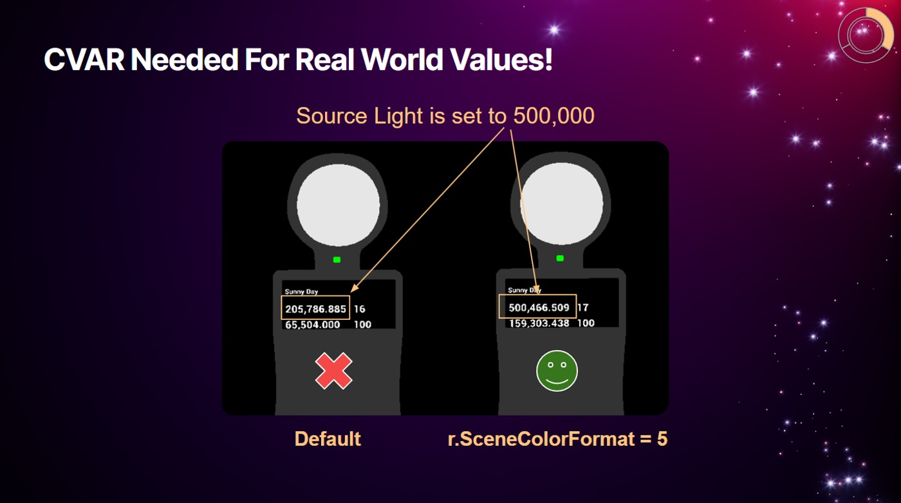
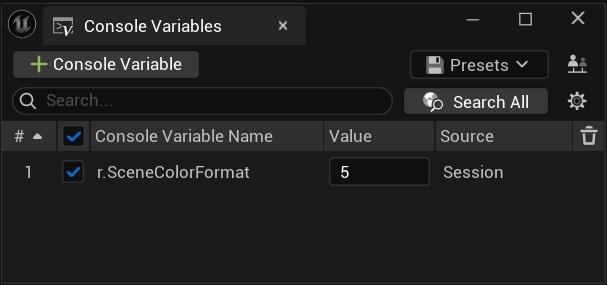
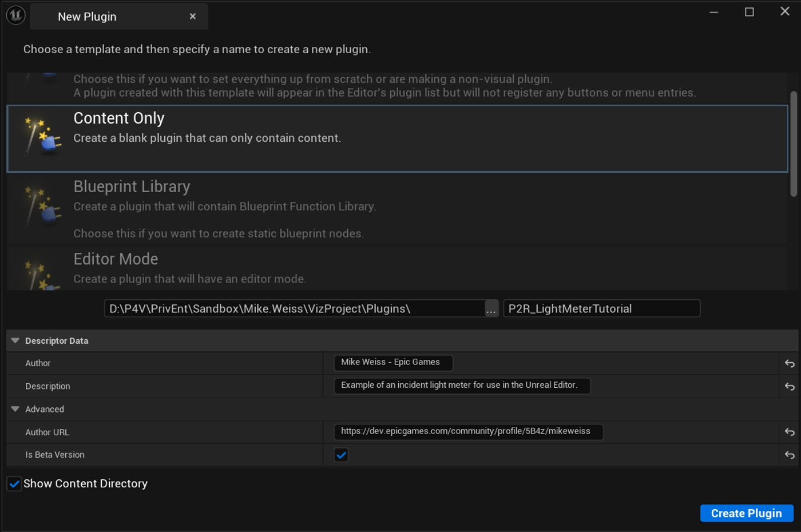
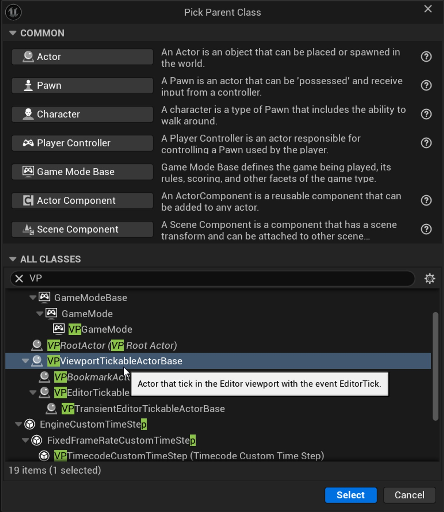
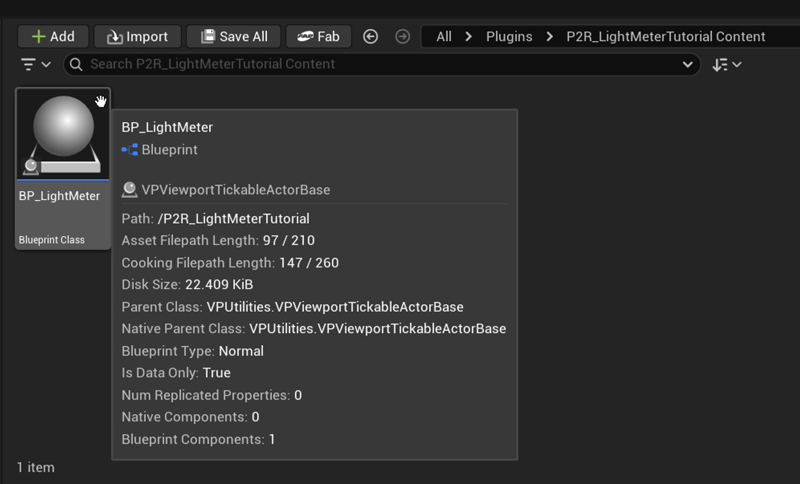
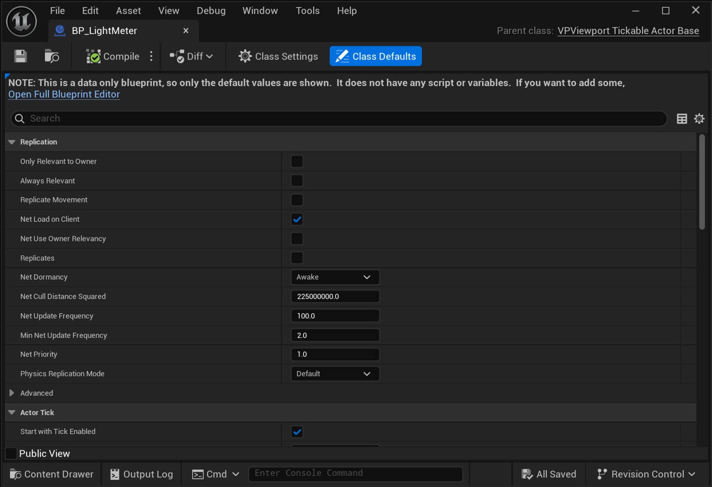

# 蓝图教程：虚幻引擎中的虚拟入射光计（续 2）

## 来源与状态

- 原始 URL：https://dev.epicgames.com/community/learning/tutorials/Z2a2/blueprint-tutorial-virtual-incident-light-meter-in-unreal-engine
- 原始文件：blueprint-tutorial-virtual-incident-light-meter-in-unreal-engine.origin.md
- 分段：第 2/5 段

可能用于测试或后备，通常不适合 HDR 或繁重的后处理。

PF_A2B10G10R10（10 位 + 2 位 alpha）更高的精度和一些 alpha 容量。

PF_FloatR11G11B10（浮点，无 alpha）紧凑浮点表示（R/G 为 11 位，B 为 10 位）。

如果不需要阿尔法，这是一个很好的折衷方案。

PF_FloatRGB（32 位浮点 RGB，无 alpha） 不错的浮点精度，但丢失了 alpha。

有时在不需要 alpha 时使用。

4（默认） PF_FloatRGBA（64 位浮点） 许多设置中的默认/最高精度选项。

包括完整的 Alpha 通道。

PF_A32B32G32R32F（128 位浮点）在大多数实时环境中过度杀伤，主要用于实验或极端精度需求。

### 第 2 步：创建仅内容插件

强烈建议使用纯内容插件，以便您可以在其他虚幻引擎项目中轻松重用此蓝图。我写了一篇文章，专门帮助您快速了解如何创建一个，如果您需要复习的话。 - 在虚幻引擎中创建仅内容插件

### 第 3 步：创建蓝图 Actor

如果您不熟悉创建蓝图 Actor，请查看下面的教程，我将深入探讨蓝图编辑器面板和其他详细信息。 - 学习蓝图：使用蓝图创建优雅的浮动项目第 1 部分

### 3.1 创建蓝图BP_LightMeter

在插件的 Content 文件夹中，右键单击空白区域并基于 VP Tickable Actor Base 创建一个新蓝图。这个类是独一无二的，因为它不仅提供游戏勾选，还允许我们在编辑器中勾选，从而在视口中为此类工具启用交互式更新。首次打开此类的默认面板时，只会在详细信息视图中显示类默认值。您必须将“Actor Hidden In Game”的类默认值设置为 False（未选中），否则您的场景捕捉将无法按预期工作！让我们借此机会做最重要的事情以使其发挥作用。 VPViewportTickableActor 有一个默认类，它会覆盖“游戏中隐藏的 Actor”的所有组件参数。如果未禁用此功能，Actor 中的几何体将不会包含在场景捕获中。我们将很快提供更多详细信息。现在是时候勾选这个框了；未来的你会感谢你！选择蓝色突出显示的“打开完整蓝图编辑器”以显示图表。

### 3.2 将组件添加到蓝图中

将以下组件添加到蓝图中： - TextRender：将此命名为“Display”，因为我们将使用它作为视口中显示的值。

TextRender：将此命名为“Display”，因为我们将使用它作为视口中显示的值。

- SceneCaptureComponent2D：将此命名为“传感器”，因为我们将使用它作为值的测量点。

SceneCaptureComponent2D：将此命名为“传感器”，因为我们将使用它作为值的测量点。

- 平面分量：这将是我们用来测量值的表面。

这是我们在使用 Sensor SceneCaptureComponent2D 进行采样时使用的捕光器。

现在，我们将比例设置为 0.1，以便我们可以看到它。

将其命名为“反射器”。

关闭“投射阴​​影”，使平面不影响场景照明。

平面分量：这将是我们用来测量值的表面。

这是我们在使用 Sensor SceneCaptureComponent2D 进行采样时使用的捕光器。

现在，我们将比例设置为 0.1，以便我们可以看到它。

将其命名为“反射器”。

关闭“投射阴​​影”，使平面不影响场景照明。

将以下变量添加到蓝图： - 纹理渲染目标 2D 类型，设置为实例可编辑并命名为“RT2D”，以管理对我们将创建的渲染目标 2D 对象的引用。

这使我们能够验证目标是否已创建。

纹理渲染目标 2D 类型，设置为实例可编辑并命名为“RT2D”，用于管理对我们将创建的渲染目标 2D 对象的引用。

这使我们能够验证目标是否已创建。

- 一定要使用“Texture Render Target 2D”； 2D 渲染目标是一种不同类型的对象。

一定要使用“Texture Render Target 2D”； 2D 渲染目标是一种不同类型的对象。

### 3.3 在运行时创建渲染目标

在构造脚本中，我们将添加逻辑来处理交互时发生的两个操作：更新值和设置蓝图实例。

我们将使用“序列”节点。

该蓝图将在编辑器内与蓝图的每次交互中执行构造脚本。

一旦执行发生，我们就设置变量“Initialized?”为真。

这绕过了重新执行初始化的需要。

我选择这种模式是因为它允许您根据需要添加更多功能。

向序列添加更多执行引脚，稍后享受乐趣和探索。

我们还将设置 - 需要“验证获取”来管理渲染目标设置的执行流程。

这将确保我们优化在内存中创建的渲染目标的数量。

为了管理渲染目标设置的执行流程，需要“验证获取”。

这将确保我们优化在内存中创建的渲染目标的数量。

- 任何 Get 都可以在上下文菜单中转换为经过验证的 Get。

由此产生的节点非常强大！

- 使用“创建渲染目标 2D”节点并将其设置为 9x9 像素。

将“格式”设置为 RGBA32f，以在编辑器中工作时获得最高精度。

您将来可以使用变量扩展它，但我们只需要一个像素即可实现基本功能。

我使用了九个，因为在您探索时更容易看到生成的纹理。

关键是我们想要有一个中心像素来查询。

该纹理用于设置我们的 RT2D 变量以供以后使用和调试。

使用“创建渲染目标 2D”节点并将其设置为 9x9 像素。

将“格式”设置为 RGBA32f，以在编辑器中工作时获得最高精度。

您将来可以使用变量扩展它，但我们只需要一个像素即可实现基本功能。

我使用了九个，因为在您探索时更容易看到生成的纹理。

关键是我们想要有一个中心像素来查询。

该纹理用于设置我们的 RT2D 变量以供以后使用和调试。

- 将传感器组件从蓝图层次结构拖到图表中并获取对其的引用。

然后，拔下引脚并使用“获取纹理目标”节点。

然后，我们使用“设置纹理目标”节点将 2D 渲染目标分配给组件。

请参阅下面的屏幕截图。

将传感器组件从蓝图层次结构拖到图表中并获取对其的引用。

然后，拔下引脚并使用“获取纹理目标”节点。
