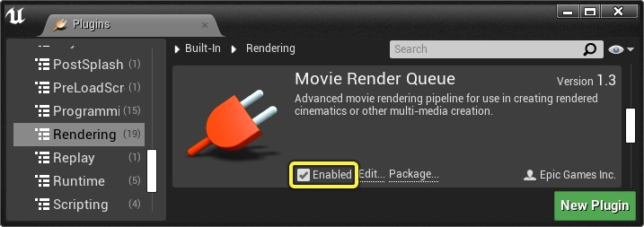
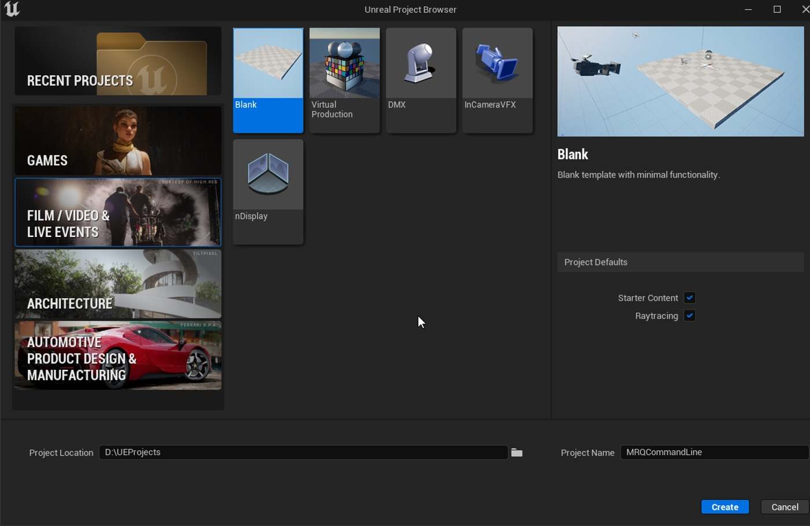
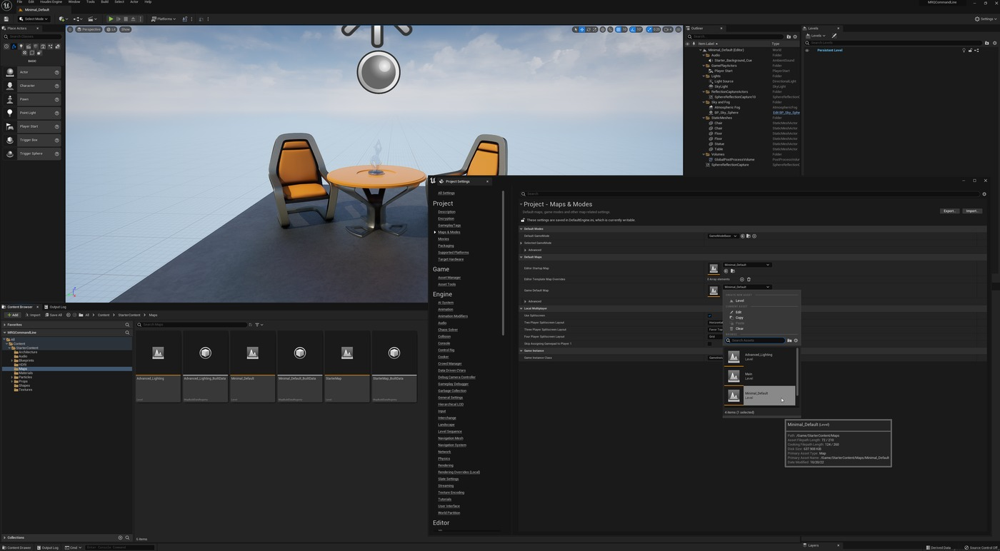
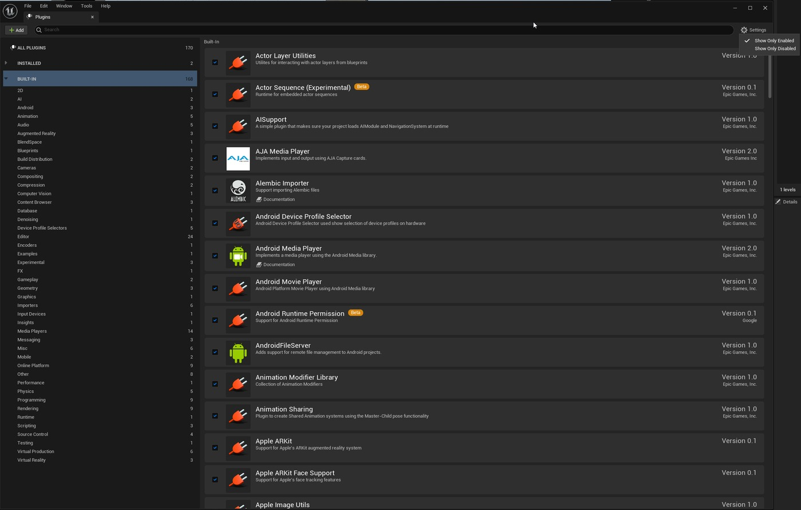
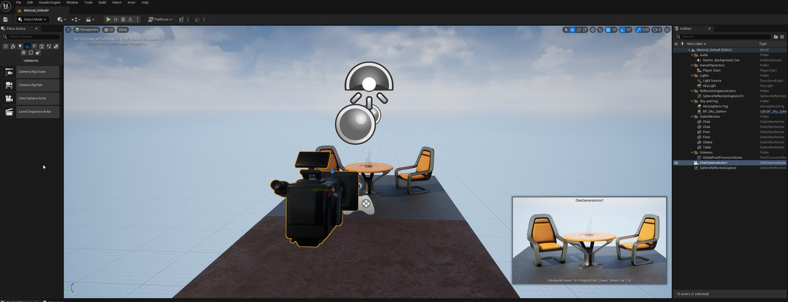
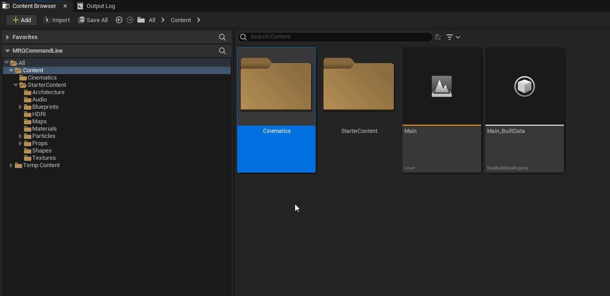
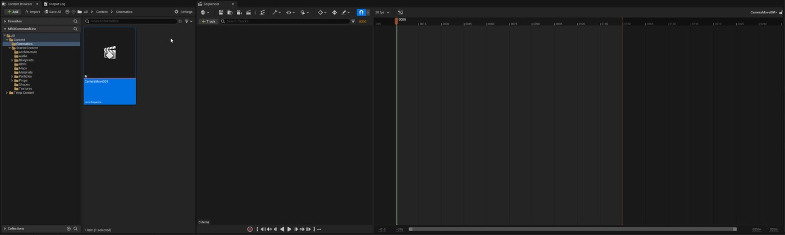
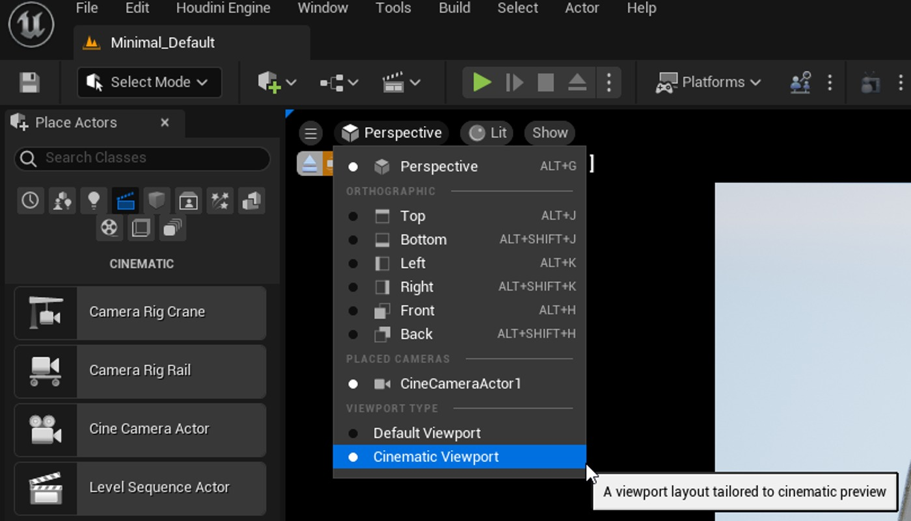
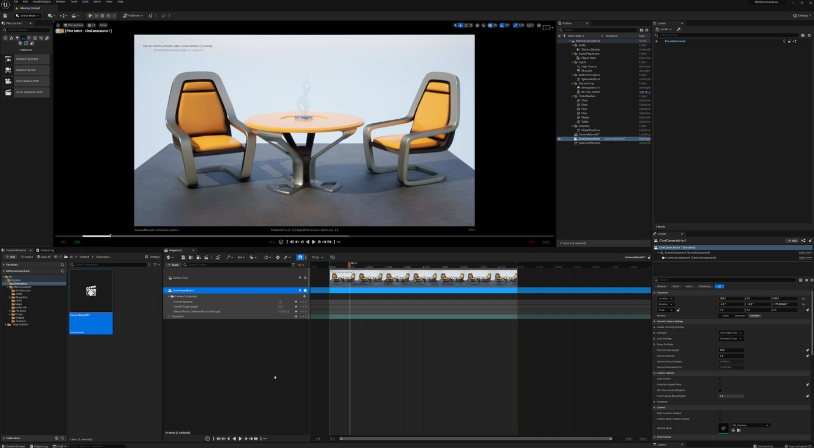
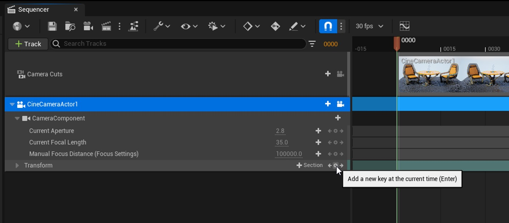

# 使用虚幻引擎电影渲染队列进行命令行渲染

## 来源与状态

- 原始 URL：https://dev.epicgames.com/community/learning/tutorials/nZ2e/command-line-rendering-with-unreal-engine-movie-render-queue
- 原始文件：command-line-rendering-with-unreal-engine-movie-render-queue.origin.md
- 分段：第 1/4 段

- 原始 URL：https://dev.epicgames.com/community/learning/tutorials/nZ2e/command-line-rendering-with-unreal-engine-movie-render-queue

## 运行时分类

- 类型：图文教程
- 判断：运行时未识别到核心视频信号，可整理正文约 14052 字符。

## 摘要

借助虚幻引擎影片渲染队列插件，虚幻引擎 4.27 和 5.x 的命令行渲染内容有多种选项。果阿...

## 中文整理

### 新功能，电影渲染队列

影片渲染队列（MRQ）是虚幻引擎的图像序列和影片渲染解决方案。它专为高质量渲染图像、简化与生产流程的集成以及用户可扩展性而构建。影片渲染队列支持多种用于生成高质量渲染的功能，例如其时间子采样功能，它允许您生成高质量的径向运动模糊。您还可以导出包含半透明像素值的图像（使用适当的项目/场景设置），使用线性数据生成 16 位 HDR 图像，并将渲染配置保存到可重复使用和共享的资源中。可以使用渲染队列同时管理多个作业及其设置，该队列支持批量渲染作业的运行。在虚幻引擎 4.27 和 5 中，出现了类似于各种渲染作业风格的新渲染概念。这些选项的范围包括直接在虚幻引擎内部的电影渲染队列中的复杂集成（应根据您的环境进行自定义的示例 Python 执行器），或者使用带有预设的单个作业或序列的简单命令行执行。

### 项目设置示例

如果您想深入了解，有一组围绕 Archvis 示例项目构建的很棒的 Movie Render Queue 文档。

然而，对于本教程，我希望确保涵盖我们从头开始处理的操作的所有要求。

有关更多详细信息和其他参考，请查看官方文档：使用电影渲染队列渲染高质量帧 为了简单起见并在本教程中快速入门，将使用带有 Starter Content 的 UE5 空白场景项目。

这将使我们专注于我们已经建立的命令行渲染目标以及您的项目所需的要求。

对于内容优化和渲染设置，资源部分下面有一些链接。

请注意，我的项目的路径是 D:\UEProjects。

这对几乎每个人来说都是不同的。

更新命令行示例以匹配您的环境。

可执行文件的位置位于此处的默认位置，但可以针对给定的虚幻引擎安装和目标版本自定义所有这些路径。

使用虚幻引擎项目浏览器的电影/视频和现场活动部分中的空白项目的好处之一是，该模板已经启用了电影渲染队列插件，以及离线制作中通常使用的其他一些插件。

如果您在正在处理的项目上完成此操作时缺少某些内容，请首先仔细检查所有插件是否已启用，这些插件与您正在使用的引擎功能的哪一部分相关。

插件管理器中有一个有用的设置，可以查看项目中启用了哪些插件。

您计划执行渲染任务的任何机器都必须具有相同的环境和项目插件才能成功。

为了使渲染变得简单，本教程将复制内容浏览器中 StarterContent/Maps 文件夹中的“Minimal_Default”地图。

在内容浏览器中，导航至入门内容 > 地图，然后右键单击 Minimal_Default 地图并选择“复制”。

这将创建一个名为 Minimal_Default1 的地图。

将其复制到项目的根目录。

我们这样做的原因是在版本之间，当我们使用迁移助手迁移项目并在版本之间“制作项目的副本”时。

这也是最佳实践。

我们将使用“编辑”>“项目设置”>“地图和模式”>“编辑器启动地图”和“游戏默认地图”条目将此项目设置为默认地图。

### 影片渲染队列要求

为了向渲染系统提供生成离线渲染所需的内容，我们将创建以下内容：将电影摄影机 Actor 拖动到您的 Minimal_Default1 关卡中，并根据您首选的序列起始位置调整其在关卡中的位置。

接下来，在内容浏览器中创建一个新文件夹来包含我们的工作。

我们将此示例称为“电影”。

接下来，我们需要一个包含要渲染的动画的关卡序列。

选择虚幻引擎编辑器顶部的拍板，选择“添加关卡序列”，然后选择我们创建的“Cinematics”文件夹作为目标。

在本教程中将此新序列命名为“CameraMove001”。

将 CineCameraActor 从 Outliner 拖放到 Sequencer 面板中，这会将其添加为轨道，并自动将此轨道锁定到视口中的摄像机。

这也是将透视视口切换到电影视口模式的绝佳时机。

现在我们将进行简单的相机移动。

有很多关于使用 Sequencer 在引擎中制作动画的资源，我们只需要一个简单的摄像机移动即可使用。

让我们通过选择轨道中两个箭头中间的圆圈来为当前变换添加一个关键帧。

确保红色时间滑块位于 0000。

将时间滑块拖动到时间线中较晚的帧。

本例中使用的是帧 135。

将视口或详细信息面板中的摄像机移动到新位置，然后再次按圆形按钮以向轨道添加关键点。

要预览序列，您可以抓住红色时间滑块并来回滑动时间线。

电影视口将随着您的相机移动而相应更新。

如果情况并非如此，请确保 CineCameraActor1 旁边的摄像机图标以白色突出显示，表示视口已锁定到该视图。

您还将在平板左侧的电影视口中看到详细信息。

### 虚幻引擎项目中的路径处理
