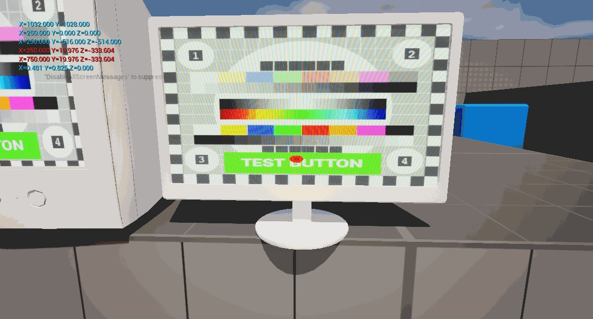
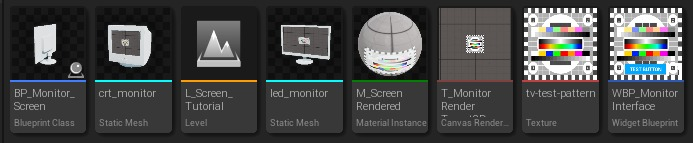
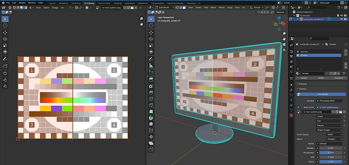

# 在虚幻引擎 5.4 中直接在网格表面上创建具有渲染屏幕的可交互监视器

## 来源与状态

- 原始 URL：https://dev.epicgames.com/community/learning/tutorials/V2Lq/creating-an-interactable-monitor-with-a-rendered-screen-directly-on-a-mesh-surface-in-unreal-engine-5-4
- 原始文件：creating-an-interactable-monitor-with-a-rendered-screen-directly-on-a-mesh-surface-in-unreal-engine-5-4.origin.md
- 分段：第 1/3 段

- 原始 URL：https://dev.epicgames.com/community/learning/tutorials/V2Lq/creating-an-interactable-monitor-with-a-rendered-screen-directly-on-a-mesh-surface-in-unreal-engine-5-4

## 运行时分类

- 类型：图文教程
- 判断：运行时未识别到核心视频信号，可整理正文约 14065 字符。

## 摘要

简短探索如何实现具有 UI 交互的显示器和具有材质效果的网格屏幕。

## 中文整理

### 概览

我最近在学习虚幻引擎时遇到了一个挑战，由于我在互联网上没有找到太多关于如何按照我想要的方式做到这一点的信息，因此我为可能对做这样的事情感兴趣的其他人写了一篇关于它的文章。在撰写本文时，我还是该引擎的新手，这也将是我的第一篇文章。我很确定可能有更好、更简单的方法来做到这一点（并且可能更优化），但我可能只是没有找到它们，无论如何，非常感谢建设性的反馈。

### 如何构建监视器：

本周（2024 年 8 月）我正在致力于构建一个可以交互的游戏内屏幕，我认为这很容易，因为在 Unity 中这是我有信心解决的问题，因为我已经使用该引擎多年了。

然而，在虚幻中，情况就大不相同了，所以让我们来探讨一下我是如何学会如何在不同的游戏引擎中做同样的事情以及如何复制它的。

主要想法是模拟一个屏幕，带有像素和它可能需要的任何扭曲，而不是简单地放置一个 3D Widget/UI 并缩放它以适合显示器，因为我不希望它感觉像网格顶部的图像，而是对象本身的一部分，就像真实的屏幕一样。

你可能会认为很多游戏都这样做，而且这应该是微不足道的，我同意。

然而，它不仅仅是一个屏幕材料，而且还可以通过该网格进行交互，并发挥引擎 UI 系统的所有优点。

我构建了一个非常简单的 UI 来展示这篇短文的监视器。

这不应该那么复杂，也不需要我花那么长时间来解决，但是，正如前面提到的，我正在将我的知识从 Unity 移植到 Unreal，因此仍然需要大量的弄清楚、学习和适应工作。

如果您想在看不到我的实现的情况下弄清楚事情，这里有一个简短的解释：该系统的工作原理是将 Widget UI 渲染到渲染目标纹理，并将其用作材质发射的输入。然后，我们使用监视器网格及其 UV 设置来匹配屏幕空间，以便可以从 Unreal 的 Linecast“查找碰撞 UV”节点中的 Hit Result 中获取其坐标。利用这些坐标，蓝图可以移动 Widget Interactor 并使用它来单击正在执行的 Widget UI。渲染到监视器。

### 1. 复制此监视器需要什么。

在本文中，我将更多地关注 UI 和渲染目标方面，而不是材质本身、监视器网格或玩家蓝图。

在下面的屏幕截图中，您可以看到该系统所有组件的细分（不按顺序）。

以下是该项目的配方成分：顺便说一下，没有任何资产是赞助的，只是我所使用的资产和到期信用的参考。

- 监视器和整个系统的 Actor 蓝图。

这将容纳一个完整的监视器屏幕，因此如果您愿意，游戏中可以有多个监视器屏幕。

监视器和整个系统的 Actor 蓝图。

- 这将容纳一个完整的监视器屏幕，因此如果您愿意，游戏中可以有多个监视器屏幕。

这将容纳一个完整的监视器屏幕，因此如果您愿意，游戏中可以有多个监视器屏幕。

- 您想要在游戏中使用的 UI 的小部件蓝图。

如果您希望它们不同，可以将其设置为所有屏幕的通用或每个监视器的单个蓝图。

您想要在游戏中使用的 UI 的小组件蓝图。

- 如果您希望它们不同，可以将其设置为所有屏幕的通用或每个监视器的单个蓝图。

如果您希望它们不同，可以将其设置为所有屏幕的通用或每个监视器的单个蓝图。

- 具有您想要的屏幕效果且可接受Texture2D 的材质。

在本文中，我将使用 Nikolay Shamaev 在他的频道上分享的材料，解释如何在 YouTube 上的 Unreal 中实现 LED 屏幕外观。

您可以使用它来跟随或制作自己的，无论哪种方式，它都需要有一个Texture2D作为输入。

具有您想要的屏幕效果且可接受Texture2D 的材质。

- 在本文中，我使用 Nikolay Shamaev 在他的频道上分享的材料，解释如何在 YouTube 上的 Unreal 中实现 LED 屏幕外观。

您可以使用它来跟随或制作自己的，无论哪种方式，它都需要有一个Texture2D作为输入。

在本文中，我将使用 Nikolay Shamaev 在他的频道上分享的材料，解释如何在 YouTube 上的 Unreal 中实现 LED 屏幕外观。

您可以使用它来跟随或制作自己的，无论哪种方式，它都需要有一个Texture2D作为输入。

- 用于屏幕捕获的 CanvasRenderTarget2D。

这是渲染小部件蓝图并在我们的材质上使用的地方。

用于屏幕捕获的 CanvasRenderTarget2D。

- 这是渲染小组件蓝图并在我们的材质上使用的地方。

这是渲染小部件蓝图并在我们的材质上使用的地方。

- 您想要使用的监视器网格。

您在本文中看到的监视器来自 The Base Mesh。

需要对模型的 UV 和材质进行一些准备工作，我们将在稍后讨论。

您要使用的监视器网格。

- 您在本文中看到的监视器来自 The Base Mesh。

需要对模型的 UV 和材质进行一些准备工作，我们将在稍后讨论。

您在本文中看到的监视器来自 The Base Mesh。

需要对模型的 UV 和材质进行一些准备工作，我们将在稍后讨论。

- 临时测试纹理，有助于调整大小、分辨率和比例。

在设置过程中，纹理会清楚地显示其比例，使对齐变得更加容易。

我使用的来自 OpenClipart-Vectors。

临时测试纹理，有助于调整大小、分辨率和比例。

- 在设置过程中，纹理会清楚地显示其比例，使对齐变得更加容易。

我使用的来自 OpenClipart-Vectors。

在设置过程中，纹理会清楚地显示其比例，使对齐变得更加容易。

我使用的来自 OpenClipart-Vectors。

### 2. 首先，准备 UV。

为了使这种效果发挥作用，有必要知道我们的玩家当前在监视器网格上查看的位置。不仅如此，我们还需要确保渲染结果适合我们的屏幕在正确的位置，而不是显示器支架上。为此，网格的 UV 坐标非常有用。在本次演示中，我从 The Base Mesh 库中获取了一个监视器模型。它们随时可以使用，但是在这种情况下，需要对其 UV 和材料进行一些修改。我使用 Blender 进行 3D 工作，但您可以在任何可以分配材质槽和编辑网格 UV 的 3D 软件中实现此目的。首先，确保屏幕的多边形有分配给它们自己的材质槽，屏幕将在其中渲染。然后，更新它们的 UV 以适应映射中从边界到边界的测试纹理，如下所示。这很重要，因为稍后在虚幻中需要整个 UV 坐标范围。

### 3. 虚幻设置 — 第 1 部分。

在虚幻中，有一个非常重要的设置可以让所有这些工作正常进行，因此首先确保它已启用。
