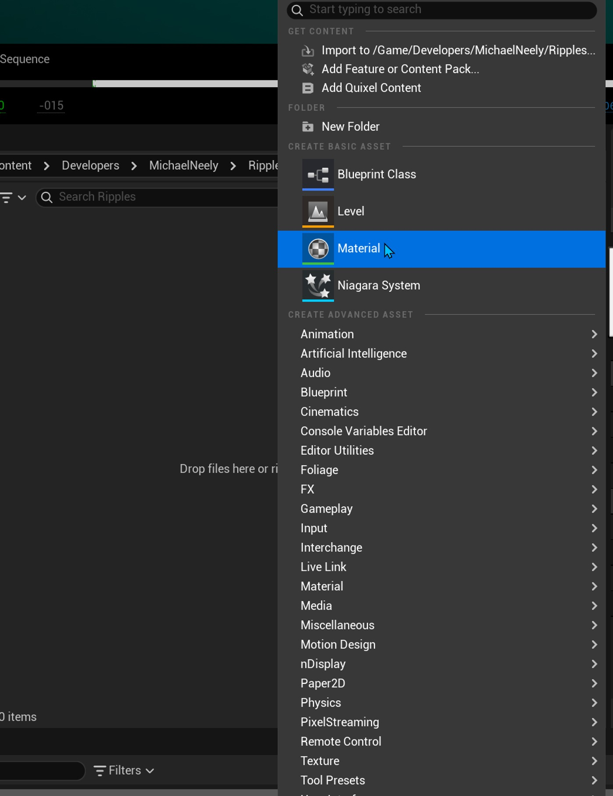
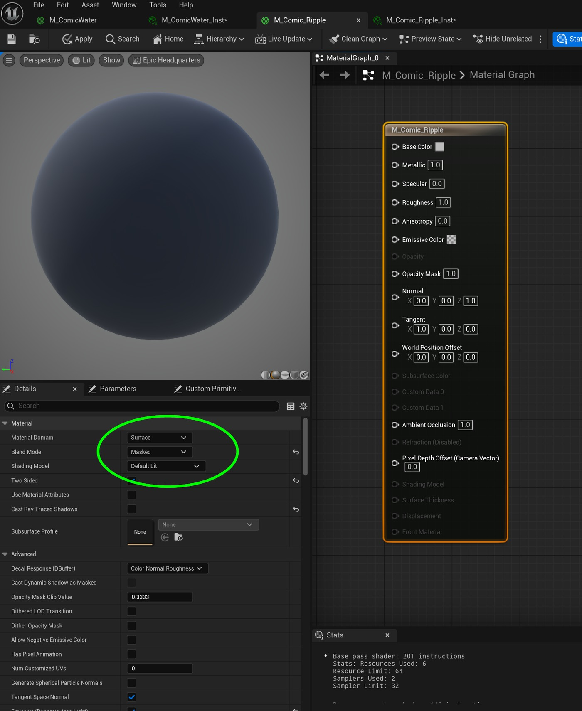
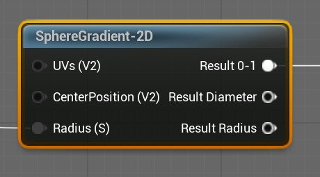
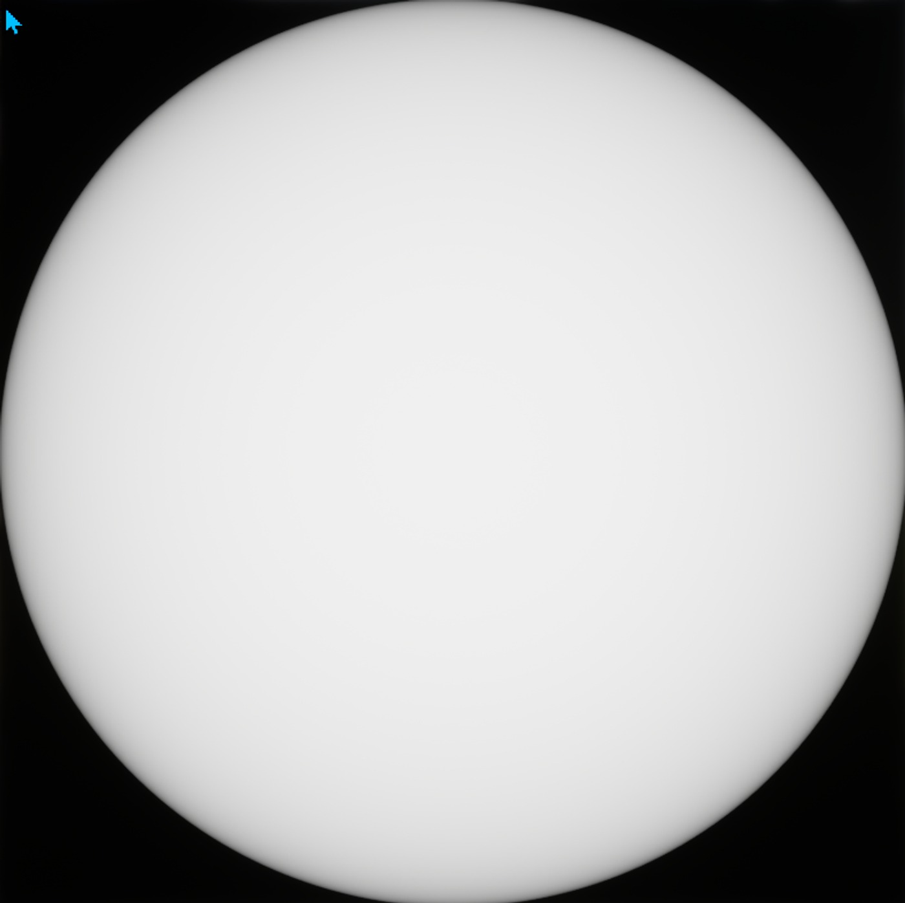
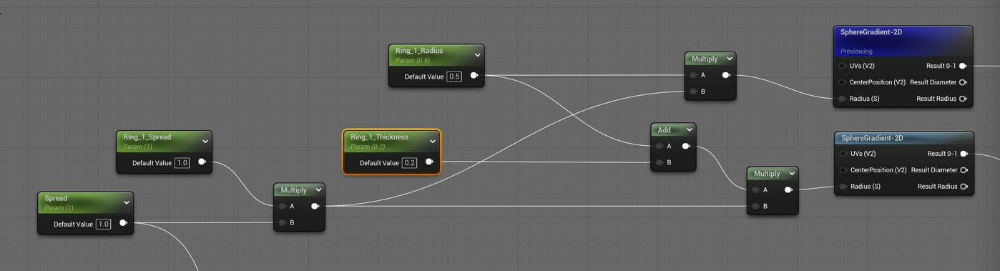
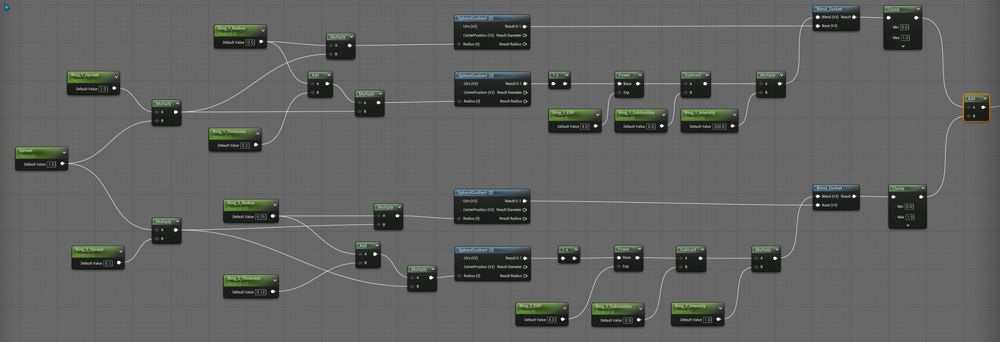
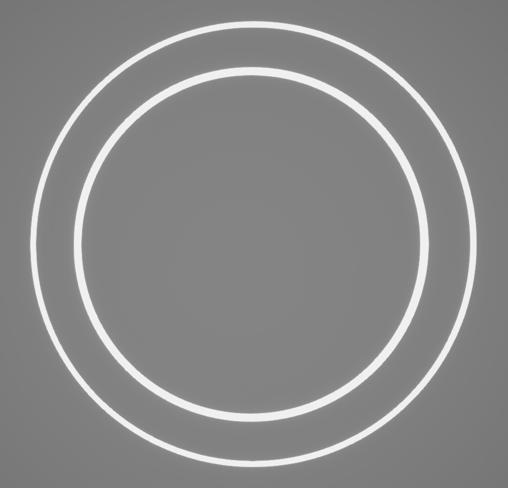
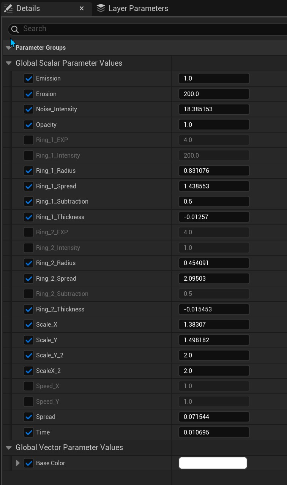
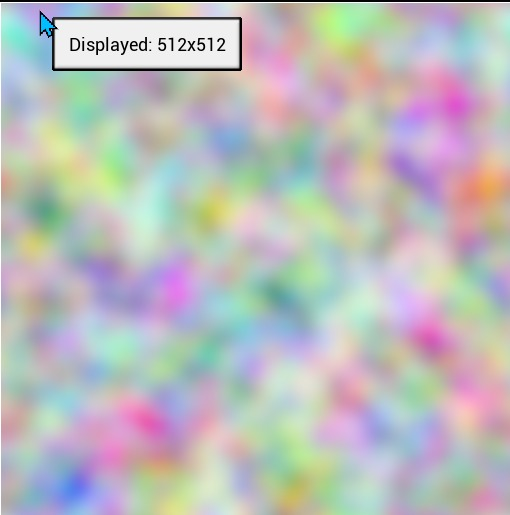

# 在虚幻引擎中创建风格化的水波纹

## 来源与状态

- 原始 URL：https://dev.epicgames.com/community/learning/tutorials/KPL1/creating-stylized-water-ripples-in-unreal-engine
- 原始文件：creating-stylized-water-ripples-in-unreal-engine.origin.md
- 分段：第 1/2 段

- 原始 URL：https://dev.epicgames.com/community/learning/tutorials/KPL1/creating-stylized-water-ripples-in-unreal-engine

## 运行时分类

- 类型：图文教程
- 判断：运行时未识别到核心视频信号，可整理正文约 4817 字符。

## 摘要

本教程将向您展示如何为您的项目创建风格化、手绘的水波纹。这个想法是创造一种简单的材料......

## 中文整理

### 概览

### 创建材质

首先，在内容浏览器中，通过右键单击并选择材质来创建材质资源。接下来，双击新创建的材质资源以打开材质图编辑器。在编辑器中选择材质节点，然后将混合模式更改为蒙版。

### 生成圆圈

为了有同心环，我们需要有圆。我们可以使用纹理贴图来做到这一点，但纹理的分辨率不是最好的，而且我们对圆的属性的控制也较少。首先，我们可以使用名为 SphereGradient-2D 的程序节点。它有 3 个输入和 3 个结果输出。出于本练习的目的，我使用半径输入和结果 0-1 输出。 0.5 处的半径值给出了此结果。通过组合 2 个 SphereGradient 节点，并使用 Blend Darken 节点将它们混合，我们可以获得环的结果。这里的技巧是使第二个环的半径偏移，以便可以创建环。这是通过一些参数节点完成的。在此示例中，有 Spread、Ring_1_Spread、Ring_1_Thickness 和 Ring_1_Radius。将厚度添加到半径并乘以 Ring_1_Spread，后者还乘以主 Spread 参数。通过反转第二个 SphereGradient 结果并通过幂节点（后跟减法器和乘法器节点）运行该值。我们可以将这些值推至最高对比度。该方法特别适用于漫画着色技术。然后使用 Blend_Darken 节点将第二个 SphereGradient 结果与第一个结果组合，形成一个环。对第二个环重复此过程，并将两个结果夹紧并相加。使用材质实例，我们可以调整参数以获得所需的结果。

### 制造一些噪音

该图的下一部分是添加一些噪声来控制环的线条质量。这为环提供了一些很好的随机侵蚀，并且完全是艺术指导的。为了进行设置，我们从一个名为“游戏风噪声”的内置纹理样本开始。使用其中的两个使我们能够缩放每个并减少或消除噪声纹理中的重复模式。添加用于缩放和偏移纹理坐标的参数，可以更好地控制两个纹理的重叠方式。最后，将两个结果相乘，限制值，然后使用两个附加参数“噪声强度”和“侵蚀”相乘，以调整整体侵蚀效果。然后将噪声的结果与环相乘。

### 使用 Sequencer 制作动画

因为我们拥有缩放、调整大小和腐蚀环所需的所有参数，所以我们还可以在 Sequencer 中为这些参数设置动画。在下图中，应用了材质实例的 3 个平面已添加到序列器中。对于每个平面，通过单击 Actor 轨道右侧的 + 添加 staticMeshComponent 轨道。接下来，单击 StaticMeshComponent 轨道上的 + 添加材质。单击材质轨道上的 + 将显示 Sequencer 可用的材质实例的所有参数。因为序列器中的每个平面都是一个实例，所以材质也是一个实例。这允许对每个平面的材质属性进行动画设置和单独设置关键帧。这为每组戒指的外观和计时提供了完全的艺术自由。

### 时间扭曲曲线轨迹

3D 动画通常看起来过于平滑，与传统的手绘单元格非常不同。音序器中一项非常酷的功能是时间扭曲曲线轨道。在 Sequencer 中，单击“添加”按钮并找到“时间扭曲”功能并选择“时间扭曲曲线”。这会将 Sequencer 中的时间扭曲曲线轨道放置在时间线的顶部。该轨道在轨道的开头有一个关键点，在结尾处有另一个关键点，其预设值与时间线中的帧数相匹配。在此示例中，为 0 到 150。在曲线编辑器中选择两个关键点，右键单击其中一个关键点并选择“过滤器”选项。这将为操作关键帧提供多种选项。使用“烘焙”选项，我们可以沿曲线时间线以我们选择的任何增量设置关键点。在此示例中，我们选择每 4 帧作为增量。这会导致每 4 帧将一个关键点烘焙到曲线中。选择所有烘焙关键点，右键单击并选择常量以更改关键帧的插值。结果是动画播放现在将在 4 秒上进行，使其在视觉上更加风格化，并且更像传统的关键帧动画。

### 概括

有许多不同的方法可以将风格化元素添加到动画中。我鼓励您在社区中探索更多有关风格化的教程。希望本教程对您有所帮助，最重要的是您玩得开心。 - 解构风格化的漫画着色器 - 轮廓和其他 FX 的叠加材质 - 材质 - 虚拟制作 - 过场动画

## 相关链接
