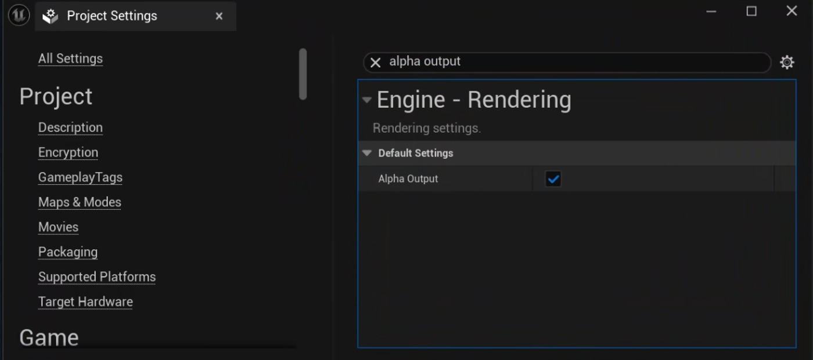

# 虚幻引擎中的分层渲染：分步制作工作流程

## 来源与状态

- 原始 URL：https://dev.epicgames.com/community/learning/tutorials/pY8M/layered-rendering-in-unreal-engine-a-step-by-step-production-workflow
- 原始文件：layered-rendering-in-unreal-engine-a-step-by-step-production-workflow.origin.md
- 分段：第 1/3 段

- 原始 URL：https://dev.epicgames.com/community/learning/tutorials/pY8M/layered-rendering-in-unreal-engine-a-step-by-step-production-workflow

## 运行时分类

- 类型：图文教程
- 判断：运行时未识别到核心视频信号，可整理正文约 14079 字符。

## 摘要

本文介绍了一种实用的、面向生产的方法，用于在虚幻引擎中进行分层渲染。它解释了如何分离环境、角色......

## 中文整理

### 介绍

分层渲染是视觉特效和动画管道中的一种成熟实践，允许合成艺术家处理图像的各个部分，例如环境、角色和效果，而无需重新渲染整个镜头。虚幻引擎通过其电影渲染工具支持分层渲染，但要获得干净、可用于生产的结果，需要清楚地了解不同系统在单独渲染时的行为方式。本文探讨了在虚幻引擎中将场景元素分离到离散渲染层中的实用的、以生产为中心的方法。它探讨了各种资产类型和渲染功能如何与分层工作流程交互，强调了实际项目中遇到的常见挑战，并概述了保持与主要美感通道视觉一致性的策略。在本文结束时，虚幻引擎中的分层渲染工作流程应该感觉更清晰、更可预测，从而更容易集成到现代实时制作和后期制作流程中。

### 研究阶段

该研究分为三个连续阶段，每个阶段都旨在解决与分层渲染相关的特定技术问题，并在实际生产条件下逐步验证工作流程。

### 第一阶段：核心资产类型分层渲染

第一阶段的重点是验证使用影片渲染队列预设 (MRQP) 将不同资源类型正确渲染为单独图层的能力。对输出前景、中景和背景层进行了一系列测试，特别注意 Alpha 通道精度和层对齐。此阶段的主要目标是确认每个图层都可以干净地导出并直接在下游合成工作流程中使用，而无需进行额外的校正。

### 第二阶段：视觉特效元素的分层渲染

第二阶段集中于包含视觉效果的渲染层，包括稀疏虚拟纹理 (SVT)、Niagara 粒子系统和静态雾资产（例如雾平面）。此阶段的目标是评估这些效果是否可以可靠地隔离到各个层中，同时保留其视觉特征、深度关系以及重新合成后与其他场景元素的正确交互。

### 第三阶段：案例研究

在最后阶段，之前测试的结果被应用于我们内部 Lightfall 项目的制作风格镜头，结合了之前评估的资产类型和效果的组合。除了这个实际应用之外，还对电影渲染图 (MRG) 进行了深入分析。这样可以在基于影片渲染队列预设的工作流程和使用影片渲染图的工作流程之间进行直接比较，目的是在现实场景中验证结果并确定每个管道的优势和局限性。

### 第一阶段：各种资产类型的分层渲染

### 层命名约定

为了确保虚幻引擎美术师和合成团队之间的顺利协作并在整个制作过程中保持一致性，必须在工作流程的早期定义清晰且统一的图层命名约定。层命名没有单一的行业范围标准。大多数工作室都会制定内部指南，但常见的做法是使用简短的大写标签（通常为 3-4 个字母），使合成人员能够一目了然地快速识别每个渲染层的内容。定义命名系统时，可以将已建立的参考资料（例如 Epic Games 的分层渲染文档、Netflix 交付指南和其他工作室最佳实践）用作起点。图层标签示例： - CHR / CHAR：角色、服装和配饰 CHR / CHAR：角色、服装和配饰 - PROP：交互式对象和道具（例如武器） PROP：交互式对象和道具（例如武器） - FX：视觉效果 FX：视觉效果 - ENV：静态环境和场景元素 ENV：静态环境和场景元素 - ATM：大气元素（雾、体积） ATM：大气元素（雾、体积） - LGT：艺术照明或辉光通道 LGT：艺术照明或辉光通道 为了提高清晰度和组织性，可以将前景 (FG)、中景 (MG) 和背景 (BG) 前缀添加到这些标签中以指示空间分组： - FG_ENV、MG_PROP、BG_FX 等。 FG_ENV、MG_PROP、BG_FX 等。在某些情况下，FG、 MG 和 BG 也可以用作独立的层名称。当空间范围内的所有元素需要分组为单个层而无需按资产类型进一步分离时，此方法非常有用。

### 标准文件命名模板

一致的文件命名结构与图层命名同样重要，尤其是对于多镜头和多版本项目。推荐的文件名模板：<EP>_<SEQ>_<SHOT>_<LAYER>_<PASS>_v###/<FRAME>.exr 示例：Lightfall_010_SH0030_BG_ENV_beauty_v001/0184.exr 此结构确保每个渲染层可立即识别、受版本控制并易于集成到下游合成管道中

### 初步项目设置

在虚幻引擎中使用分层渲染之前，必须配置几个核心项目设置以确保正确生成渲染层。其中最关键的是适当的 Alpha 通道支持，这对于干净的层分离和合成至关重要。

### Alpha 通道激活

启用 Alpha 通道允许虚幻引擎在最终渲染图像中生成和存储透明度信息。需要此数据才能正确地将场景元素与背景隔离并在合成阶段重新组合多个图层。如果未启用 Alpha 通道，渲染图层将缺少透明度数据，从而无法进行准确的图层分离和下游合成。设置路径：项目设置→引擎→渲染→默认设置→Alpha输出→ON一旦启用此选项，虚幻引擎将在支持的渲染输出（例如EXR文件）中包含Alpha信息，从而允许在专业合成工作流程中可靠地使用分层渲染。

### 测试参数

在研究的第一阶段，建立了一个专门的测试场景来评估受控条件下分层渲染的核心行为。

目标是确定可靠的基线设置，并了解不同的资源类型和渲染功能在分成离散层时的行为方式。

测试场景包括以下元素和特征： - 空间层分离，资产分布在前景、中景和背景平面上。

空间图层分离，资产分布在前景、中景和背景平面上。

- Nanite 网格体以及实例化静态网格体 (ISM) 和分层实例化静态网格体 (HISM)，用于评估不同几何系统之间的层隔离。

Nanite 网格体以及实例化静态网格体 (ISM) 和分层实例化静态网格体 (HISM)，用于评估不同几何系统之间的层隔离。

- 一个动画角色，使用带有骨架网格物体的 MetaHuman 蓝图实现，用于测试跨层的时间一致性和动画处理。

一个动画角色，使用带有骨架网格物体的 MetaHuman 蓝图实现，用于测试跨层的时间一致性和动画处理。

- 树叶资源，包括按程序放置的植被和绘制的树叶实例。

树叶资源，包括按程序放置的植被和绘制的树叶实例。

- 大气组件，例如天空大气和体积云，用于评估它们在渲染为特定图层的一部分或与特定图层隔离时的行为。

大气组件，例如天空大气和体积云，用于评估它们在渲染为特定图层的一部分或与特定图层隔离时的行为。

此配置提供了常见生产资产的代表性横截面，允许在现实的引擎级场景中评估分层渲染工作流程。

### 所需的测试渲染设置

对于初始测试渲染，使用一组一致的渲染参数来评估分层输出的正确性和稳定性。这些设置用于验证和目视检查，而不是最终的生产交付。测试渲染设置： - 抗锯齿：13× 时间样本此样本计数足以验证层分离、Alpha 完整性和时间稳定性。对于最终制作或电影质量输出，该值通常应增加到 64 个时间样本。抗锯齿：13× 时间样本此样本数量足以验证层分离、Alpha 完整性和时间稳定性。对于最终制作或电影质量输出，该值通常应增加到 64 个时间样本。 - 分辨率：1920 × 1080（全高清） 分辨率：1920 × 1080（全高清） - 帧速率：24 fps 帧速率：24 fps - 输出格式：带 alpha 通道的 .PNG 输出格式：带 alpha 通道的 .PNG

### 输出格式注意事项
