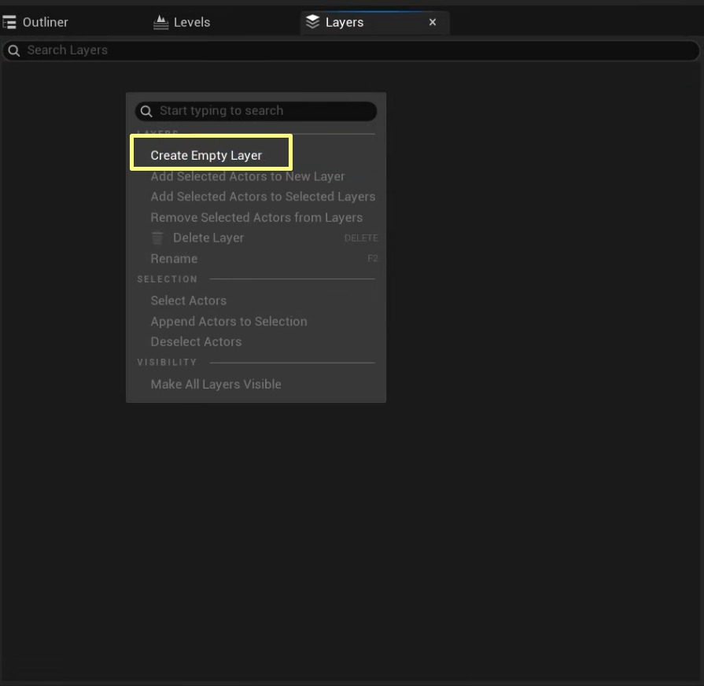
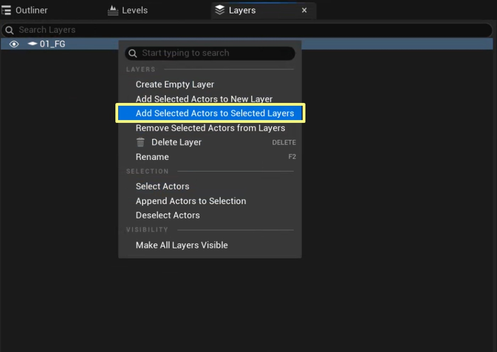
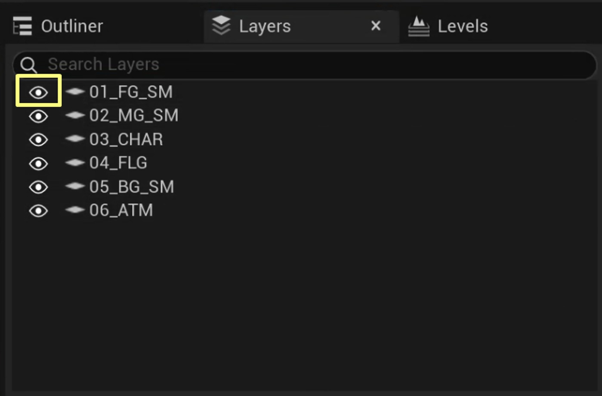
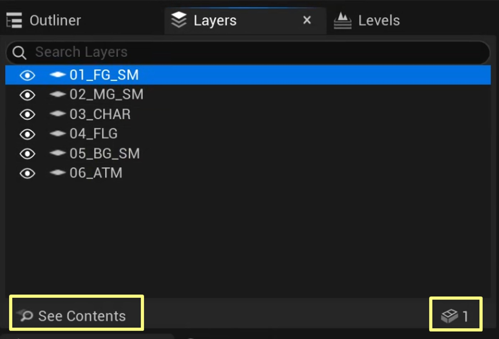
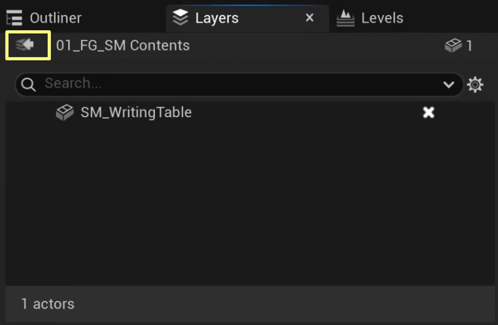
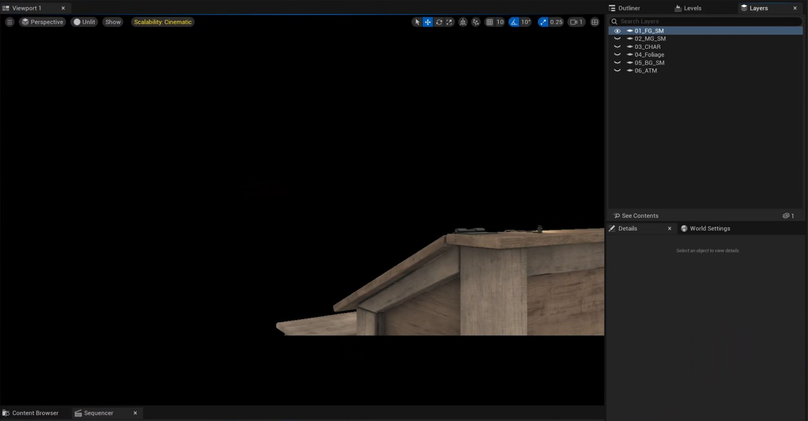
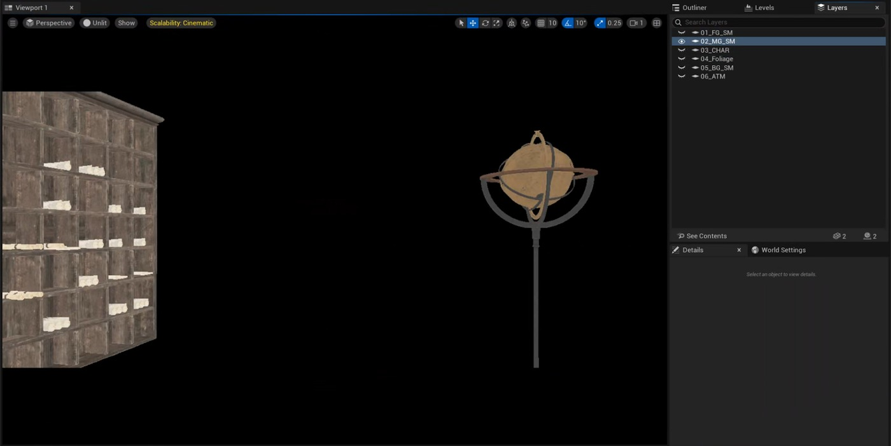
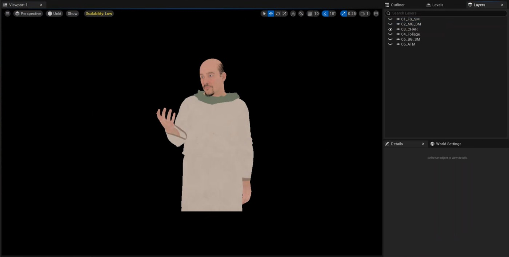

# 虚幻引擎中的分层渲染：分步制作工作流程（续 2）

## 来源与状态

- 原始 URL：https://dev.epicgames.com/community/learning/tutorials/pY8M/layered-rendering-in-unreal-engine-a-step-by-step-production-workflow
- 原始文件：layered-rendering-in-unreal-engine-a-step-by-step-production-workflow.origin.md
- 分段：第 2/3 段

虽然 .EXR 是用于生产渲染的行业标准格式，支持高动态范围 (HDR)、多个色彩空间以及在单个文件中存储多个通道和图层的能力，但它并不是此测试阶段使用的主要格式。出于本研究的目的，大多数测试渲染都选择 .PNG，因为它为中间评估提供了足够的图像质量，包括 Alpha 通道支持，并且允许在没有专门的合成软件的情况下查看结果。这极大地简化了测试过程中的快速迭代和故障排除。然而，在制作流程中，.EXR 仍然是最终分层输出和下游合成的推荐格式。

### 层设置和组织

要使用影片渲染队列预设在虚幻引擎中执行分层渲染，第一步是使用 Actor 图层将场景资源组织到逻辑组中。

此步骤为在渲染过程中将最终渲染分离为离散层奠定了结构基础。

设置 Actor 图层 Actor 图层是通过“图层”面板创建的。

要添加新图层，请在“图层”面板内右键单击，然后从上下文菜单中选择“创建空图层”。

通过在视口或大纲视图中选择所需的资源，然后右键单击“图层”面板中的目标图层并选择“将选定的 Actors 添加到选定的图层”，可以将场景对象分配到各自的图层。

图层面板还允许打开和关闭图层可见性，从而能够快速验证每个图层的内容并简化场景组织的整体控制。

要更详细地查看图层内容，请从列表中选择图层，然后单击面板底部的“查看内容”按钮。

此视图还显示图层中资产的数量，按各自的类分组。

单击后，将打开一个窗口，显示分配给所选图层的所有对象的列表。

要返回主图层列表，请使用带有箭头图标的导航按钮。

对于侧重于评估将特定资产类型渲染为单独图层的可行性的准备测试，调整了标准图层命名约定以明确反映分配给每个图层的资产类型。

作为此过程的一部分，还评估了在独立图层上渲染大气元素的能力。

根据测试目标和既定的命名原则，定义了以下层结构： FG_SM：前景静态网格物体 MG_SM：中地静态网格物体，包括 ISM、HISM CHAR：动画超人 FLG：树叶资源 BG_SM：背景静态网格物体和景观 ATM：为场景中的所有静态网格物体启用大气资源，例如天空大气、体积云、指数高度雾 Nanite。

MG_SM 层还包括 ISM 和 HISM 资产（例如，架子上的卷轴等分组道具），以验证它们在单独层上渲染时的正确输出。

### 层组织的建议

尽管某些流程建议将景观资源放置在专用图层上，但测试表明它可以与背景图层（在本例中为 BG_SM）组合，而不会影响视觉质量或合成灵活性。是否分离景观应根据具体的项目需求来决定，例如需要对地形元素进行独立的后处理。测试还证实，使用影片渲染队列预设管道时，不需要将全局 Actor（包括后期处理体积、定向光和天空光）分配给单独的 Actor 层。这些参与者可以安全地保持未分配状态。 MRQP 中的分层渲染依赖于模板层。对于每个定义的图层，引擎都会评估整个场景，包括全局照明、大气效果和后处理。在最后阶段，通过模板缓冲区进行屏蔽可确保只有属于分配给该层的 actor 的像素才会写入输出文件。因此，每个隔离层（例如角色层）都会保留整个环境的正确光照、反射和大气影响，即使环境本身不包含在该层中也是如此。同样的原理也适用于局部光源，例如点光源、聚光灯和矩形光源。这些灯光不应放置在单独的图层上，因为它们的贡献会在受影响对象的表面上正确捕获并写入相应的图层中。渲染仅包含光源的图层将生成空图像。

### MRQP 配置

在此测试阶段，使用电影渲染队列预设（MRQP）进行图像输出。虽然这种方法被认为是虚幻引擎中的遗留方法，但它仍然与建立基线并能够与更新、更灵活的影片渲染图 (MRG) 系统进行直接比较有关，该系统在第 3 阶段进行了详细检查。与分层渲染相关的 MRQP 设置可大致分为两类： - 强制设置，分层渲染正常运行所需 强制设置，分层渲染正常运行所需 - 情境设置，用于解决特定的分层渲染要求或边缘情况情境设置，用于解决特定的分层渲染要求或边缘情况

### 分层渲染的强制设置

支持 alpha 的输出格式选择输出格式...

### 分层渲染的情景设置

### 延迟渲染和路径跟踪器

### 附加后处理材料

### 颜色输出

### 配置影片渲染队列预设

### 第 2 步：选择和配置渲染

### 步骤 3：配置技术通行证输出

### 步骤 4：添加控制台变量

### 第 5 步：保存预设

### 技术难点及解决方案

### MRQP 管道

### 在单独的图层上渲染气氛的问题

### 解决方案

### 路径追踪器中的层边缘不正确

### MRG管道

### 结论

### 合成

### 在 DaVinci Resolve 中进行合成

### 在 Nuke 中合成

### 发现

### 结论

## 相关链接
