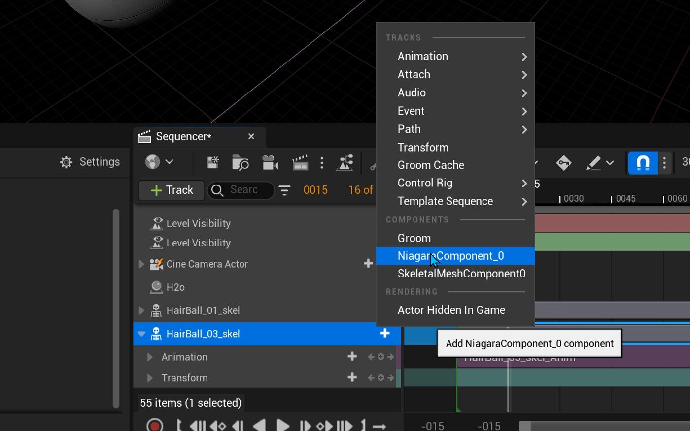
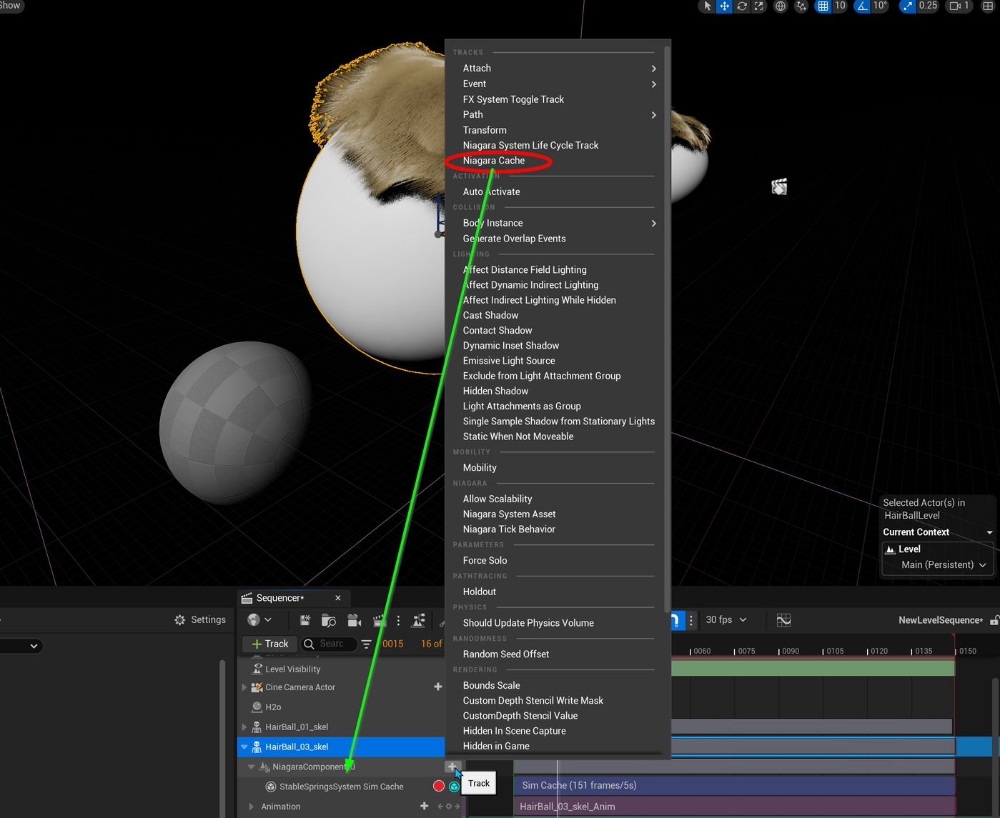
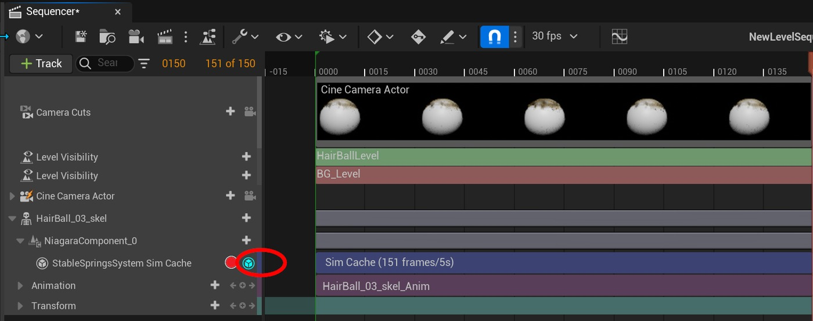
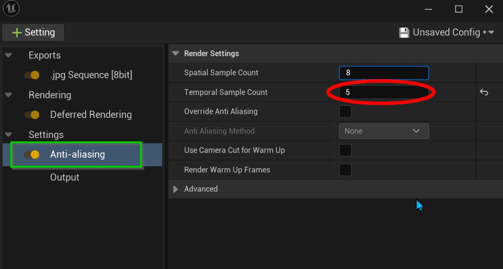
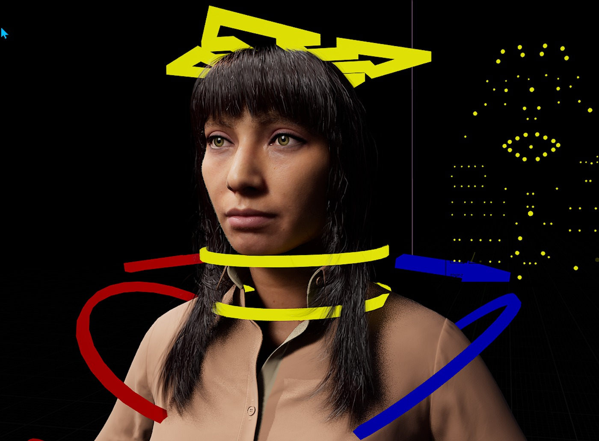
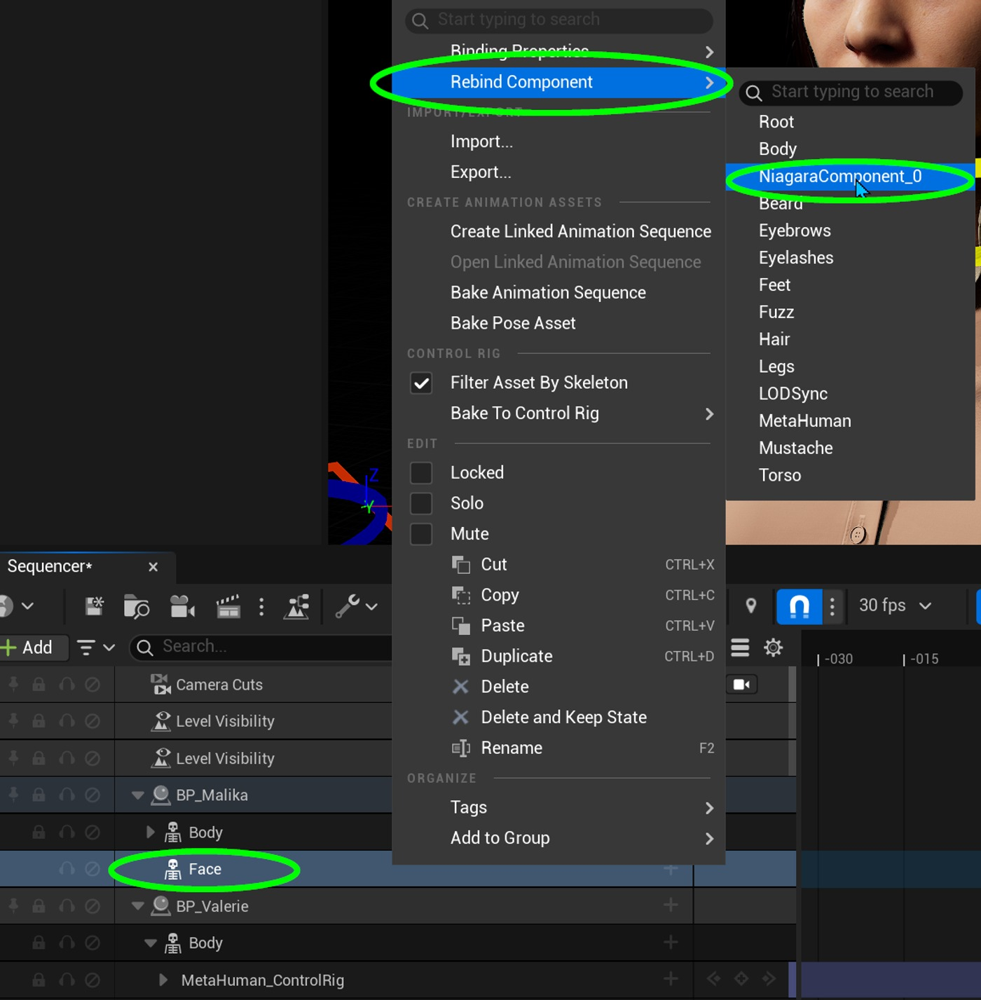
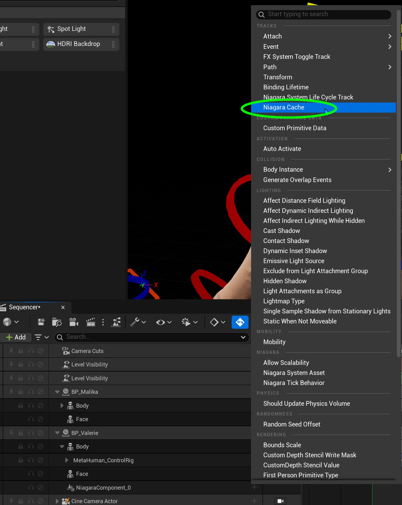

# 在虚幻引擎中缓存新郎模拟

## 来源与状态

- 原始 URL：https://dev.epicgames.com/community/learning/tutorials/vzjW/metahuman-caching-a-groom-simulation-in-unreal-engine

## 运行时分类

- 类型：图文教程
- 判断：运行时未识别到核心视频信号，可整理正文约 2309 字符。

## 摘要

如何使用时间样本在虚幻中缓存修饰以支持电影渲染队列中的适当运动模糊。

## 中文整理

### 概览

问题：引擎中的 Groom 在使用影片渲染队列中的时间采样渲染运动模糊时始终存在问题。直到最近，新郎的运动模糊还必须作为外部 DCC 合成包中的后期处理来应用。解决方案：在幕后，新郎发丝是通过 Niagara 模拟的。通过缓存控制发丝的 Niagara 系统，我们可以获得确定性的修饰，也可以在电影渲染队列中使用运动模糊进行渲染。确保 Niagara SimCaching 插件已激活。接下来，在 Sequencer 中，将 Niagara Component 轨道添加到具有修饰组件的骨架网格物体中。向 Niagara Component 轨道添加 Niagara Cache 轨道。您的音序器轨道应如下所示： 注意红色的录音按钮。接下来，单击红色录制按钮在时间轴中模拟新郎。这将在时间轴中添加一个 Sim 缓存，同时还会添加一个小的青色蓝色缓存图标，指示轨道已缓存并且新郎现在由缓存驱动。现在，在影片渲染队列的“抗锯齿设置”中，您可以将时间样本添加到渲染中，以通过修饰正确渲染运动模糊。注意：当音序器未渲染时，新郎可能会出现一些明显的抖动。但这并不影响最终渲染。

### 元人类新郎缓存

对于元人类，过程类似，但有点不同，因为元人类是基于蓝图的，并且不能以相同的方式访问新郎的组件。在 Sequencer 中，选择 Face Skeletal Mesh 轨迹并右键单击。在弹出菜单的顶部，选择重新绑定组件，然后选择 Niagara 组件。注意：如果禁用模拟或启用修饰​​上的“调试”参数，则该组件可能会失去其绑定。要解决此问题，只需再次重新绑定 Niagara 组件，该组件将具有新更新的名称。在 Niagara Component 轨道上，单击 + 按钮并选择顶部附近的 Niagara Cache。这将添加适当的 Niagara Cache 轨道来记录缓存。单击轨道上的红色记录按钮，模拟将记录模拟，并停用模拟。蓝色图标表示轨道现在正在使用缓存的模拟。 - Niagara 流体 - 序列器中的 Niagara 模拟缓存 - 序列器基础知识 - 动画 - 尼亚加拉 - 缓存

## 相关链接

- [Meta Human Groom Caching](https://dev.epicgames.com/community/learning/tutorials/vzjW/metahuman-caching-a-groom-simulation-in-unreal-engine#metahumangroomcaching)
- [文档与教程](https://dev.epicgames.com/community/learning/tutorials/vzjW/metahuman-caching-a-groom-simulation-in-unreal-engine#%E6%96%87%E6%A1%A3%E4%B8%8E%E6%95%99%E7%A8%8B)

