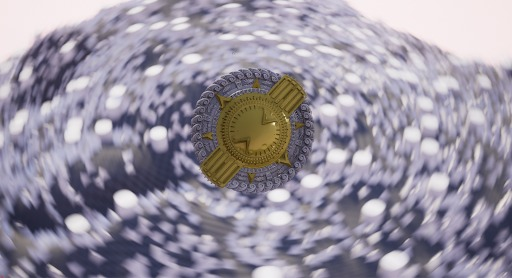
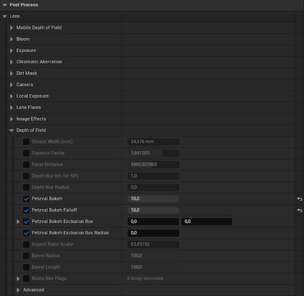
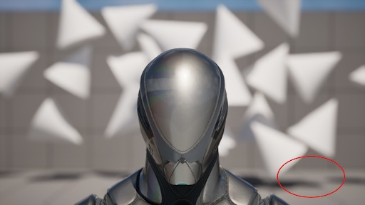
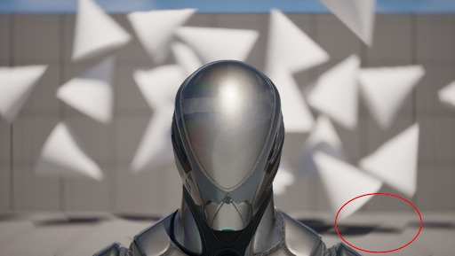

# 虚幻引擎 5.6 中的 Petzval Bokeh

## 来源与状态

- 原始 URL：https://dev.epicgames.com/community/learning/tutorials/b62v/petzval-bokeh-in-unreal-engine-5-6

## 运行时分类

- 类型：图文教程
- 判断：运行时未识别到核心视频信号，可整理正文约 2973 字符。

## 摘要

Petzval 散景效果简介

## 中文整理

### 概览

- 法语 - 德语 - 西班牙语（西班牙） - 葡萄牙语（巴西） 在本文中，我们将探讨 Petzval Bokeh 效果的一些细节，该效果现已在版本 5.6 中提供。以下是通过电影摄影机 Actor 渲染的效果示例。

### 2. 观众

任何有兴趣了解 Petzval 散景效果以及如何开始在引擎中使用它的人。

### 3. 先决条件

只需安装虚幻引擎 5.6 版本即可尝试此功能。

### 4. 如何设置效果

- 创建新项目或打开现有项目 创建新项目或打开现有项目 - 确保为项目启用“高”或“史诗”可扩展性设置 确保为项目启用“高”或“史诗”可扩展性设置 - 将电影摄影机 Actor (CCA) 添加到场景 将电影摄影机 Actor (CCA) 添加到场景 - 选择 CCA 以打开设置（图 B） 选择 CCA 以打开设置（图 B） - 由于 Petzval 效果最常用于肖像，因此请确保选择相应的相机镜头。

镜头设置中的 50mm Prime f/1.8 应该非常适合这种情况。

由于 Petzval 效果最常用于肖像，因此请务必相应地选择相机镜头。

镜头设置中的 50mm Prime f/1.8 应该非常适合这种情况。

- 现在将相机放置在靠近拍摄对象的位置，并将焦距调整到拍摄对象的脸部。

（图像 C）现在将相机放置在靠近拍摄对象的位置，并将焦距调整到拍摄对象的脸部。

（图像 C）- 通过选中景深设置下的 Petzval Bokeh 复选框来启用 Petzval 效果。

通过选中景深设置下的 Petzval Bokeh 复选框来启用 Petzval 效果。

- 调整设置以达到效果。

（图D）调整设置以达到效果。

（图像 D）- 从预览窗口观察效果。

从预览窗口观察效果。

请注意，通过增加 Petzval Bokeh Falloff，您应该开始看到图像外边缘出现环形伪像。

此效果还很大程度上取决于镜头背景中存在的物体，因此效果的强度会因场景而异。

为了验证这一事实，请比较图像 A 和图像 C，两者都是在不同场景的引擎内拍摄的。

佩兹伐效应的强度在图像 A 中更加明显。

### 5. 附加信息

- 解释创建的 Petzval 散景效果的好文章：https://www.filmmakersacademy.com/blog-what-are-petzval-lens/ 解释创建的 Petzval 散景效果的好文章：https://www.filmmakersacademy.com/blog-what-are-petzval-lens/ - 电影摄影机的文档： https://dev.epicgames.com/documentation/en-us/unreal-engine/cinematic-depth-of-field-in-unreal-engine#cinematicdofsettings 电影摄影机文档：https://dev.epicgames.com/documentation/en-us/unreal-engine/cinematic-depth-of-field-in-unreal-engine#cinematicdofsettings - 后期处理 - 虚拟制作 - 过场动画

## 相关链接

- [2. Audience](https://dev.epicgames.com/community/learning/tutorials/b62v/petzval-bokeh-in-unreal-engine-5-6#2audience)
- [3. Prerequisites](https://dev.epicgames.com/community/learning/tutorials/b62v/petzval-bokeh-in-unreal-engine-5-6#3prerequisites)
- [4. How To Set Up The Effect](https://dev.epicgames.com/community/learning/tutorials/b62v/petzval-bokeh-in-unreal-engine-5-6#4howtosetuptheeffect)
- [5. Additional Information](https://dev.epicgames.com/community/learning/tutorials/b62v/petzval-bokeh-in-unreal-engine-5-6#5additionalinformation)

