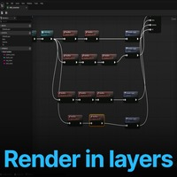
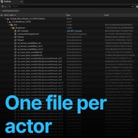
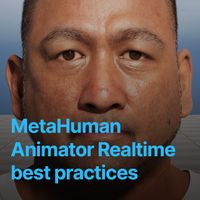
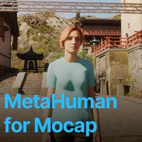
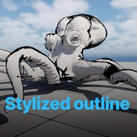
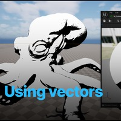
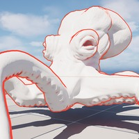
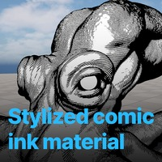

# 动画中心

## 来源与状态

- 原始 URL：https://dev.epicgames.com/community/learning/paths/3K6/unreal-engine-animation-hub

## 运行时分类

- 类型：图文教程
- 判断：运行时未识别到核心视频信号，可整理正文约 3871 字符。

## 摘要

欢迎来到动画中心，这是您掌握先进技术并加深在虚幻引擎中创建线性动画的知识的专用空间...

## 中文整理

### 概览

- 西班牙语（西班牙） - 德语 - 葡萄牙语（巴西） - 法语

### 学习路径内容

- 01 / 11 动画中心简介 教程 动画中心简介 了解动画中心是关于什么的。

### 动画中心介绍

了解动画中心的含义。 - 02 / 11 使用 Movie Render Graph 进行分层渲染 教程 使用 Movie Render Graph 进行分层渲染 让我们从 Agora 的这个精彩动画中拍摄一个镜头，并进行分层渲染，以便为合成做好准备！

### 使用 Movie Render Graph 分层渲染

让我们从 Agora 的这段精彩动画中拍摄一个镜头，并分层渲染它，以便为合成做好准备！ - 03 / 11 线性内容每个 Actor 一个文件 教程 线性内容每个 Actor 一个文件 了解如何在虚幻引擎中使用“每个 Actor 一个文件”(OFPA) 来实现无需世界分区的线性内容工作流程。本教程涵盖了协作编辑、详细更改跟踪和每个参与者版本控制等主要优势，以及实际设置步骤、限制以及如何恢复到传统 .umap 级别。非常适合希望简化大型动画项目中的场景管理的团队。

### 每个演员一个线性内容文件

了解如何在虚幻引擎中使用“每个演员一个文件”(OFPA) 来实现无需世界分区的线性内容工作流程。本教程涵盖了协作编辑、详细更改跟踪和每个参与者版本控制等主要优势，以及实际设置步骤、限制以及如何恢复到传统 .umap 级别。非常适合希望简化大型动画项目中的场景管理的团队。 - 04 / 11 Live Link Hub 提示 教程 Live Link Hub 提示 Live Link Hub 的功能。包括Live Link源的管理、录制和回放以及虚拟主体的设置和使用。

### 实时链接中心提示

Live Link Hub 的功能。包括Live Link源的管理、录制和回放以及虚拟主体的设置和使用。 - 05 / 11 MetaHuman Realtime Animator 最佳实践教程 MetaHuman Realtime Animator 最佳实践 了解使用网络摄像头从 MetaHuman Realtime Animator 获得最佳质量的最佳实践。

### MetaHuman 实时动画师最佳实践

了解使用网络摄像头从 MetaHuman Real-Time Animator 中获得最佳质量的最佳实践。 - 06 / 11 MetaHumans for Mocap 教程 MetaHumans for Mocap 了解如何使用 Mocap Manager 设置 MetaHuman 以进行表演捕捉。

### 动捕超人

了解如何使用 Mocap Manager 设置 MetaHuman 以进行表演捕捉。 - 07 / 11 风格化渲染 - 简单的轮廓教程 风格化渲染 - 简单的轮廓 快速了解如何利用相机矢量创建风格化的漫画水墨轮廓

### 风格化渲染 - 一个简单的轮廓

快速了解如何利用相机矢量创建风格化的漫画墨迹轮廓 - 08 / 11 使用矢量进行风格化教程 使用矢量进行风格化 使用光和相机矢量来实现风格化材质轮廓和效果

### 使用向量进行风格化

使用光和相机矢量实现风格化材质轮廓和效果 - 09 / 11 用于风格化的覆盖材料教程 用于风格化的覆盖材料 了解如何使用覆盖材料槽添加更精细的细节轮廓。

### 用于风格化的覆盖材料

了解如何使用覆盖材质槽添加更精细的细节轮廓。 - 10 / 11 风格化漫画水墨材质教程 风格化漫画水墨材质 基于之前的技术，该视频添加了纹理贴图，为风格化材质生成剖面线和交叉剖面线效果

### 程式化的漫画墨水材料

基于之前的技术，该视频添加了纹理贴图，以便为风格化材质生成阴影和交叉阴影效果 - 11 / 11 风格化漫画材质颜色和高光教程 风格化漫画材质颜色和高光 将之前的材质提升到一个新的水平，添加颜色和镜面高光控件

### 风格化的漫画材质颜色和亮点

将以前的材料提升到一个新的水平，添加颜色和镜面高光控制 - 照明 - 蓝图 - 角色 - 控制装备 - 动画 - 数字人类 - 材料 - 动画 BP - 环境艺术 - 虚拟制作 - 动画 - 动作捕捉

## 相关链接

- 未识别到明确相关链接。

