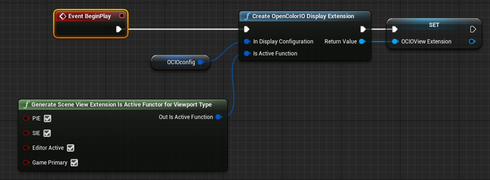

# 将 OpenColorIO 设置应用于多种视口类型（续 2）

## 来源与状态

- 原始 URL：https://dev.epicgames.com/community/learning/tutorials/Jdpl/unreal-engine-applying-opencolorio-settings-to-multiple-viewport-types
- 原始文件：unreal-engine-applying-opencolorio-settings-to-multiple-viewport-types.origin.md
- 分段：第 2/2 段

the "Return Value" output of the "Create OpenColorIO Display Extension" node - select "Promote to variable". Drag a connection off of the "Return Value" output of the "Create OpenColorIO Display Extension" node - select "Promote to variable". - Rename the new variable to something like "OCIOView
Extension". Rename the new variable to something like "OCIOView Extension". - Connect up the Set function to the execute stream. Connect up the Set function to the execute stream. - Compile. Compile. Your Blueprint setup should look something like the image below: Play the various display modes and/or viewport(s) you applied the OCIOConfig to, to verify that they are working correctly. Below is a brief description of the different viewport types: - PIE - Play in Editor PIE - Play in Editor - SIE - Simulator in Editor SIE - Simulator in Editor - Editor Active - Editor active viewport Editor

Active - Editor active viewport - Game Primary - Primary Game viewport Game Primary - Primary Game viewport - Color Management with OpenColorIO - OpenColorIO -Configs (ACES) | GitHub - 程序和脚本设计 - lighting - blueprint - virtual production - opencolorio - technical guide to linear content creation

## 相关链接

- [Color Management with OpenColorIO](https://docs.unrealengine.com/5.0/en-US/color-management-with-opencolorio-in-unreal-engine/)
- [OpenColorIO - Configs](https://github.com/colour-science/OpenColorIO-Configs)
- [Color Management with OpenColorIO](https://docs.unrealengine.com/5.0/en-US/WorkingWithMedia/ManagingColor/OpenColorIO)
- [文档与教程](https://dev.epicgames.com/community/learning/tutorials/Jdpl/unreal-engine-applying-opencolorio-settings-to-multiple-viewport-types#%E6%96%87%E6%A1%A3%E4%B8%8E%E6%95%99%E7%A8%8B)
- [实用链接](https://dev.epicgames.com/community/learning/tutorials/Jdpl/unreal-engine-applying-opencolorio-settings-to-multiple-viewport-types#%E5%AE%9E%E7%94%A8%E9%93%BE%E6%8E%A5)
