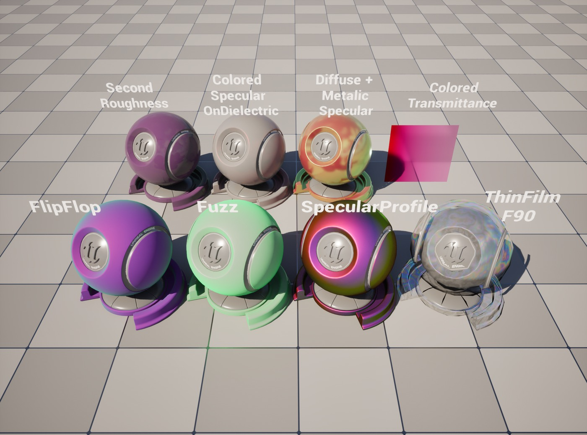
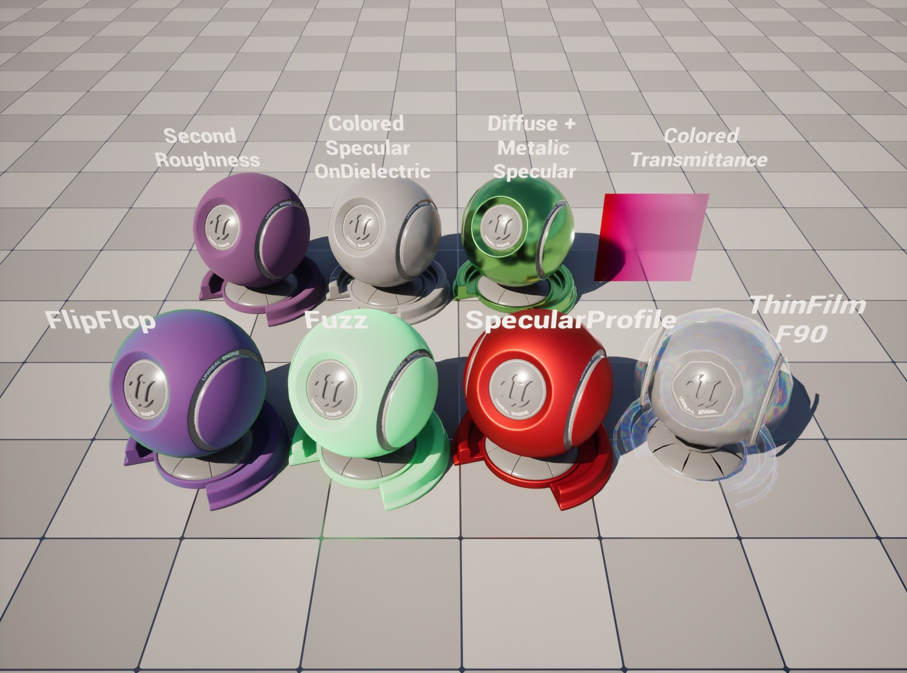
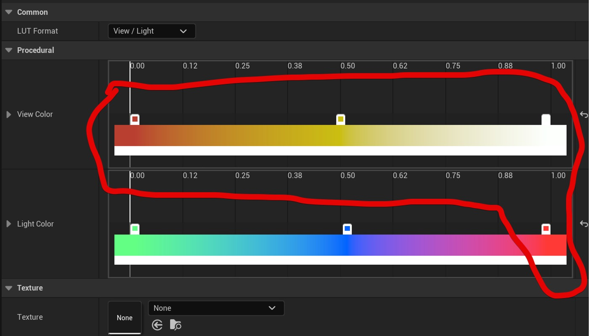
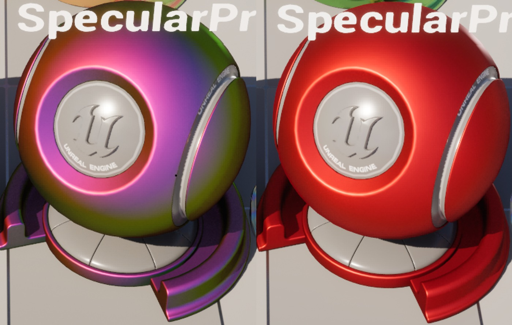

# Blendable GBuffer 利用時のスラブBSDFパラメータ

## 来源与状态

- 原始 URL：https://dev.epicgames.com/community/learning/knowledge-base/x1x1/unreal-engine-blendable-gbuffer-bsdf
- 原始文件：unreal-engine-blendable-gbuffer-bsdf.origin.md
- 分段：第 1/2 段

- 原始 URL：https://dev.epicgames.com/community/learning/knowledge-base/x1x1/unreal-engine-blendable-gbuffer-bsdf

## 运行时分类

- 类型：图文教程
- 判断：运行时未识别到核心视频信号，可整理正文约 1449 字符。

## 摘要

SubstrateのBlendableGBufferモードはパフォーマンス維持と広範囲のハードウェアをサポートします。 そのためAdaptiveGBufferモードと出力に差異が生まれます。その差異の一部について紹介します。

## 中文整理

### 概览

SlabBSDFのパラメータを使ったマテリアルをBlendableGBufferモードでレンダリングするとき、レガシーGBufferへの変換でパラメータが無効化されたり旧マテリアルのシェーディングモデルへの変換が行われます。 本トピックでは幾つかの例を挙げてレンダリング結果の差異について解説します。

### 誘電体上の色付きスペキュラー

F0の要素の最大値が0.08以下の時、誘電体(Metalic=0)としてBlendableGBufferに出力されます。 F0に入力された色付きのスペキュラーはグレイのスペキュラーに変換されます。

### Diffuse Albedo + F0 を両方使ったSlab

スラブBSDFで金属表現を行う場合F0に色を入力して、DiffuseAlbedoの値は0を入力しますが、両方の値に有効な色を入れることも可能です。しかしBlendableGBuffer利用時はF0のRGBの最大値によってMetalic値を算出するように変わります。 F0の要素の最大値 | Metalic ~0.08以下 | 0 0.08~0.4 | 0~1 0.4~ | 1 0.08~0.4 Metalicの逆数でDiffuse Albedoが乗算されてBaseColorへの影響量は減少します。そのため出力結果に大きな差異が現れます。互換性のために金属表現時にはDiffuseAlbedoを0に設定することをお勧めします。

### 第二粗糙度

SecondRoughnesは単純に無視されます。 ※サブサーフェスプロファイルにDualSpecularの設定が含まれているため、これで近似できる可能性があります。

### 法兹

FuzzAmountが入力されている場合レガシーマテリアルのClothに変換されます。

### F90

F90の値は単純に無視されます。フレネルのようなエッジ領域の効果を得たい場合には次のFlipFlopなどの代替案を検討してください。

### 拖鞋

FlipFlopノードに入力されたFlipFlopF0とFlipFlopF90がF0にエンコードされます、 0.08以上のF0によって有効なMetalicの値が出力される場合、エッジ領域に色付きのスペキュラーが現れます。一方F0の値が0.08以下になると誘電体として扱われるためモノトーンのスペキュラーになります。

### 镜面轮廓

Adaptive GBuffer使用時SpecularProfileはライティングパスで参照されます。一方Blendable GBuffer使用時はBasePassでSpecularProfileが参照されてF0にエンコードされます。 この時LightColorの参照のキーとなるNoL(またはNoH)の値は1.0に固定され、LightColorのカーブの一番右の値だけが参照されることになります。 結果として色付きの値がLightColorの一番右に設定されているとレンダリング結果に大きな差異がうまれます。

### 地下和SSSMFP

スラブBSDFのSub-surface Type設定により動作が変ります。 ->レガシーSubsurfaceとしてエンコード、 SSS MFPをSubsurfaceColorとして参照 →レガシーTwoSidedFoliageとしてエンコード、 SSS MFPをSubsurfaceColorとして参照 →レガシーSubsurfaceProfileとしてエンコードされる、SSS MFPは無視 →SSSMFPをライティングパスに渡せないためSSSが無視される

### SSSMFPを使った色付き半透明

色付き半透明はどちらも同じ結果が得られます。

### 关联

- Substrate マテリアルの概要 - materials

## 相关链接
