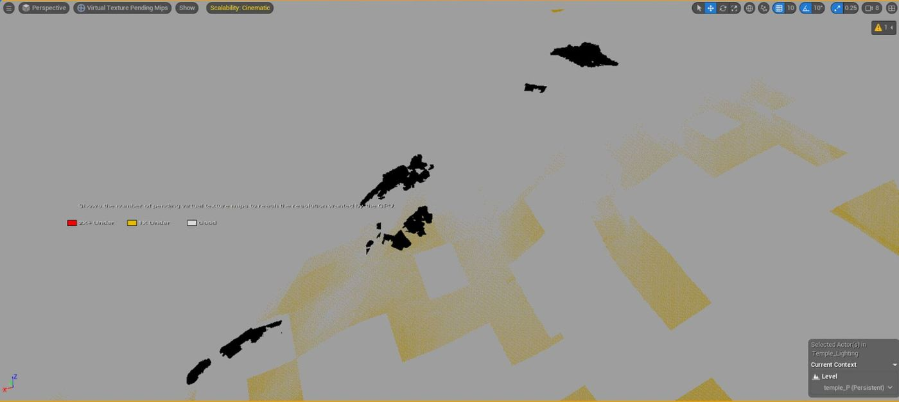
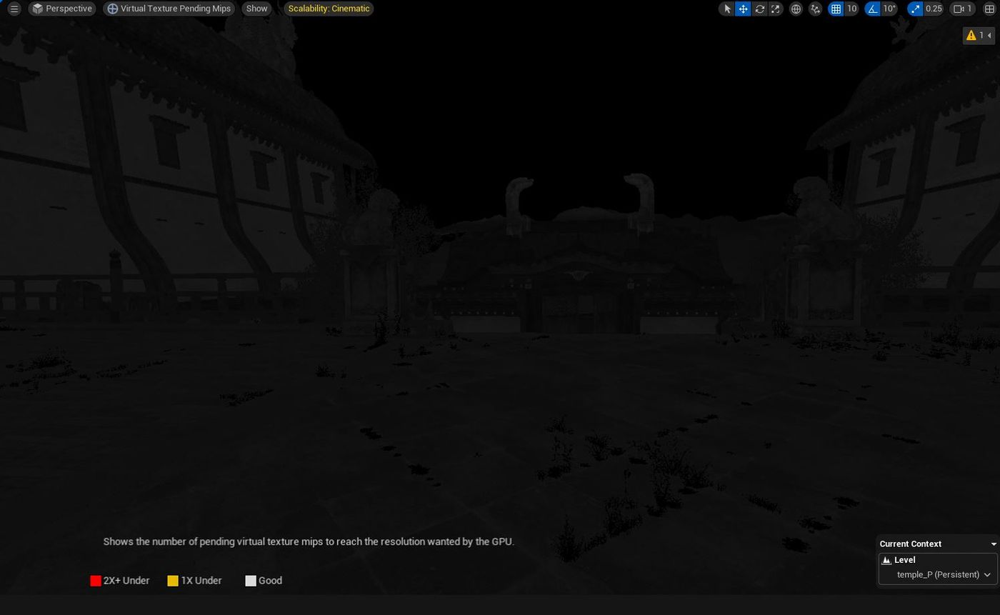
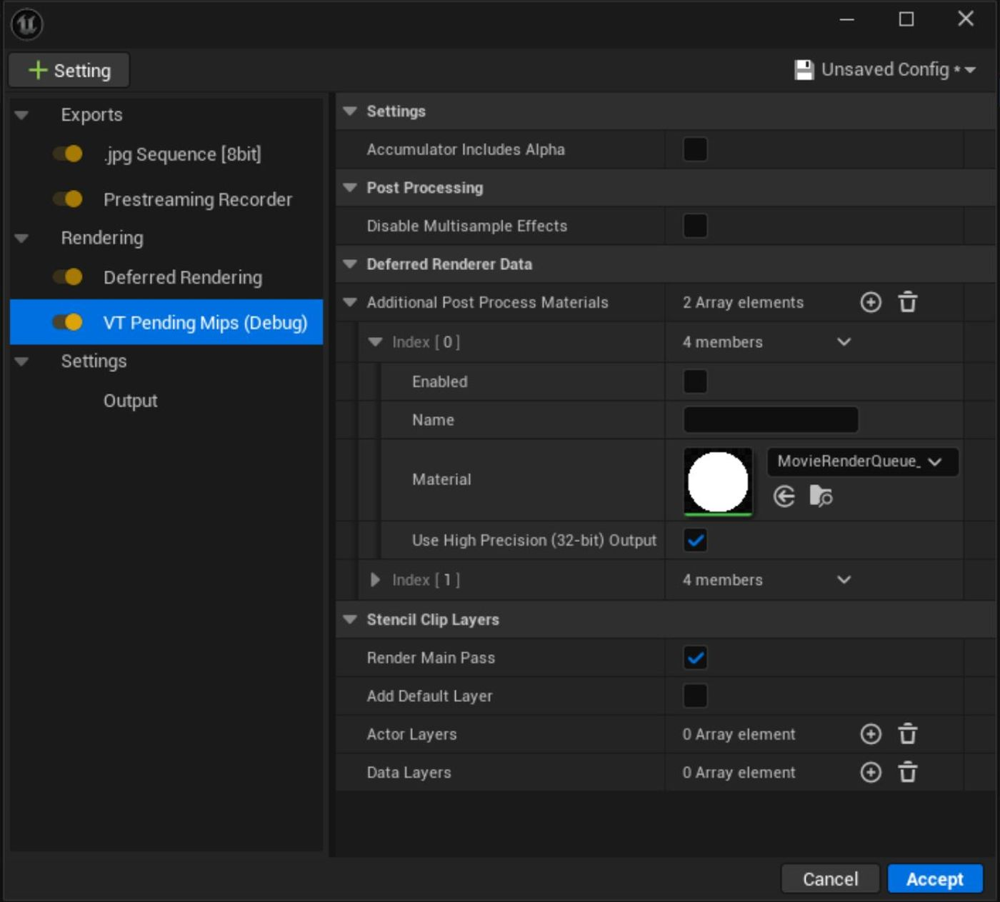
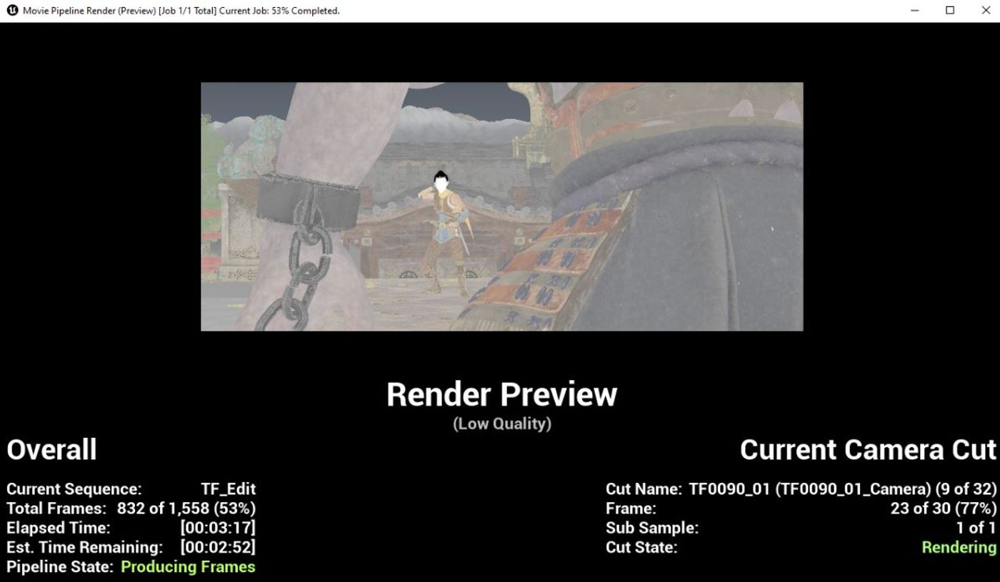
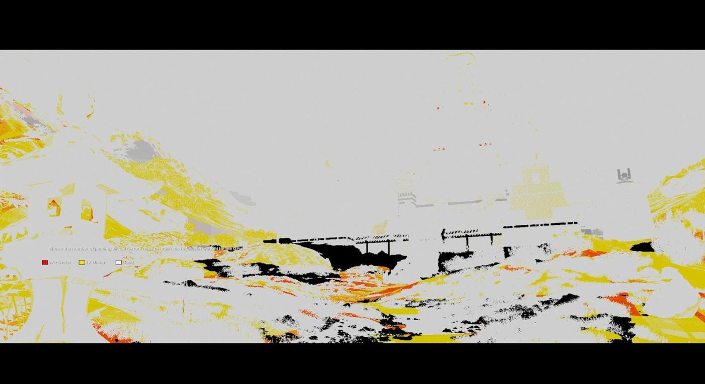
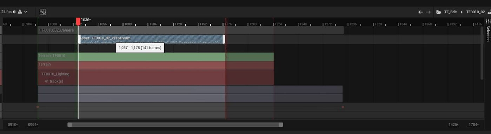
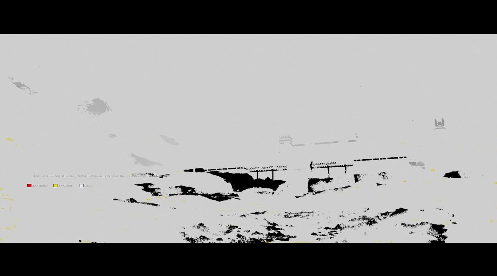
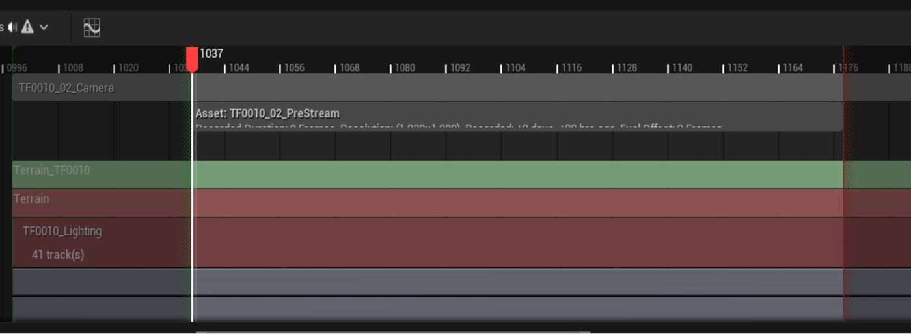
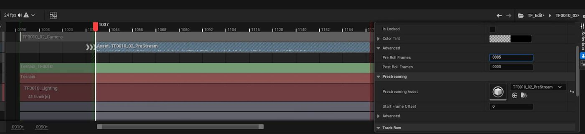
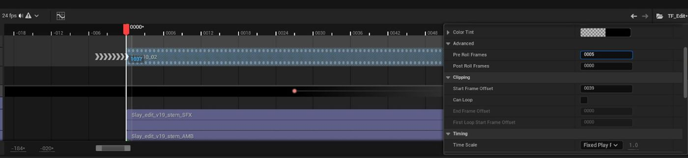

# 电影预流虚拟纹理（续 2）

## 来源与状态

- 原始 URL：https://dev.epicgames.com/community/learning/tutorials/dB5a/unreal-engine-cinematic-prestreaming-virtual-textures
- 原始文件：unreal-engine-cinematic-prestreaming-virtual-textures.origin.md
- 分段：第 2/2 段

请注意，该系统显示的是实时发现的待处理 mip（即：它没有首次渲染时应用的预流记录器系统创建的改进结果）。

Prestreaming Recorder 设置已自动为您修改关卡序列资源：它已插入 Prestreaming Recorder 轨道并自动将其连接到 MRQ 渲染创建的 Prestreaming Recorder 资源。

如果再次渲染，新渲染将考虑关卡序列中的电影预流数据，并且您可以看到待定 Mipmap 输出的改进。

（注：还有一些小补丁尚未解决。

这可能是由于多种原因造成的，例如透明虚拟（？）纹理阻挡了底层对象、次表面散射等。

您可能想尝试一下该材质，看看某个特定功能（例如像素深度偏移）是否会混淆它。

您可以在进行更改后使用“r.VT.FlushAndEvictFileCache”转储缓存以查看现在是否已解决）

### 游戏中

如果您正在电影渲染队列中渲染预告片的帧，那么您可以停在这里。

渲染器会自动提供当前帧的数据，然后等待数据上传后再渲染该帧。

如果您不使用影片渲染队列，则需要编辑关卡序列以告诉系统您要提前多久开始加载数据。

这是池中有多少空间和加载最终花费的时间之间的平衡。

池不知道预流建议的纹理和当前用于渲染当前场景的纹理之间的差异，因此预流实际上会加载比当前场景所需的更多的 mipmap（即：来自下一个镜头的纹理可能与当前的 mipmap 不同），这可能会尝试超额订阅当前场景，从而导致当前场景的质量降低。

在我们讨论在 Sequencer 中编辑 Prestreaming 部分以选择如何加载之前，我们需要对关卡序列进行简要概述。

在 Sequencer 中，仅当评估时间与该部分重叠时才评估该部分；当它在该部分之外时，无法对其进行评估。

这意味着默认情况下，直到第一帧才真正评估预流资源，此时它可以开始建议所需的 mipmap。

然而，为时已晚——您已经渲染了需要它们的帧。

为了适应这种情况，Sequencer 支持“预卷”帧，由时间线中的 >>> 标记指示。

在这里，我们在预流部分属性的高级部分中设置了 5 个预卷帧，我们可以看到将在何处评估这些预卷帧。

如果您在 Sequencer 中使用层次结构（即：预流轨道位于镜头/子部分内），那么您需要转到父序列并编辑该部分以也包括预卷，否则它实际上不会评估预流资源的预卷部分。

您可以在这里看到，我们回到了根关卡序列 (TF_Edit)，拍摄了之前的镜头，并在其部分设置了预卷。

最后的评估警告是，当您播放关卡序列时，它会从播放范围开始处开始播放，在本例中为第 0 帧。

这意味着在第一次拍摄时，实际上不会考虑预卷，除非您将播放范围开始时间更改为更早（然后修剪其他轨道，以便它们直到第 0 帧才实际评估，然后您的游戏代码将需要覆盖空白区域的 n 帧延迟）。

因此，现在该部分实际上可以在实际渲染之前的五个帧中进行评估，但我们仍然需要调整预流部分上的“起始帧偏移”，以告诉系统实际加载提前多长时间。

您可以将预卷设置为更大的值（例如 20、25），并且在使用此设置开始该部分之前的最后五帧之前它不应该执行任何操作，这可能有助于避免不断更改整个层次结构中的预卷。

预流部分资源在内部存储该部分每个帧的虚拟纹理页面 ID 列表。

当评估帧时，它会找出从哪个帧（相对于该部分的开头）提取纹理数据，然后将其提供给 VT 反馈系统进行加载。

在上述场景中，当时间光标位于该部分的第一帧上并且在该部分评估时将起始帧偏移设置为 5 时，它将计算出需要从数据的第 5 帧（将来）加载数据。

这意味着较大的数字会导致您更快地开始加载未来的数据。

这也意味着，在...

### 结论：

## 相关链接

- [Virtual Texture Overview](https://dev.epicgames.com/community/learning/tutorials/dB5a/unreal-engine-cinematic-prestreaming-virtual-textures#virtualtextureoverview)
- [Movie Render Queue Prestreaming](https://dev.epicgames.com/community/learning/tutorials/dB5a/unreal-engine-cinematic-prestreaming-virtual-textures#movierenderqueueprestreaming)
- [Setup](https://dev.epicgames.com/community/learning/tutorials/dB5a/unreal-engine-cinematic-prestreaming-virtual-textures#setup)
- [In Game](https://dev.epicgames.com/community/learning/tutorials/dB5a/unreal-engine-cinematic-prestreaming-virtual-textures#ingame)
- [Conclusion:](https://dev.epicgames.com/community/learning/tutorials/dB5a/unreal-engine-cinematic-prestreaming-virtual-textures#conclusion:)
