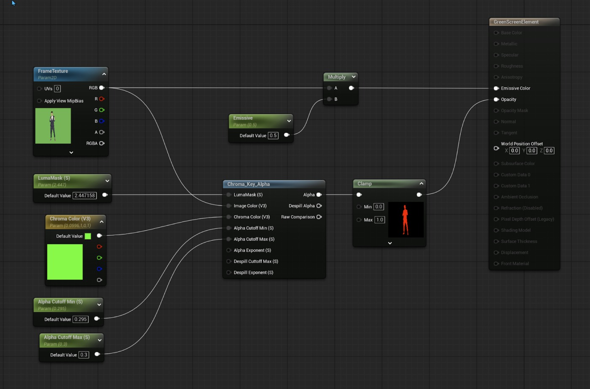
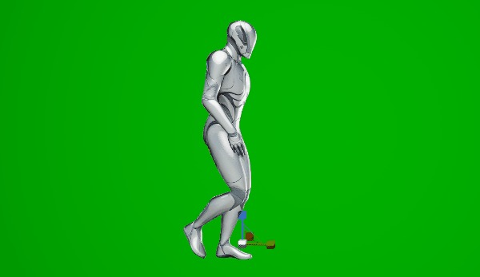

# 创建绿屏材质

## 来源与状态

- 原始 URL：https://dev.epicgames.com/community/learning/tutorials/5VzK/unreal-engine-creating-a-green-screen-material

## 运行时分类

- 类型：图文教程
- 判断：运行时未识别到核心视频信号，可整理正文约 1381 字符。

## 摘要

关于构建材质图的简短教程，用于为绿屏上拍摄的元素生成 Alpha 通道。

## 中文整理

### 创建绿屏材质

这个想法是创建一种具有特定颜色的材质来用作 Alpha 通道。在许多情况下，该颜色是蓝色或绿色。在此示例中，我使用绿色 BG，因此是绿屏。主要组件是具有绿屏背景的源纹理和色度键节点。源纹理馈送到未照亮的半透明材质上的发射通道，而色度键结果将通过管道传送到不透明通道。在此图中，有一个名为 Emissive 的参数，可在材质实例中使用该参数来调整绿屏元素的亮度。驱动色度键节点的参数是 LumaMask Chroma Color（绿屏颜色）Alpha Cutoff Min Alpha Cutoff Max。这些参数有助于调整图像中绿色被移除时生成的 Alpha 通道以及边缘需要的平滑程度。然后对生成的 Alpha 进行钳位以提供最佳的 Alpha 通道，然后将其连接到材质的不透明度。上面的例子是一个非常简单的绿屏材质，适用于非动画的人或物体的静态图像卡。使用蓝图和一些 Sequencer 魔法，只需付出一点努力，就可以使用这样的材质设置来播放一系列帧，但就目前而言，这是一个很好的起点。玩得开心！ - 材料 - 虚拟生产

## 相关链接

- [Creating a Green Screen Material](https://dev.epicgames.com/community/learning/tutorials/5VzK/unreal-engine-creating-a-green-screen-material#creatingagreenscreenmaterial)

