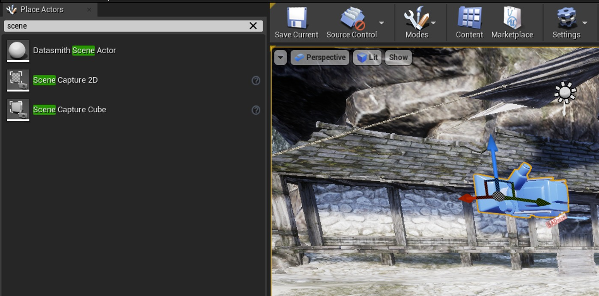
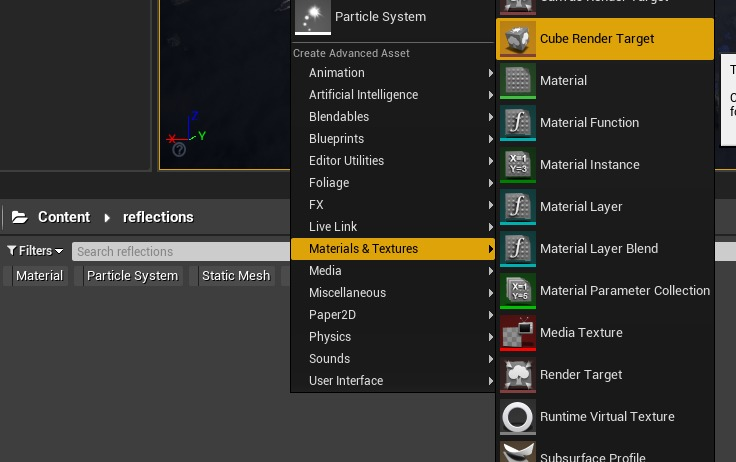
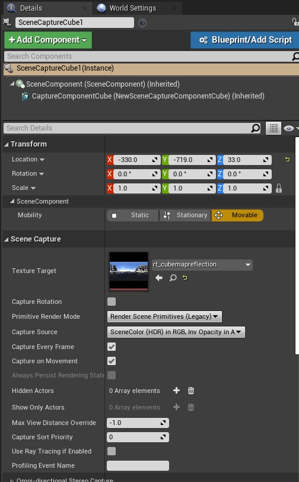
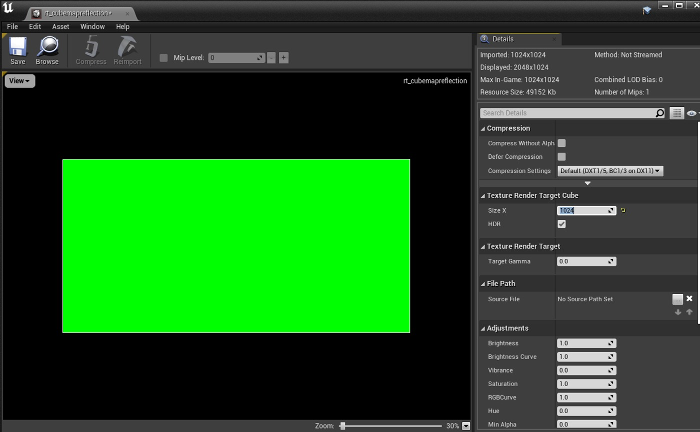
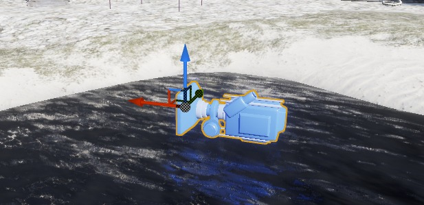
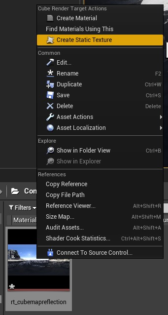
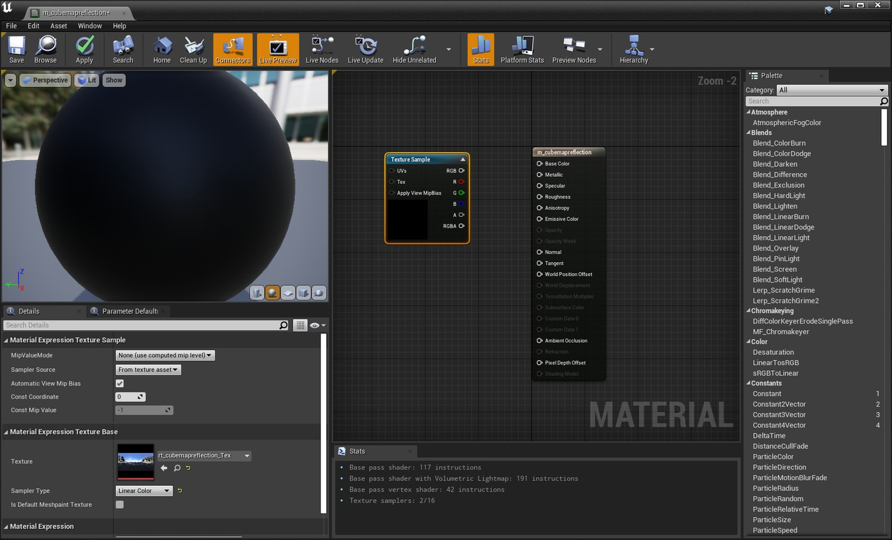
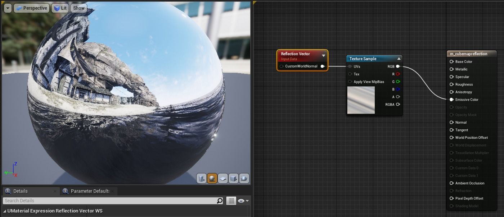
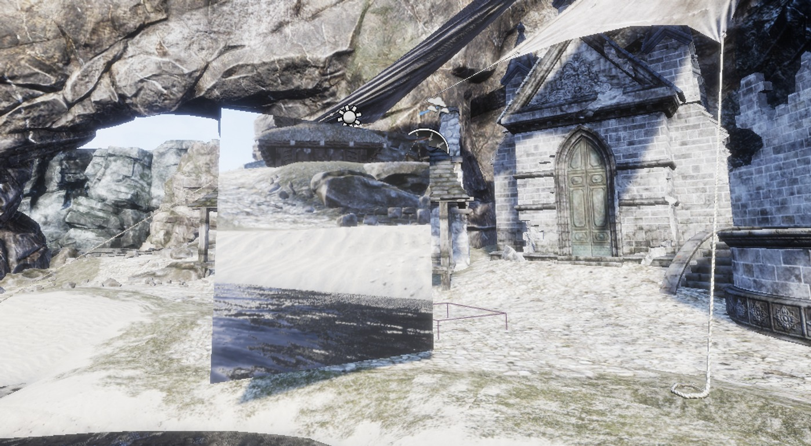

# 创建静态立方体贴图反射材质

## 来源与状态

- 原始 URL：https://dev.epicgames.com/community/learning/tutorials/BR/unreal-engine-creating-a-static-cubemap-reflection-material

## 运行时分类

- 类型：图文教程
- 判断：运行时未识别到核心视频信号，可整理正文约 1443 字符。

## 摘要

创建手动立方体贴图反射类似于常规反射探针捕获和生成反射的方式，但手动执行可以为您提供额外的...

## 中文整理

### 概览

创建手动立方体贴图反射与常规反射探针捕获和生成反射的方式类似，但手动执行可以为您提供材质内的额外控制。 1. 将场景捕捉立方体添加到您的关卡中。 2. 在内容浏览器中创建一个立方体渲染目标，该目标位于材质和纹理类别下，并将其分配给关卡中的场景捕获立方体。 3. 自定义场景捕捉立方体设置。您可以排除演员或特定的渲染功能。确保将立方体渲染目标添加为纹理目标 4. 打开立方体渲染目标并自定义分辨率。 1024 通常是一个很好的起点。您可以根据需要增加或减少，但不要高于您的用例所需的值。 5. 将场景捕捉立方体放置在尽可能靠近反射表面的位置。 6. 右键单击​​立方体渲染目标并选择创建静态纹理。 7. 创建一个新材质并添加刚刚创建的静态立方体贴图纹理。添加反射向量 WS（世界空间）并将其连接到立方体贴图的 UV 输入。将立方体贴图的 RGB 输出连接到材质的发射输入。材质编辑器中的预览网格现在应该看起来是反光的。 10. 将此材质应用到关卡中的网格上。您可以根据自己的喜好定制材料。将 mipmap 添加到静态纹理并强制材质中的 mip 级别以获得更高的粗糙度外观。 - 立方体贴图文档 - 材质

## 相关链接

- [Cubemap Documentation](https://docs.unrealengine.com/4.27/en-US/RenderingAndGraphics/Textures/Cubemaps)
- [文档与教程](https://dev.epicgames.com/community/learning/tutorials/BR/unreal-engine-creating-a-static-cubemap-reflection-material#%E6%96%87%E6%A1%A3%E4%B8%8E%E6%95%99%E7%A8%8B)

