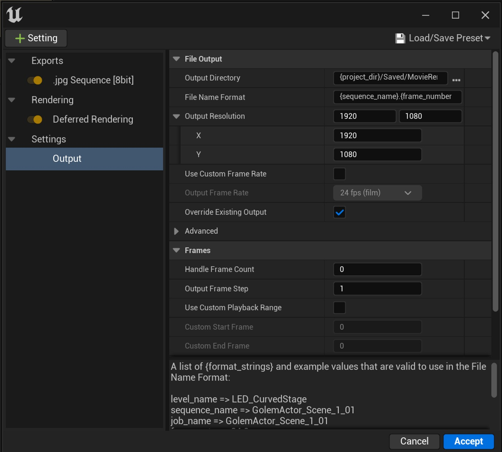
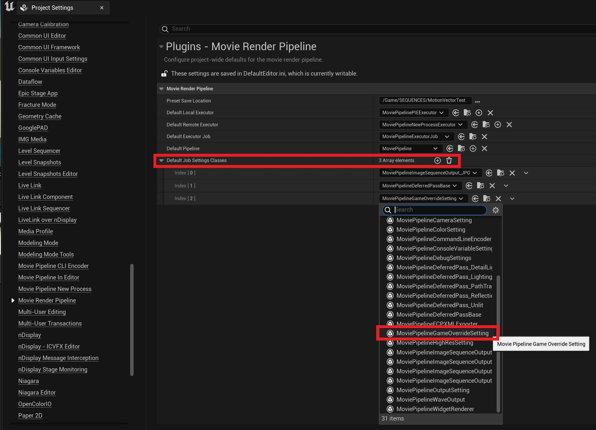
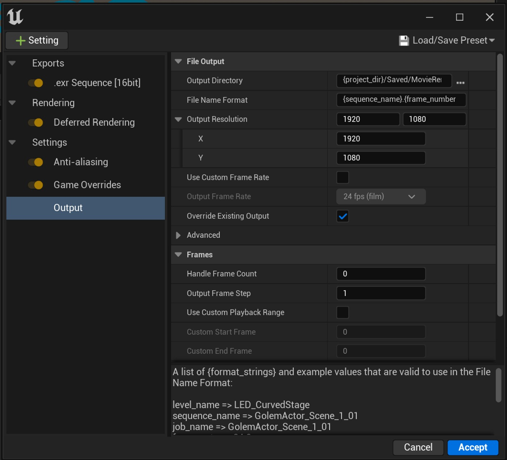

# 自定义影片渲染队列的默认 UI 设置

## 来源与状态

- 原始 URL：https://dev.epicgames.com/community/learning/tutorials/Kw1l/unreal-engine-customize-the-default-ui-setting-for-movie-render-queue

## 运行时分类

- 类型：图文教程
- 判断：运行时未识别到核心视频信号，可整理正文约 1182 字符。

## 摘要

当您进行新的电影渲染队列配置时，如何自定义默认显示的作业“设置”

## 中文整理

### 概览

默认情况下，当您进行影片渲染队列配置时，UI 中仅显示 3 个作业设置选项卡。 - JPG 序列 JPG 序列 - 延迟渲染 延迟渲染 - 输出 我很少会在不调整“抗锯齿”选项卡中的采样的情况下从 MRQ 中渲染某些内容。这意味着我必须将其添加到我所做的每个配置的 UI 中。我每次添加到用户界面的另一个选项卡是“游戏覆盖”。许多人没有意识到这一点，但无论该选项卡在 UI 中是否可见，该选项卡中的每个设置都可以控制渲染。这种混乱是可以理解的，因为默认情况下该选项卡不可见。幸运的是，有一种方法可以自定义项目默认显示的选项卡！假设您已加载影片渲染队列插件，您可以进入“插件”->“影片渲染管道”下的“项目设置”，并在“默认作业设置类”下添加您喜欢的选项卡。单击 + 号添加索引，然后选择要添加的类。就这样吧！下次您在项目中创建 MRQ 配置时，所有所需的选项卡将自动显示在您的 UI 中。感谢马特·霍夫曼（Matt Hoffman）的支持！ - 虚拟制作 - 电影

## 相关链接

- 未识别到明确相关链接。

