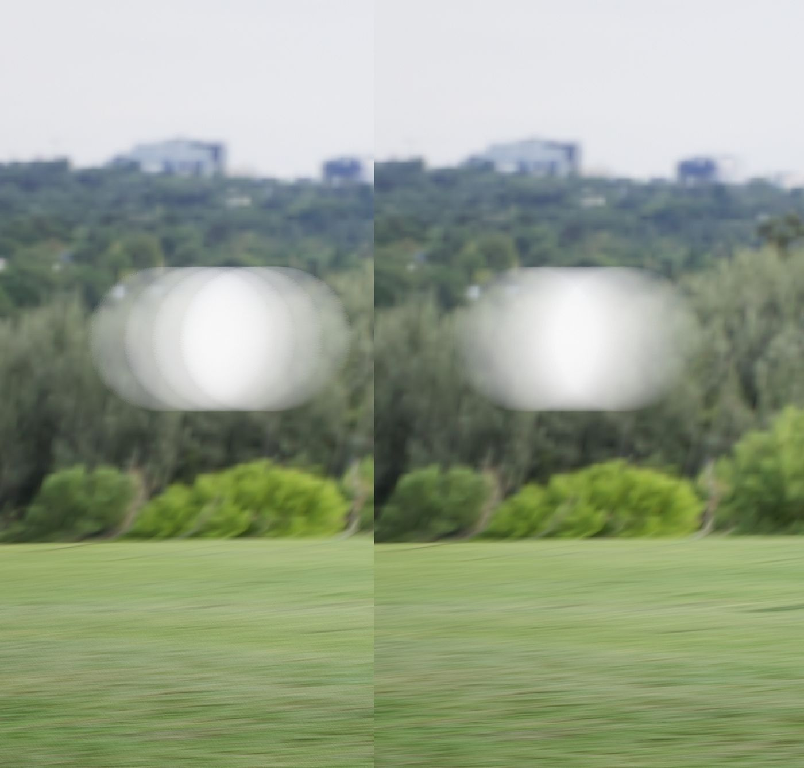
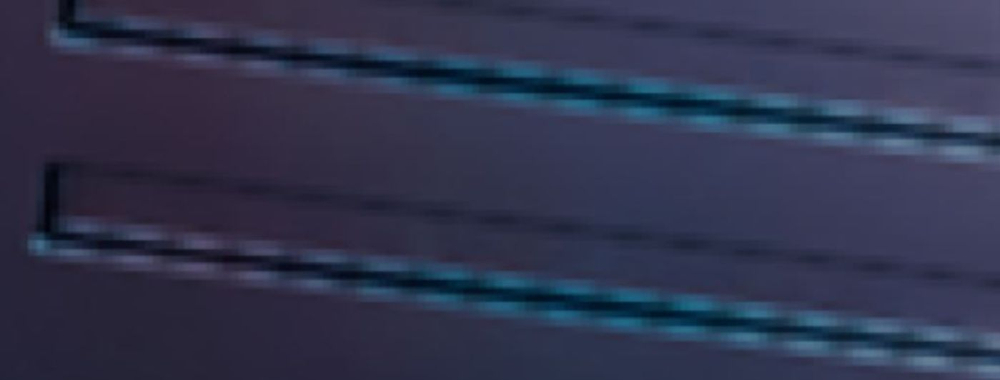
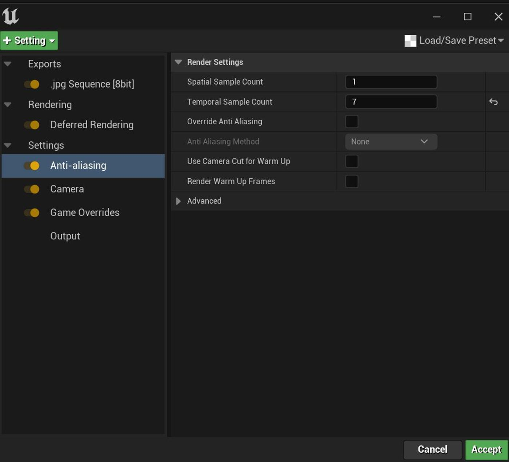

# 揭秘电影渲染队列

## 来源与状态

- 原始 URL：https://dev.epicgames.com/community/learning/tutorials/GxdV/unreal-engine-demystifying-movie-render-queue
- 原始文件：unreal-engine-demystifying-movie-render-queue.origin.md
- 分段：第 1/3 段

- 原始 URL：https://dev.epicgames.com/community/learning/tutorials/GxdV/unreal-engine-demystifying-movie-render-queue

## 运行时分类

- 类型：图文教程
- 判断：运行时未识别到核心视频信号，可整理正文约 14042 字符。

## 摘要

影片渲染队列可能会令人困惑。在这篇文章中，我的目的是通过通俗易懂地解释如何正确设置您来消除一些混乱。

## 中文整理

### 它在做什么！？

在我们进行实际渲染之前，经常有人问当您第一次启动渲染时 MRQ 正在做什么以及为什么它比高分辨率屏幕截图慢。 MRQ 具有较高的开销，因为它的目标是渲染许多帧时的快速性能，并且在设置每个镜头的质量等方面有大量开销。以下是渲染时间之前需要计算的内容的非详尽列表。 - 分配额外的资源来创建离屏渲染（而不是劫持现有的屏幕渲染） 分配额外的资源来创建离屏渲染（而不是劫持现有的屏幕渲染） - 设置预热帧 设置预热帧 - 运动模糊仿真帧 运动模糊仿真帧 - 一般第二个渲染的渲染器开销 一般第二个渲染的渲染器开销 - 可能分配累加器（如果使用平铺、空间或时间样本），为异步读回分配 GPU 资源 可能为累加器分配（如果使用平铺、空间或时间样本），为异步回读分配 GPU 资源 - 渲染结束时刷新 GPU 命令缓冲区 渲染结束时刷新 GPU 命令缓冲区 - 任何需要的着色器编译 任何需要的着色器编译

### 延迟或混合光线追踪渲染（非路径追踪）

### 时间样本计数

- 如果您没有看到平滑的运动模糊，则应该提高此数字。

非常靠近阿诺德的像素样本。

您几乎可以仅通过查看 alpha 来拨打此号码。

或者另一种思考方式是，如果您正在观察一个快速旋转的物体，时间样本越多，运动模糊就会越平滑、越圆。

如果您没有看到平滑的运动模糊，则应该提高此数字。

非常靠近阿诺德的像素样本。

您几乎可以仅通过查看 alpha 来拨打此号码。

或者另一种思考方式是，如果您正在观察一个快速旋转的物体，时间样本越多，运动模糊就会越平滑、越圆。

- 更改此数字的另一个原因是您发现任何抗锯齿问题。

就像锯齿状的线条尽力拼凑成一条直线一样。

但前提是您的抗锯齿方法设置为“无”。

否则，这将由你的 AA 方法控制。

下面详细介绍这一点。

更改此数字的另一个原因是您是否发现任何抗锯齿问题。

就像锯齿状的线条尽力拼凑成一条直线一样。

但前提是您的抗锯齿方法设置为“无”。

否则，这将由你的 AA 方法控制。

下面详细介绍这一点。

- 最好从较低的数字开始，然后逐渐增加。

较快移动的镜头比慢速移动的镜头需要更多的时间样本。

最好从较低的数字开始，然后逐渐增加。

较快移动的镜头比慢速移动的镜头需要更多的时间样本。

- 这种渲染方法对于混合时间和空间样本没有任何优势。

通过增加空间样本和时间样本，如果该方法设置为“无”，您仍然会获得更高的抗锯齿质量，但您将失去额外的运动模糊混合。

不要与延迟渲染路径混合搭配。

使用全部时间或全部空间。

这种渲染方法对于混合时间和空间样本没有任何优势。

通过增加空间样本和时间样本，如果该方法设置为“无”，您仍然会获得更高的抗锯齿质量，但您将失去额外的运动模糊混合。

不要与延迟渲染路径混合搭配。

使用全部时间或全部空间。

- 默认情况下，引擎使用“帧中心”快门定时进行渲染以实现运动模糊。

考虑到这一点，最好将采样保持为奇数，以便您在关键帧上获得任何动画影响、变化或方向的采样。

它将帮助您在渲染中更清晰地呈现该运动。

默认情况下，引擎使用“帧中心”快门定时进行渲染以实现运动模糊。

考虑到这一点，最好将采样保持为奇数，以便您在关键帧上获得任何动画影响、变化或方向的采样。

它将帮助您在渲染中更清晰地呈现该运动。

### 空间样本计数

- 与时间样本类似，只是它不会使引擎向前滴答作响。因此，仅当您不希望将运动模糊烘焙到渲染中时才使用它们。但可以用相同的方式拨打以清除任何别名，但同样，前提是您的 AA 方法设置为“无”。与时间样本类似，只是它不会使引擎向前滴答作响。因此，仅当您不希望将运动模糊烘焙到渲染中时才使用它们。但可以用相同的方式拨打以清除任何别名，但同样，前提是您的 AA 方法设置为“无”。

### 抗锯齿方法

- 默认情况下，引擎在 UE4 中使用 TAA，在 UE5 中使用 TSR（或您在项目首选项中设置的任何内容）。

这些抗锯齿方法并不完美，但对于很多用例来说它们都非常好。

TSR 比 TAA 向前迈出了一大步。

建议您仅在有视觉原因时才应在 MRQ 中禁用这些功能。

事实上，有大量渲染功能在启用时效果最佳。

默认情况下，引擎在 UE4 中使用 TAA，在 UE5 中使用 TSR（或您在项目首选项中设置的任何内容）。

这些抗锯齿方法并不完美，但对于很多用例来说它们都非常好。

TSR 比 TAA 向前迈出了一大步。

建议您仅在有视觉原因时才应在 MRQ 中禁用这些功能。

事实上，有大量渲染功能在启用时效果最佳。

- 如果您不使用 TAA，则在增加 TS 或 SS 时可以忽略 MRQ 中的警告。

如果您不使用 TAA，则在增加 TS 或 SS 时可以忽略 MRQ 中的警告。

- TAA/TSR 应用于从 GPU 返回的每个样本。

TAA/TSR 应用于从 GPU 返回的每个样本。

- 对于 TAA，如果您的样品总数为 8 或以下，通常最好保留 TAA。

与让引擎在抖动相机时通过自己的序列循环相比，TAA 将以更少的样本数量为您带来更大的收益。

如果您的样本数量超过 8 个，这基本上就是您在 MRQ 中收到的警告的意思。

一旦达到 12 个左右的时间样本，您就会从 TAA 获得收益递减，此时您可以考虑将其关闭（TSR 的情况并非如此，因为它会自动动态选择最佳数量的抖动样本，并且会考虑更多的用例）。

基本上，TAA/TSR 具有前一帧的图像历史记录（实际上是组合渲染的每一帧的历史记录，尽管最近的帧的权重很大）。

TAA 对该图像进行 8 次采样，并将其与当前帧合成。

您可以使用 cvar r.TemporalAA.NumSamples 控制抖动位置的数量。

默认为 8。

TSR 足够聪明，可以自行决定，为您提供最佳结果。

尽管在我自己的个人测试中并没有真正明显地看到超过 12 的任何东西，这就是为什么我说你会得到收益递减并且应该考虑将 AA 方法设置为“无”。

下面的下一个要点将详细介绍这一点。

但同样，除非您有视觉上的理由这样做，否则最好将其保留。

事实上，有许多渲染功能需要像 Lumen 这样的 TSR。

对于 TAA，如果您的样本总数为 8 或以下，通常最好保留 TAA。

与让引擎在抖动相机时通过自己的序列循环相比，TAA 将以更少的样本数量为您带来更大的收益。

如果您的样本数量超过 8 个，这基本上就是您在 MRQ 中收到的警告的意思。

一旦达到 12 个左右的时间样本，您就会从 TAA 获得收益递减，此时您可以考虑将其关闭（TSR 的情况并非如此，因为它会自动动态选择最佳数量的抖动样本，并且会考虑更多的用例）。

基本上，TAA/TSR 具有前一帧的图像历史记录（实际上是组合渲染的每一帧的历史记录，尽管最近的帧的权重很大）。

TAA 对该图像进行 8 次采样，并将其与当前帧合成。

您可以使用 cvar r.TemporalAA.NumSamples 控制抖动位置的数量。
