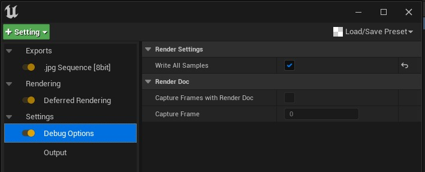
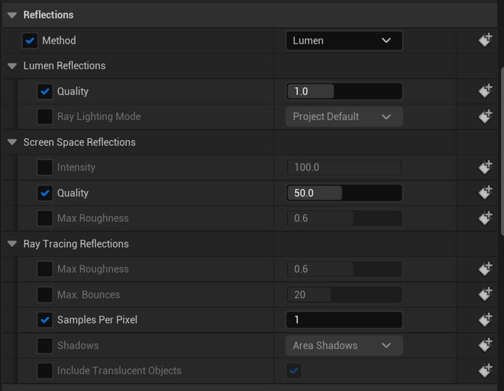
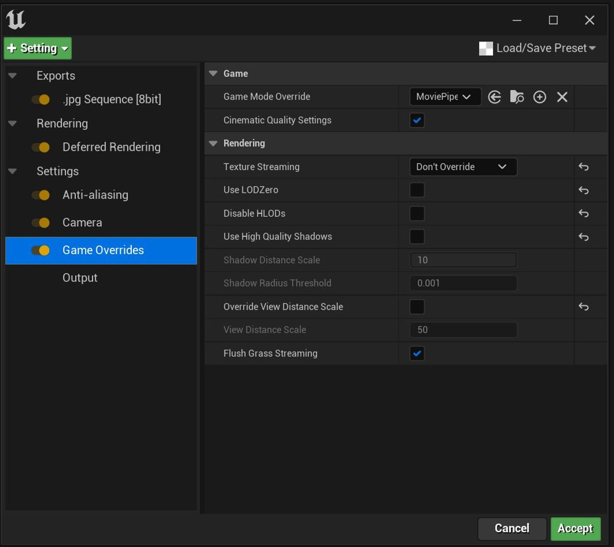

# 揭秘电影渲染队列（续 2）

## 来源与状态

- 原始 URL：https://dev.epicgames.com/community/learning/tutorials/GxdV/unreal-engine-demystifying-movie-render-queue
- 原始文件：unreal-engine-demystifying-movie-render-queue.origin.md
- 分段：第 2/3 段

默认为 8。

TSR 足够聪明，可以自行决定，为您提供最佳结果。

尽管在我自己的个人测试中并没有真正明显地看到超过 12 的任何东西，这就是为什么我说你会得到收益递减并且应该考虑将 AA 方法设置为“无”。

下面的下一个要点将详细介绍这一点。

但同样，除非您有视觉上的理由这样做，否则最好将其保留。

事实上，有许多渲染功能需要像 Lumen 这样的 TSR。

- 当“抗锯齿方法”设置为“无”时，摄像机的位置将遵循 Halton 序列，并为输出帧中的每个时间/空间样本选择唯一的子像素抖动。

因此，如果您出于运动模糊原因必须使用大量时间样本进行渲染，您不妨为每个时间样本附带的 AA 获取额外的独特相机位置。

值得一试，看看什么可以给您带来最好的结果。

当“抗锯齿方法”设置为“无”时，摄像机的位置将遵循 Halton 序列，并为输出帧中的每个时间/空间样本选择唯一的子像素抖动。

因此，如果您出于运动模糊原因必须使用大量时间样本进行渲染，您不妨为每个时间样本附带的 AA 获取额外的独特相机位置。

值得一试，看看什么可以给您带来最好的结果。

- 作为学习练习，我鼓励每个人渲染 MRQ 中的各个样本，并使用不同的抗锯齿方法和样本类型进行渲染来查看它们。

这将使您更好地了解渲染时发生的情况，并有助于清除所有这些问题。

这可能会令人困惑。

时间样本与空间样本。

时间 AA 与 TSR 与无抗锯齿方法。

这将为您提供事物的视觉表示。

使用 TAA/TSR，您不会看到每个样本上的抖动，就像将 AA 方法设置为“无”时所做的那样，因为它们都希望创建稳定的图像。

您可以在这里启用它...

作为学习练习，我鼓励每个人渲染 MRQ 中的各个样本，并使用不同的抗锯齿方法和样本类型进行渲染来查看它们。

这将使您更好地了解渲染时发生的情况，并有助于清除所有这些问题。

这可能会令人困惑。

时间样本与空间样本。

时间 AA 与 TSR 与无抗锯齿方法。

这将为您提供事物的视觉表示。

使用 TAA/TSR，您不会看到每个样本上的抖动，就像将 AA 方法设置为“无”时所做的那样，因为它们都希望创建稳定的图像。

您可以在这里启用它...

- 关闭 TAA/TSR 的一个原因是，如果您有一块非常热、薄的地理区域，并且很难清除轮廓（参见上图）。

或者一堆思考线相互堆叠，从相机的 Z 方向返回。

这些对于 TAA 来说都是难以处理的问题，您可能必须依靠空间/时间样本来清理线路。

关闭 TAA/TSR 的一个原因是，如果您有一块非常热、薄的地理区域，并且很难清除轮廓（请参见上图）。

或者一堆思考线相互堆叠，从相机的 Z 方向返回。

这些对于 TAA 来说都是难以处理的问题，您可能必须依靠空间/时间样本来清理线路。

- 这是 Brian Karis 提供的关于引擎中如何发生混叠的技术解释，可以阐明。

“如果有大量样本，就可以节省能量。

在样本数量较少的情况下，极亮的像素会导致混叠。

由于样本数量较少，我们无法确切知道它们覆盖了多少像素，因此我们给它们的权重要低得多，以防止锯齿。

这是路径追踪器中的一个常见问题，也称为萤火虫，并且使用类似的策略来处理它们。

如果样本颜色为 1600，则 8 个样本中的单个样本可以达到该值，其余样本可以为 0，平均值仍为 200 并饱和为白色。

零命中当然是黑色的。

因此，当该功能从一个像素移动到另一个像素时，它不会平滑地打开一个像素并关闭另一个像素。

它将从 1 像素白色变为 2 像素白色，再变为 1 像素白色。

这就是别名。

你感知到的能量在1和2之间闪烁。

当这种情况发生在边缘时，看起来就像阶梯一样。

AA 样本数需要更高才能顺利处理 1600。” 以下是 Brian Karis 提供的关于引擎中如何发生混叠的技术解释，可以阐明这一点。

“如果有大量样本，就可以节省能量。

在样本数量较少的情况下，极亮的像素会导致混叠。

由于样本数量较少，我们无法确切知道它们覆盖了多少像素，因此我们给它们的权重要低得多，以防止锯齿。

这是路径追踪器中的一个常见问题，也称为萤火虫，并且使用类似的策略来处理它们。

如果样本颜色为 1600，则 8 个样本中的单个样本可以达到该值，其余样本可以为 0，平均值仍为 200 并饱和为白色。

零命中当然是黑色的。

因此，当该功能从一个像素移动到另一个像素时，它不会平滑地打开一个像素并关闭另一个像素。

它将从 1 像素白色变为 2 像素白色，再变为 1 像素白色。

这就是别名。

你感知到的能量在1和2之间闪烁。

当这种情况发生在边缘时，看起来就像阶梯一样。

AA 样本数量需要更高才能顺利处理 1600 个。”

### 路径追踪渲染示例

这与延迟非常相似。您应该分开决定是否想要运动模糊，因为时间样本将使引擎向前滴答作响。 - 通常建议使用所有空间样本来实现更多定格动画风格或静止渲染 通常建议使用所有空间样本来实现更多定格动画风格或静止渲染 - 所有带有参考运动的时间样本...

### 光线追踪/流明/RT 阴影样本

### 热身

### CVARS

### 电影渲染图

## 相关链接
