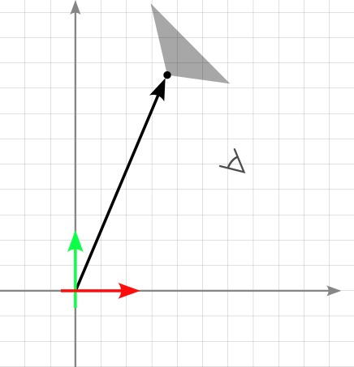
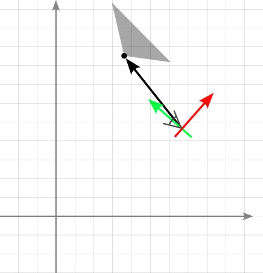
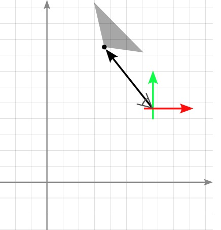
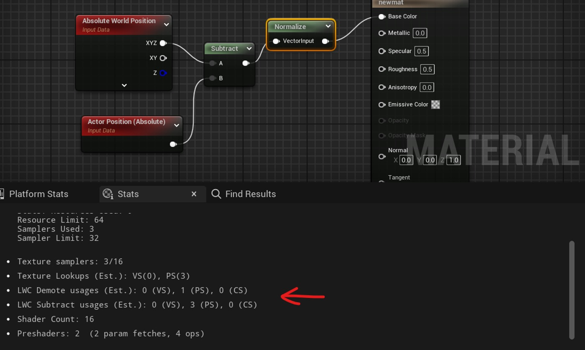
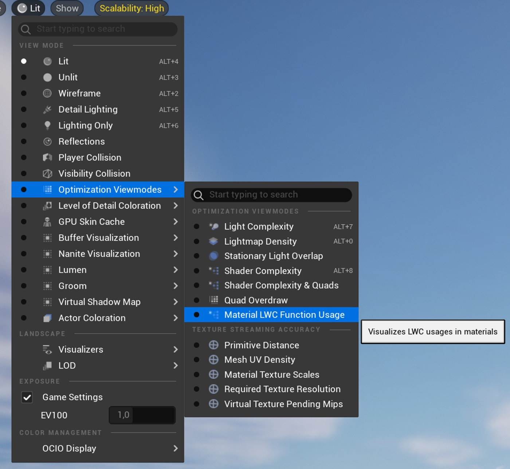
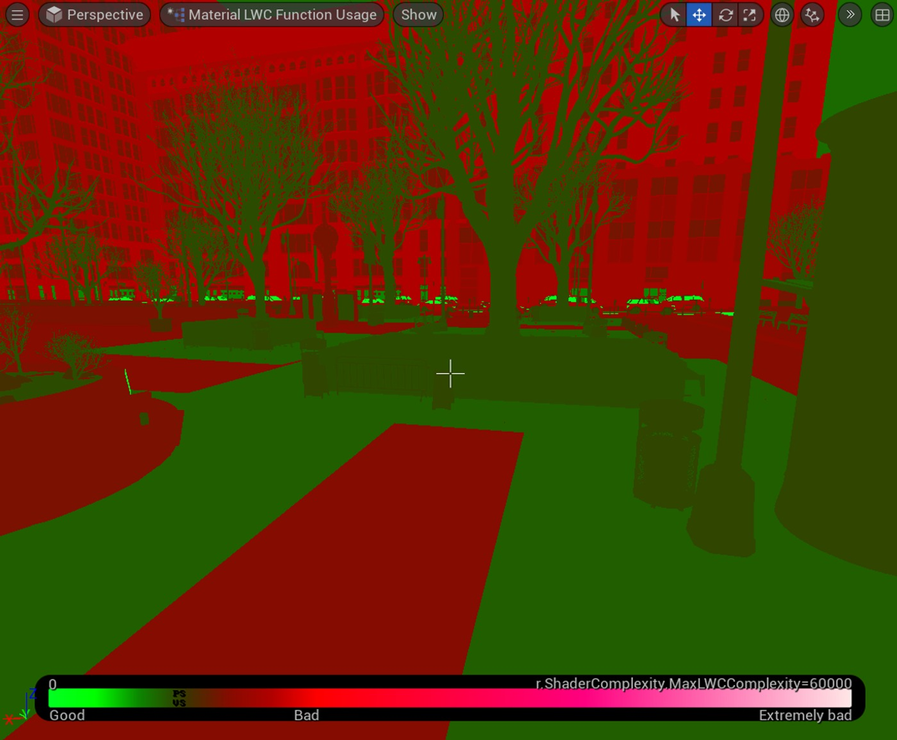

# 适用于大世界的高效材料

## 来源与状态

- 原始 URL：https://dev.epicgames.com/community/learning/tutorials/DdzL/unreal-engine-fortnite-efficient-materials-for-large-worlds
- 原始文件：unreal-engine-fortnite-efficient-materials-for-large-worlds.origin.md
- 分段：第 1/2 段

- 原始 URL：https://dev.epicgames.com/community/learning/tutorials/DdzL/unreal-engine-fortnite-efficient-materials-for-large-worlds

## 运行时分类

- 类型：图文教程
- 判断：运行时未识别到核心视频信号，可整理正文约 10888 字符。

## 摘要

通过这一简单的技巧提高材料的精度和性能！

## 中文整理

### 概览

- 葡萄牙语（巴西） - 法语 - 德语 - 西班牙语（西班牙）

### 什么和为什么？

TLDR：使用平移世界空间（又名相机相对世界空间）以获得最佳速度和精度。

虚幻引擎 5.0 及更高版本使用大世界坐标 (LWC) 来表示绝对世界空间中的位置。

改变表示方式使引擎能够将其最大世界尺寸大规模扩展到行星际尺度。

从技术角度来看，这些 LWC 比常规浮点向量提高了精度，而常规浮点向量是最大世界尺寸的限制因素。

常规 32 位浮点数只有 24 位来存储数字的数字。

当进行大量计算时，完整的结果可能不适合，导致存在舍入误差。

舍入误差的引入反过来又会表现为渲染伪影。

LWC 旨在通过增加可用位数来解决此问题，从而提高精度。

原产地未改性的道路材料 |距离原点较远的相同路面材料，显示精度误差 虽然 LWC 提高了精度，但确实存在性能成本。

除了双倍的内存成本之外，许多操作还需要双倍的指令。

此外，虽然不太可能，但仍然有可能遇到精度问题。

因此，UE 5.4 引入了用于 GPU 计算的 DoubleFloat 格式，它提供了更强大的精度，但在性能方面也更重。

然后在引擎中仔细实施 DoubleFloat，以最大限度地降低成本，同时最大限度地提高精度。

然而，材质和材质函数仍然使用 5.4 之前的格式，因为我们不控制材质中计算的结构。

因此，本教程演示了如何重构材料中的位置计算以获得更高的精度和速度。

遵循本文档中的指南的材料通常更便宜，无论它们在世界空间的何处使用。

此外，内容可能会被重用或以意想不到的方式更改，因此现在构建强大的材料可以减少以后的额外工作。

### 翻译的世界空间

最好的精度是在原点附近找到的，因此核心思想是将原点从 (0,0,0) 移动到相机位置，或者靠近它的位置。这正是翻译的世界空间，或相对于相机的世界空间。旋转和缩放与绝对世界空间相同，但位置会转换为原点位于相机位置。这使得最高精度最接近相机。因此，当使用 Translated World Space 时，Unreal 将使用常规浮点而不是 LWC，从而在保持高精度的同时降低性能成本。大多数计算可以重构为相对于相机或靠近相机的参考点来执行。如果这符合您的数学要求，局部空间也适用。绝对世界空间|相机空间|平移世界空间（相对于相机的世界空间）

### 在哪里？

有一组产生绝对世界位置的材质节点，表示为 LWC。

大多数涉及 LWC 的数学节点也会生成 LWC。

因此，单个 LWC 源的成本随着每个直接或间接使用它作为输入的数学节点而增加。

然而，一些数学节点总是返回常规浮点数。

最值得注意的是，如果减去两个 LWC 值，结果会自动转换为浮点数。

这可用于限制 LWC 操作的数量。

最好的选择是完全替换绝对世界位置的来源。

产生这些以及 LWC 的最常见材质节点是： - 绝对世界位置 绝对世界位置 - 演员位置 演员位置 - 对象位置 对象位置 - 粒子位置 粒子位置 - 相机位置 相机位置 - 变换位置（* 到绝对世界空间） 变换位置（* 到绝对世界空间） TransformVector 不在此列表中，因为 LWC 类型不用于涉及方向而不是位置的计算。

从 UE 5.4 开始，这些节点现在可以配置为通过在节点参数中设置“世界位置原点类型”来生成相机相对世界位置。

同样，许多以前只接受绝对世界位置作为输入的节点现在也接受与相机相关的位置。

其中包括： - 矢量噪声 矢量噪声 - 运行时虚拟纹理示例 运行时虚拟纹理示例 - SamplePhysicsScalarField SamplePhysicsScalarField - SamplePhysicsVectorField SamplePhysicsVectorField - SamplePhysicsIntegerField SamplePhysicsIntegerField - DistanceToNearestSurface DistanceToNearestSurface - DistanceFieldGradient DistanceFieldGradient - DistanceFieldApproxAO DistanceFieldApproxAO - SkyAtmosphereAerialPerspective SkyAtmosphereAerialPerspective - SkyAtmosphereLightIlluminance SkyAtmosphereLightIlluminance - 大气雾颜色。

大气雾色。

材质编辑器提供材质中 LWC 使用数量的粗略估计，可在“统计”面板中找到。

材质类型中使用的每种 LWC 操作类型均单独列出，以及顶点 (VS)、像素 (PS) 和计算着色器 (CS) 中的大致使用计数。“材质 LWC 函数使用”优化视图模式还可用于检查和比较跨材质的 LWC 使用估计数量。

要获取项目中所有材质及其 LWC 使用计数和其他元数据的 CSV 表，您可以使用 DumpMaterialInfo commandlet。

例如：

### 如何？

大多数涉及绝对世界位置的计算都可以重新表述为使用平移的世界空间。

一些数学简化，之前 |之后，一些数学保持不变。

以下是一些常见模式的示例： TransformPosition Before |之后之前 | （*通过查看大图检查是否可以将其转换为相对空间） SphereMask 距离 UV 坐标 如果您使用世界空间坐标来计算 UV 坐标，则可能无法使用相机相对世界空间。

但是，您仍然可以选择更靠近相机的不同原点。

例如，假设您正在构建一个在非常大的区域（可能是多个大岛屿）中使用的地形材质。

该地形有一座雪山，因此您有一个蒙版纹理来指示哪些区域有雪。
