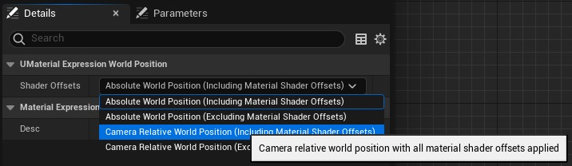
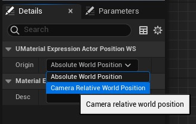

# 适用于大世界的高效材料（续 2）

## 来源与状态

- 原始 URL：https://dev.epicgames.com/community/learning/tutorials/DdzL/unreal-engine-fortnite-efficient-materials-for-large-worlds
- 原始文件：unreal-engine-fortnite-efficient-materials-for-large-worlds.origin.md
- 分段：第 2/2 段

为了避免 LWC，您可以为这座雪山定义一个原点，并相对于该区域原点执行 UV 采样。

然后，蒙版纹理仅覆盖相关区域而不是整个关卡。

请注意，减去两个 LWC 后，编译器会自动将结果转换为浮点数。

因此，ConstantDouble 或 DoubleVectorParameter 有助于定义备用原点。

（请参阅“材质参数”部分） 基于周期性位置的图案 您可能正在使用绝对世界空间来生成重复图案，例如

平铺，不随相机或物体移动。

对于此用例，UE 5.5 在 TransformPosition 节点中引入了“周期性世界空间”选项。

它与绝对世界空间类似，但世界是平铺的，并且原点移动到相机所在平铺的中心。

这提供了比绝对世界位置更好的精度和可扩展性，同时如果图块大小与图案大小匹配则保持图案完整。

例如： 上述材料在 X=1000000 cm 处进行比较如下： 平铺示例： frac-based sin-based

### 如果我必须使用绝对世界空间怎么办？

总体目标应该是通过减少绝对世界空间的使用来最小化 LWC 数学量。

如果您发现无法转换某些操作，您仍然可以尝试减少引入的错误量。

一些指导原则： - 如果您要转换为平移空间，请尽早进行。

这可以使用 TransformPosition 节点，但您也可以从另一个世界空间位置中减去。

如果您要转换为平移空间，请尽早进行。

这可以使用 TransformPosition 节点，但您也可以从另一个世界空间位置中减去。

- 如果您要从平移空间进行转换，请尽可能晚地进行。

如果您要从平移空间进行转换，请尽可能晚地进行。

- 将 LWC 乘以一个大值，或除以一个小分数会增加误差的绝对大小，应避免。

将 LWC 乘以一个大值，或除以一个小分数会增加误差的绝对大小，应避免。

- 2 的幂除法或乘法不会引入额外的舍入误差，因此优于非 pow2 因子。

2 的幂除法或乘法不会引入额外的舍入误差，因此优于非 pow2 因子。

- 处理 LWC 时，更喜欢更简单的操作（加/减/乘） 处理 LWC 时，更喜欢更简单的操作（加/减/乘） - 考虑使用顶点插值器跨像素重复使用昂贵的计算 考虑使用顶点插值器跨像素重复使用昂贵的计算 - 通常编译器会尽可能优化，但最好尽早屏蔽向量并尽可能重用计算。

一般来说，编译器会尽可能地优化，但最好尽早屏蔽向量并尽可能地重复使用计算。

- 测试您的材料的精度问题（见下文） 测试您的材料的精度问题（见下文）

### 关于材料参数

如果参数（或常量）表示绝对世界空间中的位置，请使用 DoubleVectorParameter（或 DoubleConstant）而不是常规向量参数。相对于相机的位置仍然可以使用常规参数节点，并且应该是首选。

### 关于本地位置

在 UE 5.5 中，LocalPosition 材质函数已被弃用并替换为新的本机节点。预蒙皮本地位置也移至新节点。旧的材质函数采用绝对世界位置并应用 TransformPosition 将其转移到局部空间。新的本机节点直接提供顶点着色器中的本地位置，避免了额外的变换以获得更好的精度。像素着色器仍然像旧路径一样在内部使用变换，但如果材质中有足够的空间，您可以使用 VertexInterpolator 避免这种情况。

### 测试

判断您的材料是否存在精度问题的最简单方法就是对其进行测试。如果存在问题，它们可能最容易在距离原点 2^20 厘米（= 1048576）处或在非常大的偏移处（例如 1 万亿单位）发现。将带有材质的资产移动到这些位置，并检查是否看到任何像素化、步进或扭曲伪影。最好通过移动相机和/或演员来进行运动测试，以揭示基于演员/基元/实例位置错误的缺陷。这也将有助于发现运动矢量的问题，这些问题可能表现为运动模糊或 TSR 中的问题。 - 材料 - 性能和分析 - 大世界坐标

## 相关链接

- [What and Why?](https://dev.epicgames.com/community/learning/tutorials/DdzL/unreal-engine-fortnite-efficient-materials-for-large-worlds#whatandwhy?)
- [Translated World Space](https://dev.epicgames.com/community/learning/tutorials/DdzL/unreal-engine-fortnite-efficient-materials-for-large-worlds#translatedworldspace)
- [Where?](https://dev.epicgames.com/community/learning/tutorials/DdzL/unreal-engine-fortnite-efficient-materials-for-large-worlds#where?)
- [How?](https://dev.epicgames.com/community/learning/tutorials/DdzL/unreal-engine-fortnite-efficient-materials-for-large-worlds#how?)
- [What if I must use absolute world space?](https://dev.epicgames.com/community/learning/tutorials/DdzL/unreal-engine-fortnite-efficient-materials-for-large-worlds#whatifimustuseabsoluteworldspace?)
- [On Material Parameters](https://dev.epicgames.com/community/learning/tutorials/DdzL/unreal-engine-fortnite-efficient-materials-for-large-worlds#onmaterialparameters)
- [On Local Position](https://dev.epicgames.com/community/learning/tutorials/DdzL/unreal-engine-fortnite-efficient-materials-for-large-worlds#onlocalposition)
- [Testing](https://dev.epicgames.com/community/learning/tutorials/DdzL/unreal-engine-fortnite-efficient-materials-for-large-worlds#testing)
