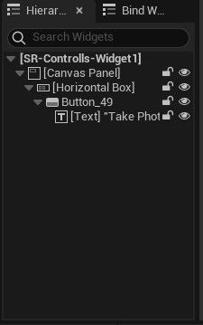
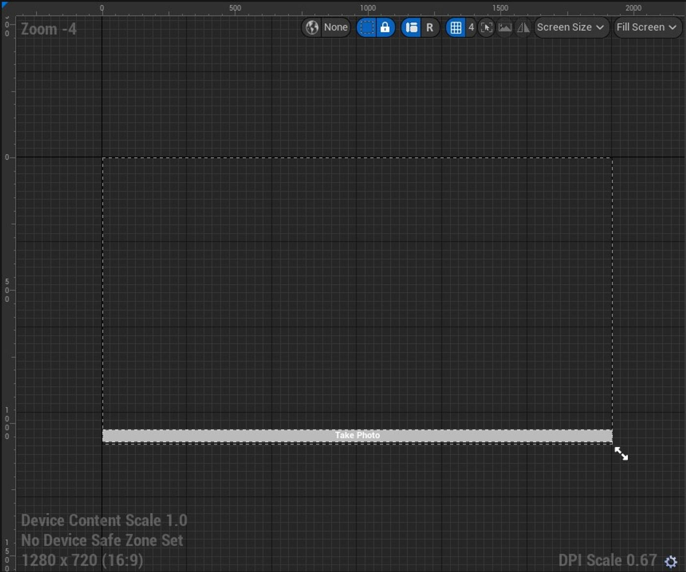
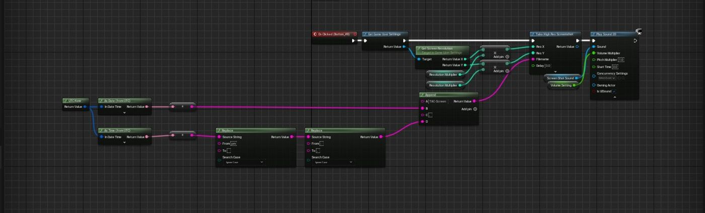

# 高质量截图

## 来源与状态

- 原始 URL：https://dev.epicgames.com/community/learning/tutorials/8kb9/unreal-engine-high-quality-screenshot

## 运行时分类

- 类型：图文教程
- 判断：运行时未识别到核心视频信号，可整理正文约 1807 字符。

## 摘要

通过本教程，您应该能够拍摄高质量的游戏屏幕截图，但这是针对过场动画和照片模式的，因为它需要很长时间...

## 中文整理

### 概览

- This setup is made in Widget graphs so make a new widget like this add a canvas to the widget and then add a horizontal box and add a button and text into it set the box to size to content and anchor it to the bottom and set the positions to 0 so it goes down to the bottom of the screen then set the button to fill so it covers the hole lower bottom of the screen : This setup is made in Widget graphs so make a new widget like this add a canvas to the widget and then add a horizontal box and add a button and text into it set the box to size to content and

  anchor it to the bottom and set the positions to 0 so it goes down to the bottom of the screen then set the button to fill so it covers the hole lower bottom of the screen : 2. now Choose the button go to events and choose on clicked then copy and attach the code to the event like this (The code can

  be found at the end of this tutorial) : 3. Your almost done just add the widget to the screen and that's it Now its time for explaining the code and how it works, you should be able to find a variable named ResolutionMultiplier you can multiply the resolution which the screen shot is taken with but take caution with this because it can crash the game or take along time to complete a screenshot, the second variable is VolumeSetting if you want to control the volume of the screenshot sound you can do it with the VolumeSetting, now about the last variable which is the ScreenShotSound with this

one you can choose what sound effect it plays after the screenshot is taken and if you are wondering about the code that's attached to the file name that is for changing the screenshots name based on date and time and that's it you should be good to go have fun
  with it and make sure to join my discord channel. - 程序和脚本设计 - blueprint - cinematics

## 相关链接

- 未识别到明确相关链接。

