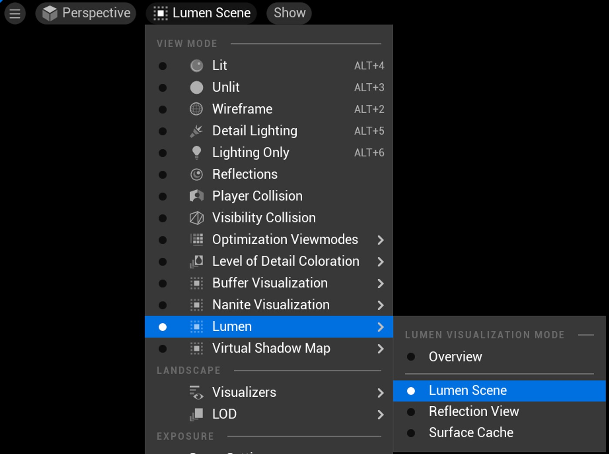

# 我如何判断是否有某些因素对流明有贡献？

## 来源与状态

- 原始 URL：https://dev.epicgames.com/community/learning/knowledge-base/5kPY/unreal-engine-how-can-i-tell-if-something-is-contributing-to-lumen

## 运行时分类

- 类型：图文教程
- 判断：运行时未识别到核心视频信号，可整理正文约 1306 字符。

## 摘要

我如何判断是否有某些因素对 Lumen 产生影响？文章由 Joe R 撰写。Lumen 场景 Lumen 提供完全动态的全局照明和 r...

## 中文整理

### 概览

文章作者：Joe R.

### 流明场景

Lumen 为场景提供完全动态的全局照明和反射。然而，在某些情况下，您可能会看到目标在反射中丢失，或者对照明没有贡献。为了帮助识别对流明没有贡献的内容，您可以使用名为“流明场景”的视图模式。这种视频模式实际上就是 Lumen 在场景中“看到”的内容。如果一个物体是纯黑色的，那么它对流明没有贡献。下面您可以在编辑器中看到原始的渲染场景，以及流明场景“看到”的内容。 原始场景，禁用流明场景 相同场景，启用流明场景 比较两个图像，您可以看到什么对流明有贡献，什么不会。请注意中间的岩石和左侧的铲子是纯黑色的。他们不对 Lumen 做出贡献。由于这些岩石和铲子很小，Lumen 不会在照明或反射中使用它们，因此显示为黑色。您还会注意到，没有任何树叶包含在内。

### 有用的链接

- Lumen 全局照明和反射文档 Lumen 全局照明和反射文档 - Lumen |虚幻流明内部 |深入虚幻 - Lumen Essentials Lumen Essentials - Lumen - 让光存在！流明——要有光！在知识库中获取更多答案！ - 虚幻引擎

## 相关链接

- [Lumen Global Illumination and Reflections documentation](https://docs.unrealengine.com/5.0/en-US/lumen-global-illumination-and-reflections-in-unreal-engine/)
- [Knowledge Base!](https://forums.unrealengine.com/docs)
- [The Lumen Scene](https://dev.epicgames.com/community/learning/knowledge-base/5kPY/unreal-engine-how-can-i-tell-if-something-is-contributing-to-lumen#thelumenscene)
- [Useful Links](https://dev.epicgames.com/community/learning/knowledge-base/5kPY/unreal-engine-how-can-i-tell-if-something-is-contributing-to-lumen#usefullinks)

