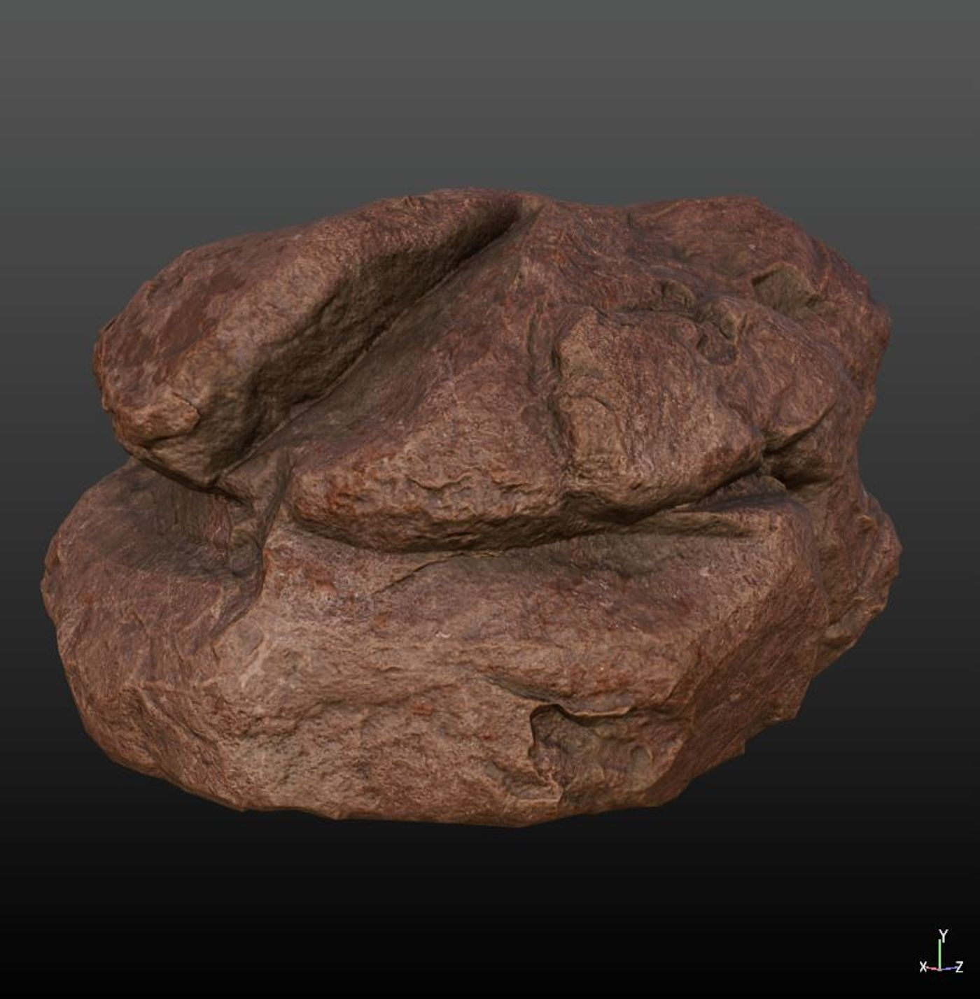

# 您如何着手为您的第一个游戏资产制作纹理？

## 来源与状态

- 原始 URL：https://dev.epicgames.com/community/learning/tutorials/b5Rd/unreal-engine-how-do-you-go-about-texturing-your-first-game-asset

## 运行时分类

- 类型：图文教程
- 判断：运行时未识别到核心视频信号，可整理正文约 4624 字符。

## 摘要

本教程最初是作为 Instagram 帖子创建的，用于记下我在虚幻引擎环境中学到的技术......

## 中文整理

### 概览

继上一篇关于创建“您的第一个游戏道具”的主题之后，这是该主题的后续内容，涵盖了您在为您的第一个游戏资产进行纹理处理时可以遵循的总体步骤，以减少痛苦的体验。

在此期间将使用的软件主要是 Substance Painter、一点 Photoshop 以及在虚幻引擎中使用的软件。

那么我们开始吧...

第 1 步：完成低多边形几何体的网格贴图烘焙后，我们就可以添加一些填充层来增强基础。

现在，在对道具进行纹理化时始终要牢记的三个参数是腔体、环境光遮挡 (AO) 和曲率。

腔体将使您能够访问基本上是腔体和难以到达的区域，AO 将使您能够访问表面之间的遮挡区域，而曲率将使您能够访问尖角和边缘，这些尖角和边缘可以使用级别来缓解或收紧。

考虑到这一点，添加一个具有基本纹理的填充层（在本例中为岩石纹理），您可以从 Megascans 或 AmbientCG.com 免费获得该纹理。

第2步：按照这一步，您可以继续使用生成器、级别调整、填充图层等。

以获得最终结果。

我建议您在继续之前获取一些参考图像。

许多初学者往往会错过的另一件事是，您可以基于通道创建填充层，例如仅为基色创建一个填充层，为粗糙度创建另一个填充层，依此类推。

这将在操纵纹理时放弃很多自由。

以下是您可以使用的一些最常见的生成器： - 遮罩编辑器/生成器用于操作遮罩，主要是曲率、渐变和 AO。

- AO、曲率和金属边缘磨损。

一些常见的滤镜： - 模糊和模糊斜率，用于操纵蒙版的行为方式，或创建看起来不完整的东西。

- 扭曲到扭曲蒙版或纹理。

- MatFinish 滤镜，如果您想制作一些看起来很酷的金属材质，可以控制颜色、法线和粗糙度。

- 烘焙灯光滤镜，如果您想要风格化的外观。

第 3 步：添加蒙版后，再添加生成器和滤镜，您可以通过在蒙版中添加填充层并将混合模式设置为正片叠底、叠加或滤色，然后进行级别调整来更进一步。

对于有机食品，BnW 景点、Clouds & Grunges 效果最好。

步骤 4：到达这一步后，我建议您创建一个文件夹并右键单击以创建智能材质以供您在将来的项目中使用。

第5步：现在使用填充层和蒙版都很好，但是为了使整个资源看起来像计算机生成的混乱，有必要进行一些有机的修饰，我的意思是使用平板电脑或鼠标用手绘制一些蒙版。

为此，您可以在遮罩层堆栈下添加一个绘画层，并用黑色和白色进行绘画。

第 6 步：以下是一些方便的技巧，您可以使用它们在为资源创建纹理时节省时间：

您不需要从头开始创建所有内容，而是使用包含大量免费内容的在线资源，即

物质来源（免费的智能材质和纹理、存档文件等）

获取免费纹理，而不是自己制作纹理（ambientcg.com、textures.com、polyhaven.com 等） iii。

使用 artstation 市场、Megascans 库等。

获取免费的 Alpha、画笔以及数千种纹理！

步骤 7：以下是一些中级到高级的工作流程技术，您可以学习这些技术来处理复杂的资产：

您可以使用物质画家内部的锚点在多个图层中使用蒙版，而无需从头开始复制和重新创建蒙版。

二.

使用画家或设计师创建装饰表，然后在引擎内的大量资源中使用它，可以节省大量内存、性能和时间。

三.

顶点绘画！

无需离开编辑器即可在引擎内绘制纹理。

四.

创建两张 UV 贴图并使用第二张来设置 RGB 蒙版，以便在多次实例化同一资源时获得更多变化。

v.

想要呈现手绘效果吗？

为什么不在 Photoshop 内部的 UV 上进行绘制呢？

通过我在这里提供的所有提示，我希望您对在为游戏创建下一个 3D 资产时应该关注哪些事情有一个大致的了解。

如果您有任何形式的疑问，请随时与我联系，我很乐意为您提供帮助。

如果您觉得有帮助，请与您的朋友分享此主题，关注我以获取类似的未来主题，祝您创作愉快！

- AmbientCG 纹理 - 物质源 - 光照 - 世界创建 - 纳米粒子 - 材质 - 建模 - 树叶 - 环境艺术 - 动画 - 关卡设计

## 相关链接

- [AmbientCG textures](https://ambientcg.com/)
- [Substance Source](https://substance3d.adobe.com/assets)
- [实用链接](https://dev.epicgames.com/community/learning/tutorials/b5Rd/unreal-engine-how-do-you-go-about-texturing-your-first-game-asset#%E5%AE%9E%E7%94%A8%E9%93%BE%E6%8E%A5)

