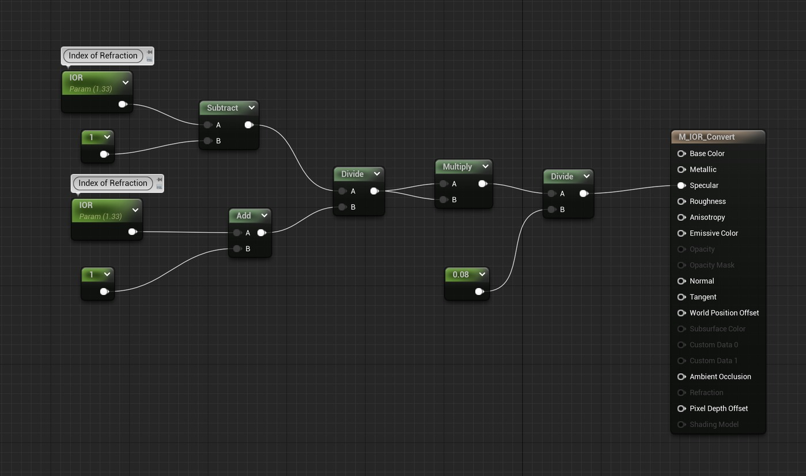
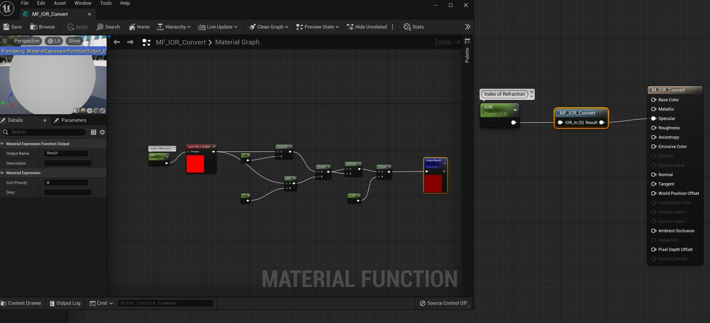

# 如何将折射率 (IOR) 值转换为虚幻材质的镜面反射值

## 来源与状态

- 原始 URL：https://dev.epicgames.com/community/learning/tutorials/yG4z/unreal-engine-how-to-convert-index-of-refraction-ior-values-into-an-unreal-material-s-specular-value

## 运行时分类

- 类型：图文教程
- 判断：运行时未识别到核心视频信号，可整理正文约 1055 字符。

## 摘要

一些离线渲染器使用折射率值来调制材质中的菲涅尔。在虚幻引擎中，我们使用“Specular”值。在这位导师...

## 中文整理

### 概览

在虚幻引擎中，镜面反射参数将有效介电范围重新映射到标准化数字，其中 0.5 = IOR 1.5 作为基线，1.0 = IOR 1.8 在顶端。对于很多材质来说，IOR 为 1.5 就非常合适。但是，如果您正在制水并且想要 IOR 为 1.33，该怎么办？这相当于什么镜面反射数？引擎在引擎盖下使用的方程为镜面反射 = ( ( IOR − 1 ) / ( IOR + 1 ) ) ² / 0.08。 （方程中 1 的值假设 IOR 输出为空气/真空。因此，如果您试图确定玻璃内水的镜面反射值，您需要将 1 替换为 1.5）。在这种情况下，如果我们将玻璃的 IOR 1.33，通过方程，您将得到 0.25 的镜面反射值。您可以将其作为镜面反射参数输入到您的材质中。或者您可以将其设置为材质中的参数，并让引擎为您进行数学计算。如果您真的想变得更奇特，您甚至可以创建自己的材质函数，可以在项目中的任何材质中引用。 - 材料

## 相关链接

- 未识别到明确相关链接。

