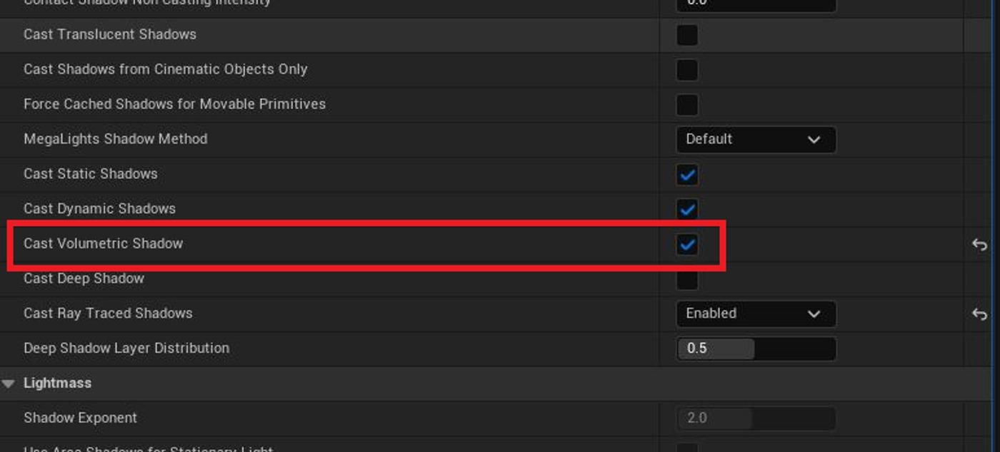
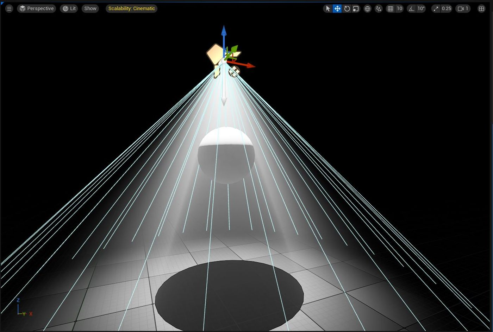

# 如何使用光线追踪阴影获得“上帝光芒”

## 来源与状态

- 原始 URL：https://dev.epicgames.com/community/learning/tutorials/oLba/unreal-engine-how-to-get-god-rays-with-raytraced-shadows

## 运行时分类

- 类型：图文教程
- 判断：运行时未识别到核心视频信号，可整理正文约 652 字符。

## 摘要

如何使光线追踪阴影变成阴影体积雾并制作漂亮的“上帝光线”。

## 中文整理

### 概览

最近我注意到很少有人知道从 5.3 或 5.4 开始可以使用光线追踪阴影来阴影体积雾，我不记得了。有趣的是，我们让渲染团队将其添加到我们与 Blur Studios 合作制作的 Secret Level Unreal Tournament 短片中。无论如何，您需要确保您的灯光正在投射体积阴影并设置为光线追踪阴影（确保您的项目中启用了硬件光线追踪）。然后，只需输入控制台变量 r.VolumetricFog.InjectRaytracedLights 1。瞧！下次你见到 Aleksander Netzel 时请他喝杯咖啡来添加这个！ - 灯光 - 阴影 - 动画 - 体积

## 相关链接

- [Secret Level Unreal Tournament](https://www.imdb.com/title/tt33208009/)

