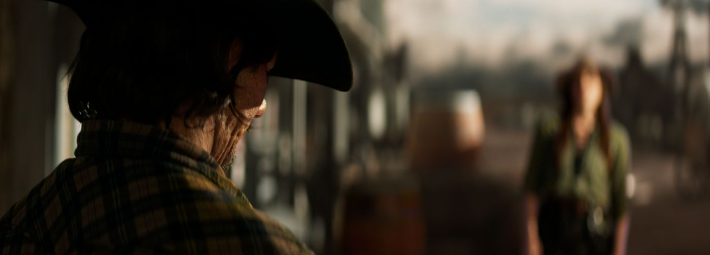
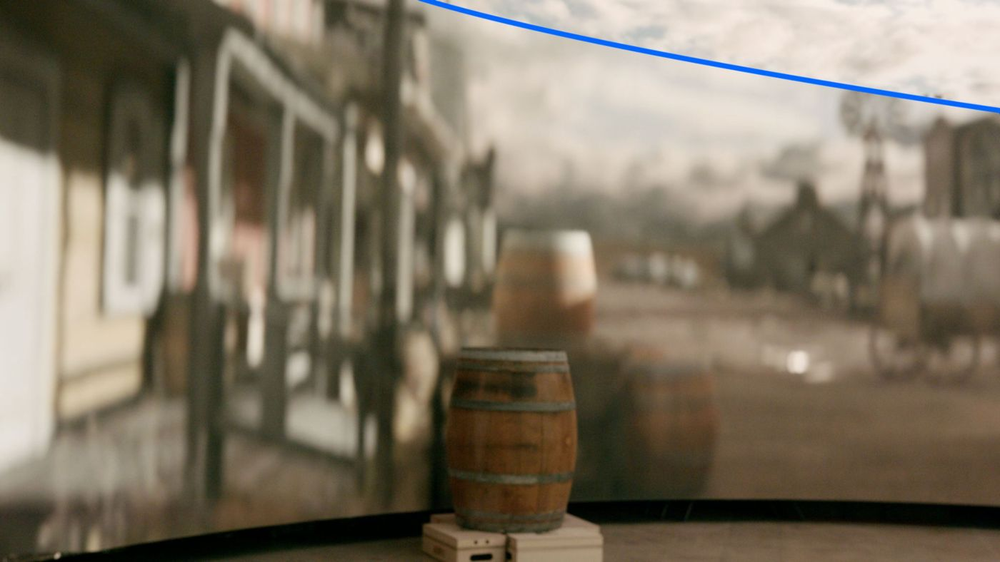
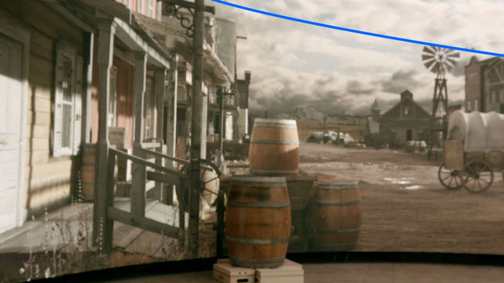
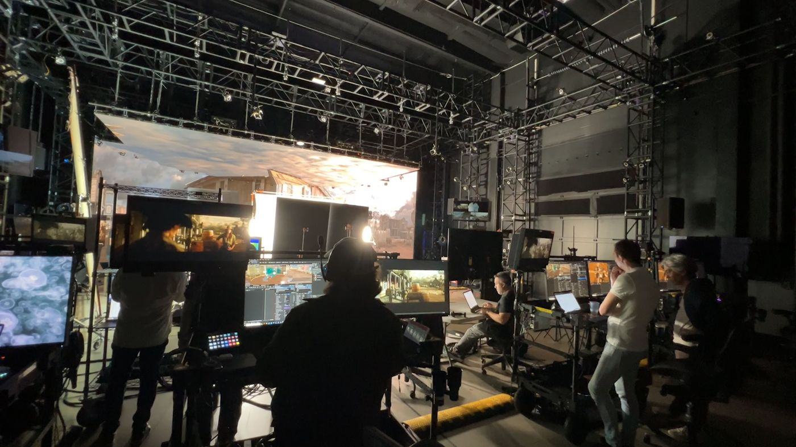
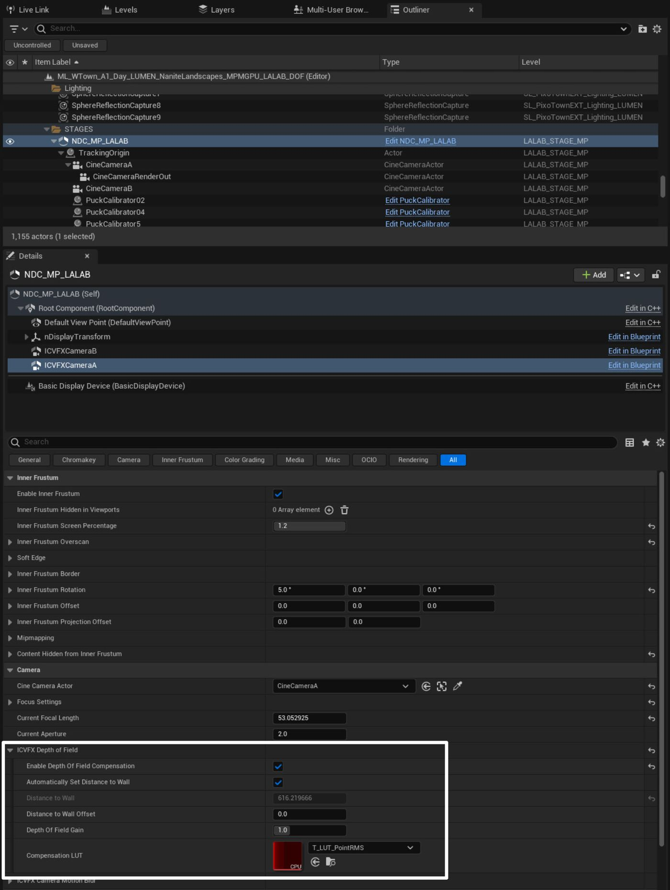
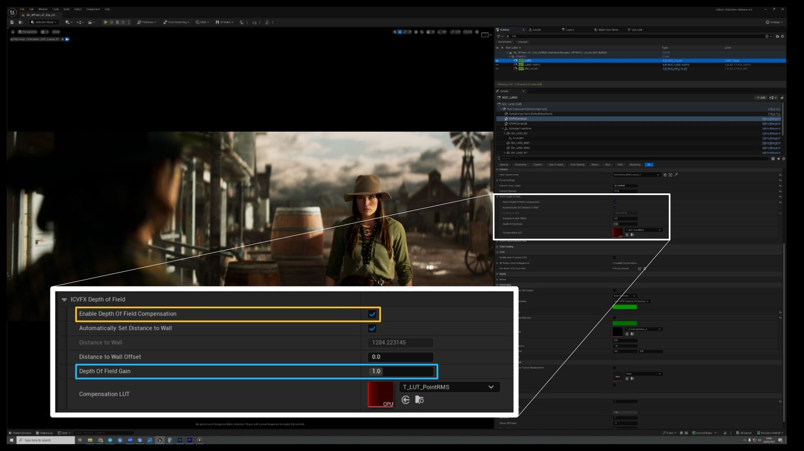
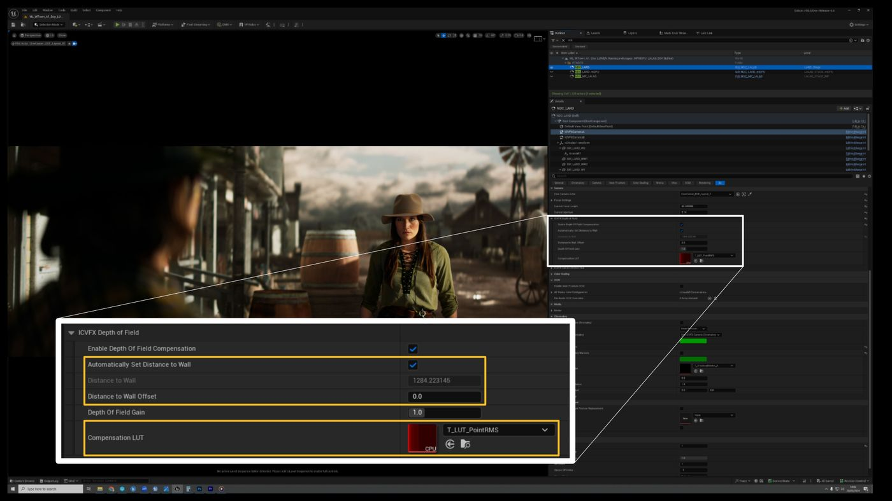
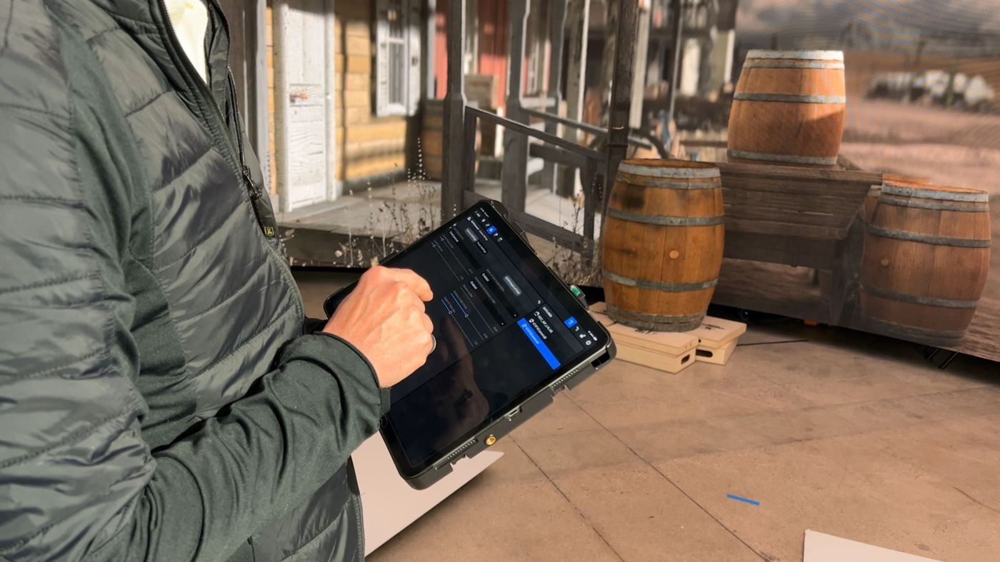
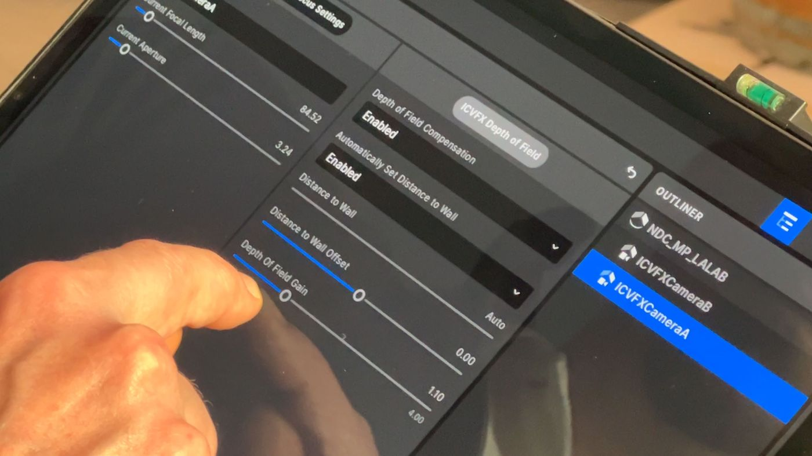

# ICVFX 景深补偿

## 来源与状态

- 原始 URL：https://dev.epicgames.com/community/learning/knowledge-base/earV/unreal-engine-icvfx-depth-of-field-compensation
- 原始文件：unreal-engine-icvfx-depth-of-field-compensation.origin.md
- 分段：第 1/3 段

- 原始 URL：https://dev.epicgames.com/community/learning/knowledge-base/earV/unreal-engine-icvfx-depth-of-field-compensation

## 运行时分类

- 类型：图文教程
- 判断：运行时未识别到核心视频信号，可整理正文约 8348 字符。

## 摘要

这篇文章概述了 ICVFX 景深补偿功能及其使用方法。

## 中文整理

### ICVFX 景深补偿：简介

### LED 墙上 DOF 的挑战

管理 LED 墙上的相机内视觉特效 (ICVFX) 景深 (DOF) 一直是一个长期存在的挑战。部分原因是存在两个自由度，一个来自通过 LED 墙上的 nDisplay 进行的虚拟相机渲染，另一个来自现实世界的相机。使用这两台相机，匹配焦点、光圈和变焦，产生的图像比预期的更不准确和模糊，并且物理和虚拟道具以及布景之间的连续性被破坏。在其他场景中，为了减轻额外的模糊效果，有时会关闭景深，导致虚拟背景缺乏深度，或者对焦距和光圈进行任意调整，以尝试实现所需的准确或创意结果。这些方法可能会导致不准确的景深下降，并将混乱的镜头数据发送到下游后期制作中。

### 5.4 新功能

在 UE 5.4 中，新的 ICVFX 景深补偿功能提供了一种简单有效的方法来实现 LED 墙虚拟制作的精确 DOF，具有完全的创意控制，同时保留物理和虚拟场景之间的连续 DOF 衰减。此功能是新的且是实验性的；它已经过虚拟制作团队的严格测试和视觉验证，其所达到的准确性水平已被证明可以在现场提供巨大的价值。支持球面和变形镜头，补偿的工作原理是根据相机到墙壁的距离以及场景中像素的深度来调整每个像素的混乱圈（CoC，或模糊量）。补偿根据现实世界相机的焦距、光圈和焦距进行动态调整。

### ICVFX DOF 补偿：如何使用该功能

### 先决条件

DOF 补偿功能依赖的主要参数是摄像机到 LED 墙的距离，因此需要摄像机跟踪以及与现实世界 LED 墙匹配的 nDisplay 墙网格。

同样重要的是，ICVFX 摄像机组件或其指定的电影摄像机演员与现实世界的摄像机和镜头共享相同的焦距、光圈和焦距参数（有时称为焦点/光圈/变焦或“FIZ”）。

电影摄影机演员还必须共享相同的传感器尺寸，并且变形镜头还需要压缩系数。

这最好通过镜头编码系统和经过良好校准的镜头文件来实现，为您提供完全动态的实时补偿，能够通过机架对焦进行补偿！

然而，如果没有这样的系统，则可以手动输入所有参数，只需确保每次摄影团队调整镜头 FIZ 值时更新参数即可。

光圈的叶片数量对于实现互补的散景也很重要。

最后，确保后期处理的最小引擎可扩展性设置设置为 Epic，否则渲染将利用物理上不准确的旧版 DOF。

- 摄像机跟踪 摄像机跟踪 - 相当准确的 LED 墙网 相当准确的 LED 墙网 - 镜头编码（理想但可选） 镜头编码（理想但可选） - 镜头文件（理想但可选） 镜头文件（理想但可选） - 所有电影摄影机设置必须与现实世界摄影机匹配： 焦距 光圈（光圈） 焦距（变焦） 传感器尺寸 挤压系数 光圈叶片数量（理想但可选） 所有电影摄影机设置必须与现实世界摄影机匹配： - 焦距 焦距 -光圈（光圈） 光圈（光圈） - 焦距（变焦） 焦距（变焦） - 传感器尺寸 传感器尺寸 - 压缩系数 压缩系数 - 光圈叶片数（理想但可选） 光圈叶片数（理想但可选） - 最低引擎可扩展性：Epic 最低引擎可扩展性：Epic

### 地点

ICVFX 景深补偿功能位于 nDisplay Config actor 的 ICVFX 相机组件上

### 控制

两个主要控件是启用该功能（以黄色突出显示）和景深增益（蓝色）。启用该功能将立即通过 nDisplay 渲染补偿 LED 墙上的 DOF。

还可以在 nDisplay Config actor 预览渲染上观察此补偿。

景深增益是主要的创意控制，因为它定义了景深的浅度。

值 1 是默认值，表示与现实世界的镜头匹配。

增益值高于 1（最大 4）将使 DOF 衰减更浅。

例如，如果您想要浅两倍的自由度，则将增益设置为 2。

增益值低于 1 将使景深变浅，即较低的增益值会增加景深。

例如，要将 DOF 的浅度减半，请将 DOF 增益设置为 0.5。

该值一直有效到 0，此时渲染的 LED 墙内容中没有 DOF。

其他控件包括自动距墙距离和距墙偏移距离。

由于此功能是实验性的，开发团队希望包含允许用户进行修补和实验的控件，但是不需要对常规预期用途进行更改。

默认情况下启用自动距墙距离，并负责根据摄像机的位置提供动态补偿更新。

到墙的距离偏移量只是在到墙的距离参数中加上或减去一个数字。

这可用于在不改变衰减的情况下艺术地控制靠近墙壁的对象的模糊。

请记住，在墙壁深度处对虚拟对象进行散焦，反过来会产生双重模糊并破坏从物理场景到虚拟场景的过渡，但最终如果镜头通过监视器看起来是正确的，那么它就是正确的！

最后是补偿 LUT（查找表）。

不要与任何颜色校正混淆，该 LUT 定义了 DOF 补偿所需的弥散圆的基于非线性深度的调整。

这可以保留为默认值，但添加它是为了在需要时进行进一步的实验。

### 5.4 中的工作流程改进

电影摄像机演员和 ICVFX 摄像机组件交互的方式得到了改进，这样焦距、光圈和焦距以及其他镜头参数的更改可以在任一演员/组件上进行，并将立即反映在另一个演员/组件上。这意味着现在可以从 nDisplay Config actor 详细信息面板访问这些常用设置。 ICVFX Stage 应用程序还包括 ICVFX 景深补偿的控件。这提供了现场远程控制，用于启用和禁用补偿、调整到墙壁偏移的距离以及控制自由度增益。当不存在镜头编码系统时，可以从应用程序控制所有电影摄影机演员镜头参数，包括焦距、光圈、焦距及其相关设置。

### ICVFX 景深补偿：注意事项

### 散景

与镜头中产生的散景相比，墙壁上渲染的散景会显得稍微柔和一些。因此，在焦距较接近具有较大光圈的相机导致景深非常浅的情况下，可能值得将 DOF 增益设置为较低的值，包括 0。在我们的测试中，在这种有限的情况下，与参考图像相比，DOF 增益 0 提供了更准确的散景。

### 将 T 制光圈转换为 F 制光圈
