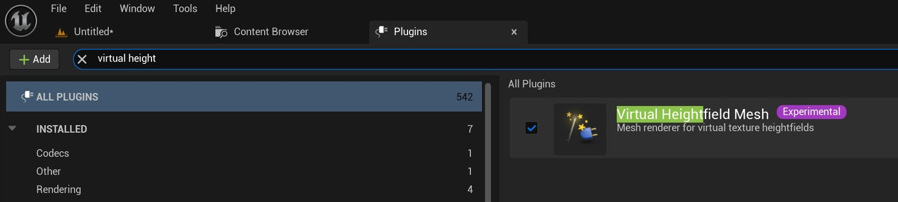
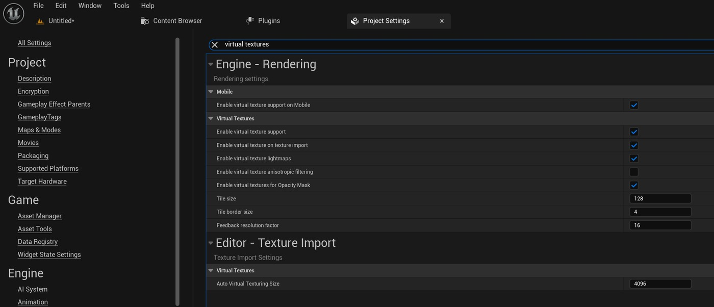
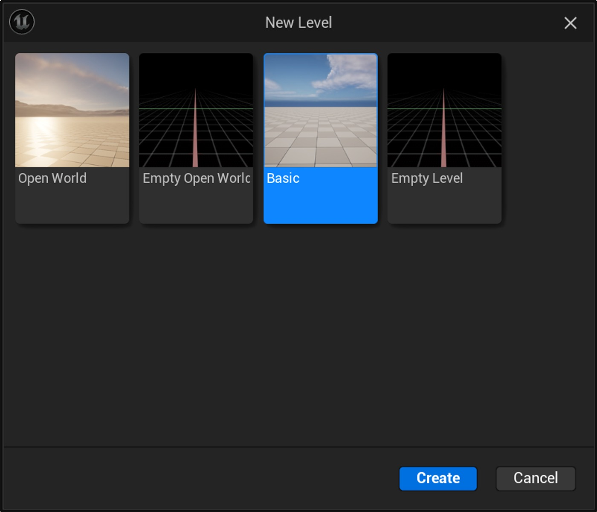
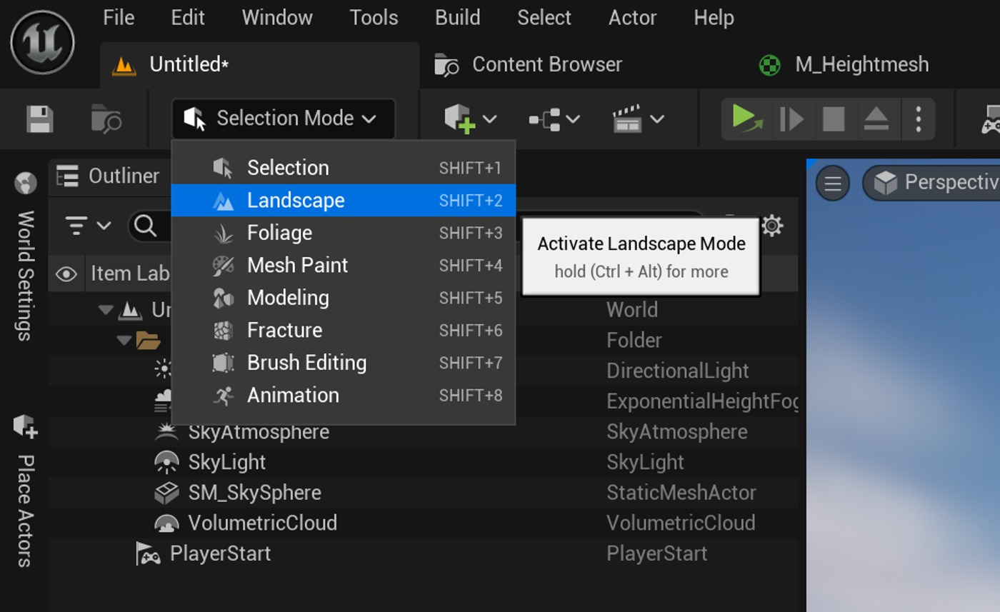
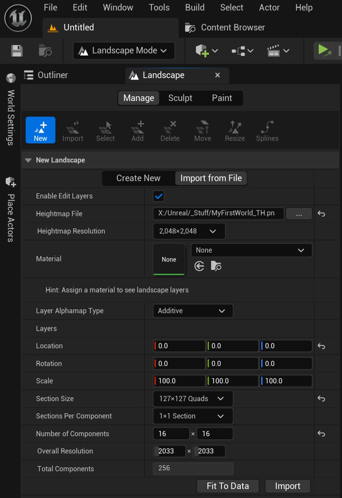
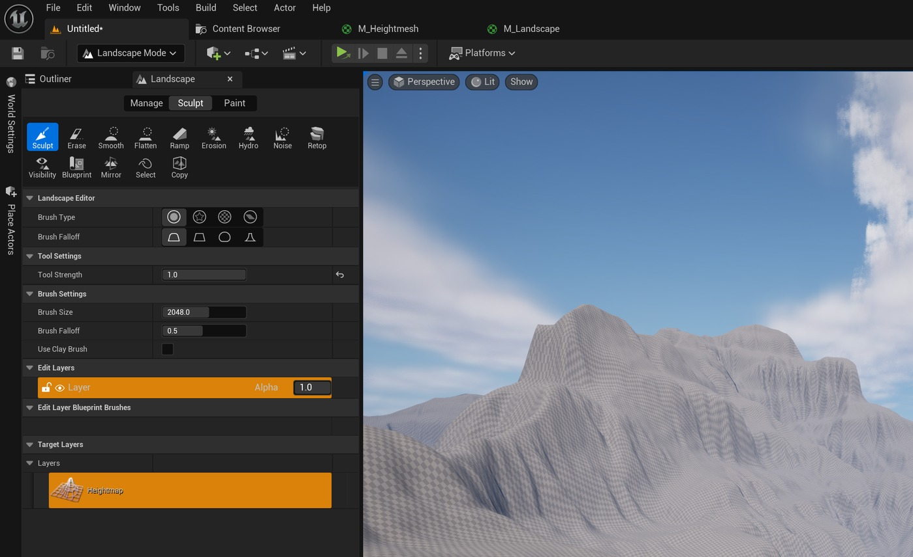
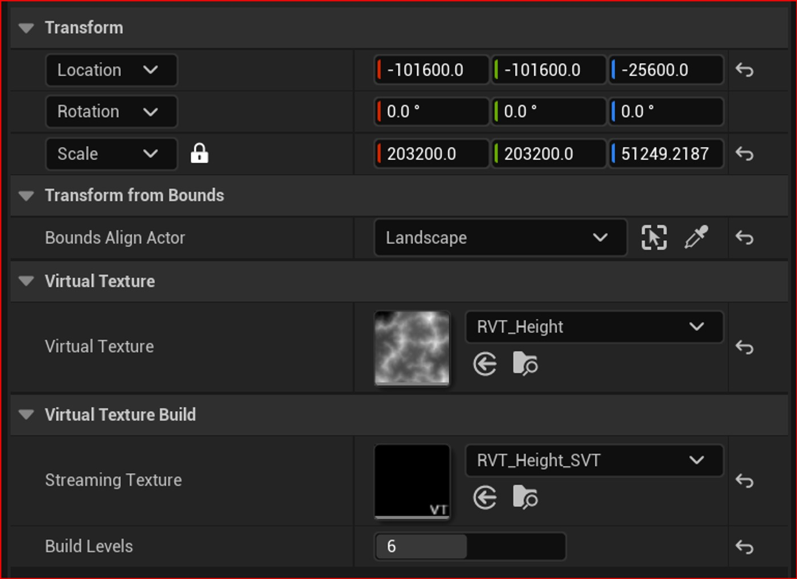

# 使用虚拟高度场网格实现景观。

## 来源与状态

- 原始 URL：https://dev.epicgames.com/community/learning/tutorials/ZZzk/unreal-engine-implementing-a-landscape-with-a-virtual-heightfield-mesh
- 原始文件：unreal-engine-implementing-a-landscape-with-a-virtual-heightfield-mesh.origin.md
- 分段：第 1/3 段

- 原始 URL：https://dev.epicgames.com/community/learning/tutorials/ZZzk/unreal-engine-implementing-a-landscape-with-a-virtual-heightfield-mesh

## 运行时分类

- 类型：图文教程
- 判断：运行时未识别到核心视频信号，可整理正文约 14038 字符。

## 摘要

本教程将描述创建渲染到虚拟高度场网格的景观的步骤。高度场网格是一项实验性功能...

## 中文整理

### 你好！

欢迎来到我的第一个教程；希望你觉得它有用！我们将回顾设置景观的步骤，使其渲染为虚拟高度场网格，以便获得我们都希望从景观中获得可爱的凹凸感和镶嵌效果。具体来说，我们将回顾： - 回顾什么是高度网格 - 设置环境（项目设置和插件） - 设置景观、运行时虚拟纹理 (RVT) 和高度网格 - 创建基本景观材质以渲染到 RVT 中 - 配置组件相互交谈 - 未来的影响、沉思等 请注意，我使用虚幻 5.3 作为我的环境，但机械部分（景观、运行时虚拟纹理卷等）全部出现在 4.26 中，并且配置/工作方式相同。某些选项特定于 5.3（例如，虚拟纹理上的各向异性过滤），但其他设置对于任何版本都是相同的。在本文档的末尾/底部，我提供了一个示例高度图纹理，以方便您使用。

### 什么是高度场网格？

虚拟高度场网格是一种无限细分的网格，人们可以向其提供高度信息，以便它根据驱动它的任何材料而变形（在 Z 轴上）。

创建一个运行时虚拟纹理堆栈来捕获渲染到它的事物的信息，然后该信息由高度场网格读回。

它几乎就像一个美化的渲染目标，但它可以与世界上的对象建立潜在的多对一关系，所有对象都聚合到单个虚拟纹理中，然后渲染到单个网格/物体（高度场网格）。

从机械角度来说，它名义上是平坦的平面，但无论渲染到驱动高度场网格的虚拟纹理中的是什么，该平面都会在 Z 轴上变形（没有 XY 变形，只有高度；在 Z 轴上没有重叠的凹结构）。

这非常有用，因为它可以复制景观的轮廓，直至非常小的细节水平。

由于源是材料驱动的，因此变形对于材料驱动的程序生成非常开放。

此外，由于多个事物可以渲染到运行时虚拟纹理中，因此您可以尝试添加其他事物，例如石头（来自景观草层）与渲染其实际网格。

它们的高度将被聚合到 RVT 中，然后 RVT 会在相同的单一网格中渲染石头的高度。

它对于给定的用例是否有用还有待商榷，但它是它可以做的事情的一部分。

网格具有用于确定曲面细分的密度、各种 LOD 衰减程度等的控件。

它是相当可调的，从我的经验来看，它似乎比传统镶嵌的景观性能更好，总体效果更好（恕我直言）。

在这里，我将设置所有这一切的景观部分以使事情顺利进行。

过去的，我留给读者，或者如果有兴趣的话后续教程。

### 第 1 步 - 设置环境

在使用虚拟高度场网格之前，我们需要在编辑器中启用该功能。由于我们使用的是虚拟纹理，因此我们也需要启用它们。对于虚拟高度场网格，编辑菜单 -> 插件，查找“虚拟高度”，它应该会弹出。根据提示启用并重启编辑器。对于虚拟纹理支持，编辑菜单 -> 项目设置。寻找“虚拟纹理”，它应该会弹出。我在本教程中使用默认值运行。如果出现提示，请重新启动。

### 第 2 步 - 导入景观

使用提供的高度纹理（或您自己的），我们想要创建一个新的景观。创建一个新的基本级别供我们工作：删除地板，我们不需要这个。使用 Shift+2 或从菜单下的下拉列表中选择横向模式进入横向模式：进入横向模式后，单击面板顶部的“从文件导入”。浏览到您选择的高度图文件并设置选项，如下图所示。请注意，此时我们肯定可以分配一个带有命名图层的景观材质，它们会像我们预期的那样显示和工作，但出于本教程的目的，我稍后将制作/分配一个基本材质。另请注意，我已将组件数量从 17x17 设置为 16x16。额外的组件有时可以是围绕导入网格周边的平裙。我们不需要它，因为它会产生额外的成本（而且看起来很糟糕），因此我们可以通过减少组件数量来削减它。否则，对于高度场网格，这些选项并不重要，它们会影响将景观渲染到 RVT 中的成本。总成本的这一部分是独特的，因为它仅与景观相关。在您自己的用例中，您可以使用任何以景观为中心的功能，例如命名图层或诸如此类的材质逻辑，只要材质最终将值推送到 RVT，您就可以在另一侧（在高度场网格中）对它们进行采样。单击“导入”以创建景观。您应该看到类似以下内容的内容（现在也是保存的好时机）：

### 第 3 步 - 添加/配置 RVT

返回选择模式 (Shift+1)，在“放置 Actor”下，查找“运行时”，然后将两个运行时虚拟纹理体积拖到世界中。

由于虚幻引擎跟踪我们需要的信息的方式，我们需要一种来跟踪 PBR 信息（或我们选择推送到其中的任何信息），以及一种来跟踪高度。

从技术上讲，您只需要高度体积来驱动变形。

为了保持跟踪，我将它们重命名为“RVT_Main”和“RVT_Height”。

对于每个项目，在其详细信息面板中，我们需要： - 在“边界对齐 Actor”下拉列表下选择景观 - 在虚拟纹理下，单击下拉列表以创建新资源。

我分别将它们命名为“RVT_Height”和“RVT_Main”。

- 创建 RVT 后，单击“设置边界”按钮以确保 RVT 卷的大小适合景观。

您还可以使用“对齐横向”复选框来协助调整大小（仅供参考，我遇到过此复选框的错误，请预先警告）。

- 在“流纹理”下，将“构建级别”设置为 6（或非零整数），然后单击“构建”按钮。

系统应该提示您保存流纹理，并将字符串“_SVT”附加到您在上一步中为虚拟纹理指定的任何名称。

这样做。

对于 RVT_Height 属性，您应该具有如下所示的内容： 对于 RVT_Main 属性，您应该具有如下所示的内容： 打开 RVT_Height 虚拟纹理对象（您可以在属性面板中双击虚拟纹理）并按如下所示设置属性。

我将在教程的最后深入解释它们的作用，但现在，我们只是将其全部连接起来工作：对于 RVT_Main 虚拟纹理，如下设置其属性：在更改这些属性后，您将需要为任何卷重建流纹理。

否则，更新可能不会生效。

