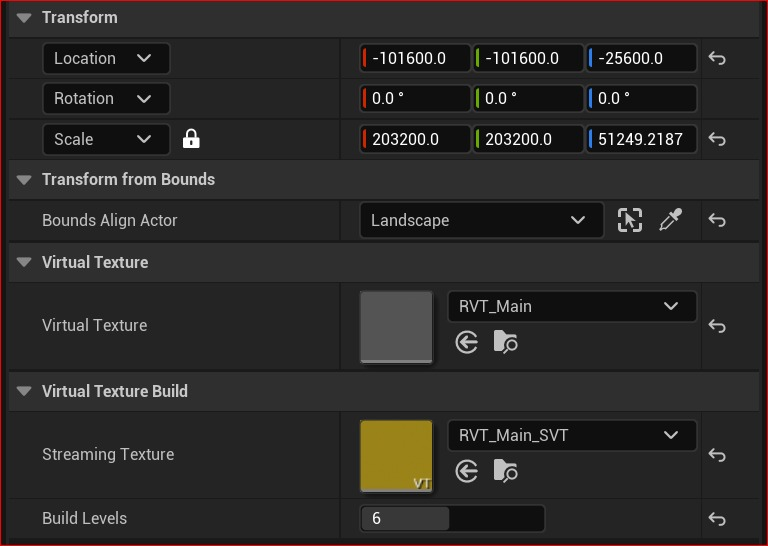
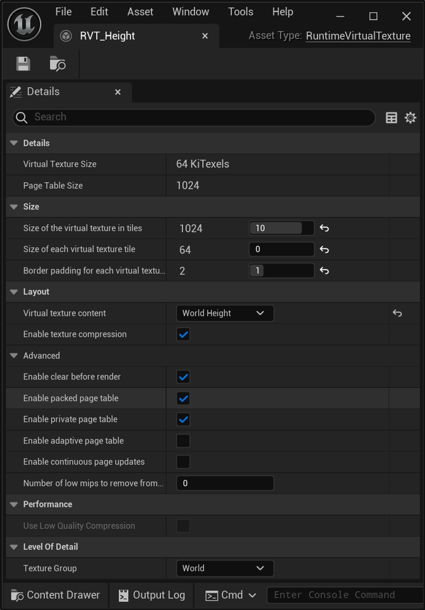
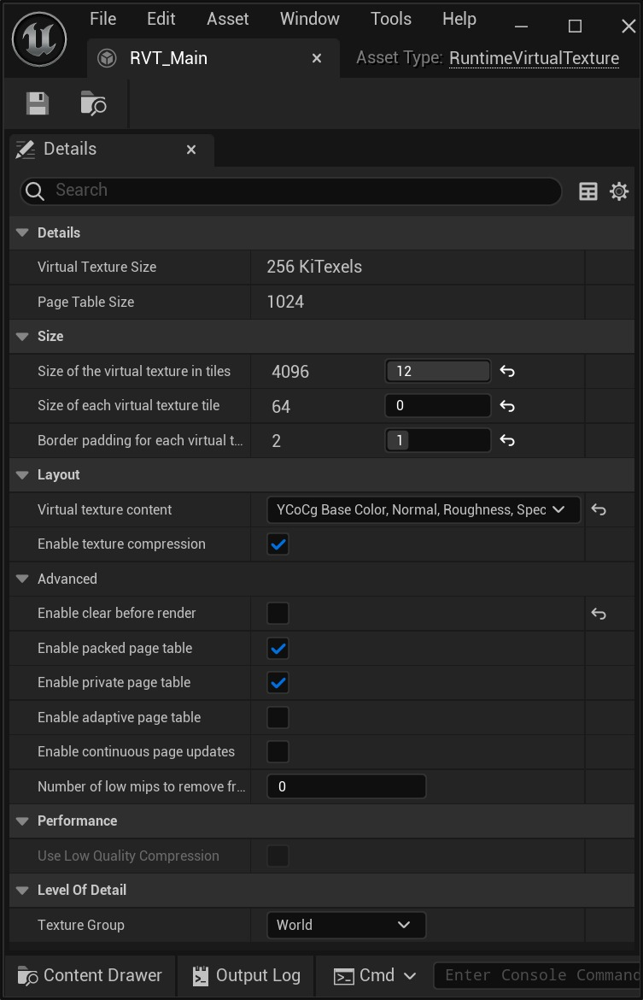

# 使用虚拟高度场网格实现景观。（续 2）

## 来源与状态

- 原始 URL：https://dev.epicgames.com/community/learning/tutorials/ZZzk/unreal-engine-implementing-a-landscape-with-a-virtual-heightfield-mesh
- 原始文件：unreal-engine-implementing-a-landscape-with-a-virtual-heightfield-mesh.origin.md
- 分段：第 2/3 段

### 第 4 步 - 添加/配置虚拟高度场网格

在“放置 Actors”下，查找“虚拟”，然后将虚拟高度场网格拖到世界中。在该高度场网格的详细信息面板中： - 将虚拟纹理设置为 RVT_Height - 单击“复制边界” - 在“高度场构建”下，将“最小最大构建级别”设置为 6，然后单击“构建”，在出现提示时保存创建的对象。可能需要一秒钟。如果您构建 0（所有级别），您将在那里待一段时间... - 确保取消选中“隐藏在编辑器中的演员”框，以便能够在编辑器中看到它 - 我们将在制作它们后回来设置材质（后续步骤） 此时，您应该有一个如下所示的场景：

### 检查点 - 当前状态

快速总结一下我们现在的情况： - 我们创建了一个景观 - 创建了运行时虚拟纹理体积，它将捕获来自该景观的信息 - 创建/配置了要渲染到的这些体积的虚拟纹理 - 创建了虚拟高度场网格并将其绑定到高度 RVT 还有一些配置需要进行，但我们已经有了骨骼。一旦材料到位以实际传播信息，信息就会开始流动。再次，在本文结束时，我将回顾一下实际上在谈论什么。

### 第 5 步 - 附加景观配置

鉴于我们实际上已经创建了虚拟纹理对象，我们可以告诉/配置景观以专门渲染给它们。

此外，我们还有一些额外的配置选项来设置性能。

通常，给定网格上的材质可以输出到（常规）渲染器，但也可以输出到通用 RVT 输出节点。

逻辑实际上特别提供的 RVT 体积不是材质的一部分，它与网格相关联（这就是它的工作原理）。

这有点脱节，但确实提供了一些灵活性，因为输出内容与目的地分离。

人们可以将对象渲染到多个目标，具体取决于事物的逻辑，并且材质将无法跟踪它，使用该材质的所有事物都会到达相同的位置，除非您为每个网格创建不同的材质......

选项增加了复杂性，但它们也为您增加了更多表达/实现想法的方式。

也就是说，在景观的详细信息面板中： - 在“虚拟纹理”下，单击“+”以添加两个条目。

将它们分配给我们之前创建的 RVT_Main 和 RVT_Height 对象。

这将告诉景观要渲染到哪些特定 RVT。

- 将“在主通道中绘制”设置为“从不” - 如果您运行的是 5.3，您还可以检查/启用“使用 Quad 进行虚拟纹理渲染”（性能） - 在光照下，检查隐藏阴影。

由于我们没有在主通道中绘制，因此我们仍然需要阴影 - 在碰撞下，选中“将材质位置偏移烘焙到碰撞中”复选框 - 在景观下，将“正 ZBounds 扩展”设置为 50。

关于照明，由于景观将被隐藏，但在照明的主通道中渲染（隐藏阴影），我们不需要实际将其渲染到屏幕，只需渲染到 RVT，因此将其“关闭”。

烘焙碰撞是可选的，但如果您想要任何碰撞等，您推动材料进行碰撞，请确保选中此项。

高度场网格不提供碰撞，我们需要依赖底层景观来实现这一点。

因此，凹凸，无论你的材料中出现什么，如果你希望它在世界上表达出来，请选中该框。

您当前的值集应如下所示：

### 第 6 步 - 材料

每个人都喜欢的有趣部分：材料！

我使用示例鹅卵石纹理集作为基础。

制作以下两种材料。

一张是为了风景。

这将捕获基本的 PBR 信息以及高度。

变形的处理方式与在曲面细分中使用变形时的处理方式相同，您可以按照自己的意愿进行计算。

请务必将其添加到景观的 Z 值（WorldPosition 节点）的顶部，以便穿过高度场网格的值与景观提供的碰撞对齐。

如果您希望高度更好地沿着表面包裹，请将其乘以 VertexNormalWS 的 Z 轴（我目前在下图中将其断开）。

由于可以直接在景观上使用 WPO 并向高度场网格提供您想要的“任何”值，因此可能会发生剪切。

鉴于变形往往会向上/远离景观位置，因此对于雪、沙子或浅水等物体可能是理想的。

请注意此行为，正如预期的那样。

高度场网格不提供碰撞，并且在景观材质中，对于 WPO 到景观材质的高度一，以及通过管道传输到 RVT/高度场网格的任何内容，有多个“输出”。

因此，这些价值观似乎是可以被明显操纵的。所以请注意。

正如我之前所说，选择是好的。

对于虚拟高度场网格，创建以下材质。

确保将 RVT Sample 节点设置为 RVT_Main 虚拟纹理。

网格的实际变形/高度是由我们之前创建的 MinMax 纹理驱动的；高度与我们从 RVT Sample 节点获得的高度分开。

在本材料中，我们可以获得我们选择放入 PBR 通道的任何信息。

我们还可以读取高度，以便在我们想要的任何数学中使用，以便为混合蒙版或其他东西制作渐变，但它是只读的，它实际上不会影响网格的高度。

在这个特定的区域（高度场网格的材质）中，它严格来说是显示层；变形通过另一个 RVT 并行发生。

做这个：

### 第7步-中提琴！

将材质应用到各自的对象上，您应该会看到这样的东西！您可能需要重建虚拟纹理并查看线框模式，Alt+2。

### 审查

漂亮，嗯！让我们回顾一下...我按照我所做的顺序运行了配置，以显示网格/对象是如何相互配置的，然后是材料以显示这些值是如何实际读出的。只要所有不同的部分最终都指向彼此，它最终就会起作用，无论你以什么顺序连接东西。总而言之，不一定在上述工作顺序中： - 创建景观、运行时纹理体积、运行时纹理和虚拟高度场网格 - 对于景观： - 创建一个材质以将 PBR 和高度信息提供给 RVT - 将景观网格绑定到 PBR 和高度 RVT - 关闭景观网格的渲染/显示 - 对于高度场网格： - 创建一个材质来读取要绘制的 PBR 信息 - 将其绑定到高度 RVT 并构建一个 MinMax 纹理以获取高度信息 这就是必需品；其实并没有那么努力。核心部分是知道如何提供中间虚拟纹理。您可以使用任何网格或多个网格来喂养它们，在本例中我们使用的是景观。另一方面，我们使用高度网格来显示景观，但任何网格都可以读取 RVT。事实上，要将网格与景观混合，您就可以这样做。

### 额外的想法

解释一些我掩盖的事情。在步骤 3 中，我提供了虚拟纹理的属性、包含虚拟纹理大小、页表大小、图块计数等的对话框。详细信息显示总体纹理元素计数、虚拟纹理的密度。这些值是衍生值，会影响可用内容的清晰度/清晰度...

### 结局

## 相关链接
