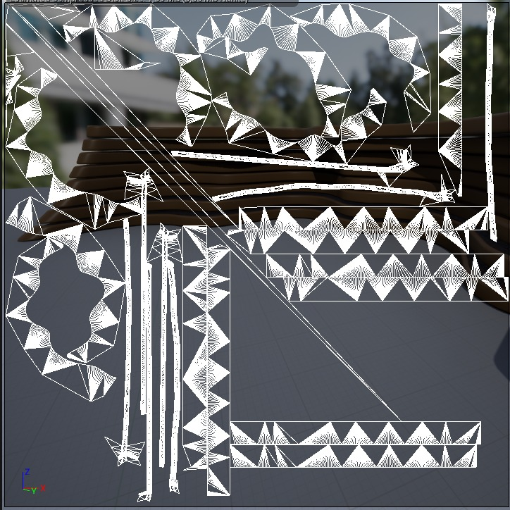
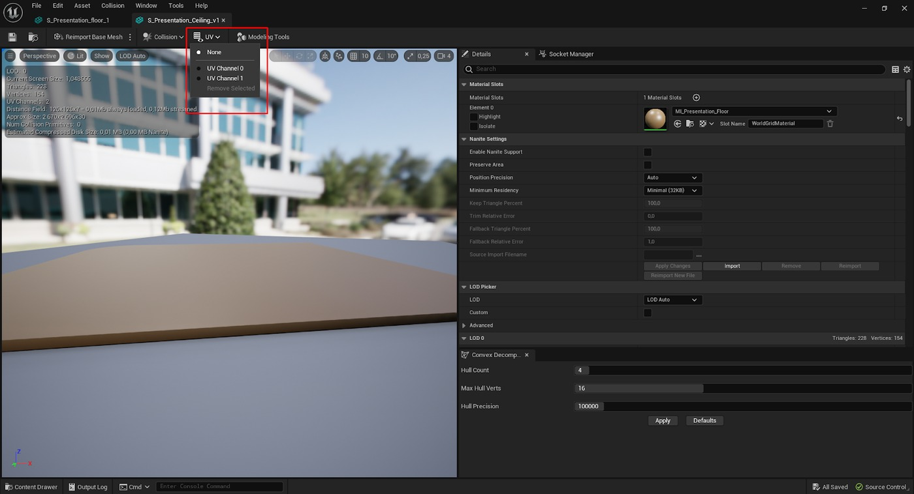
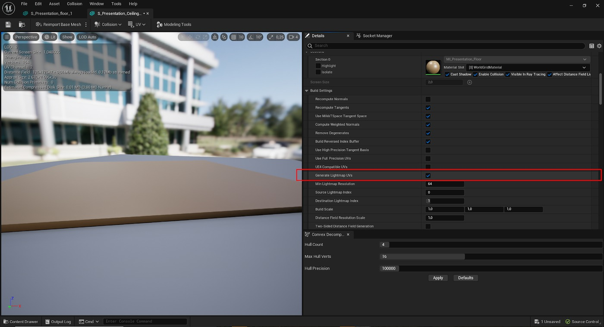
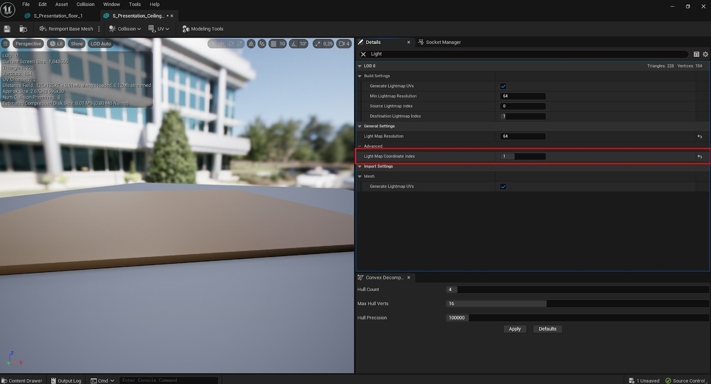
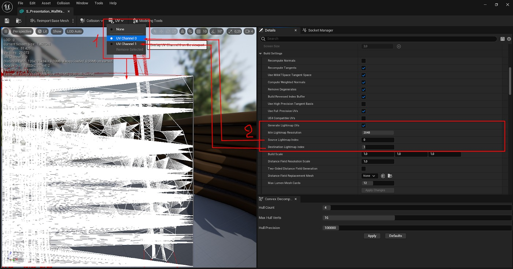
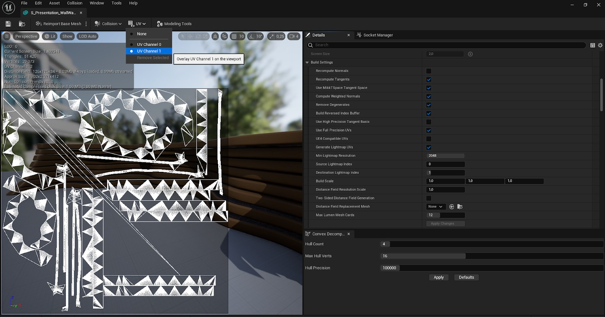
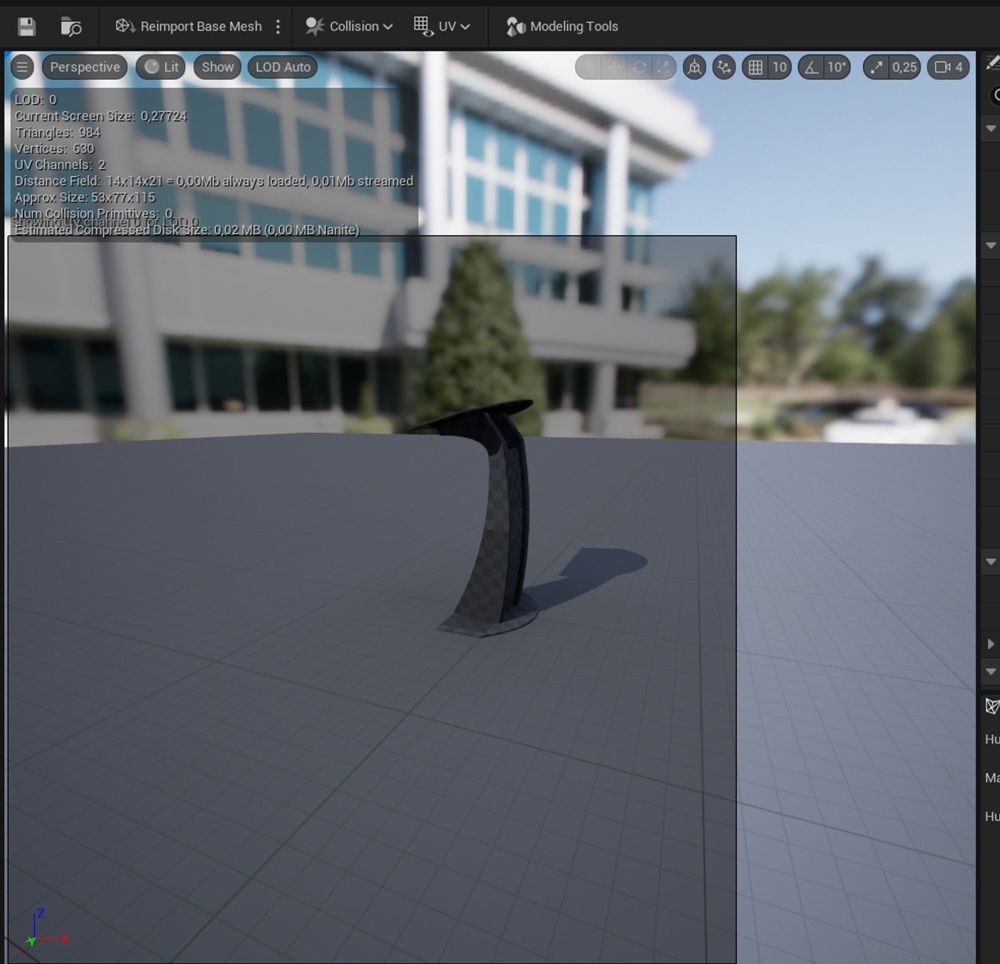
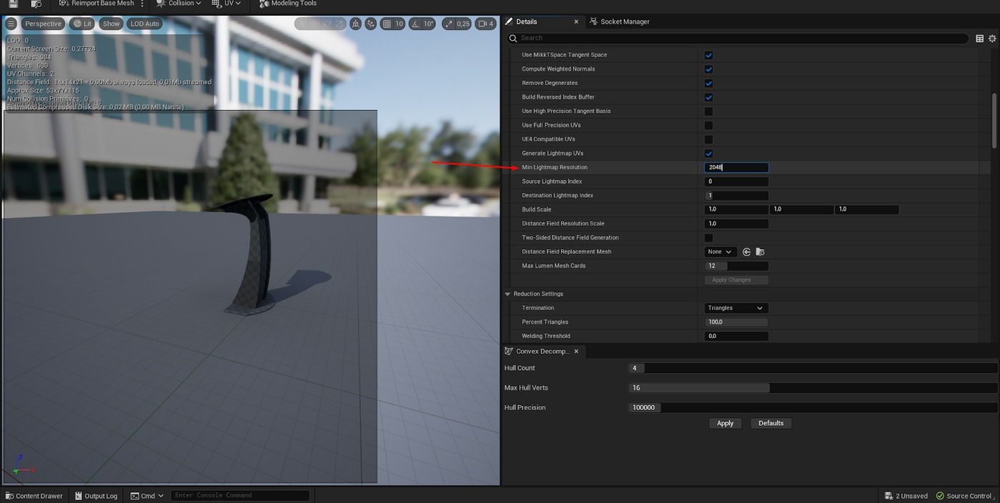
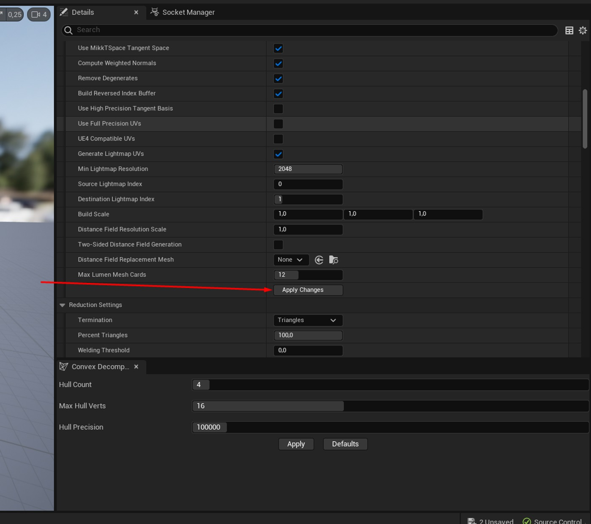
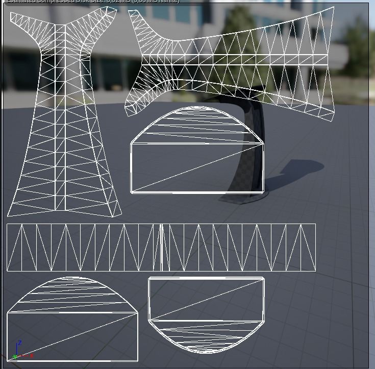

# 光烘焙和光照贴图：UE 分步指南（续 2）

## 来源与状态

- 原始 URL：https://dev.epicgames.com/community/learning/tutorials/KPOx/unreal-engine-light-baking-and-lightmaps-a-step-by-step-ue-guide
- 原始文件：unreal-engine-light-baking-and-lightmaps-a-step-by-step-ue-guide.origin.md
- 分段：第 2/3 段

值得注意的是，这些值不一定必须是 2 的倍数；您可以将它们调整为 3000、2500、2800 等值。

为了获得最高质量，您应该使用更密集的光照贴图渲染更靠近相机的对象。

也就是说，它们应该是红色的。

这会增加光照计算时间；然而，这些物体上的烘焙光质量也很高。

此外，值得注意的是，烘焙过程完成后，我们还可以看到指示“光照贴图重叠 ___%”的错误以及网格列表和光照贴图重叠量的百分比。

因此，引擎将指示哪些网格体具有光照贴图重叠以及重叠的百分比。

因此，在场景中光照贴图重叠的区域中，将会出现伪影。

在这种情况下，需要对光照贴图进行调整：增加最小光照贴图分辨率、手动创建光照贴图或分割网格。

### 烘焙光

### 项目设置和关键参数

我们需要启用 RT 和 GPU Lightmass 插件：

### 灯光预可视化

开始场景时，您可以利用 Lumen 进行基本照明设置。

这使您可以直观地看到最终烘焙结果的近似值，包括光强度、阴影等。

重要的是要了解，某些照明效果无法使用 Lumen 准确实现，例如模拟 LED 灯条背光。

您还应该记住，具有烘焙光照的场景不支持 Nanites，这意味着所有资源都将在没有 Nanites 的情况下进行编译。

此外，Lumen 主要设计用于与 Nanites 配合使用，禁用它们可能会导致轻微的阴影故障。

但是，这不会显着影响照明场景的整体预可视化 - 这只是一般观察。

要启用 Lumen，请创建一个单独的子级别，您可以将其命名为 _RealTime 或 _Lumen。

前缀应该是LSL_（意思是Light Sublevel）。

场景中放置的所有光源都必须放置在该特定子级别内。

同时，几何体、效果、相机和预览应放置在其他子级别上。

将所有光源放置在该特定子级别内可确保更轻松的工作流程。

例如，如果利益相关者/创意人员批准视觉照明组合，我们可以轻松复制此子级别并将其配置为烘焙。

在流明子关卡中，您可以将光源设置为“静态”，这将节省烘焙关卡转换期间的时间。

在上面的屏幕截图中，以光源设置为“可移动”为例。

但是，在使用烘焙光照时，您需要将它们更改为“静态”。

使用 Lumen 时，至关重要的是在子关卡中设置 PostProcessVolume (PPV)，将其设置为“Unbound”（影响整个关卡）并配置为 Lumen 渲染：通过切换 Lumen 子关卡的可见性，我们可以使用多个照明设置并向利益相关者展示场景的外观，而无需在烘焙上浪费时间。

这种方法显着减少了工作时间，并且允许我们只有在特定的照明方案获得批准后才能继续进行烘焙配置。

重要提示：在PostProcessVolume中，我们需要将曝光设置为“Manual”并将值设置为1。

这将帮助我们调整现实世界中的灯光亮度。

此外，我们应该禁用“应用物理相机曝光”。

### 配置和利用光烘焙的级别层次结构

一旦照明场景 (LS) 获得批准，我们就可以继续设置烘焙级别。最快的方法是使用 Lumen（或实时光照）复制 LSL，将其添加到关卡结构中，然后将其切换到烘焙模式。我们还需要激活“LightScenario”选项（“Levels”选项卡中的灯泡图标）：然后我们重命名新的 LSL，删除“_Realtime”后缀并简单地添加照明方案的名称（通常是一天中的时间，但可以是任何名称）。接下来，要激活烘焙模式，选择 PPV 并在设置中将全局照明 (GI) 和反射设置为“无”： 如果一切正确完成，视口中的照明将立即发生变化（将变得更暗），并且您将看到一条静态通知，提示“照明需要重建”： 如果照明发生变化但未出现通知，请确保将视口设置为显示静态数据（如果已启用但未出现通知，只需将其打开和关闭即可）再次）。您还应该将所有光源（包括天窗）切换为“静态”。有些可以根据需要设置为“Stationary”来调整其亮度和颜色。需要注意的是，设置为“静态”的天光在光线烘烤后才会起作用。每个级别可以有多个照明场景。例如，根据变化...

### GPU Lightmass：设置和使用

### 模式：

### 去噪：

### 全局照明：

### 设置：

### 场景设置

### 将发射材质参数配置为光源

### 全局照明 (GI) 设置

### 光源设置

### 烘焙照明的反射设置

### 结论

## 相关链接
