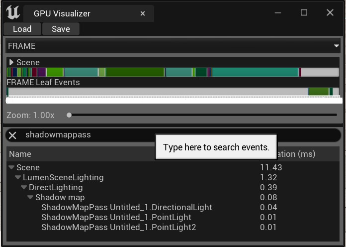
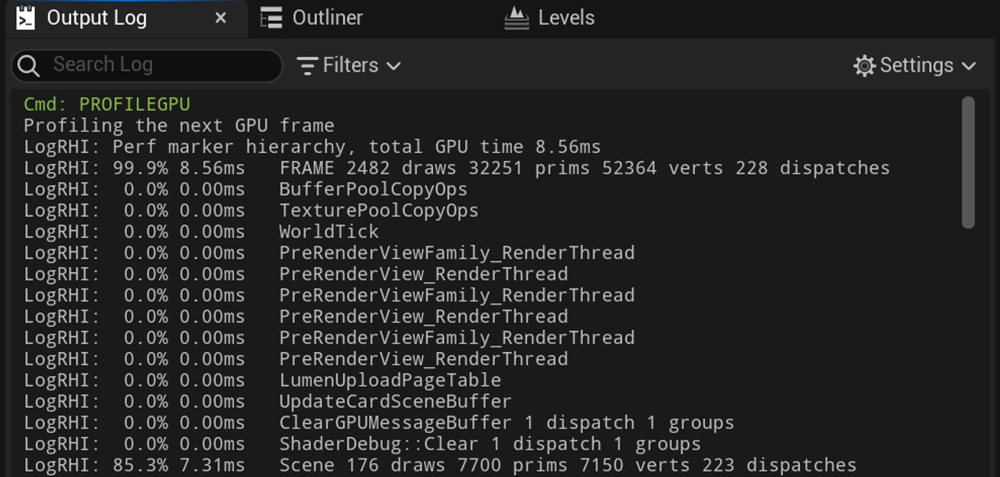
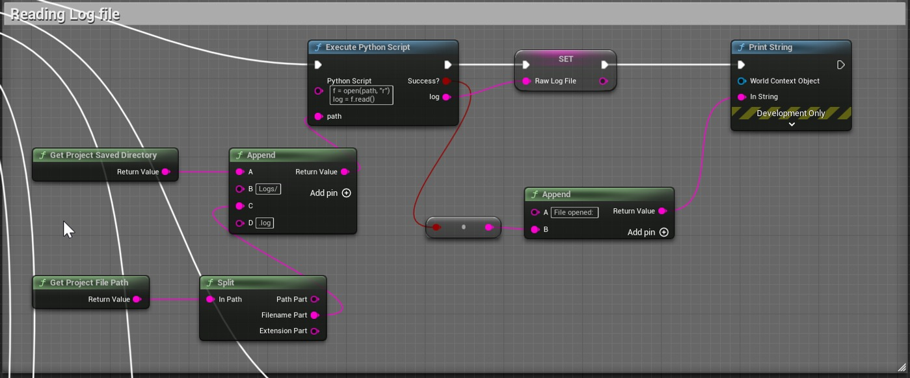
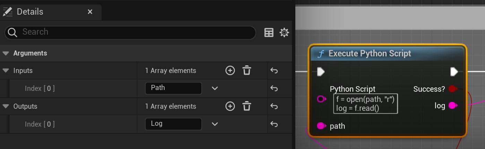
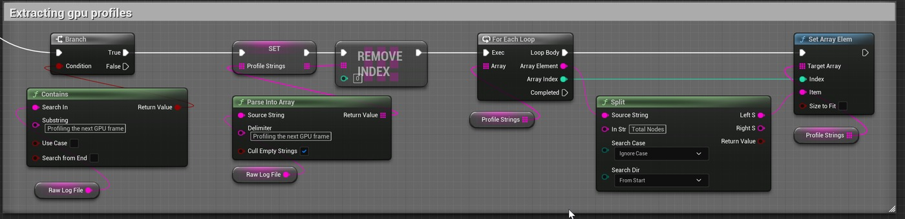
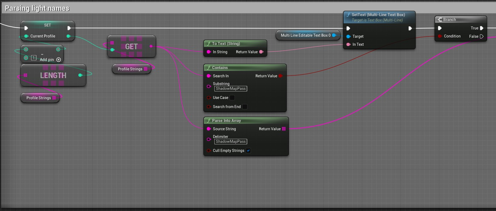
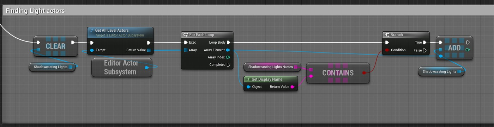
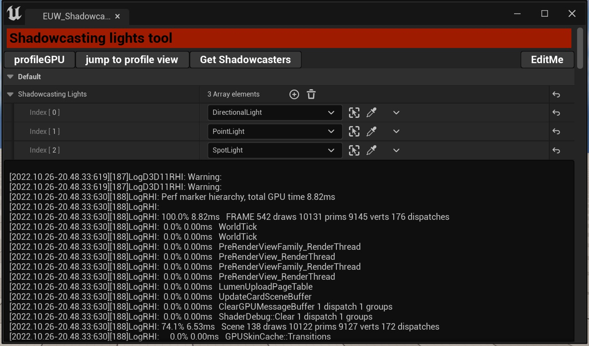
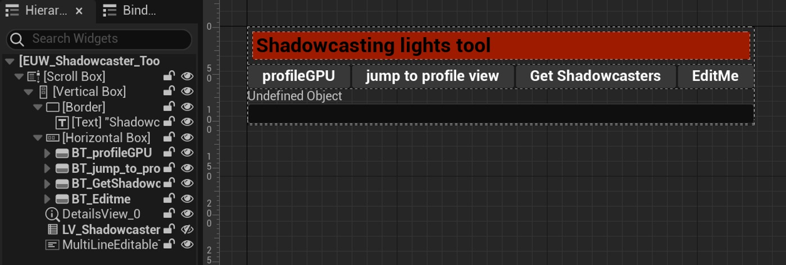

# 列出阴影投射灯

## 来源与状态

- 原始 URL：https://dev.epicgames.com/community/learning/tutorials/bJ8d/unreal-engine-listing-shadowcasting-lights
- 原始文件：unreal-engine-listing-shadowcasting-lights.origin.md
- 分段：第 1/2 段

- 原始 URL：https://dev.epicgames.com/community/learning/tutorials/bJ8d/unreal-engine-listing-shadowcasting-lights

## 运行时分类

- 类型：图文教程
- 判断：运行时未识别到核心视频信号，可整理正文约 7561 字符。

## 摘要

免责声明 UE5.1 本教程部分已过时。 Epic 更改了 profileGPU 列出阴影投射灯光的方式，因此方式略有变化......

## 中文整理

### 问题

随着虚幻引擎 5 引入 Nanite 和 Lumen，总体性能成本比以往更多地转向照明。对于大型场景，大量灯光照亮您需要一种方法来管理大部分照明成本：阴影投射。虽然有几种方法可以在虚幻编辑器中列出当前渲染的阴影投射灯光，但它们都不是开箱即用的，也无法提供易于访问的数据。您要么必须使用 Unreal Insights（第三方分析软件，例如 Nvidia Nsight），要么使用内置的 GPU 分析器。即使如此，您最多也会了解这些灯的名称，并且必须手动找到它们。

### 为什么这很重要？

在给定的场景中，实际渲染和阴影投射的灯光通常比您看到的要多得多。这是因为虚幻的遮挡算法不是很激进。有多种方法可以隐藏或禁用它们，但它们都需要一些额外的脚本和/或校准。在不知道当前渲染和阴影投射的灯光的情况下，您只能猜测。解决方案：一个基于蓝图的工具，可收集阴影投射光并提供 UI 来管理它们。

### 概括

这个问题的解决方法非常简单，因为它只是读取引擎中已经存在的数据（如果您知道在哪里查找）。令人惊讶的是，您必须通过后门才能到达它： - profileGPU 命令将帧渲染数据输出到 output.log 文件中。 profileGPU命令将帧渲染数据输出到output.log文件中。 - 使用Python将output.log文件的内容读取到实用程序小部件蓝图中 使用Python将output.log文件的内容读取到实用程序小部件蓝图中 - 通过多个字符串解析提取shadowmappass灯的名称并找到相应的演员。通过多个字符串解析提取shadowmappass灯光的名称并找到相应的演员。就是这样！唯一具有挑战性（稍微）的部分是如何自动化该过程，以便您只需单击两次即可获得所需的内容。

### 先决条件：

- UE4 启用了 python 脚本和实用小部件蓝图插件。 （两者都预装了虚幻 UE4，并启用了 python 脚本和实用程序小部件蓝图插件。（两者都预装了虚幻 - 实用程序小部件蓝图脚本的基本知识。实用程序小部件蓝图脚本的基本知识。

### 教程

### 第 1 部分：读取文件

通过运行 profileGPU (Ctrl+Shift+Comma) 控制台命令，您将看到一个窗口，该窗口详细介绍了单帧中 GPU 上发生的情况。 （Epic 告诉我们的那个被 Insights 取代了……事实证明并非所有事情都如此；）这是我们的信息来源。您可以在此处的虚幻前端部分中阅读它：https://docs.unrealengine.com/4.27/en-US/TestingAndOptimization/PerformanceAndProfiling/GPU/ 虽然它向我们显示了阴影投射光源的名称（在搜索栏中输入shadowmappass），但无法访问它们。幸运的是，profileGPU 将其结果写入输出日志，然后将其写入日志文件。输出日志文件位于/Saved/Logs。有两个有用的节点可自动获取该路径：获取项目保存目录和获取项目文件路径。我们将两者的结果组合起来形成一个文件路径字符串。要读取 unreal 中的文本文件，我们将使用一个简单的 Python 脚本： f = open(path, "r") log = f.read() 要从 python 传递和接收数据，请使用输入和输出参数：

### 第 2 部分：提取 profileGPU 数据

原始日志文件变量包含整个输出日志作为字符串。首先我们必须检查它是否包含任何 profileGPU 数据。我们可以使用 Contains 节点并将“分析下一个 GPU 帧”关键短语作为子字符串参数来完成此操作。如果找到我们就可以继续解析。使用 Parse Into Array，我们将字符串至少分成两部分：第一部分包含分析之前的所有内容，第二部分包含分析 GPU 以及之后的所有内容。如果日志文件中有多个配置文件，则生成的数组将包含 +1 个元素。让我们删除第一个元素，因为它没有 profileGPU 信息。每个配置文件都以“总节点”关键字结尾，因此我们删除其右侧的所有内容。现在，每个配置文件字符串元素仅包含分析数据。

### 第 3 部分：查找阴影贴图通道

本部分包含与 UE5 和 LumenSceneLighting 通道相关的关键词。 UE4 和 UE5 旧版光照对于 profileGPU 具有不同的结构，因此您必须使用不同的关键字来查找灯光。使用“ShadowMapPass”关键字解析整个字符串。与我们对配置文件所做的类似，删除第一个元素。您将得到如下内容： ShadowMapPass LevelName.LightActorName 1dispatch 1 groups LogRHI: 0.0% 0.01ms 如果您在第一个点 (.) 符号处将其拆分 - 右侧将从 LightActorName 开始。你快到了。在第一个空格符号处拆分生成的字符串，您将留下演员姓名。最后一件事是获取所有灯光演员，并用字符串名称数组交叉检查它们是否匹配。

### 第 4 部分：添加 UI

（本节假设您具有使用 UMG 的基本知识）为了简化和自动化该过程，我们将制作一个实用程序小部件。

### 运行分析器
