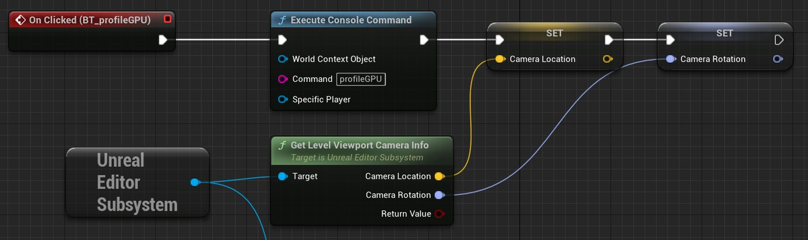

# 列出阴影投射灯（续 2）

## 来源与状态

- 原始 URL：https://dev.epicgames.com/community/learning/tutorials/bJ8d/unreal-engine-listing-shadowcasting-lights
- 原始文件：unreal-engine-listing-shadowcasting-lights.origin.md
- 分段：第 2/2 段

您可以使用控制台命令 profileGPU 或 Ctrl+Shift+ 来运行探查器，我们将使用“执行控制台命令”蓝图节点：这将启动探查器，并在一两秒后打开 GPU 可视化器窗口。您可能已经注意到，在分析之后我立即存储当前的相机变换。这是为了防止我移动相机并且想要返回到捕获个人资料的位置。跳转到剖面视图将视口相机置于存储的变换中。此功能在许多不同的情况下都很有用，因此请记住它。 Get Shadowcasters 按钮执行本教程的主要脚本。 EditMe 按钮是我添加到所有实用小部件中的按钮。它的功能非常简单：它在实用程序小部件编辑器中打开小部件。它的用途与大多数窗口中存在的“浏览资源”功能相同。这样，每当我想要进行一些编辑时，我就不必在资源浏览器中搜索小部件。

### 演员名单

在实用程序小部件中显示参与者引用的方法很少。在这里，我使用一个简单的详细信息视图小部件，但我还实现了一个列表视图。列表视图可以显示额外的信息，例如到每个灯光的距离，或添加功能，例如选择演员而无需相机放大。详细信息视图是显示和编辑实用程序小部件属性的最简单方法。您只需要指定要查看的对象属性（在本例中为 Self）和属性名称（ShadowcastingLights，即 actor 数组的名称）。如果我想在不滚动输出日志窗口或打开日志文件的情况下检查某些内容，我还添加了一个 MultiLineEditableTextBox 来显示我的配置文件字符串的内容。您可以将一个高的小部件放入滚动框面板中以滚动其内容。每当您使用小部件时，请尝试在构造脚本中执行某些功能。在本例中，我正在运行几乎整个脚本。它使我不必每次进行一些更改并重新编译蓝图时都按“获取 Shadowcasters”按钮。就是这样！您可以通过这种方式从 profileGPU 和输出日志文件中提取更多内容。运行 r.DumpRenderTargetMemory 将输出渲染目标大小，您可以使用它来优化 VRAM 使用。 Memreport 命令将创建一个包含内存信息的完整单独的文本文件。如果本教程对您有帮助或者有什么不清楚的地方，请在评论中告诉我。您也可以通过 jacek.jerzy.maj@gmail.com 联系我。 - 照明 -

蓝图 - python - 性能和分析 - 实用小部件

## 相关链接

- [Problem](https://dev.epicgames.com/community/learning/tutorials/bJ8d/unreal-engine-listing-shadowcasting-lights#problem)
- [Why does that even matter?](https://dev.epicgames.com/community/learning/tutorials/bJ8d/unreal-engine-listing-shadowcasting-lights#whydoesthatevenmatter?)
- [Summary](https://dev.epicgames.com/community/learning/tutorials/bJ8d/unreal-engine-listing-shadowcasting-lights#summary)
- [Prerequisites:](https://dev.epicgames.com/community/learning/tutorials/bJ8d/unreal-engine-listing-shadowcasting-lights#prerequisites:)
- [Tutorial](https://dev.epicgames.com/community/learning/tutorials/bJ8d/unreal-engine-listing-shadowcasting-lights#tutorial)
- [Part 1: Reading the file](https://dev.epicgames.com/community/learning/tutorials/bJ8d/unreal-engine-listing-shadowcasting-lights#part1:readingthefile)
- [Part 2: Extracting profileGPU data](https://dev.epicgames.com/community/learning/tutorials/bJ8d/unreal-engine-listing-shadowcasting-lights#part2:extractingprofilegpudata)
- [Part 3: Finding shadowmap passes](https://dev.epicgames.com/community/learning/tutorials/bJ8d/unreal-engine-listing-shadowcasting-lights#part3:findingshadowmappasses)
- [Part 4: Adding UI](https://dev.epicgames.com/community/learning/tutorials/bJ8d/unreal-engine-listing-shadowcasting-lights#part4:addingui)
- [Running the profiler](https://dev.epicgames.com/community/learning/tutorials/bJ8d/unreal-engine-listing-shadowcasting-lights#runningtheprofiler)
- [Actors list](https://dev.epicgames.com/community/learning/tutorials/bJ8d/unreal-engine-listing-shadowcasting-lights#actorslist)
