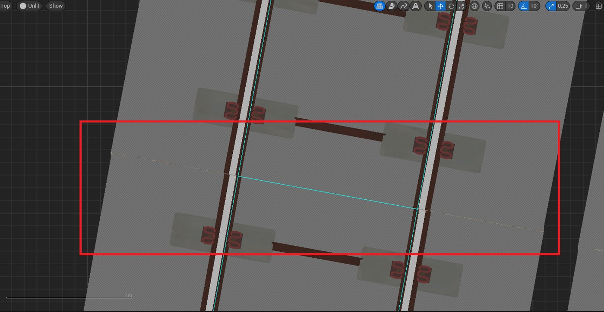
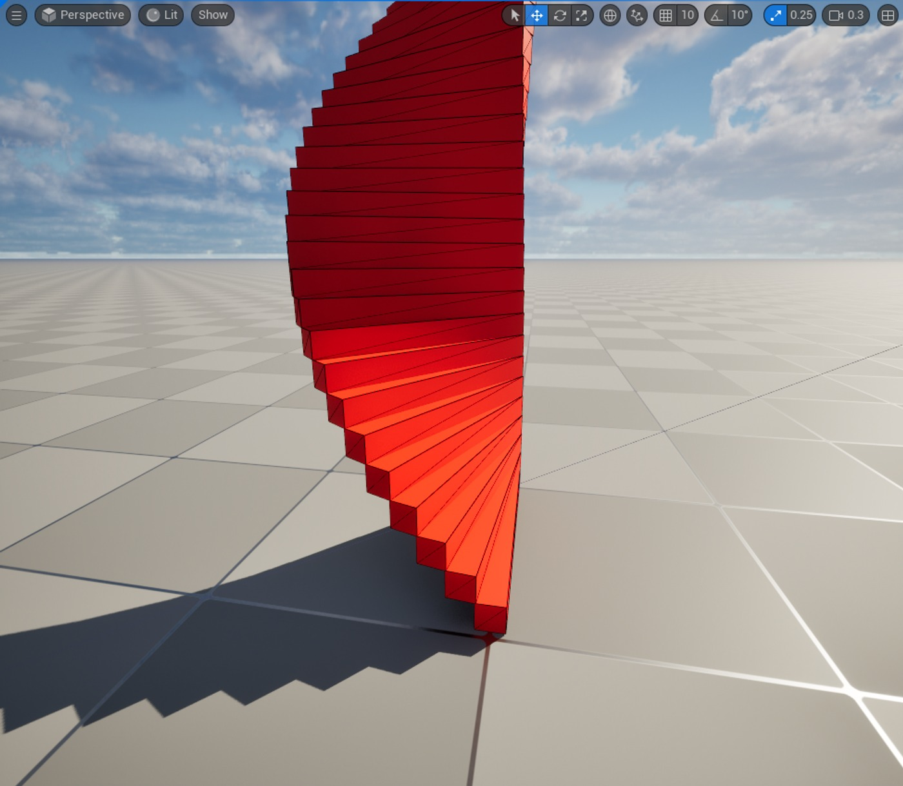
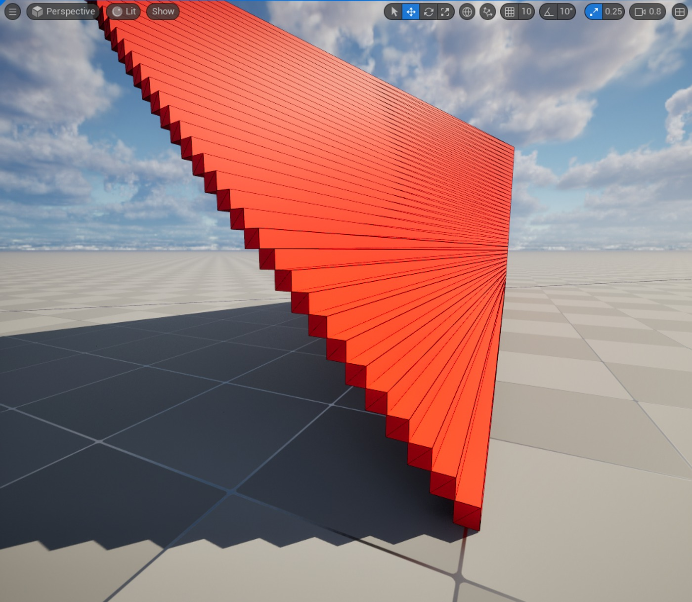
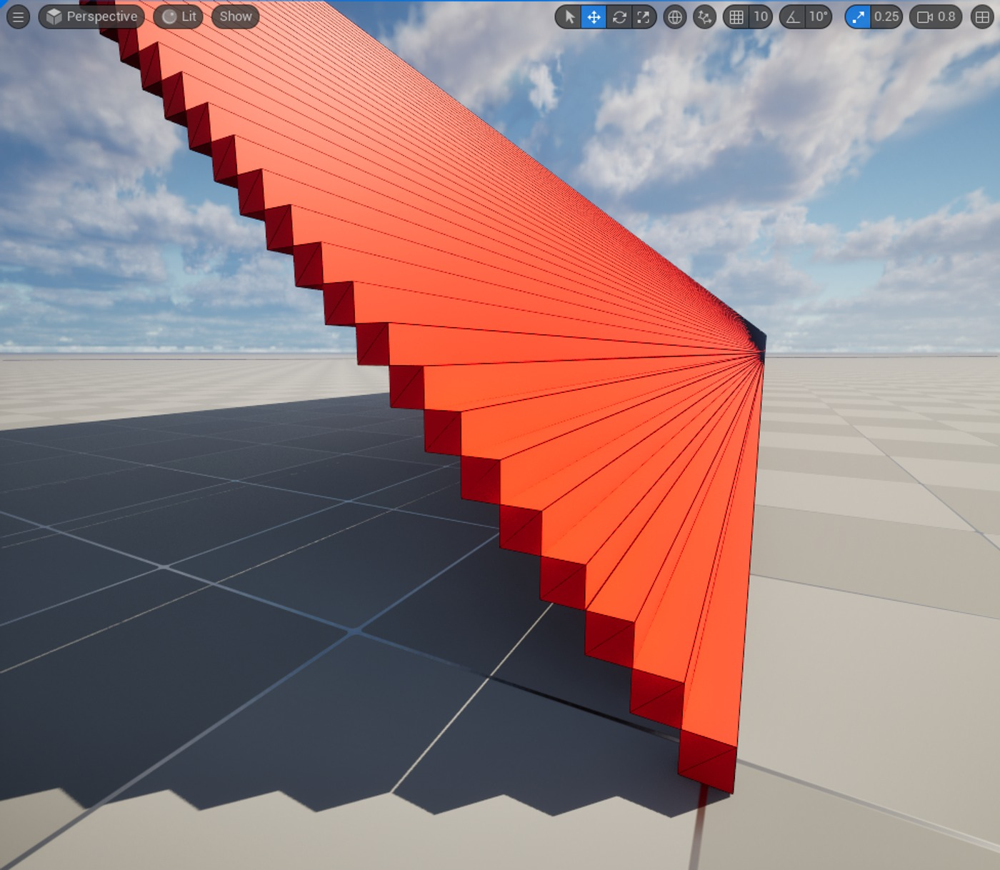
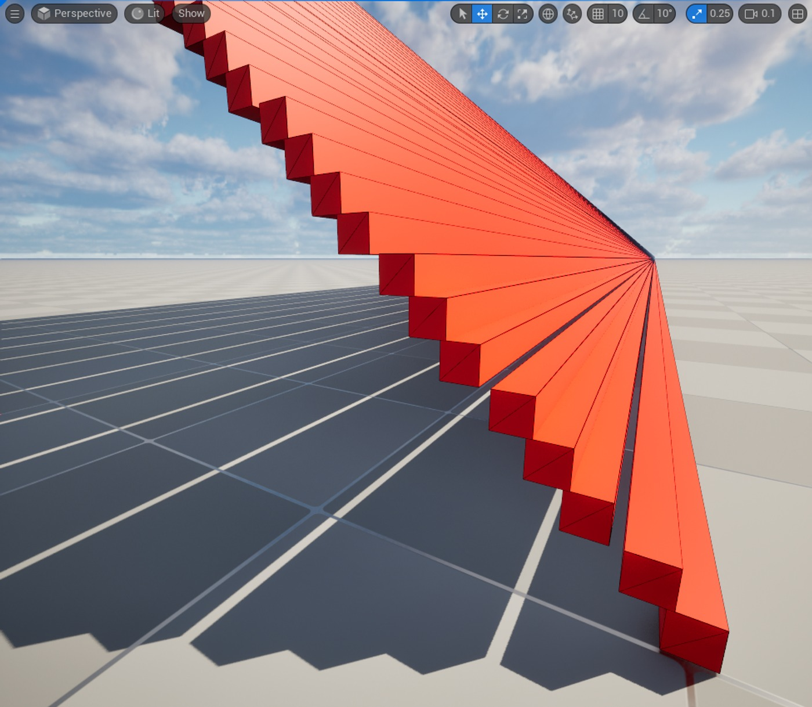
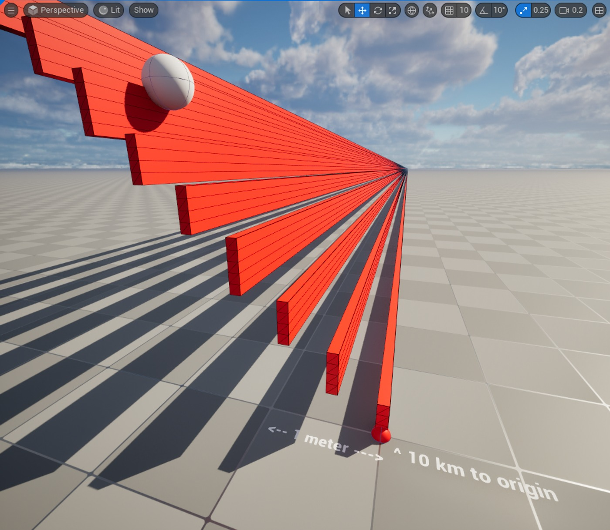
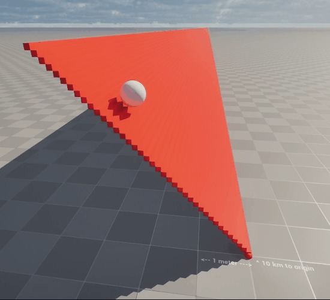
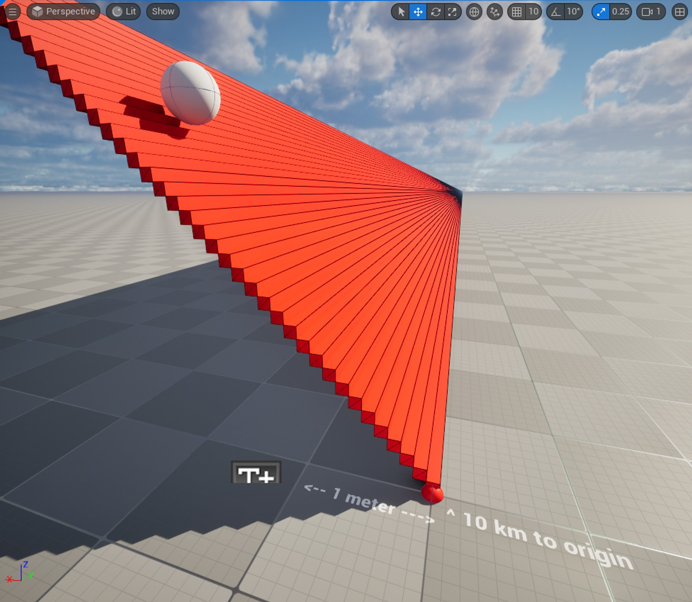
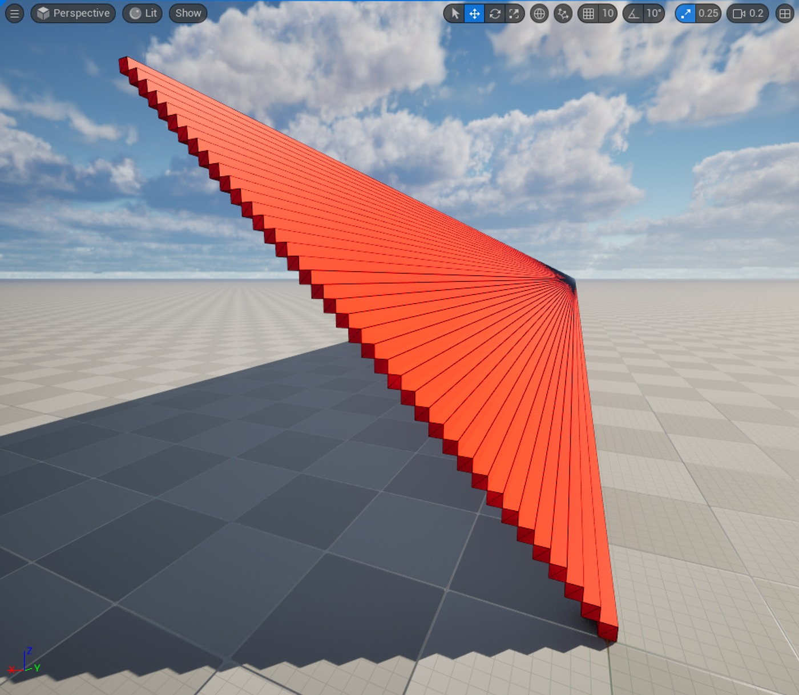

# LWC - “真正高”精度旋转

## 来源与状态

- 原始 URL：https://dev.epicgames.com/community/learning/tutorials/3JZ6/unreal-engine-lwc-really-high-precision-rotations
- 原始文件：unreal-engine-lwc-really-high-precision-rotations.origin.md
- 分段：第 1/2 段

- 原始 URL：https://dev.epicgames.com/community/learning/tutorials/3JZ6/unreal-engine-lwc-really-high-precision-rotations

## 运行时分类

- 类型：图文教程
- 判断：运行时未识别到核心视频信号，可整理正文约 7583 字符。

## 摘要

关于虚幻中的变换压缩以及如何通过旋转保持正确的精度水平的解释！

## 中文整理

### 介绍

虚幻引擎 5 在许多数学基元（如向量、矩阵等）中引入了对双精度的支持。大世界坐标系统（又名 LWC）使渲染管道能够准确渲染网格，即使远离原点也是如此。在游戏线程上，浮点数现在使用 64 位，这提供了前所未有的精度，不仅对于大数字，而且对于小数字，仍然具有出色的性能。为了在渲染方面保持较高的性能，我们通过启用变换压缩做出了一些优化选择。在一些非常罕见的边缘情况下，这些选择可能会产生一些我们仍然希望控制的不良影响。在本文中，我们将了解如何控制变换压缩以针对这些边缘情况释放旋转精度的全部功能。它对模拟行业很有帮助，或者对任何处理几公里大物体的人都有帮助。

### 技术原理

在 CPU 方面，UE 使用双精度计算。

它适用于在 CPU 上进行计算的转换、蓝图和混沌。

当大数与小数组合时，它对某些计算有很大帮助。

您不会因为数字编码限制而损失精度。

然而，当前一代的 GPU 仍然以单精度运行（或者它们对双精度的支持仍然缺乏性能）。

因此，我们开发了一组特定的变换着色器来透明地为您处理这个问题。

您可以在我们的官方文档中了解更多信息：https://dev.epicgames.com/documentation/en-us/unreal-engine/large-world-coordinates-in-unreal-engine-5 该过程中还有一个敏感步骤，即从CPU到GPU的传输。

某些平台，尤其是低端平台的带宽有限，我们可以节省的每一点都有助于提高性能。

Unreal 有一个设置可以启用场景变换压缩。

这种压缩将节省一些旋转角度和缩放因子的位。

当然，较少的位数意味着较低的准确性，但它仅发生在所有变换计算的最后阶段，正好及时渲染网格。

例如，这种压缩保持约 0.0024° 的角度精度，这不会对常规尺寸的网格产生明显的视觉影响，并提高渲染性能。

但是，如果您开始使用非常大的网格，例如几公里的铁路或几十公里的地形网格，您可能会开始看到一些错位或裂缝。

正如我所说，我们将其置于控制之下，因此如果您确实需要使用此类网格，您可以禁用此压缩并释放旋转的全部精度。

当然，如上所述，发送到 GPU 的最终变换矩阵仍然是 float4x3 矩阵，但避免变换压缩将有助于保持良好渲染所需的精度。

在 Windows 等高端平台上，性能影响几乎无法察觉。

但我们选择默认启用此压缩，因为边缘情况可能只占 0.000001% 的情况。

（我可以写更多的 0，但我会考虑 IEEE-754 浮点精度）

### 插图

为了说明效果，这里有一个项目，它在彼此的顶部生成一组静态网格物体，并具有旋转角度，使得下一个网格物体的右侧与前一个网格物体的左侧对齐。如果你愿意的话，就像螺旋楼梯一样。在保持网格轮廓尺寸不变并仅增加其长度的同时，计算出的角度将越来越小。经过一段距离后，我们将开始看到这个 0.0024° 角度步长的效果。请记住，您在屏幕上看到的只是渲染效果！ GPU是用什么产生的！在内部，在 CPU 上和混沌物理引擎中，网格位于正确的位置！为了说明这一点，我制作了一个在楼梯上滚动的球体。请注意，即使步骤看起来未对齐，球体物理模拟仍然相同。因此，当禁用旋转压缩时，即使距离很远，对齐也是完美的。为了避免破坏太多内部缓存，UE 在设置新转换之前检查内部更改阈值 (1e-4)。如果您尝试为具有现有零旋转的对象设置非常小的旋转，它可能会被忽略。解决方法是先设置大旋转，然后设置小旋转。此行为可能会在以后的版本中得到改进。

### 禁用转换压缩

更改此行为的设置位于一个 ini 文件中，控制与二重奏平台/着色器模型关联的不同设置。更改它意味着重建核心引擎着色器。如果您的项目针对多个平台和着色器模型，请确保在所有适当的部分应用更改！

### 在引擎层面

实现高精度旋转的一种方法是在发动机级别进行。它将适用于您本地计算机上的任何项目。而且因为它是在引擎级别，所以如果您与未进行相同更改的其他团队成员共享您的项目，他们将无法看到最终的效果。我强烈建议您在项目级别进行编辑（见下文）针对相应的平台，找到位于引擎安装位置的 DataDrivenPlatformInfo.ini：[EngineLocation]\Engine\Config\[Platform] 例如：“C:\Program Files\Epic Games\UE_5.4\Engine\Config\Windows\DataDrivenPlatformInfo.ini” 找到每个着色器模型的 bSupportsSceneDataCompressedTransforms=[value] 行例如：对于 Windows 平台，有 3 个部分： - [ShaderPlatform PCD3D_SM5] [ShaderPlatform PCD3D_SM5] - [ShaderPlatform PCD3D_SM6] [ShaderPlatform PCD3D_SM6] - [ShaderPlatform PCD3D_ES3_1] [ShaderPlatform PCD3D_ES3_1]

### 在项目层面
