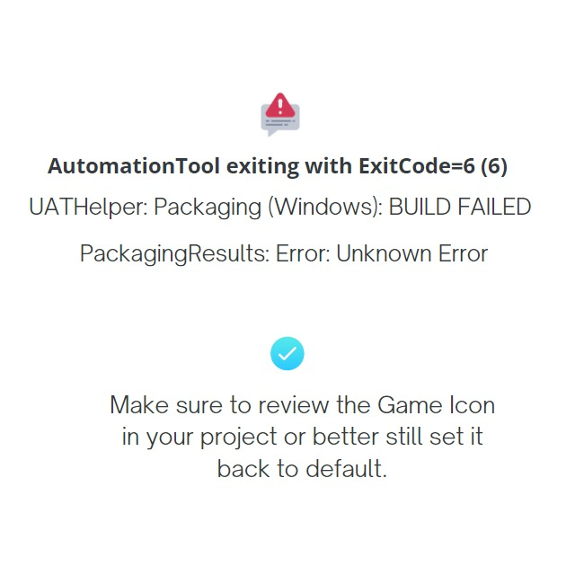

# 打包结果：错误：未知错误

## 来源与状态

- 原始 URL：https://dev.epicgames.com/community/learning/tutorials/mZEk/unreal-engine-packagingresults-error-unknown-error

## 运行时分类

- 类型：图文教程
- 判断：运行时未识别到核心视频信号，可整理正文约 237 字符。

## 摘要

问题：AutomationTool 退出，ExitCode=6 (6) UATHelper：打包 (Windows)：构建失败 PackagingResults：错误：未知错误解决方案：Make ...

## 中文整理

### 问题 ：

AutomationTool 退出，ExitCode=6 (6) UATHelper：打包 (Windows)：构建失败 PackagingResults：错误：未知错误

### 解决方案：

Make sure to review the Game Icon in your project or better still set it back to default. - 程序和脚本设计 - blueprint

## 相关链接

- [Issue :](https://dev.epicgames.com/community/learning/tutorials/mZEk/unreal-engine-packagingresults-error-unknown-error#issue:)
- [Solution:](https://dev.epicgames.com/community/learning/tutorials/mZEk/unreal-engine-packagingresults-error-unknown-error#solution:)

