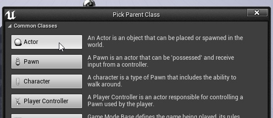
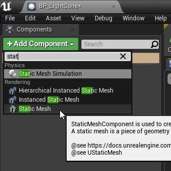
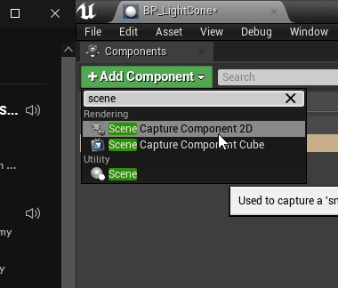
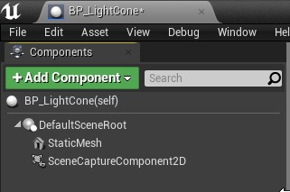

# 在世界空间中投影纹理（续 3）

## 来源与状态

- 原始 URL：https://dev.epicgames.com/community/learning/tutorials/nR/unreal-engine-projecting-a-texture-in-worldspace
- 原始文件：unreal-engine-projecting-a-texture-in-worldspace.origin.md
- 分段：第 3/4 段

360 and pass that into the tangent function. We want half the FOV in order to create the right triangle as we discussed above. So putting that all together: Now, with the size of our texture for a given point in space, let’s divide our grid by that size: Great! Now we have some normalized values, but the 0,0 is still along the forward axis. We can shift that by adding 1, and dividing the resulting value by 2, to push 0,0 up and to the left such that (0.5, 0.5) is along the forward axis of the camera. Now that we have the UV coordinates we want, let’s plug them into a TextureSampleParameter2D

node, which we’ll call ProjectorTexture. In our application, this texture will be the depth map from our scene capture component, and we want to determine if the pixel we’re drawing with this material is occluded relative to the projector. Instead of using an If node, which costs many instructions, I

prefer to divide the distance between the projector and the current point by the sampled depth value, then floor the value, and finally saturate it. This normalizes the distance to the sampled depth, so if the distance is less than the sampled depth it will be between 0 and 1, and if the distance is greater than the sampled depth it will be greater than 1. By flooring the value, we can drop everything between 0 and 1 to 0, then when we saturate the value we ensure that anything at or greater than the sampled scene depth will be 1. Finally, we’ll want to OneMinus that value so that anything

that is greater than our sampled depth will be 0, and everything between the projector and our sampled depth will be 1. We’ll pass that into the opacity input of our material and we’re ready to go! Let’s loop back to our scene capture component and make sure it’s set up properly. We want to set the
Primitive Render Mode to Render Scene Primitives, so that our capture actor disregards itself, and set the capture source to SceneDepth in R. Finally, let’s use the default Cone static mesh for our static mesh component. We can squash and stretch it to suit our needs, but it’s important that we move it around so its tip is in front of our projector and extends out from there. Now let’s put our Blueprint in the world and see how it works! If I point my light cone at the floor of the default level, and look at it from the side, we can see that our system is working! Half the cone is transparent!

We can use this to, in effect, cast shadows on the light cone! This technique can be applied in many different situations. You could, for example, use it to project a texture or movie onto a surface with a decal actor and cast shadows as characters walk in front of it! You could use it to detect
how much of an actor is occluded. The possibilities are endless! - 程序和脚本设计 - blueprint - materials

