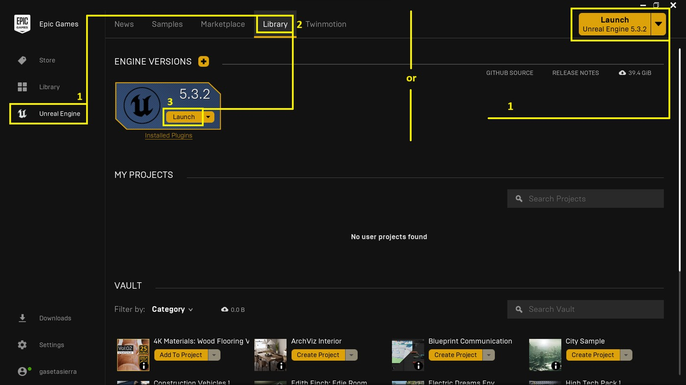
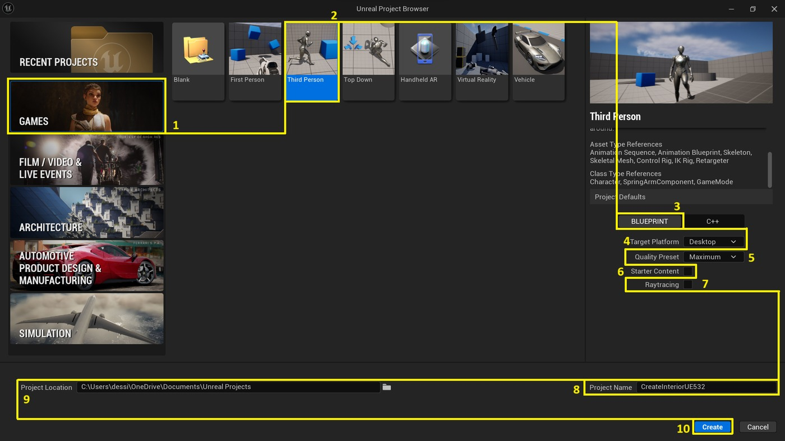
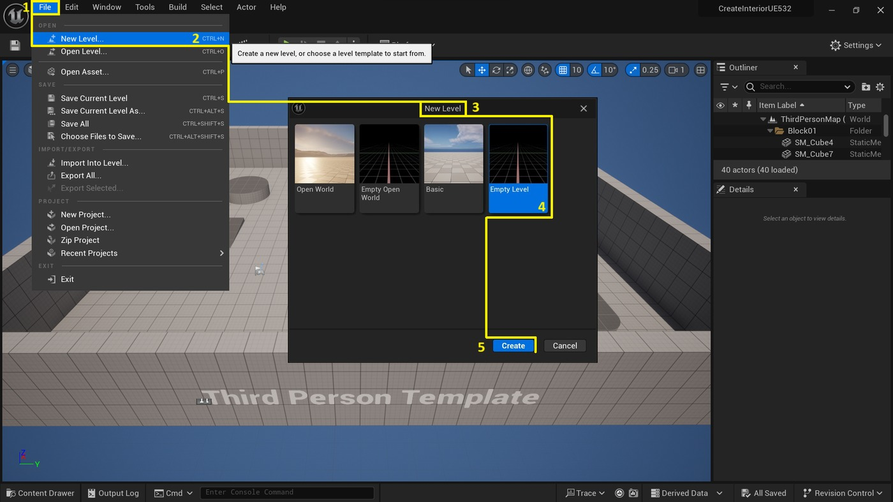
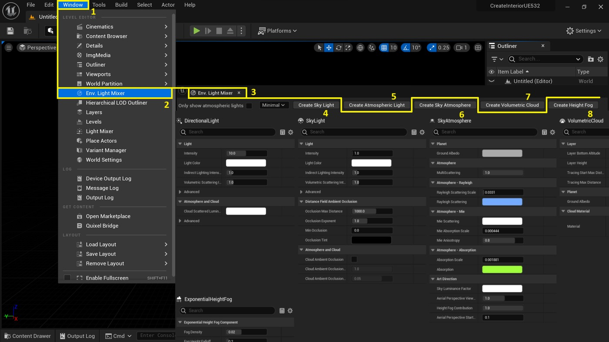
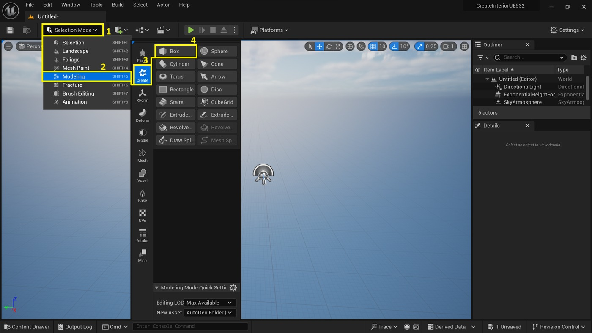
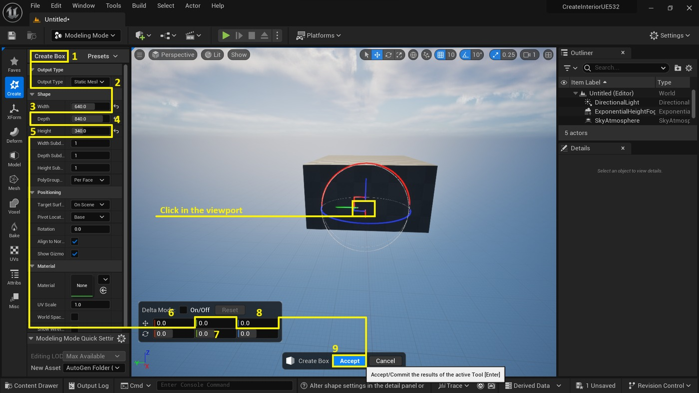
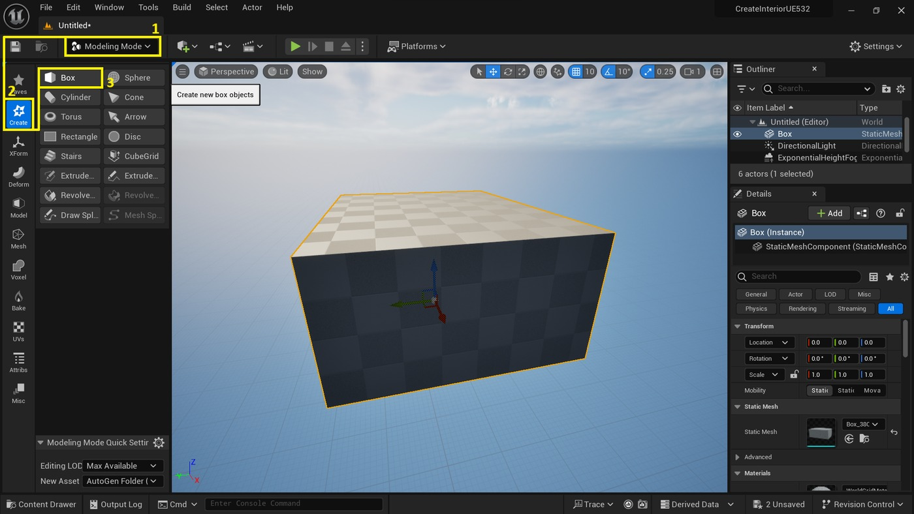
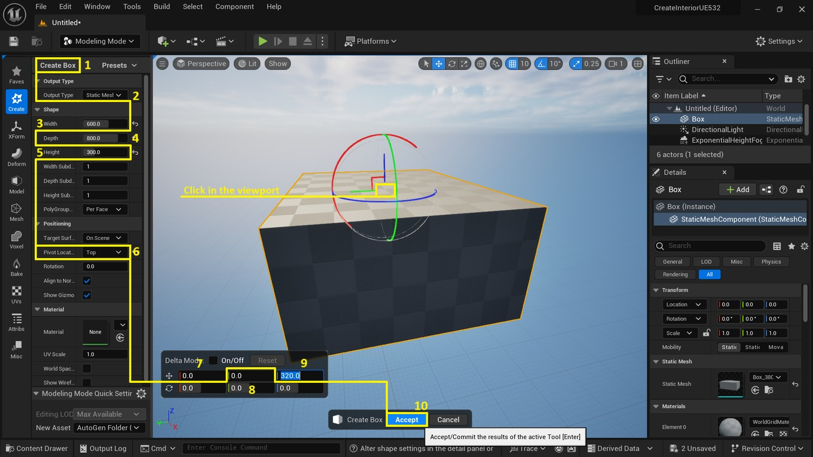
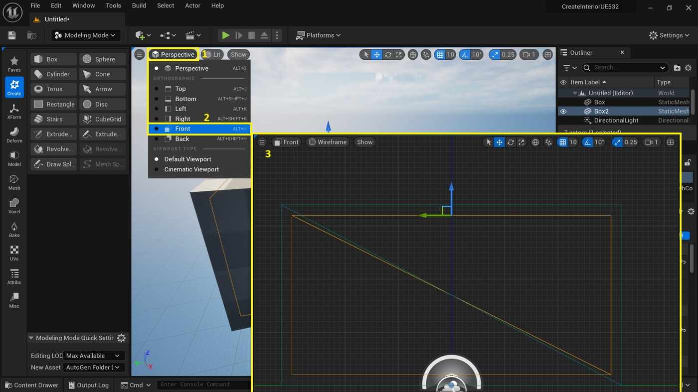
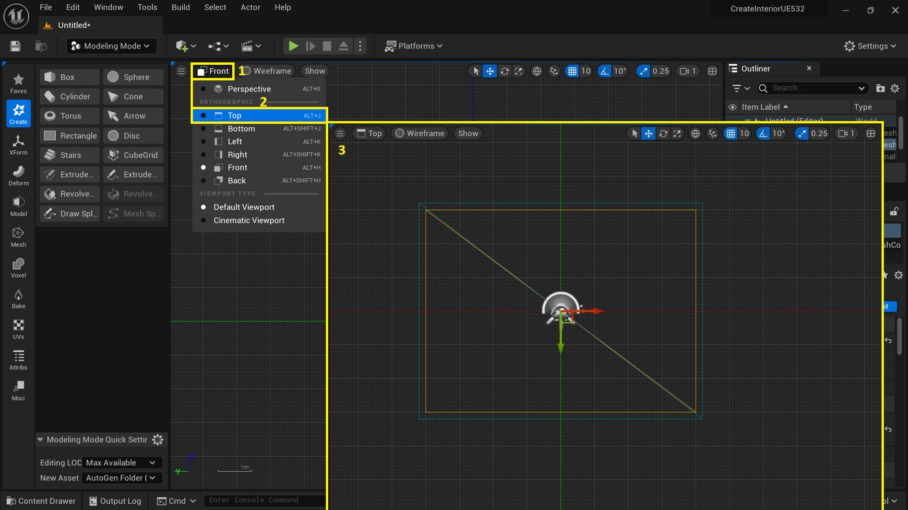

# 虚幻引擎：实时室内可视化入门指南

## 来源与状态

- 原始 URL：https://dev.epicgames.com/community/learning/tutorials/DdRE/unreal-engine-real-time-interior-visualization-starter-guide
- 原始文件：unreal-engine-real-time-interior-visualization-starter-guide.origin.md
- 分段：第 1/3 段

- 原始 URL：https://dev.epicgames.com/community/learning/tutorials/DdRE/unreal-engine-real-time-interior-visualization-starter-guide

## 运行时分类

- 类型：图文教程
- 判断：运行时未识别到核心视频信号，可整理正文约 14032 字符。

## 摘要

本教程为用户提供了在虚幻引擎中创建实时内部可视化的基本技能。该指南引导用户完成...

## 中文整理

### 介绍

本指南将引导您在虚幻引擎中创建实时内部可视化。您将从设置新项目和级别开始。然后，您将创建环境照明并使用静态网格物体构建基本房间结构。接下来，您将学习如何设置相机来构建场景并保存进度。该指南还提供了一个可选部分，您可以在其中下载预构建的建筑可视化室内项目以探索其结构和资产。接下来，您将深入研究如何使用内容浏览器中的过滤器来管理项目的资产。然后，您将学习如何导入家具网格并将其放置在场景中。接下来是添加灯光来照亮内部空间，并为家具分配材质以定义其纹理。最后，该指南介绍了如何设置视口，以高质量、实时地渲染已完成的室内场景。

### 项目和关卡创建

本节介绍在虚幻引擎中设置新项目以及在该项目中创建一个关卡来处理可视化。

### 启动发动机

要通过 Epic Games Launcher 启动虚幻引擎，请导航至“库”选项卡并选择虚幻引擎旁边的“启动”。

### 创建新项目

要启动新项目，请导航至“游戏”部分并选择“第三人称”，然后选择“蓝图”。确保目标平台设置为桌面，质量预设为最高。起始内容应关闭，光线追踪也应关闭。在“命名项目”下为您的项目分配唯一的名称，并在“项目位置”下为项目指定自定义位置。配置完所有设置后，单击“创建”开始新项目。

### 创造一个新的水平

要在项目中创建新关卡，请浏览菜单：文件 > 新关卡。在“新级别”选项卡中，选择“空级别”并单击“创建”以启动新级别。

### 环境照明和静态网格体创建

在本节中，我们将探讨制作基本环境照明和使用静态网格体构建初始房间布局的基本步骤。重点是建立一个视觉上有凝聚力的空间，既实用又美观。

### 创建环境照明

要增强 3D 场景，请导航至“窗口”>“环境”。光混合器访问环境。混光器窗口。在这里，您可以创建天空光来模拟自然日光。要获得更多大气效果，请选择“创建大气光”和“创建天空大气”选项。要添加动态云结构，请使用“创建体积云”功能。最后，要模拟低空薄雾或雾气，请选择“创建高度雾”。使用环境照明演员的默认设置。如果您想了解有关虚幻引擎环境光照的更多信息，请访问官方文档页面。

### 创建框 1

要创建具有指定尺寸的盒子 1，请导航至“模式选择”并选择“建模”。从那里，继续创建类别并选择框工具。在创建框工具属性中，将输出类型设置为静态网格体。输入尺寸：宽度 [640]、深度 [840]、高度 [340]。在视口中单击以放置该框。要调整其位置和方向，请使用变换面板。将“移动红色”、“旋转红色”、“移动绿色”、“旋转绿色”、“移动蓝色”和“旋转蓝色”全部设置为 [0]。单击“接受”确认您的设置。

### 创建框 2

要创建具有指定属性的盒子 2，首先选择“创建类别”，然后从“建模模式”中选择“盒子工具”。在创建框工具属性中，将输出类型设置为静态网格体。通过将宽度设置为 [600]、深度设置为 [800]、高度设置为 [300] 来调整尺寸。确保枢轴位置设置为顶部。接下来，在视口中单击以放置该框。在变换面板中，将红色和绿色的所有移动和旋转值设置为 [0]。对于蓝色，将移动设置为 [320]，并将旋转设置为 [0]。最后，单击“创建”以完成该过程。有关虚幻引擎中建模的更多见解，请考虑浏览官方文档：建模模式入门。

### 盒中盒检查

通过不同的视口选项验证框 2 在框 1 内的定位。关卡视口选项 > 正面 确保框 2 准确放置在框 1 内。关卡视口选项 > 顶部 确认框 2 保留在框 1 的边界内。如果框 2 不在框 1 内，请使用变换控件将框 2 定位在框 1 内。如果您想了解有关虚幻引擎中变换控件的更多信息，请访问官方文档页面。

### 返回透视图

要返回视口中的透视图，只需选择“级别视口选项”，然后选择“透视图”，或使用键盘快捷键 ALT + G。

### 创造室内空间

要创建内部空间，请导航至大纲面板。使用 CTRL + 单击选择框 2，然后选择框 1，确保两者都突出显示。继续进行模式选择并选择建模模式。在模型类别中，找到并选择布尔工具。在“网格布尔工具属性”中，将“操作”设置为“差值 B - A”。这将从框 B 中减去框 A 的体积。对于“输出类型”，如果需要不可编辑的模型，请选择“静态网格”。将网格命名为 Boolean_Interior 以便于识别。在最终确定之前，选择处理输入并选择删除输入以从场景中删除原始框。单击“接受”应用更改。如果未创建内部空间，请确保先选择框 2，然后选择框 1，并将运算类型设置为 Difference B - A。有关虚幻引擎中布尔工具的更多信息，请参阅官方文档页面。

### 创建窗口

访问大纲面板并选择布尔运算产生的新静态网格物体。切换到建模模式，然后导航到创建类别并选择立方体网格工具。立方体网格工具属性将网格功率设置为 [3]，将当前块大小设置为 [25]。使用视口上的网格覆盖，通过布尔运算选择静态网格上的窗口区域。按 Q 或使用 Push 功能，然后单击 Accept 完成。有关虚幻引擎中的立方体网格工具的更多见解，请考虑浏览文档页面上的官方指南。

### 相机创作

在这里，您将学习如何设置相机来拍摄室内场景。

### 内部透视图

要访问透视图的“关卡视口选项”，请使用键盘快捷键 ALT + G。激活此快捷键后，在视口中导航，直到位于布尔运算生成的静态网格物体内。

### 选择方式

模式选择 > 选择
