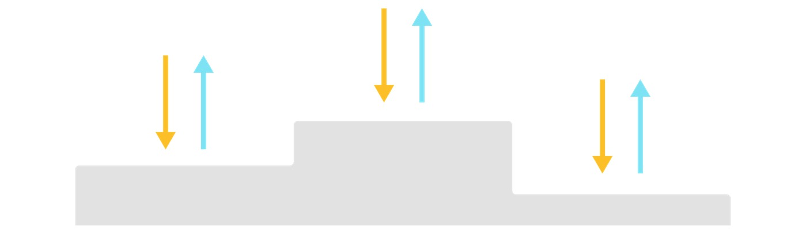
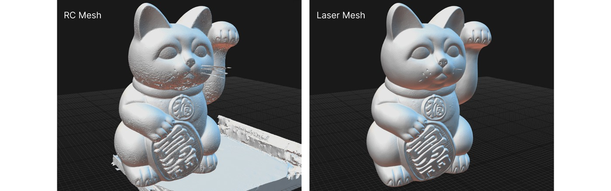

# Quixel 激光扫描

## 来源与状态

- 原始 URL：https://dev.epicgames.com/community/learning/courses/NdE/unreal-engine-realityscan-laser-scanning-by-quixel

## 运行时分类

- 类型：图文教程
- 判断：运行时未识别到核心视频信号，可整理正文约 5400 字符。

## 摘要

对于摄影测量，某些主题和材料比其他主题和材料更适合捕捉。激光扫描通过捕获...来补充摄影测量。

## 中文整理

### 激光扫描简介

使用摄影测量进行扫描时，有时物体的表面无法产生高质量的结果。此类主体的示例包括反光主体（闪亮的塑料椅子或瓷碗）、透明主体（半透明塑料或有色玻璃）和无特征主体（没有表面细节的平坦墙壁或类似光滑的表面）。当摄影测量无法准确捕捉被摄体时，需要采用激光扫描方法对被摄体进行扫描。当可以单独使用摄影测量来扫描和重建对象时，则不使用激光扫描方法。 🅿️回到“学习之路”

### 目的

本文档的目的是介绍激光扫描过程。目标是为用户在激光扫描自己的项目时可以适应的过程提供指南。

### 范围

本文档的范围包括总体概述以及从开始到结束完成激光扫描所需的事件顺序。有关摄影测量的更多信息，请参阅相关摄影测量文档： - 摄影测量简介 摄影测量简介 - 摄影测量扫描的核心原理 摄影测量扫描的核心原理 - 处理 RAW 图像 处理 RAW 图像 - 在 RealityCapture 中对齐图像 在 RealityCapture 中对齐图像 - 处理数字资产 处理数字资产 - 植被扫描简介 植被扫描简介

### 观众

本文档适用于已经练习摄影测量但遇到仅使用摄影测量无法提供高质量结果的主题的任何人。

### 课程符号

在本文档中，信息由注释系统标记。找到的注释由可区分的图标标记，并通过指示其用途的文本进行介绍。 📋 注意：注释添加有关主题的附加信息或包含附加资源的链接。 ☢️ 注意：注意事项表示可能对设备或过程结果造成损坏。这些注释并不涵盖所有案例或情况，而是旨在强调最常见的错误或潜在的错误。

### 课程内容

- 课程概述 - 入门 - 激光扫描主题 - 将激光模型与照片模型对齐 - 清理并展开激光模型 - 烘焙纹理 - 格式化纹理文件 - 测试数字资产 - 激光扫描仪的常见问题

### 设备和软件

☢️ 注意：由于软件开发的性质，本文档中引用的第三方软件的特性和功能可能与此处详细介绍的有所不同。请务必查阅软件制造商的文档来解决问题并及时了解第三方产品的更改。本课程的重点是使用以下设备和软件的激光扫描过程。 📋 注意：可以使用类似的设备或软件来代替下面列出的设备或软件，但可能需要本文档中未提供的其他信息或流程。

### 设备

- Creaform Handyscan 3D Black Elite - 手持式激光扫描仪（配有校准板、电缆和 VXelements 软件）。 Creaform Handyscan 3D Black Elite - 手持式激光扫描仪（配有校准板、电缆和 VXelements 软件）。 - 具有图形功能的笔记本电脑 - 如果图形卡和处理器足以运行下面列出的软件，则任何基于 Windows 的笔记本电脑都可以工作。在 Quixel，我们目前使用配备 NVIDIA Quadro RTX3000 显卡和 i9 处理器的 HP Zbook G6 移动工作站。具有图形功能的笔记本电脑 - 如果图形卡和处理器足以运行下面列出的软件，则任何基于 Windows 的笔记本电脑都可以工作。在 Quixel，我们目前使用配备 NVIDIA Quadro RTX3000 显卡和 i9 处理器的 HP Zbook G6 移动工作站。 - 目标点/标记贴纸 - 建议使用低粘性和中粘性以及磁性目标点。目标点/标记贴纸 - 建议使用低粘性和中粘性以及磁性目标点。 - 转盘 - 用于放置和旋转拍摄对象的可转台。并非所有受试者都需要转盘，但对于小到可以坐在上面的受试者很有用。转盘 - 用于放置和旋转拍摄对象的可转台。并非所有受试者都需要转盘，但对于小到可以坐在上面的受试者很有用。

### 软件

- Adob​​e Photoshop Adob​​e Photoshop - CloudCompare CloudCompare - 狨猴狨猴 - RealityCapture RealityCapture - VXelements VXelements - xNormal 📋 注意：有各种激光扫描仪制造商和接口软件发行商。以下信息基于 Creaform 的技术和软件。如需更多信息或资源，请访问 Creaform 网站。

### 什么是激光扫描？

激光扫描是使用投射光（激光束）而不是相机传感器捕获目标形状的过程。激光扫描仪向目标方向发射光束，然后测量光束反射并返回扫描仪所需的时间。扫描仪软件根据每秒发生的数千次反射来计算目标表面的形状。由于激光扫描仪不像摄影测量那样受到反射、图像曝光或模糊像素数据的影响，因此激光扫描产生的扫描数据具有很高的准确性。比较以下两个图像之间的网格精度差异： - 摄影测量

## 相关链接

- [Creaform website](https://www.creaform3d.com/en)

