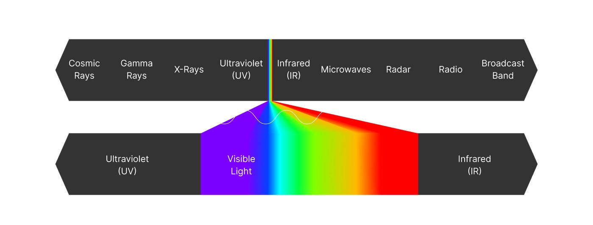
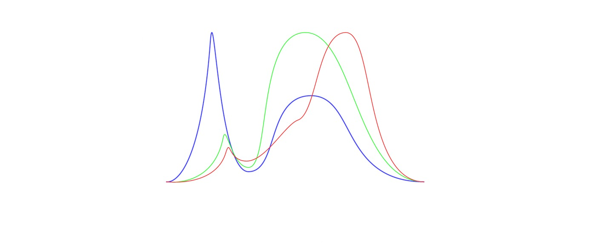
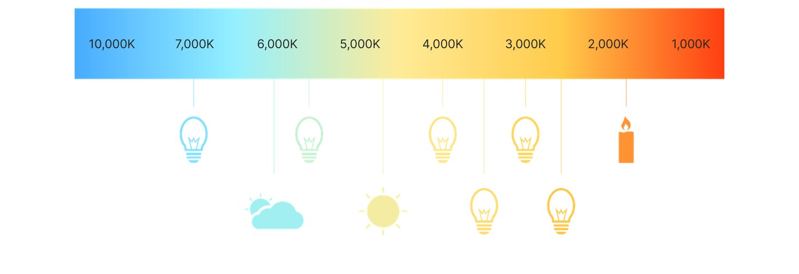

# Quixel 的光偏振

## 来源与状态

- 原始 URL：https://dev.epicgames.com/community/learning/courses/W1J/unreal-engine-realityscan-light-polarization-by-quixel

## 运行时分类

- 类型：图文教程
- 判断：运行时未识别到核心视频信号，可整理正文约 2459 字符。

## 摘要

光是摄影、摄影测量和立体光度测量的关键因素。室内工作室环境和室外遮阳设置用于控制...

## 中文整理

### 灯光基础知识

本节简要介绍光及其含义。要了解如何有效地操纵光，必须对光有基本的了解。 📋 注意：本节包括对光的简化描述，重点关注扫描摄影测量时准确修改所需的光的关键特征（或特性）。

### 光（一般而言）

光是一种以波的形式传播的电磁辐射。

它没有物理形式，但光确实具有可以操纵的物理属性。

光源发射“粒子”（或光子），它们以光速沿特定方向移动。

这些粒子可以被视为“能量”——它们没有质量。

📋 注意：光的亮度（光强度）就是光线/光子的数量。

更亮的光有更多的光线，因此能量也更多。

当沿一个方向移动时，光粒子以波形模式不断振动/振荡。

波长（振动频率）决定光的颜色。

我们用眼睛看到的只是光谱中非常小的一部分，从 380nm 到 750nm 左右，其频率带宽为 400-790 太赫兹。

光谱并不包含人类视觉系统可以区分的所有颜色。

例如，不饱和颜色（例如粉红色或紫色变体（例如洋红色））不存在，因为它们是多种不同波长的混合。

仅包含一种波长的颜色也称为纯色（或光谱色）。

白光也是如此。

白光是所有可见波长的混合光。

“白光”有不同类型，它们的混合物可以在以 nm（纳米）为单位测量的曲线上进行比较：冷白光、等白光、暖白光。

测量光子密度来确定白色的色调可能很麻烦。

幸运的是，还有另一种（相关的）方法来确定白光的混合：表观温度。

这种秤最初是基于烛光，早在现代技术能够测量光子密度之前。

在此标度中，白光以开尔文温度单位测量，范围从红色 (0°K) 到蓝色 (10.000°K)。

人眼将 5000°K 左右的温度视为“纯白色”。

📋 注意：当使用人造光源照亮表面和物体以及相机上的白平衡时，这一点很重要。

5200° 至 5600°K 是针对中性照明的摄影光源的标准。

- 摄影测量

## 相关链接

- 未识别到明确相关链接。

