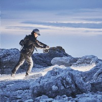
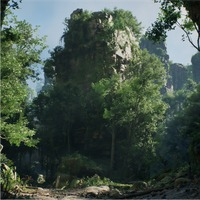
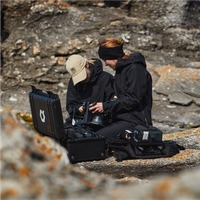

# 掌握 Megascans：摄影测量和资产创建指南

## 来源与状态

- 原始 URL：https://dev.epicgames.com/community/learning/paths/yzG/unreal-engine-realityscan-mastering-megascans-a-guide-to-photogrammetry-and-asset-creation
- 原始文件：unreal-engine-realityscan-mastering-megascans-a-guide-to-photogrammetry-and-asset-creation.origin.md
- 分段：第 1/4 段

- 原始 URL：https://dev.epicgames.com/community/learning/paths/yzG/unreal-engine-realityscan-mastering-megascans-a-guide-to-photogrammetry-and-asset-creation

## 运行时分类

- 类型：图文教程
- 判断：运行时未识别到核心视频信号，可整理正文约 10037 字符。

## 摘要

本学习路径重点关注摄影测量的过程。从扫描到生产资产创建，学习路径安排了典型的工作流程...

## 中文整理

### 学习路径内容

- 01 / 11 Overview COURSE | 12 模块 Photogrammetry Basics by Quixel This course is an introduction to photogrammetry. The sections within this course discuss the core principles of photogrammetry.

### Quixel 的摄影测量基础知识

This course is an introduction to photogrammetry. The sections within this course discuss the core principles of photogrammetry. - 02 / 11 Scouting COURSE | 5 模块 Scouting by Quixel Before heading out to a remote location and scanning whatever is available, effort should be made to ensure the location is ideal. This is the process of Scouting. This course details the scouting workflow and the tasks involved in choosing the perfect location to scan. 03 / 11 COURSE | 1 模块 Content Curation by Quixel This course looks at what is involved in organizing assets into collections. From deciding target

subjects to compiling digital assets into collections, this process is essential for asset management. 04 / 11 COURSE | 1 模块 Expedition Planning by Quixel Scheduling scan artists, transporting equipment to location, booking travel and accommodations, this course details the major considerations when

planning a scan trip. - 02 / 11 Scouting COURSE | 5 模块 Scouting by Quixel Before heading out to a remote location and scanning whatever is available, effort should be made to ensure the location is ideal. This is the process of Scouting. This course details the scouting workflow and the tasks involved in choosing the perfect location to scan.

### Quixel 侦察

Before heading out to a remote location and scanning whatever is available, effort should be made to ensure the location is ideal. This is the process of Scouting. This course details the scouting workflow and the tasks involved in choosing the perfect location to scan. - 03 / 11 COURSE | 1 模块 Content Curation by Quixel This course looks at what is involved in organizing assets into collections. From deciding target subjects to compiling digital assets into collections, this process is essential for asset management.

### Quixel 的内容管理

This course looks at what is involved in organizing assets into collections. From deciding target subjects to compiling digital assets into collections, this process is essential for asset management. - 04 / 11 COURSE | 1 模块 Expedition Planning by Quixel Scheduling scan artists, transporting equipment to location, booking travel and accommodations, this course details the major considerations when planning a scan trip.

### Quixel 的探险计划
