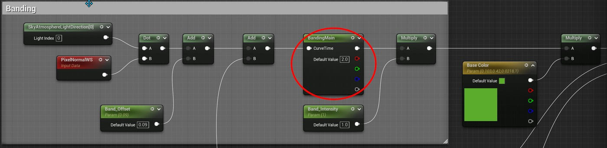
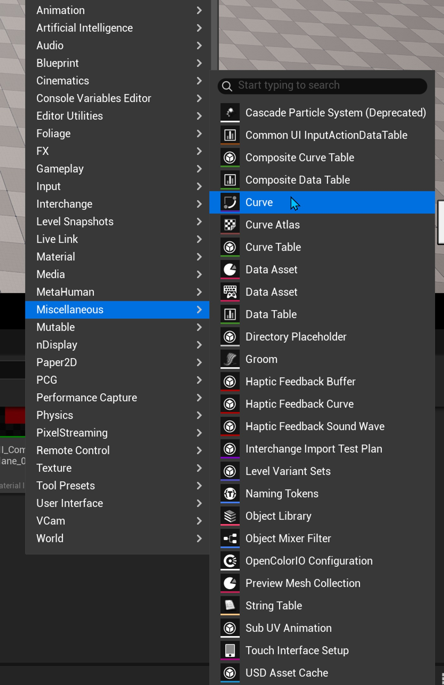
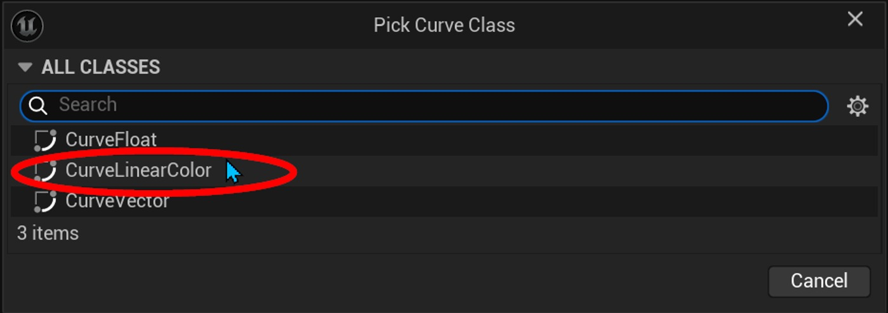
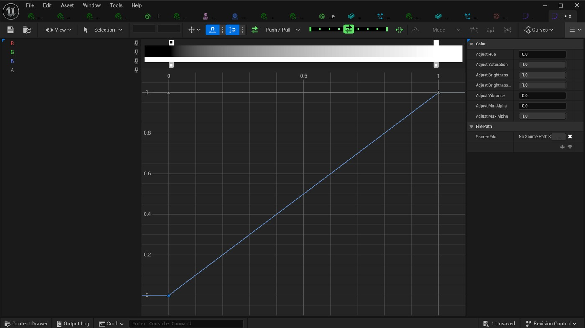
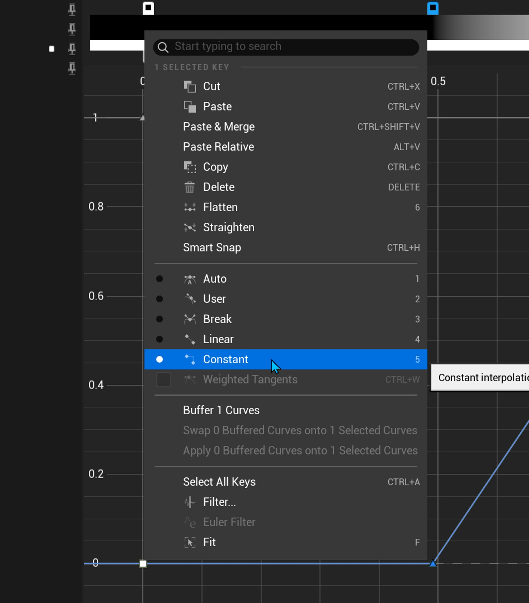
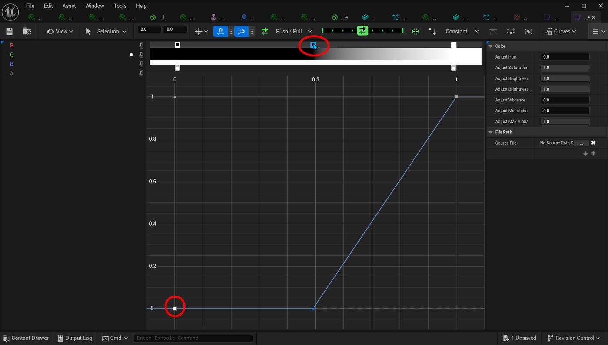
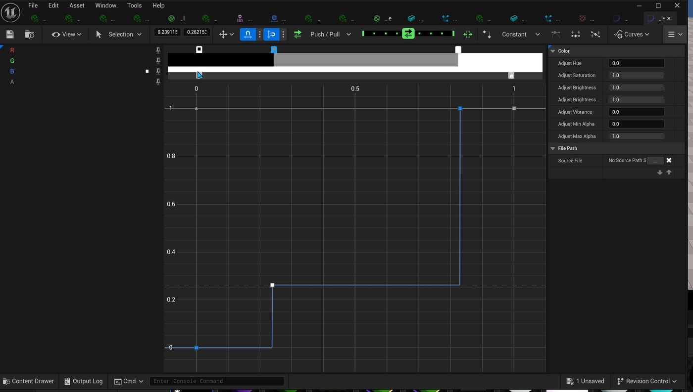
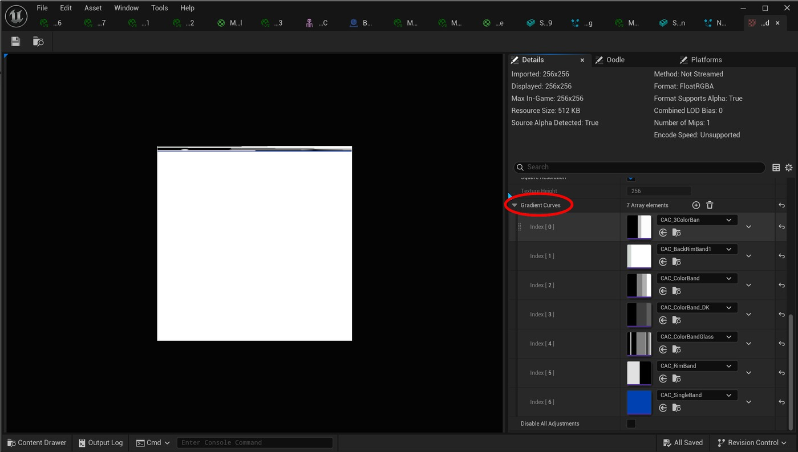
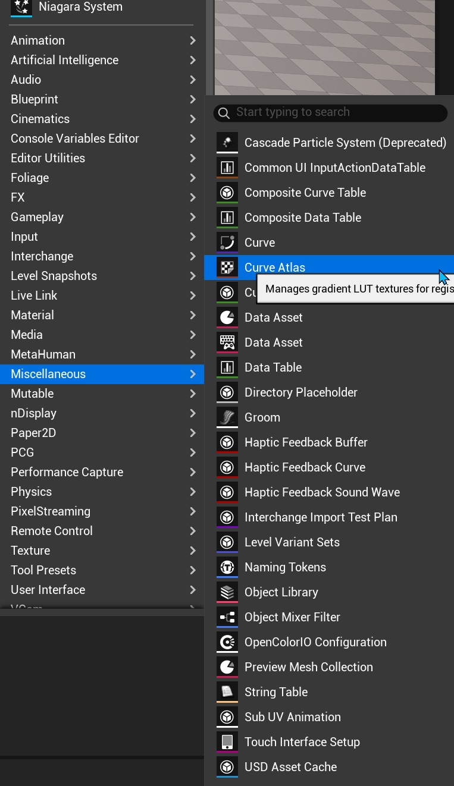
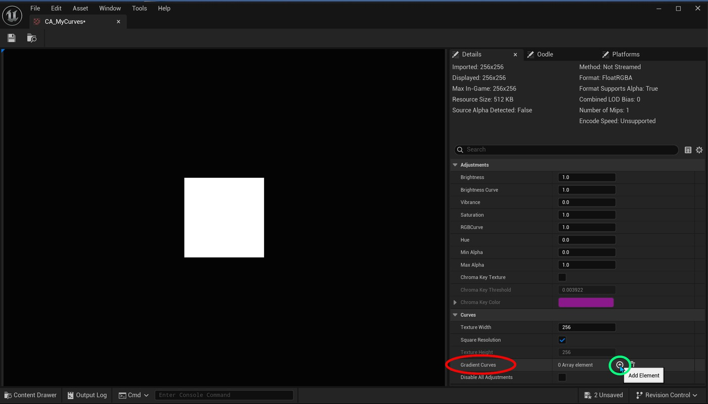

# 为风格化条带设置曲线图集

## 来源与状态

- 原始 URL：https://dev.epicgames.com/community/learning/tutorials/89n2/unreal-engine-setting-up-a-curve-atlas-for-a-stylized-banding
- 原始文件：unreal-engine-setting-up-a-curve-atlas-for-a-stylized-banding.origin.md
- 分段：第 1/2 段

- 原始 URL：https://dev.epicgames.com/community/learning/tutorials/89n2/unreal-engine-setting-up-a-curve-atlas-for-a-stylized-banding

## 运行时分类

- 类型：图文教程
- 判断：运行时未识别到核心视频信号，可整理正文约 3175 字符。

## 摘要

本教程旨在稍微深入研究如何创建一个条带系统以添加到您的风格化材料中。这是使用 Curve Atlas Row Para 完成的...

## 中文整理

### 曲线图集行参数

该节点有一个输入引脚“曲线时间”，以及“详细信息”面板中的两个资产参数“曲线”和“图集”。为了使用这个节点，我们必须首先创建一些颜色曲线和一个曲线图集来保存它们。

### 色彩曲线

在内容浏览器中，右键单击并选择Miscellaneous / Curve，在弹出的对话框中选择CurveLinearColor，然后按选择按钮。这将在您的内容浏览器中生成资产。双击资源并打开曲线编辑器。选择下方时间线中的关键点，然后更改为 Constant。这将决定曲线或带保持该颜色的时间长度。双击上面的颜色栏以创建新的颜色选项卡。双击新选项卡将弹出颜色选择器。我建议使用可以在材质中与其他参数相乘的灰度值。将所有颜色选项卡添加到颜色条后，可以将按键设置为 Constant 以获得每个颜色值之间的锐利边缘。对于主颜色，有一个颜色曲线，以及用于前轮缘和后轮缘的 2 个附加颜色曲线。

### 曲线图集

曲线图集资源基本上是一组颜色曲线的容器。要在内容浏览器中创建曲线图集资源，请右键单击并选择其他/曲线图集。双击新资产将其打开。在“详细信息”面板的“渐变曲线”部分中，通过单击“加号”按钮添加您创建的颜色曲线。这将为数组创建元素，填充后即可在材质图中访问。

### 曲线图集行参数

现在您已经创建了颜色曲线，并创建了曲线图集并填充了颜色曲线，您就可以将它们添加到材质图中了。要在材质图中执行此操作，请按 TAB 键并开始输入 CurveAtlasRowParameter，该选项应过滤以显示节点。选择它，它将出现在图表中。在 FAB 上的 Stylized Comic Shader Pack 中，有一个示例展示了条带是如何实现的。完成的图形看起来有点像下图，添加了带之间的纹理。静态网格物体上带的方向是使用 SkyAtmosphereLightDirection 和 PixelNormalWorldSpace 节点的点积完成的。添加一个浮点标量参数并将其连接到 CurveTime 引脚，以允许偏移条带分布。然后，CurveAtlasRowParameter 节点的 RGBA 输出引脚通过另一个标量浮点参数“Band Intensity”连接到 Multiply 节点，以赋予条带更多或更少的强度。然后，Multiply 节点的输出引脚连接到另一个 Multiply 节点，其中 B 引脚附加有颜色参数，然后连接到材质块的基色，并连接到另一个 Multiply 节点，该节点具有连接到其 B 引脚的“Emissive”浮动参数节点。然后将输出引脚连接到 - 解构风格化漫画着色器 - 创建风格化漫画 FX 第 1 部分：烟雾轨迹 - 在虚幻引擎中创建漫画书飞溅元素 -

在虚幻引擎中创建风格化水波纹 - 用于轮廓和其他 FX 的叠加材质 - 用于线性内容的风格化材质 - 风格化漫画着色器包 - 材质

## 相关链接
