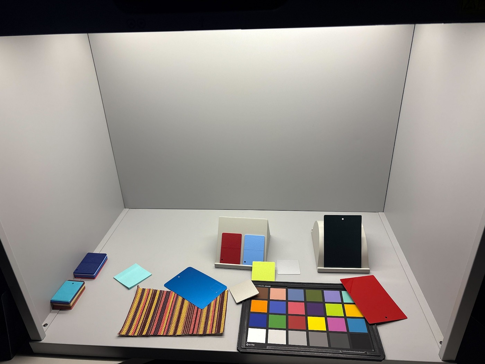
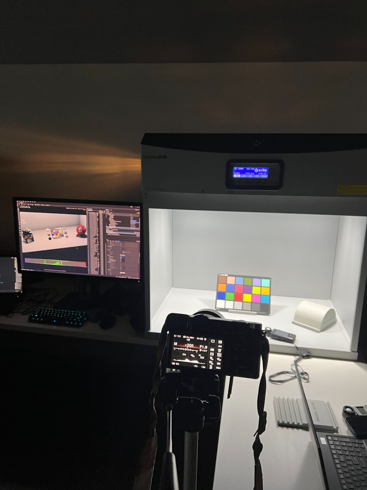
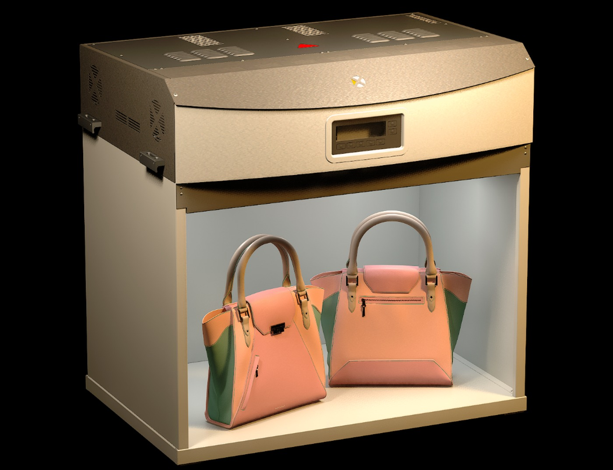
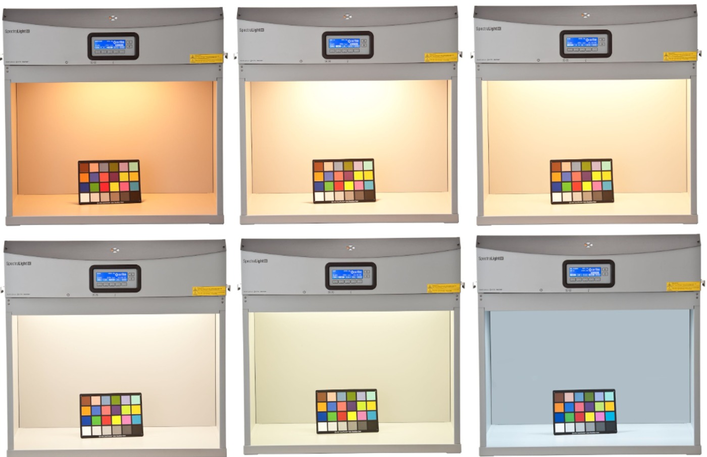
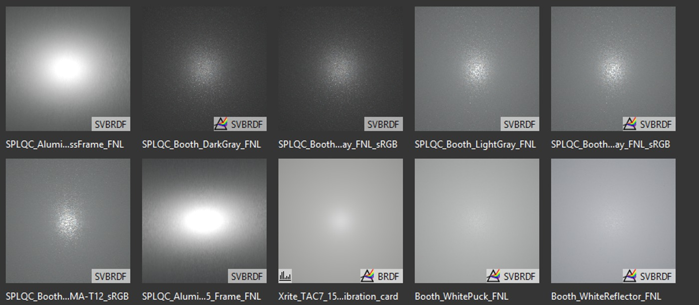
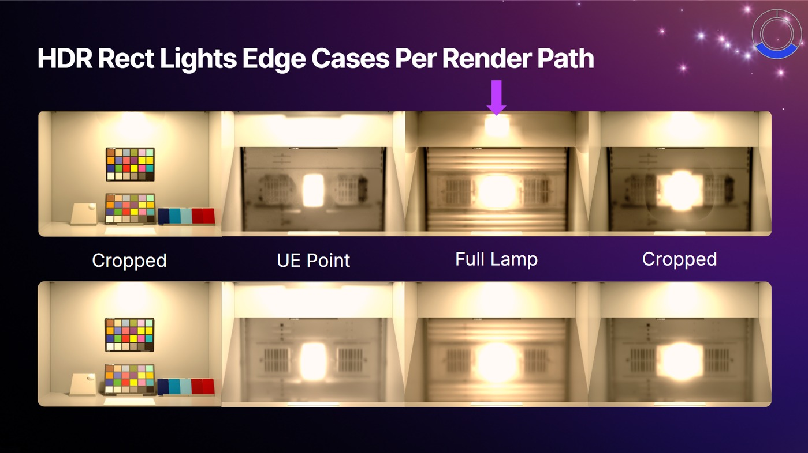
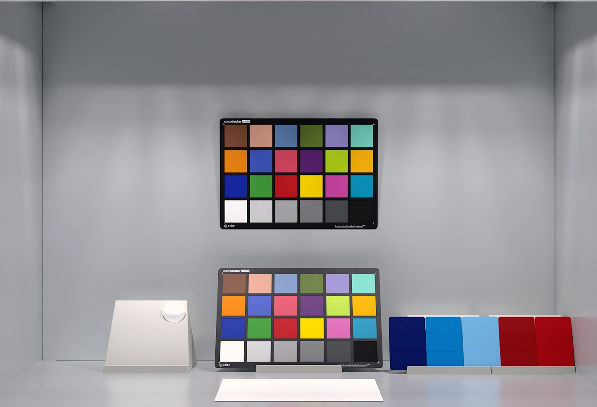
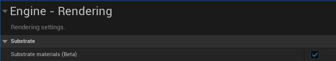

# SpectraLight QC Light Booth 插件 - 将分类照明引入 Unreal

## 来源与状态

- 原始 URL：https://dev.epicgames.com/community/learning/tutorials/abVl/unreal-engine-spectralight-qc-light-booth-plugin-bringing-classified-lighting-into-unreal
- 原始文件：unreal-engine-spectralight-qc-light-booth-plugin-bringing-classified-lighting-into-unreal.origin.md
- 分段：第 1/3 段

- 原始 URL：https://dev.epicgames.com/community/learning/tutorials/abVl/unreal-engine-spectralight-qc-light-booth-plugin-bringing-classified-lighting-into-unreal

## 运行时分类

- 类型：图文教程
- 判断：运行时未识别到核心视频信号，可整理正文约 11922 字符。

## 摘要

Spectralight QC Light Booth 插件将行业标准 X-Rite Spectralight QC 作为纯内容包引入虚幻引擎。从官方构建...

## 中文整理

### SpectraLight QC Light Booth 插件 - 将分类照明引入 Unreal

此内容与 Unreal Fest Stockholm 2025 的 Portal to Reality - Fusing Real World Assets with Unreal Workflows Resources 相关。这是供虚幻引擎用户学习和实验的参考实现。不暗示任何保证或保证。使用由您自行决定。该示例旨在定制并集成到您的工作流程中。除本文外，不提供任何支持。请联系您的 Epic Games 支持渠道或 X-Rite 代表获取支持。 - 现实门户 - 将现实世界资产与虚幻工作流程资源融合

### 介绍

当谈到产品设计和零售可视化时，信任就是一切。设计师、工程师和客户都需要确信他们在屏幕上看到的内容与现实世界中的内容相同。在产品开发中，实现这种信心的最值得信赖的工具之一是 X-Rite SpectraLight QC 灯箱。它提供标准化、分类的照明条件（D65、CWF、TL84、白炽灯 A 等），使团队能够在受控、可重复的环境下评估样品。无论您是在检查纺织品、塑料还是饰面，SpectraLight QC 都可以作为视觉质量评估的行业基准。但如果您能够将同样的信心带入虚幻引擎呢？这就是这个插件背后的想法：一个纯内容包​​，忠实地将 SpectraLight QC 展位重新创建为蓝图 Actor。它将虚幻引擎从游戏引擎转变为我所说的“通往现实的门户”，在这里，虚拟产品可以像物理样品一样严格地进行评判，并与指导全球产品设计的标准并存。

### 插件里面有什么

该插件作为纯内容解决方案提供，允许您将其放入虚幻引擎 5.6+ 项目插件文件夹中，同时设置麻烦最小。

您将在里面找到以下内容： - CAD 衍生展位模型：直接根据 X-Rite 提供的官方 SpectraLight QC CAD 数据构建，确保比例和几何形状的准确性。

虚幻 SpectraLight QC 几何体。

CAD 衍生展位模型：直接根据 X-Rite 提供的官方 SpectraLight QC CAD 数据构建，确保比例和几何形状的准确性。

- 具有分类照明模式的蓝图：使用简单的蓝图控件在标准化光源（例如 D65、CWF、TL84 和白炽灯 A）之间切换。

每种模式均根据使用专业测光计进行的实际测量进行分类。

（注意：UV 模式被排除在外，因为它无法在虚幻引擎中忠实地再现。） 具有分类照明模式的蓝图：使用简单的蓝图控件在标准化光源（例如 D65、CWF、TL84 和白炽灯 A）之间切换。

每种模式均根据使用专业测光计进行的实际测量进行分类。

（注意：UV 模式被排除在外，因为它无法在虚幻引擎中忠实地再现。） - SpectraLight QC 的各种灯光模式。

- 基于物理的材料：所有展位和配件材料均由使用 X-Rite MAT-12 分光光度计捕获的 AxF 扫描生成，将视觉体验植根于测量的真实世界数据。

基于物理的材料：所有展位和配件材料均根据使用 X-Rite MAT-12 分光光度计捕获的 AxF 扫描编写，将视觉体验建立在测量的真实世界数据的基础上。

- X-Rite Pantora AxF 捕捉喷漆室涂层。

- 基于物理的光照纹理：展位遮光罩的 HDR 贴图并根据光照范围进行裁剪。

这些捕获被映射到矩形灯并分类到 X-Rite 实验室的参考灯箱。

请根据您的展位值调整这些值。

基于物理的光照纹理：展位遮光罩的 HDR 贴图并根据光照范围进行裁剪。

这些捕获被映射到矩形灯并分类到 X-Rite 实验室的参考灯箱。

请根据您的展位值调整这些值。

- X-Rite ColorChecker Classic 插件作为展位的一部分包含在内，用于参考和验证，确保您的材料和照明工作流程符合公认的行业标准。

X-Rite ColorChecker Classic 插件作为展位的一部分包含在内，用于参考和验证，确保您的材料和照明工作流程符合公认的行业标准。

- 我在斯德哥尔摩 '25 Unreal Fest Talk 上实现的 Lightbooth 组合起来，这些元素使 SpectraLight QC 插件不仅仅是一项资产。

这是虚幻引擎内基于物理的评估的基础，旨在建立对数字工作流程的信任。

### 先决条件：

此插件需要 Unreal 5.6.1 或更高版本。该插件使用了 Substrate。如果您的项目没有使用 Substrate 并且您想使用此插件，则必须在项目设置中启用它。

### 物理照明评估注意事项：
