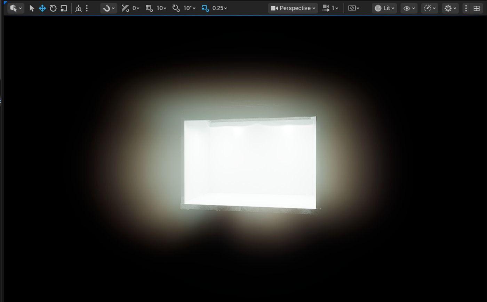
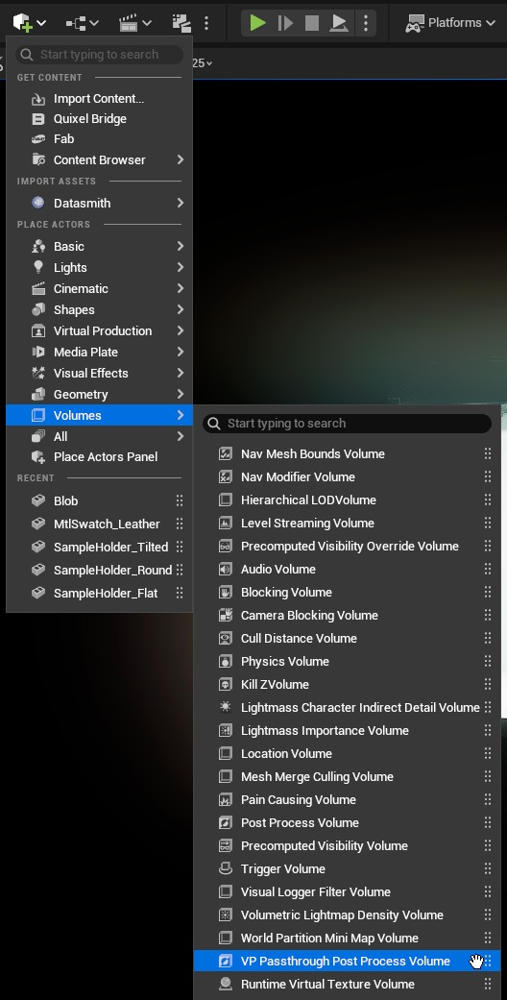

# SpectraLight QC Light Booth 插件 - 将分类照明引入 Unreal（续 2）

## 来源与状态

- 原始 URL：https://dev.epicgames.com/community/learning/tutorials/abVl/unreal-engine-spectralight-qc-light-booth-plugin-bringing-classified-lighting-into-unreal
- 原始文件：unreal-engine-spectralight-qc-light-booth-plugin-bringing-classified-lighting-into-unreal.origin.md
- 分段：第 2/3 段

SpectraLight QC 蓝图灯利用光线追踪阴影在产品可视化中实现最准确的表示。请随意根据您的项目用例定制展位。该插件使用基于物理的照明值；因此，我们期望在关卡中使用物理相机和/或基于物理的后处理体积。如果关卡内没有任何东西，照明就会过度曝光并超出范围。看看这张图片。 VP 直通后处理体积的功能是提供一个后处理体积，该后处理体积可以将颜色干净地直通到显示空间，而无需额外的后处理。这是通过自定义一些默认值来完成的。如上图的曝光补偿。当我们简单地添加 VP PassThrough Post Process Volume 时，我们可以为干净的颜色直通奠定基础，并调整视口的曝光补偿或相机参数。此 PPV 可在 Virtual Product Utilities 插件中找到，该插件可在虚幻编辑器中访问。现在，可以使用 PPV 调整视口，为项目设置所需的曝光补偿或相机设置。我发现 -6 到 -8 之间的曝光补偿对于一般视口导航很有好处。场景中的任何额外照明都会影响灯箱中物体的外观！

### 它是如何运作的

无论您是艺术家、设计师还是工程师，使用该插件都很简单： - 将插件安装到您的项目中：将纯内容插件添加到您的虚幻引擎项目的 Plugins 文件夹中。

如果该文件夹不在您的项目文件夹中，请创建它。

在虚幻引擎插件管理器中，您将看到一个标有“X-Rite”的类别，其中将包含该插件。

确保插件内容在浏览器中可见。

将插件安装到您的项目中： 将纯内容插件添加到您的虚幻引擎项目的 Plugins 文件夹中。

如果该文件夹不在您的项目文件夹中，请创建它。

在虚幻引擎插件管理器中，您将看到一个标有“X-Rite”的类别，其中将包含该插件。

确保插件内容在浏览器中可见。

- 在内容浏览器 -> 插件 -> P2R_XRite_SpectralightQC 内容文件夹中找到名为 XRiteSpectraLightQCSample 的蓝图。

在内容浏览器 -> 插件 -> P2R_XRite_SpectralightQC 内容文件夹中找到名为 XRiteSpectraLightQCSample 的蓝图。

- 放置展位：将 SpectraLight QC 展位 Actor 拖动到您的关卡中。

它的建造是为了匹配实际展位的真实尺寸。

放置展位：将 SpectraLight QC 展位 Actor 拖动到您的关卡中。

它的建造是为了匹配实际展位的真实尺寸。

- 蓝图位于插件的内容根目录中。

巨型灯可以改善漏光和整体质量。

然而，在虚幻 5.6 中，可能会出现一些瑕疵，因为这是一个实验性功能。

探索！

- 切换照明模式：打开蓝图详细信息，找到控制部分，然后从可用的分类照明预设中进行选择。

当您在模式之间切换时，展位会复制实物产品评估中使用的条件。

每种模式都有其自己的注意事项。

探索最适合您的。

切换照明模式：打开蓝图详细信息，找到控制部分，然后从可用的分类照明预设中进行选择。

当您在模式之间切换时，展位会复制实物产品评估中使用的条件。

每种模式都有其自己的注意事项。

探索最适合您的。

- 您需要关闭灯，因为开关是绝对的，与真正的灯箱不同。

您可以按照您认为合适的方式更改此蓝图。

评估您的内容：将您的材料、纹理或产品模型放置在展位内。

您需要关掉灯，因为开关是绝对的，与真正的灯箱不同。

您可以按照您认为合适的方式更改此蓝图。

评估您的内容：将您的材料、纹理或产品模型放置在展位内。

每种照明模式都有其自己的注意事项和细节。

探索各种参考实现和实验！

### 为什么这很重要

SpectraLight QC 展位插件代表的不仅仅是一个数字模型。

它是一个更大系统的一部分，旨在将现实世界的标准引入虚幻引擎，确保您的可视化能够承受最高级别的企业审查。

旨在修改此示例以匹配您的环境。

深入研究蓝图并探索、添加并绝对定制。

这就是为什么这很重要： - 建立信任：当您的数字原型在标准化照明下看起来与物理原型几乎相同时，利益相关者就会对数字决策充满信心。

建立信任：当您的数字原型在标准化照明下看起来与物理原型几乎相同时，利益相关者就会对数字决策充满信心。

- 加速设计：设计师可以在数字管道中尽早验证颜色、纹理和饰面，减少成本高昂的来回周期，从而实现下游重用。

加速设计：设计师可以在数字管道中尽早验证颜色、纹理和饰面，减少成本高昂的来回周期，从而实现下游重用。

- 实现 Substrate 材料开发：借助受控照明和 AxF 创作的资产，Substrate 成为创建基于现实的材料的可靠工具。

支持 Substrate 材料开发：借助受控照明和 AxF 创作的资产，Substrate 成为创建基于现实的材料的可靠工具。

- 支持企业工作流程：从汽车到时尚再到消费品，企业不仅可以将虚幻用作可视化平台；现在，他们可以将其用作决策平台。

支持企业工作流程：从汽车到时尚再到消费品，企业不仅可以将虚幻用作可视化平台；现在，他们可以将其用作决策平台。

简而言之，这个展位充当了通往现实的门户，将虚幻引擎项目与推动全球产品设计和零售体验的物理标准联系起来。

### 下一步

这只是工作流程的开始。在 Unreal Fest Stockholm Portal To Reality 演示中，我们深入研究了该插件附带的 X-Rite ColorChecker Classic，并演示了如何利用它来验证您的照明、验证您的颜色管道，并确保您使用场景参考的、物理准确的数据。通过将分类照明与测量的颜色参考相结合，您可以在 Unreal 中以与全球物理产品实验室相同的严格程度进行材质创作和验证。

### 概括

SpectraLight QC Light Booth 插件是一个纯内容包​​，可将可信的标准化照明引入虚幻引擎。凭借 CAD 精确的几何形状、经过验证的照明模式、基于 AxF 的材料以及 ColorChecker Classic，它为在数字工作流程中建立信任奠定了基础。无论您是寻求更准确预览的艺术家、验证材料的设计师，还是寻求可靠可视化的企业，此插件都旨在帮助您使用虚幻引擎作为现实的门户。 - 灯光 - 蓝图 - 插件 - 材料 - 虚拟制作

## 相关链接
