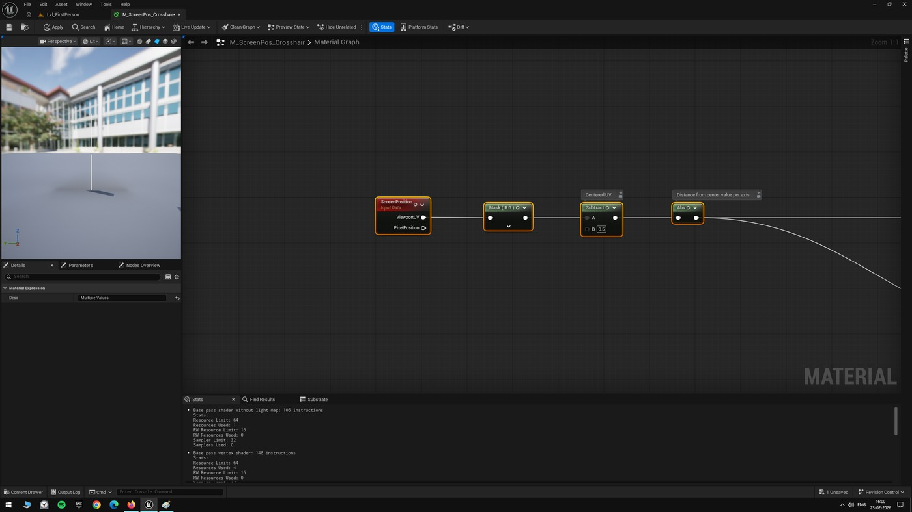
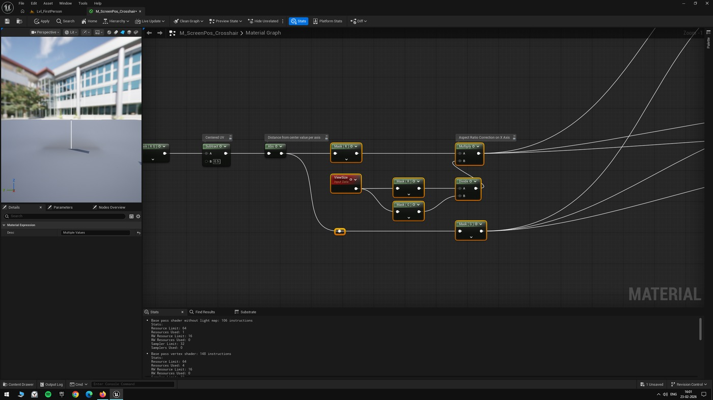
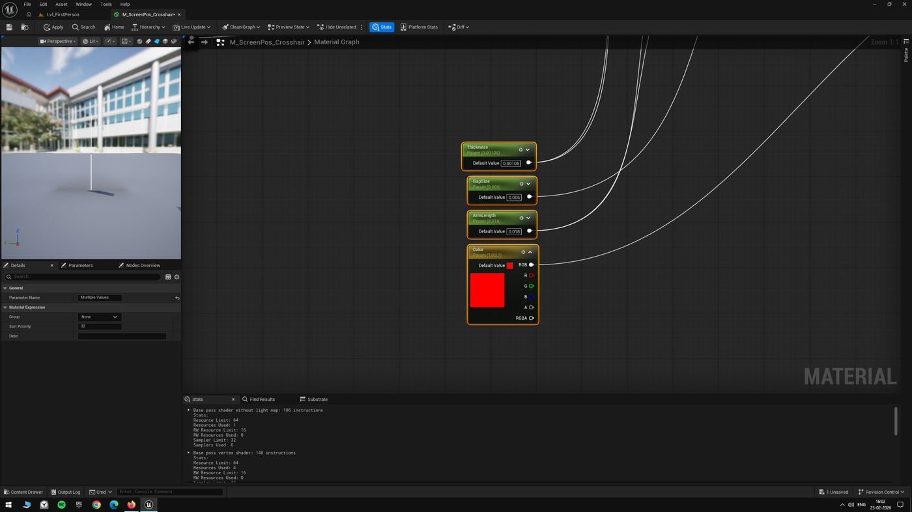
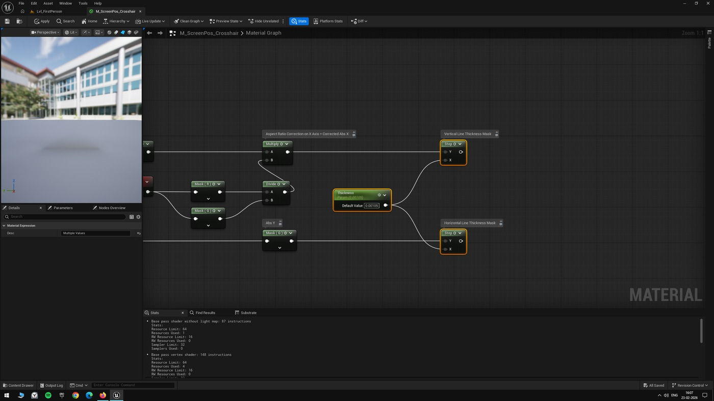
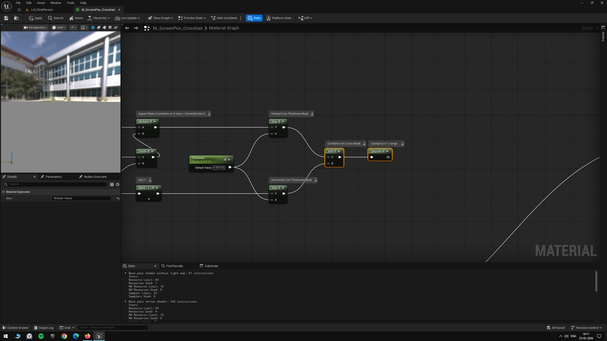
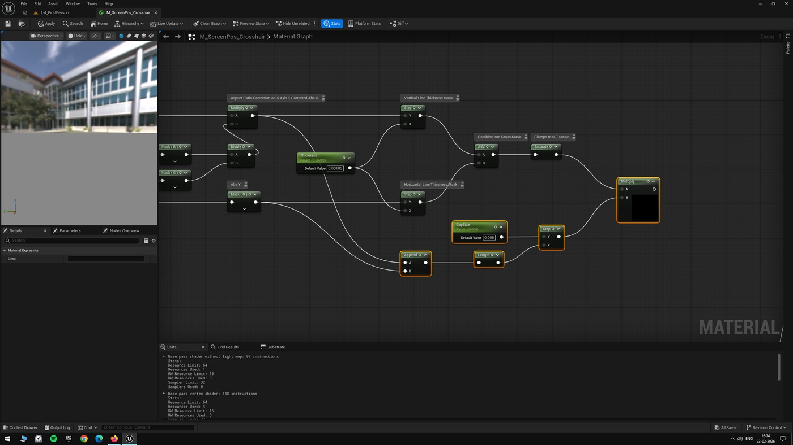
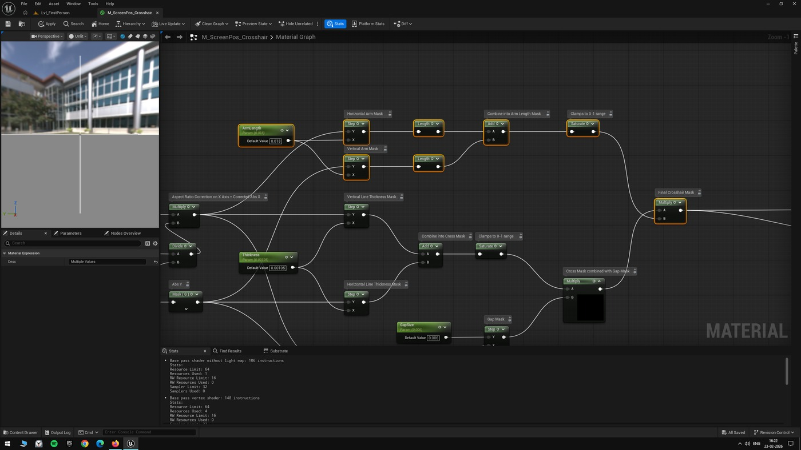
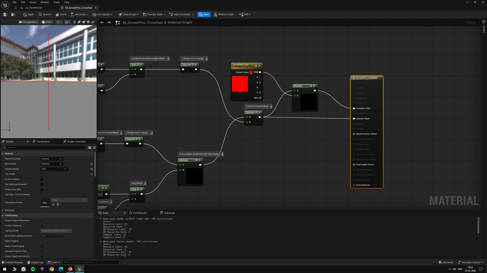
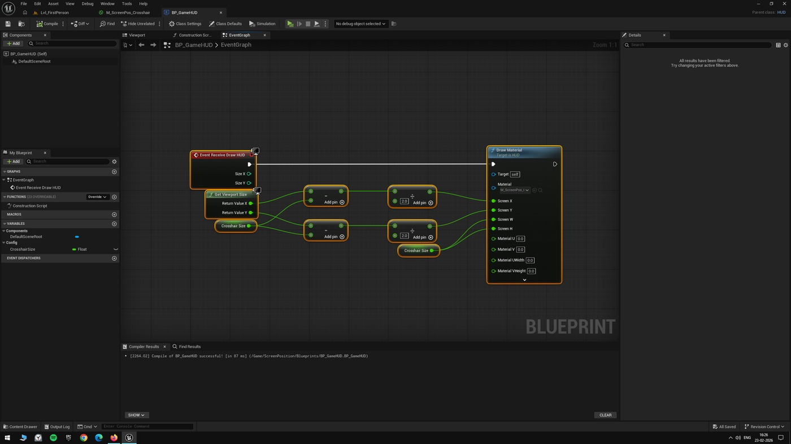
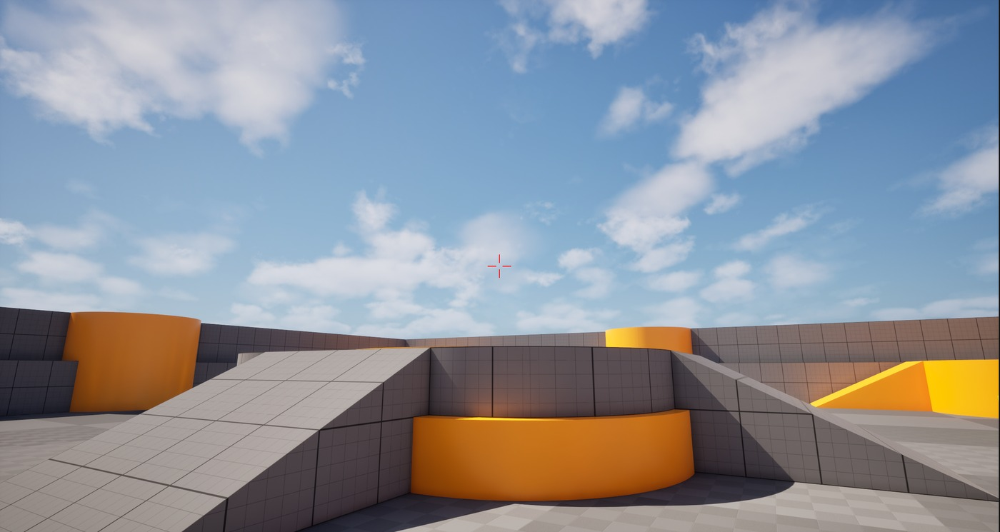

# 虚幻引擎教程：不使用纹理创建十字准线材质

## 来源与状态

- 原始 URL：https://dev.epicgames.com/community/learning/tutorials/nKXW/unreal-engine-tutorial-creating-a-crosshair-material-without-using-textures

## 运行时分类

- 类型：图文教程
- 判断：运行时未识别到核心视频信号，可整理正文约 4225 字符。

## 摘要

不使用纹理创建十字线材质的教程

## 中文整理

### 概览

继上一篇文章的晕影效果之后，下一个实验探索完全在屏幕空间中创建十字准线材质，而不依赖于纹理。

基本思想是在屏幕空间中创建两条无限交叉线，然后逐步遮盖它们以获得最终的十字准线形状。

屏幕位置节点提供屏幕上的标准化坐标，其中 (0,0) 是左上角，(1,1) 是右下角。

为了处理距中心的距离，我们从两个分量中减去 0.5，以使原点居中于 (0,0)。

然后我们取两个轴的绝对值，因为我们只需要距中心的距离。

长宽比校正 在创建十字准线几何体之前，我们需要考虑长宽比。

在 1920x1080 显示器上，水平分辨率高于垂直分辨率。

这意味着相同的标准化距离在水平方向上覆盖的像素多于在垂直方向上覆盖的像素，这会使十字准线不均匀。

我们通过将 X 轴乘以纵横比来纠正此问题。

ViewSize 节点为我们提供了屏幕宽度和高度，宽度除以高度就得到了宽高比。

将绝对 X 值乘以该比率可确保两个轴使用相同的像素比例测量距离。

此修正会影响十字准线的所有三个部分。

如果没有它，垂直条在物理上会比水平条更宽，水平臂会更长，并且中心间隙将变成椭圆形而不是圆形。

通过校正，两个条具有相同的像素宽度，两个臂具有相同的像素长度，并且间隙保持圆形。

设置参数 在创建十字线蒙版之前，我们首先设置“厚度”、“间隙大小”和“臂长”的标量参数，以及“十字线颜色”的矢量参数。

这些使我们可以调整十字准线属性，而无需编辑材质图。

创建水平/垂直条 水平条是使用步骤节点创建的。

我们将绝对 Y 值与厚度参数一起输入到 Step 节点中。

当距中心的垂直距离小于厚度时，Step 返回 1，从而创建一条穿过中心的水平线。

垂直条使用相同的逻辑，但对校正后的绝对 X 值进行操作。

这可确保垂直条与水平条具有相同的像素宽度。

组合成一个十字，我们将两个条形蒙版添加在一起，然后通过“饱和”运行结果。

这给了我们两条在中心相交的无限直线。

饱和度将重叠的中心像素钳位回 1。

创建中心间隙 为了创建中心间隙，我们使用“长度”节点计算距中心的径向距离。

在将 X 分量输入到 Length 之前，我们将其乘以纵横比，以防止圆形间隙变成椭圆形。

长度输出被馈送到具有间隙大小参数的步骤节点。

Step 在间隙半径外返回 1，在间隙半径内返回 0。

将其与我们的十字蒙版相乘即可从中心移除圆形区域。

控制臂长 为了防止十字准线臂在屏幕上无限延伸，通过检查沿其轴的距离是否超过臂长参数来限制每个臂。

对于水平臂，我们在校正后的绝对 X 上使用 Step 节点。

对于垂直臂，我们在绝对 Y 上使用 Step 节点。

我们将两个 Step 输出相加，然后饱和以将值限制在 0-1 范围内。

将带有间隙的十字乘以这个长度掩模就得到了最终的十字准线形状。

材质输出 最终蒙版与十字线颜色参数相乘并连接到发射颜色。

蒙版本身连接到不透明蒙版。

材质域设置为“表面”，混合模式设置为“蒙版”，着色模型设置为“无光照”。

在屏幕上显示 为了显示十字准线，我们在 HUD 蓝图中使用 DrawMaterial。

DrawHUD 事件计算屏幕中心位置并在定义的像素框中绘制材质。

通过 HUD 组合并显示蒙版后，十字准线将在屏幕中心渲染，如下面的屏幕截图所示。

此实验和其他屏幕位置实验的项目文件可在 Github 上找到：https://github.com/RohitKotiveetil/UnrealEngine--ScreenPositionExperiments - 材料

## 相关链接

- [https://github.com/RohitKotiveetil/UnrealEngine--ScreenPositionExperiments](https://github.com/RohitKotiveetil/UnrealEngine--ScreenPositionExperiments)

